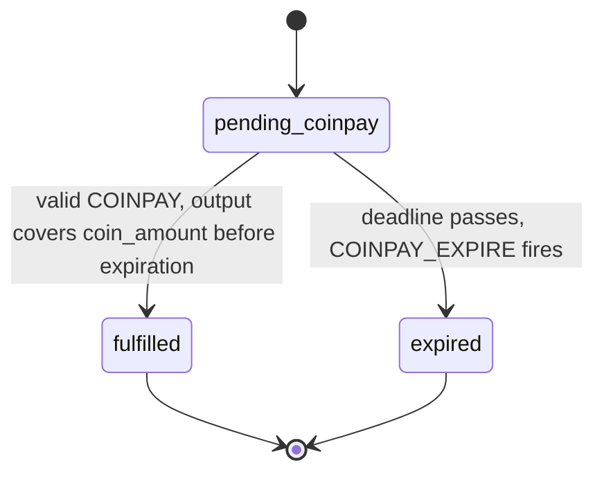

<!-- SPDX-License-Identifier: AGPL-3.0-or-later -->
<!-- Copyright © 2025–2026 Dankest, LLC -->

# XChain Platform Action - COINPAY

This action fulfills a native coin payment obligation created by an ORDER_MATCH for native coin DEX pairs (e.g., trading tokens for BTC/LTC/DOGE). The COINPAY transaction includes both the action data (OP_RETURN) and a native coin output paying the seller.

## PARAMS
| Name                       | Type   | Description                                             |
| -------------------------- | ------ | ------------------------------------------------------- |
| `VERSION`                  | String | Format Version                                          |
| `ORDER_MATCH_ACTION_INDEX` | String | `ACTION_INDEX` of the `ORDER_MATCH` being paid          |

## Formats

### Version `0` - Fulfill COINPay Obligation
- `VERSION|ORDER_MATCH_ACTION_INDEX`

## Examples
```
COINPAY|0|12345
This example fulfills the COINPay obligation for ORDER_MATCH with ACTION_INDEX 12345.
The transaction must also include a native coin output to the seller's GET_ADDRESS
for the owed amount (or more).
```

## Rules
- The referenced `ORDER_MATCH` must exist and have status `pending_coinpay`
- The `ORDER_MATCH` must not have expired (current block timestamp < obligation expiration)
- The transaction must include a native coin output to the obligation's payee address
- The output amount must be >= the obligation's `coin_amount`
- Overpayment goes to the seller as a tip; the obligation is fulfilled at the owed amount
- If the obligation has expired, the COINPAY is recorded as invalid and no tokens are released
- The buyer loses native coin if the COINPAY transaction confirms after the obligation expires (accepted risk)
- Anyone can send a COINPAY on behalf of the buyer; the escrowed tokens always go to the buyer's `GET_ADDRESS`

## Notes
- COINPAY is always an explicit ACTION. Never a bare payment. This avoids the decoder scanning every transaction output for potential order payments.
- Each transaction output is processed separately by the indexer. Only the output matching the payee address and amount triggers settlement.
- The obligation's expiration is timestamp-based (match block timestamp + `COINPAY_EXPIRATION` config, default 7200 seconds / 2 hours).
- On valid COINPAY: escrowed tokens are released to the buyer, ORDER_MATCH status changes to `valid`, and the obligation status changes to `fulfilled`.
- Expired obligations are cleaned up by `COINPAY_EXPIRE`, a system action fired automatically by the indexer at the block where an obligation's deadline passes. `COINPAY_EXPIRE` is not user-invocable: it releases escrowed tokens back to the seller's order, cancels the coin-offering party's order if needed, and sets the ORDER_MATCH status to `expired`. The coin offerer's order (the side that was not holding tokens) remains open and can match again.



---

**Copyright &copy; 2025–2026 Dankest, LLC**
