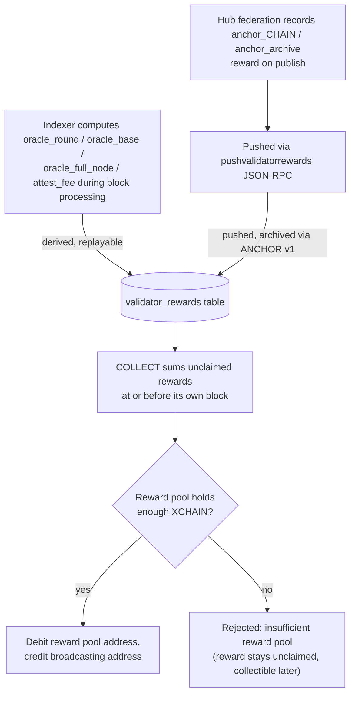

<!-- SPDX-License-Identifier: AGPL-3.0-or-later -->
<!-- Copyright © 2025–2026 Dankest, LLC -->

# XChain Platform Action - COLLECT
This action collects all accrued validator rewards to the broadcasting address.

## PARAMS
| Name      | Type   | Description    |
| --------- | ------ | -------------- |
| `VERSION` | String | Format Version |
| `AMOUNT`  | String | Optional trailing partial-claim amount; absent = claim the full unclaimed total |

## Formats

### Version `0`
- `VERSION[|AMOUNT]`

## Examples
```
COLLECT|0
Collect all accrued validator rewards for the broadcasting address
```

```
COLLECT|0|25
Collect 25 XCHAIN of the accrued rewards; the remainder stays pending and collectible later
```

## Partial Claim (optional AMOUNT)
The trailing `AMOUNT` is activated by the `PARTIAL_UNSTAKE_COLLECT` protocol change (mainnet: the coordinated 2026-10-01 contract-era flag-day; testnet/regtest: genesis). Semantics:

- **Absent**: claim the full unclaimed total, byte-identical to the historical behavior
- **Present (at/after the flag-day)**: claim only `AMOUNT`; the remainder stays pending
- **Present (below the flag-day)**: ignored (full claim), matching what a pre-upgrade node parses
- An `AMOUNT` equal to the full unclaimed total is treated exactly as absent
- An `AMOUNT` of zero, malformed, finer than 8 decimals, or greater than the unclaimed total is rejected; over-asks are never clamped
- The reward-pool coverage check applies to the claimed amount, so a partial claim can succeed while the pool cannot yet cover the full pending total

## Rules
- BTC chain only
- Broadcasting address must have an active stake (gated by the 6-block activation delay)
- Broadcasting address must have unclaimed rewards greater than 0
- Rewards are paid by **debiting the reward pool address** and crediting the broadcasting address; XCHAIN is never minted by `COLLECT`
- The reward pool must hold enough XCHAIN to cover the full claim, or the `COLLECT` is rejected (see Reward Funding)

## Reward Sources

Rewards accumulate from multiple validator activities, all stored in the indexer's `validator_rewards` table:

| Reward Type | Earned By | Trigger |
|---|---|---|
| `oracle_round` | Validator with `price` capability | Legacy label (used when `FULLNODE.REWARD_SHARE` is 0): signature included in the on-chain PRICE v0 action of a finalized price round; the full per-round budget is split equally across all qualified signers |
| `oracle_base` | Validator with `price` capability | Active-regime label (used when `FULLNODE.REWARD_SHARE` > 0): the base tranche of the per-round budget, split equally across all qualified signers; replaces `oracle_round` once the full-node reward tier is activated |
| `oracle_full_node` | Validator with `price` and `full_node` capabilities | Active-regime only: the full-node tranche of the per-round budget, split equally across verified full-node sources that signed the round and met the trailing `MIN_PASS_RATE_BPS` participation threshold |
| `attest_fee` | Validator with `attestation` capability | Share of the request fee for a fulfilled ATTEST request |
| `anchor_<chain>` | Validator with `oracle_publish` capability | Publishing a per-chain ANCHOR v0 checkpoint |
| `anchor_archive` | Validator with `oracle_publish` capability | Publishing an ANCHOR v1 archive batch |

## Reward Population Path

Reward rows reach the indexer's `validator_rewards` table on two rails:

- **Derived (replayable):** `oracle_round` / `oracle_base` / `oracle_full_node` and `attest_fee` are computed by the indexer itself during block processing, as deterministic functions of on-chain actions. The oracle reward type used depends on whether the full-node reward tier is active (`FULLNODE.REWARD_SHARE` > 0): when inactive the full per-round budget is credited as `oracle_round`; when active it is split into an `oracle_base` tranche (all qualified signers) and an `oracle_full_node` tranche (verified full-node sources that met the participation threshold). `attest_fee` splits a fulfilled request's fee across its responsible set. A reindex reproduces these rows exactly.
- **Pushed (archived):** `anchor_<chain>` / `anchor_archive` are recorded by the hub federation when an anchor publishes and pushed via the `pushvalidatorrewards` JSON-RPC endpoint (which rejects any non-anchor type). Because a chain parse cannot re-derive them, they ride the ANCHOR v1 archive and are restored by full-parse recovery (see [ANCHOR](ANCHOR.md).

`COLLECT` queries the indexer's `validator_rewards` table directly. No hub round-trip during transaction processing.

## Replayability

`COLLECT` validation sums unclaimed rewards **earned at or before the COLLECT's own block** (`validator_rewards.block_index <= BLOCK_INDEX`). The scope is a no-op live (rows never carry a future block), but it makes every historical claim replay identically on a reindex or ANCHOR full-parse recovery, bulk-restored reward rows can never become visible to an earlier COLLECT than they were when it confirmed.

## Reward Funding

XCHAIN is a fixed-supply token (minted once at genesis, then locked (see [GAS](../../concepts/GAS.md)). Rewards are therefore **not minted**; they are paid out of a dedicated **reward pool address** (`config['ADDRESS']['REWARD']`, BTC only). A valid `COLLECT` debits the pool for the reward amount and credits the broadcasting address, leaving total XCHAIN supply unchanged.

The pool is seeded at genesis and **topped up manually** (an ordinary XCHAIN `SEND` to the pool address) by the operator. Because the balance check reads the pool at the action's block/action index, every validator computes the same accept/reject outcome.

If the pool cannot cover the full pending reward, the `COLLECT` is rejected with `invalid: insufficient reward pool`. The claim is recorded as invalid, so the reward **remains unclaimed and fully collectible later**; the validator simply re-broadcasts `COLLECT` once the pool has been replenished. No rewards are lost or partially paid.



## Notes
- Rewards accrue continuously while the address holds an active stake
- By default all pending rewards are collected in a single action; a partial claim is available via the optional trailing `AMOUNT` (see Partial Claim above)
- Rewards may be collected at any time while a stake is active
- Rewards can also be collected after initiating `UNSTAKE` during the cooldown period
- A single pubkey can earn from multiple capabilities in the same round, e.g. a validator with both `price` and `oracle_publish` capabilities can earn the per-round consensus reward AND the per-publish broadcast reward in the same round

---

**Copyright &copy; 2025–2026 Dankest, LLC**

**Based on XChain Platform by Dankest, LLC &ndash; https://dankest.llc**

Licensed under the **GNU Affero General Public License v3.0** (AGPL-3.0-or-later)
with a commercial license available for proprietary use.

You may use, modify, and distribute this material under the terms of the License.
See [LICENSE](../../LICENSE.md) and [NOTICE](../../NOTICE.md) for full terms.
See the [licensing overview](https://docs.xchain.io/legal/LICENSING.html).
