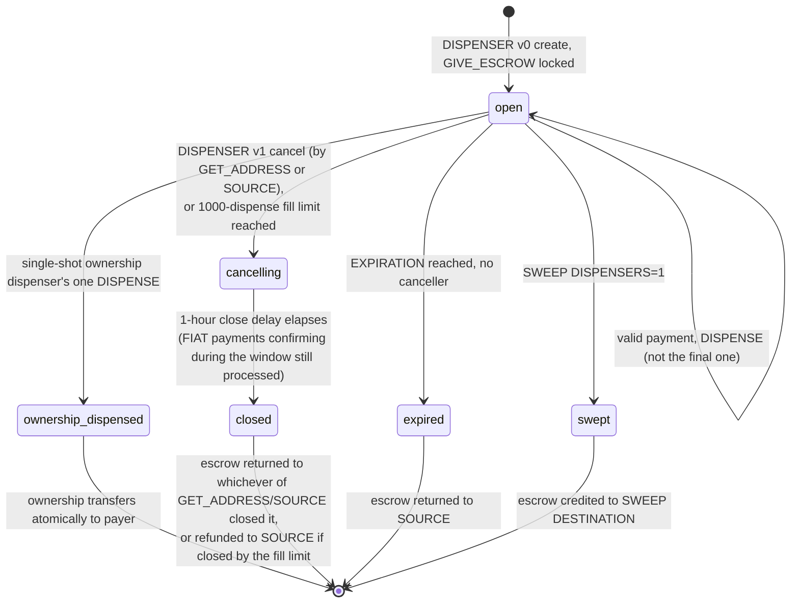
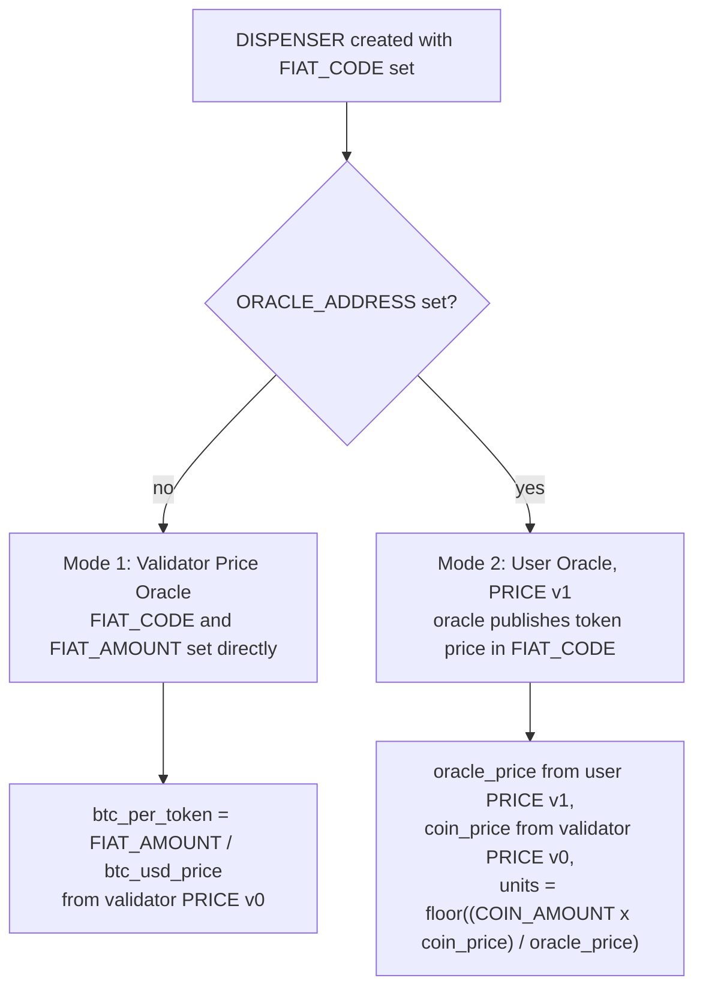
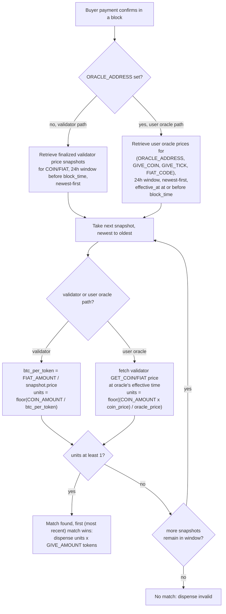

<!-- SPDX-License-Identifier: AGPL-3.0-or-later -->
<!-- Copyright © 2025–2026 Dankest, LLC -->

# XChain Platform Action - DISPENSER
This action creates a dispenser (vending machine) to dispense `TICK` when triggered

## PARAMS
| Name                     | Type   | Description                                                                |
| ------------------------ | ------ | -------------------------------------------------------------------------- |
| `VERSION`                | String | Format Version                                                             |
| `GIVE_COIN`              | String | `COIN` name (BTC, LTC, DOGE, etc)                                          |
| `GIVE_TICK`              | String | Ticker name or Ticker ID                                                   |
| `GIVE_AMOUNT`            | String | Quantity of `GIVE_TICK` to `DISPENSE` when triggered                       |
| `GIVE_ESCROW`            | String | Quantity of `GIVE_TICK` to escrow in dispenser                             |
| `GET_COIN`               | String | `COIN` name (BTC, LTC, DOGE, etc)                                          |
| `GET_TICK`               | String | Ticker name or Ticker ID                                                   |
| `GET_AMOUNT`             | String | Quantity of `GET_COIN` or `GET_TICK` required to `DISPENSE`                |
| `GET_ADDRESS`            | String | Address for dispenser to operate on (default=`SOURCE`)                     |
| `FIAT_CODE`              | String | Code for `FIAT` currency your dispenser is priced in (USD, JPY, GBP, etc.) |
| `FIAT_AMOUNT`            | String | Amount of `FIAT` currency required to trigger a `DISPENSE` (ignored when `ORACLE_ADDRESS` is set) |
| `ORACLE_ADDRESS`         | String | Optional address of a user oracle (PRICE v1) that prices the dispensed token in `FIAT_CODE` |
| `EXPIRATION`             | String | Timestamp of when dispenser should close, in Unix time                     |
| `ALLOW_LIST`             | String | `ACTION_INDEX` of a `LIST` of addresses allowed to trigger dispenser       |
| `BLOCK_LIST`             | String | `ACTION_INDEX` of a `LIST` of addresses NOT allowed to trigger a dispenser |
| `GIVE_OWNERSHIP`         | String | When `1`, dispense ownership of `GIVE_TICK` instead of a balance amount (single-shot; default `0`) |
| `MEMO`                   | String | An optional memo to include                                                |
| `DISPENSER_ACTION_INDEX` | String | `ACTION_INDEX` of existing `DISPENSER`                                     |

## Formats

### Version `0` - Create Dispenser
- `VERSION|GIVE_COIN|GIVE_TICK|GIVE_AMOUNT|GIVE_OWNERSHIP|GIVE_ESCROW|GET_COIN|GET_TICK|GET_AMOUNT|GET_ADDRESS|FIAT_CODE|FIAT_AMOUNT|ORACLE_ADDRESS|EXPIRATION|ALLOW_LIST|BLOCK_LIST|MEMO`

### Version `1` - Cancel Dispenser
- `VERSION|DISPENSER_ACTION_INDEX|MEMO`

### Version `2` - Edit Dispenser
- `VERSION|DISPENSER_ACTION_INDEX|GIVE_ESCROW|EXPIRATION|ALLOW_LIST|BLOCK_LIST|MEMO`


## Examples
```
DISPENSER|0|BTC|JDOG|1|0|10|BTC||0.01|1ExampleAddressXXXXXXXXXXXXXXXXXXX|||||||Creating JDOG dispensers at 0.01 BTC each
This example creates a dispenser, escrows 10 JDOG tokens in it, and dispenses 1 JDOG token when 0.01 BTC is sent to 1ExampleAddressXXXXXXXXXXXXXXXXXXX (no FIAT pricing, no oracle)
```

```
DISPENSER|1|1234|Canceling JDOG Dispenser
This example cancels the dispenser in example 1 with `ACTION_INDEX` 1234
```

```
DISPENSER|2|1234|100||||Refilling with 100
This example refills a dispenser with `ACTION_INDEX` 1234 with 100 JDOG tokens
```

```
DISPENSER|2|1234|||9876|5432|Updating allow/block lists
This example updates the allow and block lists for dispenser with `ACTION_INDEX` 1234
```

```
DISPENSER|0|BTC|PEPECASH|100|0|100|BTC||0|1ExampleAddressXXXXXXXXXXXXXXXXXXX|USD|0.05||0|||Selling PEPECASH for $0.05 USD each
FIAT dispenser using validator price oracle (PRICE v0): escrows 100 PEPECASH and dispenses 100 at a time when a buyer sends BTC equivalent to $0.05 USD per token. GET_AMOUNT is set to 0 because the effective BTC price is determined dynamically via validator BTC/USD snapshots. ORACLE_ADDRESS is empty.
```

```
DISPENSER|0|BTC|PEPECASH|100|0|100|BTC||0|1ExampleAddressXXXXXXXXXXXXXXXXXXX|JPY||1OracleSourceAddrXXXXXXXXXXXXXXXXX|0|||Using user oracle for JPY pricing
FIAT dispenser using a user-run TOKEN/FIAT oracle (PRICE v1): the oracle at `1OracleSourceAddrXXX...` publishes PEPECASH/JPY prices. FIAT_AMOUNT is empty because the oracle provides the price. The system combines the user oracle PEPECASH/JPY with the validator BTC/JPY snapshot to compute the BTC equivalent.
```

```
DISPENSER|0|BTC|JDOG|1|0|10|BTC||0.01|1FreshAddrZZZZZZZZZZZZZZZZZZZZZZZZ|||||||Opening a dispenser on a brand-new address from my main wallet
Fresh-address pattern: SOURCE is the user's main wallet, GET_ADDRESS is a newly-generated address with no prior on-chain activity. Allowed by the fresh-address exception, so DISPENSER_PREFERENCE on `1FreshAddr...` does not need to be pre-configured. SOURCE retains cancel authority; on cancel, escrow returns to SOURCE.
```

```
DISPENSER|0|BTC|JDOG||1||BTC||0.50000000|1ExampleAddressXXXXXXXXXXXXXXXXXXX|||||||First buyer of 0.5 BTC gets JDOG ownership
Ownership dispenser: `GIVE_OWNERSHIP=1` with empty `GIVE_AMOUNT`/`GIVE_ESCROW` escrows the JDOG ownership record. The first valid 0.5 BTC payment transfers ownership to the payer; the dispenser auto-closes after the single dispense.
```

```
DISPENSER|0|BTC|JDOG||1||BTC||0|1ExampleAddressXXXXXXXXXXXXXXXXXXX|USD|500.00|||||Selling JDOG ownership for $500 USD
FIAT-priced ownership dispenser using the validator BTC/USD oracle. Payer sends BTC equivalent to $500 USD at current snapshot price; ownership transfers and the dispenser closes.
```

```
DISPENSER|0|BTC|JDOG||1||BTC|PEPECASH|10000000.00000000|1ExampleAddressXXXXXXXXXXXXXXXXXXX|||||||Selling JDOG ownership for 10M PEPECASH via dispenser
Token-priced ownership dispenser: first matcher who delivers 10,000,000 PEPECASH receives JDOG ownership.
```

## Rules
- A dispenser may be created on an address other than `SOURCE` only if one of:
  (a) the target address has set `DISPENSER_PREFERENCE=2` via an `ADDRESS` action, or
  (b) the target address has never appeared on chain as of `BLOCK_INDEX − 1` (fresh-address exception), or
  (c) `SOURCE` is the target address's established origin: the `SOURCE` of a prior valid `DISPENSER` create on that address (origin standing)
- Origin standing is permanent: it survives the earlier dispenser closing, being canceled, or expiring, and cannot be revoked by the target address. It lets one main address keep opening dispensers on a sub-address it claimed while fresh (it already holds refill/close authority via the Version 1/2 owner rule below). Invalid create attempts confer no standing
- When `GET_ADDRESS == SOURCE` the dispenser is always allowed (owner self-opening); preference, freshness, and standing are not consulted
- Dispensers can be closed by the dispenser `GET_ADDRESS` or `SOURCE` address which first opened the dispenser
- If a dispenser is closed by the dispenser `GET_ADDRESS`, tokens escrowed in the dispenser are returned to `GET_ADDRESS`
- If a dispenser is closed by the dispenser `SOURCE`, tokens escrowed in the dispenser are returned to `SOURCE`
- If a dispenser is closed via `SWEEP` (`DISPENSERS=1`), remaining escrowed tokens (or the escrowed ownership record, if `GIVE_OWNERSHIP=1`) are credited to the SWEEP `DESTINATION` (see [`SWEEP`](./SWEEP.md))
- If a dispenser closes due to `EXPIRATION` (no canceller), tokens escrowed in the dispenser are returned to `SOURCE`



- `FIAT_CODE` and `FIAT_AMOUNT` must both be provided together (or both empty), unless `ORACLE_ADDRESS` is set
- `ORACLE_ADDRESS` requires `FIAT_CODE` to be set (the oracle prices the token in that fiat currency)
- `ORACLE_ADDRESS` makes `FIAT_AMOUNT` optional/ignored; the oracle provides the price
- `ORACLE_ADDRESS` must be a valid crypto address

### Token Ownership Dispensers
- `GIVE_OWNERSHIP=1` requires SOURCE to be the current owner of `GIVE_TICK`; `GIVE_AMOUNT` and `GIVE_ESCROW` must be empty; the ownership record moves into a protocol-held escrow state
- Ownership dispensers are **single-shot**: max dispenses = `1`; the dispenser auto-closes after the first successful dispense
- FIAT pricing (validator oracle and user oracle) and reverse-price-matching (24-hour window) apply unchanged
- Existing `GET_ADDRESS` rules (`DISPENSER_PREFERENCE` / fresh-address / self-open) apply unchanged
- While ownership is escrowed, the following actions targeting the escrowed `TICK` are rejected:
  - `ISSUE` Versions 0-6 (all edits to an existing tick: description, mint params, lock params, callback params, list params, controller bind/unbind, and re-issuance by the current owner)
  - `CALLBACK`, `SLEEP`
  - `LINK` using this `TICK`'s `ISSUE` as `COIN2_ACTION_INDEX`
  - `FILE` with `GATE_TICKER` = this `TICK`
  - New child `ISSUE` using this `TICK` as a parent (period-separated name)
  - Additional `ORDER`/`SWAP`/`DISPENSER` ownership offers for this `TICK` from the original owner
- Holder-side actions are unaffected: `SEND`, `MINT` (if mint window open), `DIVIDEND` payouts, `DEPOSIT`/`WITHDRAW`, `DESTROY` of held balance
- Child `TICK`s (e.g. `JDOG.SUB1`) have independent ownership records and are **not** transferred when a parent's ownership is sold
- On successful dispense: ownership transfers atomically to the payer's address
- On cancel (Version 1) / `EXPIRATION`: ownership returns to the SOURCE that opened the dispenser
- On `SWEEP`-closure: ownership is delivered to the SWEEP `DESTINATION`

## Notes
- Dispensers are closed and any escrowed funds returned after a set amount of time (1 hour)
- Dispenser `LIST` edits are delayed a set amount of time (1 hour)
- Dispensers are limited to a maximum number of dispenses per fill (1,000, enforced). The dispense that reaches the limit still executes; the dispenser then auto-closes and any remaining escrow is refunded to the `SOURCE` owner
- A refill (a Version 2 `DISPENSER_EDIT` that tops up `GIVE_ESCROW`) resets the dispense count to 0, so each fill allows another 1,000 dispenses. Refills are limited to 5 (the 6th is rejected), giving a lifetime ceiling of 6 fills x 1,000 dispenses
- `FIAT_CODE` accepts the following 12 currencies:
  - `USD` = US Dollar
  - `CAD` = Canadian Dollar
  - `AUD` = Australian Dollar
  - `MXN` = Mexican Peso
  - `GBP` = Great Britain Pound
  - `JPY` = Japanese Yen
  - `CNY` = Chinese Yuan
  - `CHF` = Swiss Franc
  - `BRL` = Brazilian Real
  - `INR` = Indian Rupee
  - `EUR` = Euro
  - `KRW` = South Korean Won
- `FIAT_AMOUNT` format is `X.XX`
- `EXPIRATION` begins the process of closing a dispenser after a set block delay
- Use `^` (caret) as prefix when passing `TICK_ID` for `TICK` field (^1234 = `TICK_ID` 1234)
- Use `^` (caret) as prefix when passing an `ADDRESS_ID` for address fields (^57 = `ADDRESS_ID` 57); see [Index ID References](../Index_Id_References.md). **`GET_ADDRESS` and `ORACLE_ADDRESS` are the exceptions: write both in full.** The decoder keys dispense detection on `GET_ADDRESS` and oracle-fee recognition on `ORACLE_ADDRESS`, and it cannot resolve an id reference, so a compacted value produces a dispenser that never dispenses or a create rejected as unpaid

## FIAT Dispensers

FIAT dispensers allow token sellers to price their tokens in a traditional currency (e.g., USD, JPY) while accepting payment in the native coin (BTC, LTC, DOGE). This enables non-XChain users to trigger a dispense by sending a simple bare coin payment. No XChain transaction required.

There are two pricing modes:

### Mode 1: Validator Price Oracle (no `ORACLE_ADDRESS`)
The dispenser sets `FIAT_CODE` and `FIAT_AMOUNT` directly. Pricing uses the validator COIN/FIAT snapshot for the GET_COIN/FIAT pair.

**Example:** Dispenser sells PEPECASH for BTC at $0.05 USD per token. Buyer sends BTC; system uses the validator BTC/USD price to compute the equivalent BTC amount.

**Calculation:**
```
btc_per_token = FIAT_AMOUNT / btc_usd_price   (from validator PRICE v0)
units         = floor(COIN_AMOUNT / btc_per_token)
```

### Mode 2: User Oracle (`ORACLE_ADDRESS` set)
The dispenser delegates pricing to a user-run TOKEN/FIAT oracle (PRICE v1). The oracle publishes the token's price in the specified FIAT currency. The system combines the user oracle price with the validator COIN/FIAT price for cross-conversion.

**Example:** Dispenser sells PEPECASH for BTC, with the oracle pricing PEPECASH at ¥7.50 JPY. Buyer sends BTC; system uses the validator BTC/JPY price to convert.

**Calculation:**
```
oracle_price  = pepecash_jpy   (from user PRICE v1, oracle's effective price)
coin_price    = btc_jpy        (from validator PRICE v0)
units         = floor((COIN_AMOUNT × coin_price) / oracle_price)
```

**Why both oracles?** The user oracle prices the *token*, the validator oracle prices the *coin*, both are needed when the buyer is paying in a coin different from the oracle's quote currency. Both must use the same FIAT currency as the bridge.



### Reverse Price Matching
Because blockchain payments can take time to confirm, oracle prices may change between when the buyer sends the payment and when it lands in a block. The system handles this by searching historical oracle price snapshots within a **24-hour window** (86400 seconds) before the payment's `block_time`.

**Algorithm (validator path):**
1. Retrieve all finalized validator price snapshots for the COIN/FIAT pair within the 24-hour window, ordered newest-first
2. For each snapshot (newest to oldest):
   - Calculate `btc_per_token = FIAT_AMOUNT / snapshot.price`
   - Calculate `units = floor(COIN_AMOUNT / btc_per_token)`
   - If `units >= 1`: **match found**, dispense `units × GIVE_AMOUNT` tokens
3. The first (most recent) matching snapshot is used; the buyer most likely used the latest price they saw
4. If no snapshot produces at least 1 unit, the dispense is invalid

**Algorithm (user oracle path):**
1. Retrieve all user oracle prices for the `(ORACLE_ADDRESS, GIVE_COIN, GIVE_TICK, FIAT_CODE)` combination within the 24-hour window, ordered newest-first
2. For each oracle price (gated by the 24-hour lock window via `effective_at <= block_time`):
   - Fetch the validator GET_COIN/FIAT price at the oracle's effective time
   - Calculate `units = floor((COIN_AMOUNT × coin_price) / oracle_price)`
   - If `units >= 1`: **match found**
3. Returns the first matching combination



### Overpayment / Tips
If a buyer sends slightly more coin than the exact calculated amount, the system floors the unit count and absorbs the excess as overpayment. The extra amount does not trigger additional dispenses. For example, if the exact cost for 5 units is 0.000005 BTC and the buyer sends 0.0000055 BTC, the system dispenses 5 units.

### Oracle Front-Running Protection
User oracles (PRICE v1) have a built-in anti-front-running mechanism: **every** price for a `(ORACLE_ADDRESS, COIN, TICK, FIAT)` combination, **including the first**, takes effect 86400 seconds (24 hours) after its `block_time`. An oracle operator therefore cannot see an incoming dispenser payment and rush a price update to manipulate the exchange rate; pending payments settle at the price already in effect.

The delay applies to first publishes as well, and that part is a **consensus requirement** rather than an anti-manipulation one: an immediately-effective first publish would be *retroactively* effective, because its `effective_at` (the action's `block_time`) precedes the moment the row can exist in any indexer's hub-DB mirror. A FIAT dispense settled in that window would settle differently on replay and fork the ledger. See [`PRICE`](./PRICE.md) for the full rule.

> **Setting up a user-oracle dispenser:** point at an oracle whose price is **already effective**. A PRICE v1 quote becomes effective 24 hours after publication, and a `DISPENSER` naming an oracle with no effective price is rejected outright (`invalid: ORACLE_ADDRESS (no effective oracle price)`). Oracle operators are normally a separate, ongoing service, so this only bites when you are standing up your own oracle for your own dispenser: publish first, wait out the window, then create.

### Oracle Usage Fee
An oracle operator can charge a usage fee by publishing a non-zero `FEE` (see [`PRICE`](./PRICE.md)). The charge lands **once, up front, on the address opening or refilling the dispenser**, never on buyers per dispense, and is paid as a real native-coin output inside the `DISPENSER` transaction:

```
oracle_fee = FEE x (oracle_price x GIVE_ESCROW) / validator_coin_price
```

`FEE` percent of what the whole escrow is projected to earn. A `DISPENSER` naming an `ORACLE_ADDRESS` is **invalid** without that output, or with one below the amount, so size it from the quote endpoint:

`GET /{COIN}/api/oraclefeequote?oracleAddress=..&giveTick=..&fiatCode=USD&giveEscrow=..`
→ `{ requiredFeeNative, requiredFeeSats, belowDust }` (SDK: `explorer.getOracleFeeQuote()`)

No output is required when the oracle's `FEE` is `0` (the common case) or when the computed fee is below the chain's dust threshold. A v2 refill is charged on the escrow it adds, not on the whole balance, and a Mode A dispenser (`FIAT_AMOUNT` without `ORACLE_ADDRESS`) is never charged: it reads validator snapshots, and validators are compensated through the protocol fee.

**Write `ORACLE_ADDRESS` in full, never as a `^<id>` reference.** The fee output is recognized by reading `ORACLE_ADDRESS` straight out of this transaction's payload, and a compacted id cannot be resolved at that point, so a create using one is rejected as unpaid however much was actually sent. The official SDK emits this field in full for that reason (the same rule `GET_ADDRESS` already follows).

On **mainnet** the fee output is recognized from `2026-10-01 00:00:00 UTC` onward; a Mode B create against a fee-charging oracle before that instant is rejected whether or not it pays. Testnet and regtest recognize it from genesis.

### Recommendations
- Buyers should send with a high transaction fee to ensure confirmation within the 24-hour price window
- If a payment is stuck in the mempool for longer than 24 hours, no matching price snapshot will be found and the dispense will be invalid

### Dispenser Close Window
Dispensers have a 1-hour close delay (`DISPENSER_CLOSE_DELAY`). When a dispenser is cancelled or runs out of tokens, it enters a "cancelling" state for 1 hour before fully closing. FIAT dispense payments that confirm during this window are still processed normally; the dispenser honors pending dispenses until the close window elapses.

---

**Copyright &copy; 2025–2026 Dankest, LLC**

**Based on XChain Platform by Dankest, LLC &ndash; https://dankest.llc**

Licensed under the **GNU Affero General Public License v3.0** (AGPL-3.0-or-later)
with a commercial license available for proprietary use.

You may use, modify, and distribute this material under the terms of the License.
See [LICENSE](../../LICENSE.md) and [NOTICE](../../NOTICE.md) for full terms.
See the [licensing overview](https://docs.xchain.io/legal/LICENSING.html).
