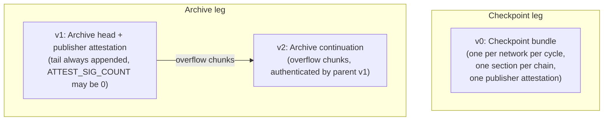
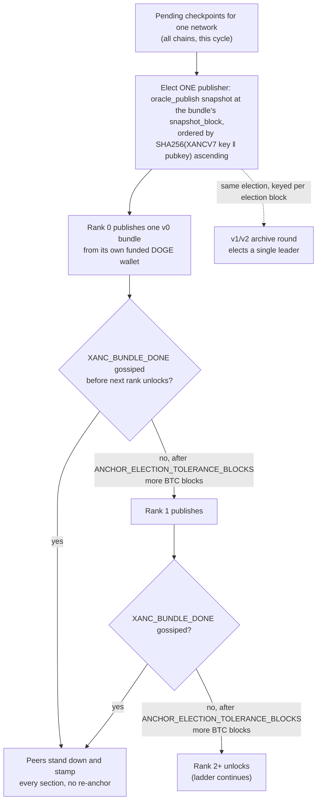
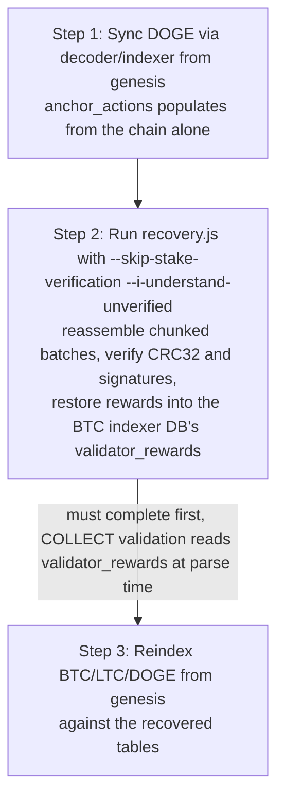

<!-- SPDX-License-Identifier: AGPL-3.0-or-later -->
<!-- Copyright © 2025–2026 Dankest, LLC -->

# XChain Platform Action - ANCHOR

On-chain commitment of federation-signed state, checkpoints and the cross-chain match
archive, in a single action with two legs and three version-discriminated phases:

- **v0: Checkpoint bundle.** Validator-broadcast. ONE anchor per network per publishing cycle,
  carrying every checkpointed chain as its own **section**: the chain's hash triple, its SPV
  light-client roots and its own quorum signature list, followed by a single `PUBLISHER`
  attestation tail covering the whole bundle. v0 is the only checkpoint wire the hub emits.
- **v1: Archive head + publisher attestation.** Validator-broadcast. One chain's quorum-signed
  state checkpoint (the per-block `ledger`/`actions`/`contract` hash triple) plus a compressed
  batch of full `cross_chain_matches` records (including their validator signatures and the
  `capability_snapshots` rows needed to re-verify them), plus the elected archive leader's
  `PUBLISHER` pubkey and a `max(2f+1, ceil((N+1)/2))` `oracle_publish` attestation (the
  `XANCPUB` canonical) keyed on `MATCH_BATCH_SEQ`, binding which validator earns the archive
  reward. The `PUBLISHER` tail is **always appended**; `ATTEST_SIG_COUNT` MAY be 0 when the
  attestation round degrades, in which case the checkpoint and archive still index `valid`, no
  publisher attestations are stored, and no `anchor_archive` reward is derived. The indexer
  derives the reward straight from these bytes, retiring the last key-authenticated
  `pushvalidatorrewards` rail.
- **v2: Archive continuation.** Validator-broadcast. Carries overflow chunks when a v1 archive
  payload exceeds the per-action data limit. Authenticated by its parent v1 (carries no
  signatures of its own).

## Activation

`ANCHOR_ACTIVATION` is a frozen consensus constant, one mined-height value per network, keyed
on the anchor's own DOGE `BLOCK_INDEX`:

| Network | `ANCHOR_ACTIVATION` |
| --- | --- |
| mainnet | 0 |
| testnet | 67858600 |
| regtest | 0 |

The gate runs before format dispatch: an `ANCHOR` of **any** version mined below its network's
activation height is `invalid: ANCHOR before activation`. At or above the activation height,
only versions 0, 1 and 2 exist (this document); any other version byte is
`invalid: VERSION (unknown)`. See [Notes](#notes) for how this reads on the versions this
restart retires.



`ANCHOR` is valid **only on the anchor chain; DOGE** (all networks). Indexers on other chains
reject it. BTC and LTC state is still covered: a v1 names the `CHAIN` it checkpoints, and
a v0 carries one section per chain, so one cheap chain carries the commitments for all three.

ANCHOR supersedes the hub's legacy raw `XDEXANCHOR` payload (which was not a protocol action and
was invisible to the decoder). The `XDEXANCHOR` publisher (`CrossChainDexAnchor`) was removed
from the hub on 2026-06-11 after ANCHOR verified end-to-end on mainnet; rows it stamped
(`batch_root`) remain readable but nothing publishes the legacy payload anymore.

## Purpose

1. **Verifiable state.** Light clients verify any indexer/explorer response against a
   checkpoint signed by a `max(2f+1, ceil((N+1)/2))` quorum of `oracle_publish` validators, without trusting a single operator.
2. **Full-parse recoverability.** Cross-chain match records are the only consensus-relevant
   dataset not natively on-chain (they are mirror-delivered; see
   [Cross-Chain DEX](../cross-chain-dex.md)). The v1/v2 archive places the records themselves
   on-chain, so the entire platform state is reconstructible from a full parse of the three
   blockchains with no surviving hub database.

## PARAMS
| Name                  | Type    | Versions | Description                                                            |
| --------------------- | ------- | -------- | ---------------------------------------------------------------------- |
| `VERSION`             | Integer | all      | Format version (0=checkpoint bundle, 1=archive head + publisher, 2=continuation) |
| `NETWORK`             | String  | 0, 1     | `mainnet` \| `testnet` \| `regtest`. On a v0 it is carried once, in the header, and applies to every section |
| `SNAPSHOT_BLOCK`      | Integer | 0, 1     | BTC block selecting the `oracle_publish` validator set. On a v0 it is the bundle's election and attestation block: the MAX of the sections' `SECTION_SNAPSHOT_BLOCK` |
| `SECTION_COUNT`       | Integer | 0        | Number of per-chain checkpoint sections that follow; at least 1        |
| `CHAIN`               | String  | 0, 1     | Chain being checkpointed: `BTC` \| `LTC` \| `DOGE`. One per v0 section |
| `BLOCK_INDEX`         | Integer | 0, 1     | Checkpointed block height on `CHAIN`                                   |
| `BLOCK_HASH`          | String  | 0, 1     | 64-hex block hash of `CHAIN` at `BLOCK_INDEX`                          |
| `LEDGER_HASH`         | String  | 0, 1     | 64-hex chained ledger hash (`blocks.ledger_hash` at `BLOCK_INDEX`)     |
| `ACTIONS_HASH`        | String  | 0, 1     | 64-hex chained actions hash                                            |
| `CONTRACT_HASH`       | String  | 0, 1     | 64-hex chained contract hash                                           |
| `CHECKPOINT_SEQ`      | Integer | 0, 1     | Monotonic checkpoint counter per (`CHAIN`,`NETWORK`)                   |
| `SECTION_SNAPSHOT_BLOCK` | Integer | 0   | The section's own BTC snapshot block, the one its signatures verify against. Usually equal to the bundle `SNAPSHOT_BLOCK`; lower when a lagging chain rides at an older checkpoint |
| `STATE_ROOT`          | String  | 0        | 64-hex SPV state root (SMT over balances+stakes) at `BLOCK_INDEX`      |
| `STATE_ROOT_VERSION`  | Integer | 0        | Merkle scheme version the `STATE_ROOT` was computed under              |
| `BLOCK_MERKLE_ROOT`   | String  | 0        | 64-hex SPV per-block content Merkle root at `BLOCK_INDEX`              |
| `BLOCK_MERKLE_VERSION`| Integer | 0        | Merkle scheme version the `BLOCK_MERKLE_ROOT` was computed under       |
| `MATCH_BATCH_SEQ`     | Integer | 1, 2     | Monotonic archive-batch counter (ties v2 chunks to their v1)           |
| `MATCH_COUNT`         | Integer | 1        | Number of match records in this archive batch                         |
| `BATCH_CRC32`         | String  | 1        | 8-hex CRC32 of the **uncompressed** archive JSON bytes                 |
| `ARCHIVE_B64`         | String  | 1        | base64url of `gzip(archive JSON)`: chunk 0 when the batch is chunked  |
| `CHUNK_INDEX`         | Integer | 2        | 1-based continuation index (the v1 head itself carries chunk 0)        |
| `TOTAL_CHUNKS`        | Integer | 1, 2     | Total chunks in the batch (1 = unchunked, archive-head-only)           |
| `ARCHIVE_B64_CHUNK`   | String  | 2        | This continuation's slice of the base64url payload                    |
| `SIG_COUNT`           | Integer | 0, 1     | Number of (pubkey, sig) pairs that follow; on a v0 it is per section   |
| `PUBKEY_n`            | String  | 0, 1     | 64-hex Ed25519 pubkey, in the `oracle_publish` set at the signature's snapshot block |
| `SIG_n`               | String  | 0, 1     | 128-hex Ed25519 signature over the canonical checkpoint message    |
| `PUBLISHER`           | String  | 0, 1     | 64-hex Ed25519 pubkey of the elected publisher that earns the anchor reward |
| `ATTEST_SIG_COUNT`    | Integer | 0, 1     | Number of (pubkey, sig) attestation pairs that follow; on a v1 this MAY be 0 when the attestation round degraded |
| `APUBKEY_n`           | String  | 0, 1     | 64-hex pubkey in the `oracle_publish` set at `SNAPSHOT_BLOCK` (attestation signer) |
| `ASIG_n`              | String  | 0, 1     | 128-hex Ed25519 signature over the `XANCPUB` canonical                 |

## Formats

### Version `0`: Checkpoint bundle (validator-broadcast)
- `ANCHOR|0|NETWORK|SNAPSHOT_BLOCK|SECTION_COUNT|CHAIN|BLOCK_INDEX|BLOCK_HASH|LEDGER_HASH|ACTIONS_HASH|CONTRACT_HASH|CHECKPOINT_SEQ|SECTION_SNAPSHOT_BLOCK|STATE_ROOT|STATE_ROOT_VERSION|BLOCK_MERKLE_ROOT|BLOCK_MERKLE_VERSION|SIG_COUNT|PUBKEY1|SIG1|...|PUBLISHER|ATTEST_SIG_COUNT|APUBKEY1|ASIG1|...`

Read as a header, `SECTION_COUNT` repeats of one section, and one publisher tail:

```
ANCHOR|0|NETWORK|SNAPSHOT_BLOCK|SECTION_COUNT
      |CHAIN|BLOCK_INDEX|BLOCK_HASH|LEDGER_HASH|ACTIONS_HASH|CONTRACT_HASH|CHECKPOINT_SEQ|SECTION_SNAPSHOT_BLOCK
       |STATE_ROOT|STATE_ROOT_VERSION|BLOCK_MERKLE_ROOT|BLOCK_MERKLE_VERSION
       |SIG_COUNT|PUBKEY|SIG|...                        (repeated SECTION_COUNT times)
      |PUBLISHER|ATTEST_SIG_COUNT|APUBKEY|ASIG|...
```

- **`NETWORK` is carried once.** A section has no network field of its own; the header's
  `NETWORK` applies to every section, and the indexer rebuilds each section's signing canonical
  with it and writes it onto every stored section row.
- **`SNAPSHOT_BLOCK` is the bundle's block**, used for the publisher election and for the
  attestation quorum. It is the MAX of the sections' `SECTION_SNAPSHOT_BLOCK`. In the normal
  case every section shares it; a chain that lagged one cycle rides at its own older block.
- **A section is one chain's checkpoint**, verified exactly as a standalone checkpoint is:
  its signatures cover its own `XCHECKPOINT` canonical at its own `SECTION_SNAPSHOT_BLOCK`.
  Nothing about per-chain checkpoint verification changes when it travels in a bundle.
- **Ordering is fixed.** Sections are ordered by `CHAIN` ascending, and within a section the
  `(PUBKEY, SIG)` pairs are ordered by `PUBKEY` ascending. Both rules are load-bearing: they
  make two publishers racing the same cycle produce byte-identical bundles, which is what lets
  the attestation peers byte-match what they rebuild from their own checkpoint rows.
- **`SECTION_COUNT` is at least 1.** A one-section bundle is valid and, under the daily
  cadence, common: a chain whose newest eligible checkpoint is already anchored is simply
  absent from this cycle and rides the next one.
- **Roots are required in every section.** The bundle is root-bearing by construction; a
  checkpoint row with null roots is skipped with a log line, never emitted rootless.
- **One publisher tail per bundle**, whatever the section count.
- **Byte budget: 8189 bytes** of wire text (`MAX_ACTION_DATA_LENGTH` 8192 minus the 3-byte
  push prefix). A cycle that would exceed it is split chain-ascending into as many bundles as
  fit, each with its own election; a single section that cannot fit even with an empty
  attestation tail is refused loudly and counted, never sent truncated.

### Version `1`: Checkpoint + match archive + publisher attestation (validator-broadcast)
- `ANCHOR|1|CHAIN|NETWORK|BLOCK_INDEX|BLOCK_HASH|LEDGER_HASH|ACTIONS_HASH|CONTRACT_HASH|CHECKPOINT_SEQ|SNAPSHOT_BLOCK|MATCH_BATCH_SEQ|MATCH_COUNT|BATCH_CRC32|TOTAL_CHUNKS|ARCHIVE_B64|SIG_COUNT|PUBKEY1|SIG1|...|PUBLISHER|ATTEST_SIG_COUNT|APUBKEY1|ASIG1|...`
- The `PUBLISHER` + attestation list is appended **after** the wrapper signature list (never
  inserted mid-string), and is **always present**: every v1 carries a `PUBLISHER` and an
  `ATTEST_SIG_COUNT`, which MAY be 0 when the attestation round degraded. A count-0 v1 is
  `valid`, stores no publisher attestations, and derives no `anchor_archive` reward; every other
  archive rule (integrity, `MATCH_BATCH_SEQ` monotonicity, v2 tie) is unaffected by the count.
  Continuation chunks stay v2, tied by `MATCH_BATCH_SEQ` exactly as for any v1 head.

### Version `2`: Archive continuation (validator-broadcast; no signatures)
- `ANCHOR|2|MATCH_BATCH_SEQ|CHUNK_INDEX|TOTAL_CHUNKS|ARCHIVE_B64_CHUNK`

## Examples

```
ANCHOR|0|mainnet|900120|3|BTC|900123|00000000...|3f9a...|b81c...|44d0...|900123|900120|9ab1...|1|77cc...|1|3|a1b2...|c3d4...|e5f6...|0718...|292a...|3b4c...|DOGE|5401230|9f2c...|...|LTC|3102277|1c88...|...|f0e1...|3|a1b2...|55aa...|e5f6...|66bb...|292a...|77cc...
One bundle for mainnet at snapshot block 900120: three sections (BTC, DOGE, LTC in chain order), each with its own roots and 3-of-N signatures, then one publisher attestation tail
```

```
ANCHOR|1|BTC|mainnet|900123|00000000...|3f9a...|b81c...|44d0...|418|900120|42|17|9c4e1b22|1|H4sIAAAA...|3|a1b2...|c3d4...|...|8899...|2|aa11...|bb22...|cc33...|dd44...
Checkpoint plus archive batch 42 (17 match records, single chunk), publisher tail with a 2-of-N attestation
```

```
ANCHOR|1|BTC|mainnet|900123|00000000...|3f9a...|b81c...|44d0...|418|900120|43|9|7a1e2c0b|1|H4sIAAAA...|3|a1b2...|c3d4...|...|8899...|0
Same shape, but the attestation round degraded: PUBLISHER is still present, ATTEST_SIG_COUNT is 0, no anchor_archive reward is derived
```

```
ANCHOR|2|42|1|3|AAAB7Rxe...
Continuation chunk 1 of 3 for archive batch 42
```

## Canonical signing message (v1 / v0 sections)
Each `SIG_n` covers the UTF-8 bytes of:

```
XCHECKPOINT|CHAIN|NETWORK|BLOCK_INDEX|BLOCK_HASH|LEDGER_HASH|ACTIONS_HASH|CONTRACT_HASH|CHECKPOINT_SEQ|SNAPSHOT_BLOCK
```

and for v1, with the archive structure appended:

```
XCHECKPOINT|...|SNAPSHOT_BLOCK|MATCH_BATCH_SEQ|MATCH_COUNT|BATCH_CRC32|TOTAL_CHUNKS
```

and for a v0 section, with the SPV light-client roots appended (the bytes the federation signs, so the roots are covered by the quorum, not merely transported):

```
XCHECKPOINT|CHAIN|NETWORK|BLOCK_INDEX|BLOCK_HASH|LEDGER_HASH|ACTIONS_HASH|CONTRACT_HASH|CHECKPOINT_SEQ|SECTION_SNAPSHOT_BLOCK|STATE_ROOT|STATE_ROOT_VERSION|BLOCK_MERKLE_ROOT|BLOCK_MERKLE_VERSION
```

`NETWORK` here is the bundle header's network and `SECTION_SNAPSHOT_BLOCK` the section's own snapshot block, so a section's signed bytes are byte-identical to the checkpoint canonical the hub `StateCheckpointEngine` signs and the SDK / explorer verifiers reconstruct (the publisher reuses the checkpoint row's signatures verbatim, it does not re-sign anything to build a bundle).

`ARCHIVE_B64` is **not** part of the signed bytes; the blob is bound to the signed structure by
`BATCH_CRC32`, computed over the uncompressed JSON. (CRC over uncompressed bytes keeps
verification independent of the zlib version that produced the gzip stream.) Chain/network are
uppercase/lowercase exactly as on the wire; numerics are decimal with no leading zeros; hashes
are lowercase hex. A signature counts only if its pubkey is in the `oracle_publish` capability
snapshot at `SNAPSHOT_BLOCK` **and** the Ed25519 signature verifies.

The v1 wrapper signatures cover the archive canonical, and each v0 section's signatures cover
that section's own checkpoint canonical; the publisher attestation below is a SEPARATE
signature list in both cases.

## Publisher-attestation canonical (`XANCPUB`, v0 / v1)
Each `ASIG_n` on a v0 covers the UTF-8 bytes of the bundle reward tuple:

```
XANCPUB|anchor_bundle|SNAPSHOT_BLOCK|SNAPSHOT_BLOCK|PUBLISHER|ANCHOR_REWARD_AMOUNT
```

The six positional fields are the shipped layout, kept so the slashing judge finds
`snapshot_block` at the same index for every `XANCPUB` family. Field 2 is the round reference,
which for a bundle IS the snapshot block, hence the repeat: a bundle spans several chains and
several checkpoint sequences, so the block is the only round key all its sections share.

`ANCHOR_REWARD_AMOUNT` is the **frozen consensus constant** `10.00000000` (read from the
`ANCHOR_REWARD_ACTIVATION` twin module, NEVER taken from the wire; changing it is itself a
flag-day). `PUBLISHER` is lowercase hex. At/above the `EQUIV_HEADER` flag-day the bytes are wrapped
once in the uniform equivocation header, with a distinct `XANCPUB|bundle|...` round id so this
attestation forms its own equivocation family, disjoint from the archive family (a validator
that signs both a checkpoint canonical and this reward attestation in the same round is never
falsely slashable):

```
EQUIV|XCHECKPOINT|XANCPUB|bundle|NETWORK|SNAPSHOT_BLOCK|0||XANCPUB|anchor_bundle|SNAPSHOT_BLOCK|SNAPSHOT_BLOCK|PUBLISHER|ANCHOR_REWARD_AMOUNT
```

The v1 archive attestation uses the same shape keyed on the archive batch, with the
frozen `ARCHIVE_REWARD_AMOUNT` (`10.00000000`, from the same twin module) and an
`XANCPUB|archive|...` round id disjoint from the bundle round id (the two attestation families
can never equivocation-collide):

```
XANCPUB|anchor_archive|MATCH_BATCH_SEQ|SNAPSHOT_BLOCK|PUBLISHER|ARCHIVE_REWARD_AMOUNT
```

and at/above the `EQUIV_HEADER` flag-day:

```
EQUIV|XCHECKPOINT|XANCPUB|archive|NETWORK|MATCH_BATCH_SEQ|SNAPSHOT_BLOCK|0||XANCPUB|anchor_archive|MATCH_BATCH_SEQ|SNAPSHOT_BLOCK|PUBLISHER|ARCHIVE_REWARD_AMOUNT
```

These bytes are byte-identical across the hub producer (`StateAnchorPublisher._attestationCanonical`),
the indexer verifier (`actions/anchor.js` `_rewardCanonical`) and this spec; a divergence forks the
derived reward row. An `ASIG_n` counts only if its pubkey is in the SAME `oracle_publish` snapshot at
`SNAPSHOT_BLOCK` used for the root quorum **and** the Ed25519 signature verifies.

## Archive JSON (v1/v2 payload, after gunzip)

A single JSON object with **fixed key order** (required: `BATCH_CRC32` is computed over these
exact bytes):

```json
{
  "v": 1,
  "network": "mainnet",
  "batch_seq": 42,
  "matches": [ { ...full cross_chain_matches row... } ],
  "calls": [ { ...cross_chain_calls relay row... } ],
  "rewards": [ { "validator_pubkey": "...", "source": "1Stake...", "round_number": 900120, "reward_type": "anchor_bundle", "amount": "10.00000000", "block_index": 900120 } ],
  "capability_snapshots": [ { "snapshot_block": 900120, "capability": "cross_chain", "signing_pubkey": "...", "amount": "..." } ]
}
```

- `matches[]` rows carry every wire-relevant `cross_chain_matches` column: `match_id`,
  `snapshot_block`, `network`, both legs (`a_*`/`b_*` including `kind`/`filled_before`),
  `effective_time`, `validator_signatures` (the raw JSON string, verbatim), and `status`
  (`finalized` or `retracted`). Hub-side audit columns (`batch_root`, `anchor_txid`) are
  excluded.
- `capability_snapshots[]` carries the `cross_chain` snapshot rows for every distinct
  `snapshot_block` referenced by `matches[]` (to re-verify match signatures) **plus** the
  `oracle_publish` rows at the wrapper checkpoint's `SNAPSHOT_BLOCK` (to re-verify the v1
  anchor's own signatures). They are included because historical `min_stake` governance values
  are not on-chain, archiving the snapshot rows makes signature re-verification
  self-contained during recovery. Recovery additionally cross-checks archived pubkeys against
  on-chain BTC stakes (a fabricated snapshot row cannot survive, staking is on-chain), so the
  chain remains the root of trust.
- `rewards[]` carries the **anchor-publish reward rows** (`reward_type` `anchor_bundle` /
  `anchor_archive` only) that have not yet ridden an archive. These are the one
  `validator_rewards` rail a chain parse cannot re-derive (`oracle_round` and `attest_fee`
  rows are derived deterministically from PRICE/ATTEST actions and are **never archived**:
  recovery rejects an archive that claims them). Reward rows carry no per-row signatures;
  every co-signing hub instead **re-derives** each field before signing: the pubkey must be in
  its own `oracle_publish` resolution at `block_index`, the amount must equal its configured
  publish reward, and `source` must match its own block-scoped indexer resolution of the
  earn-time staking address (pinned into the archive because recovery restores rewards into an
  EMPTY BTC DB, and a later re-stake of the pubkey must not move the credit). `block_index` is
  the quorum-agreed `SNAPSHOT_BLOCK` of the rewarded checkpoint, so every hub records
  identical row bytes.
- All amounts are decimal strings (full precision, as stored).
- A match **retracted after it was archived** is re-published in a later batch with
  `status:"retracted"`. Recovery applies latest-status-wins ordered by `batch_seq`.
- `calls` and `rewards` are additive keys, archives published before each existed simply
  omit them, and recovery treats a missing key as an empty list.

## Rules

### All versions
- Valid **only where `COIN = DOGE`**, indexers on other chains mark the action invalid.
- Mined below the network's `ANCHOR_ACTIVATION` height (see [Activation](#activation)), an
  anchor of ANY version is `invalid: ANCHOR before activation`. At or above it, a version byte
  other than 0, 1 or 2 is `invalid: VERSION (unknown)`.
- No XCHAIN fee and no native-coin protocol fee (validator protocol action, same fee treatment
  as `PRICE` v0). The publisher pays only the DOGE miner fee.

### Version 0 / 1
- `CHAIN` must be one of `BTC`/`LTC`/`DOGE`; `NETWORK` must equal the indexer's own network.
- Each `PUBKEY_n` is checked against the `oracle_publish` capability snapshot at its signature's
  snapshot block (a BTC height; non-BTC indexers resolve it from the hub-mirrored
  `capability_snapshots` table, exactly as cross-chain settlement resolves `cross_chain`). For a
  v0 section that block is the section's own `SECTION_SNAPSHOT_BLOCK`.
- Each `SIG_n` must Ed25519-verify against the canonical message.
- Valid signatures must reach `max(2f+1, ceil((N+1)/2))` of the snapshot set; PBFT `2f+1`
  floored at a simple majority, so N=3 requires 2 (single-validator sets require 1).
- `CHECKPOINT_SEQ` must be ≥ any previously accepted seq for (`CHAIN`,`NETWORK`), replays of
  older checkpoints are recorded but flagged `stale`, never `valid`. Equal-seq records are
  accepted: an exact replay is signature-bound to identical content (harmless duplicate). The
  same ≥ rule applies to `MATCH_BATCH_SEQ` on v1. The checkpoint replay watermark counts
  v0/v1 together, per chain.

### Version 0 only
- No flag-day above activation. A v0 at or above `ANCHOR_ACTIVATION` is valid at every height;
  it is the checkpoint wire.
- `SECTION_COUNT` must be at least 1 and must equal the number of sections actually present.
  Sections must be `CHAIN`-ascending with no duplicate chain, and each section's `(PUBKEY, SIG)`
  pairs must be `PUBKEY`-ascending.
- `SNAPSHOT_BLOCK` must equal the MAX of the sections' `SECTION_SNAPSHOT_BLOCK`.
- Every section must carry roots: `STATE_ROOT` and `BLOCK_MERKLE_ROOT` must be 64-hex and the
  two version bytes must be integers. Both roots are inside the signed canonical, so a swapped
  root fails that section's signature check.
- Each section is verified independently against its own canonical, rebuilt with the header
  `NETWORK` and the section's own `SECTION_SNAPSHOT_BLOCK`. The stored network on every section
  row is the header's.
- **One bad section invalidates the whole bundle** (`invalid: SECTION n <reason>`) and no reward
  is written. The publisher signed for all of the sections, and the stale-seq guard is
  strictly-less, so the only way a section can be stale is replay or forgery, never a lagging
  chain.
- `PUBLISHER` must be 64-hex. The attestation list (`APUBKEY_n`/`ASIG_n`) is verified as a SECOND
  quorum over the `XANCPUB` canonical against the `oracle_publish` snapshot at the bundle's
  `SNAPSHOT_BLOCK`, reaching the same `max(2f+1, ceil((N+1)/2))` (stake-weighted at/above
  `STAKE_WEIGHTED_QUORUM`) threshold.
- **One reward per bundle**, not one per section: a COLLECT-spendable `validator_rewards` row
  keyed `(SNAPSHOT_BLOCK, anchor_bundle)`, amount = the frozen `ANCHOR_REWARD_AMOUNT`, never the
  wire, credited **only** when every section's quorum passed, the attestation quorum is met, and
  `PUBLISHER` is in the snapshot set. A failed, short, or forged attestation **never** invalidates
  the anchor: the checkpoints still record as `valid` and only the reward is skipped,
  deterministically across the fleet. A failover double-publish converges to the smallest-pubkey
  winner, so the COLLECT rail stays single-winner.
- The trusted, unauthenticated `pushvalidatorrewards` reward push is retired for `anchor_bundle`:
  every indexer DERIVES the reward from these bytes instead.

### Version 1 only
- `MATCH_COUNT` must equal `matches.length` after decompression (when `TOTAL_CHUNKS` = 1;
  otherwise checked at reassembly).
- `BATCH_CRC32` must match the CRC32 of the uncompressed JSON (checked at reassembly when
  chunked).
- `MATCH_BATCH_SEQ` must be ≥ any previously accepted batch seq for the network.
- `PUBLISHER` is always present, and the attestation list (`APUBKEY_n`/`ASIG_n`) follows the v0
  rules verbatim, over the archive `XANCPUB` canonical: a SECOND quorum against the
  `oracle_publish` snapshot at `SNAPSHOT_BLOCK`. `ATTEST_SIG_COUNT` MAY be 0, which means the
  attestation round degraded, not that the anchor is malformed: the checkpoint and archive still
  index `valid`, and only the reward is skipped.
- When the attestation quorum is met, the credited row is keyed
  `(MATCH_BATCH_SEQ, anchor_archive)`, amount = the frozen `ARCHIVE_REWARD_AMOUNT`, never the
  wire. Reward derivation is additionally gated by the `ARCHIVE_REWARD_ACTIVATION` flag-day
  (per network, on `SNAPSHOT_BLOCK`): below it, a v1 stores its checkpoint and archive as
  `valid` exactly as above it does, but never derives an `anchor_archive` reward even with a
  full attestation. A failed, short, forged, or below-flag-day attestation never invalidates the
  archive anchor; only the reward is skipped.
- The `pushvalidatorrewards` push is retired for `anchor_archive`: every indexer DERIVES the
  archive reward from these bytes instead (closing the last insider-with-key forge surface).

### Version 2 only
- `MATCH_BATCH_SEQ` must reference a previously indexed v1 with `TOTAL_CHUNKS` > 1 (out-of-order
  arrival within the same block is tolerated; the batch assembles when all chunks are present).
- `CHUNK_INDEX` must be in `[1, TOTAL_CHUNKS-1]` and not a duplicate.
- The chunk's source address must equal the head's: "authenticated by its parent v1" is
  enforced, so only the publisher whose batch it is can fill a slot.
- Carries no signatures; a v2 is meaningful only joined to its authenticated v1; orphan or
  CRC-failing batches are flagged `invalid_archive` and ignored by recovery.

#### Archive batch identity (flag-day gated)

`MATCH_BATCH_SEQ` is not unique: an equal seq is accepted (re-broadcast, failover
double-publish), so more than one head can carry it. At/after the per-network
`ARCHIVE_BATCH_AUTHOR` flag-day an archive batch is identified by
**(`MATCH_BATCH_SEQ`, head source address)**, not by the seq alone:

- a chunk's parent is the earliest head for that seq **authored by the same address**,
- `TOTAL_CHUNKS`, slot occupancy and `BATCH_CRC32` reassembly are all evaluated within
  that publisher's own batch, and
- a chunk whose publisher has no head for the seq is an orphan.

Before the flag-day the parent is the earliest head for the seq regardless of author, which
lets anyone deny a batch by broadcasting a junk head at the next seq: its `TOTAL_CHUNKS`
invalidates every legitimate chunk, and its address becomes the only one whose chunks count.
A publisher publishing one head per seq sees no difference between the two rules.

## Effects
- Persists into `anchor_actions`, keyed `(action_index, section_index)` and rolled back on
  reorg like any data table. A v1/v2 is one row at `section_index` 0; a v0 writes one row
  per section, all sharing the bundle's `action_index`, each carrying its own chain, block
  index, checkpoint seq, roots and signatures, so every per-chain reader is unchanged.
- A `valid` v0/v1 records the checkpoint; the indexer's mirrored `state_checkpoints` copy is
  the live source for verification APIs, while `anchor_actions` is the permanent on-chain
  record.
- **No ledger effect.** ANCHOR never credits, debits, escrows, or alters token state. A bad or
  missing anchor can never corrupt balances; the worst failure mode is a missing audit/recovery
  record.

## Publisher
- Published by the hub's `StateAnchorPublisher`. **One election per bundle**: the cycle's
  pending checkpoints for a network are grouped into ONE bundle, which elects a single
  publisher from the `oracle_publish` capability snapshot at the bundle's `SNAPSHOT_BLOCK`,
  ordered by `SHA256(XANCV7|NETWORK|SNAPSHOT_BLOCK ‖ pubkey)` ascending (the attestation
  responsible-set idiom; the internal round-id tag stays `XANCV7` even though the wire's
  checkpoint-bundle version byte is now `0`, because the tag is not on chain and permuting it
  would reorder every hub's failover rank mid-rollout). One validator therefore pays for the
  whole cycle, instead of a different one winning each chain. Rank 0 publishes from its own
  funded DOGE wallet; each further rank unlocks after `ANCHOR_ELECTION_TOLERANCE_BLOCKS` more
  BTC blocks elapse without a publish (deterministic failover ladder; a gossiped
  `XANC_BUNDLE_DONE` back-fill carries the txid and the section list, so peers stamp every
  section and nobody re-anchors a cycle someone already paid for). The v1/v2 archive round
  elects a single leader the same way (its own internal round-id tag stays `XANCV1`), keyed
  per election block. A single-validator federation degenerates to today's serialized
  single-wallet behavior.



- Each successful publish records an `anchor_bundle` (round = the bundle's `snapshot_block`) or
  `anchor_archive` (round = `batch_seq`) reward of `ANCHOR_REWARD_PER_PUBLISH` XCHAIN
  (default 10) on the `validator_rewards` rail, collectable on BTC via `COLLECT` like
  oracle-round rewards. One bundle earns one reward however many chains it carries.
- P2SH encoding via the standard encoder pipeline.
- Default cadence: one v0 bundle per network plus pending v1/v2 archive batches per anchor
  interval (`ANCHOR_INTERVAL_MS`, default daily), or early when `ANCHOR_MATCH_BATCH_SIZE`
  matches are pending. Checkpoint *signing* happens more often (hourly, mirror-only, no chain
  writes); the anchor commits the latest signed checkpoint of every chain at publish time.
  Operators can also trigger an immediate flush via the hub's authenticated `anchorflush`
  JSON-RPC method.
- A chain missing from a bundle is normal, not an error. It means either that its newest
  eligible checkpoint is already anchored, or that its checkpoint round did not run this cycle
  (a lagging indexer). Either way it rides the next bundle, and its absence never delays one.

### Where the publisher constants come from

None of these is consensus data: they are per-hub operator knobs, and two hubs running
different values still produce mutually verifiable anchors. What follows is the derivation of
each magnitude, so a tuner can tell what is load-bearing from what is merely a round number.
The arithmetic is pinned by `xchain-hub/test/unit/StateAnchorPublisher.constant-derivations.test.js`.

**`ANCHOR_CHUNK_MAX_BYTES` (6000).** The hard ceiling is `MAX_ACTION_DATA_LENGTH` = 8192
compiled bytes (`protocol/constants.js`). The decoder is the arbiter and *silently drops* any
action above it, so an oversize anchor is lost on every node rather than rejected loudly. Chunk
0 never travels alone: it sits inside the v1 head beside the checkpoint prefix (four 64-hex
hashes plus the chain/network/seq/index fields, about 322 bytes at mainnet heights) and the
signature lists, which cost 194 bytes per `(PUBKEY, SIG)` pair. The v1 head always carries the
`PUBLISHER` + `ATTEST_SIG_COUNT` tail, roughly 67 bytes plus another 194 bytes per attesting
signer (the attestation count may be 0 when the round degrades). So `8192 - 6000 - 322` leaves
about 1870 bytes of head budget, which is about nine signature pairs on a v1 with no
attestations, or four wrapper plus four attestation pairs at full quorum. That reserve is the
reason for 6000 rather than a figure nearer 8000. It constrains chunk 0 only (a v2 continuation
carries about 30 bytes of overhead and could hold far more), but a single uniform slice keeps
the splitter trivial. **This is the knob to lower as the federation grows:** a v1 with a 5+5
quorum needs `ANCHOR_CHUNK_MAX_BYTES` at or below about 5860, a 7+7 quorum about 5080. Raising
it saves v2 transactions but overflows the head first, and the encoder rejects the oversize v1.

**The v0 bundle budget (8189 bytes).** Not a knob: it is the same 8192-byte ceiling minus the
3-byte OP_RETURN push prefix the encoder adds, so the wire text IS the compiled size. A section
costs about 375 bytes of header and roots plus 194 bytes per `(PUBKEY, SIG)` pair, and the
publisher tail about 67 bytes plus 194 per attesting pair. At equal signer counts in sections
and tail that budget holds 6 chains at 4 signers, 5 chains at 5 signers, and 3 chains at 7
signers. A cycle that would overflow splits chain-ascending into as many bundles as fit rather
than dropping a chain, because the decoder silently drops an oversize action instead of
rejecting it loudly. This is the arithmetic to re-check when the federation grows.

**`ANCHOR_MATCH_BATCH_SIZE` (200) and `ANCHOR_MAX_BATCH` (1000).** The first is a latency
trigger, not a size cap: 200 pending rows flush an archive early instead of waiting out
`ANCHOR_INTERVAL_MS`, which bounds how much settled cross-chain state exists only in hub
databases. The second is the per-cycle SQL `LIMIT` and therefore the DOGE spend bound. Archived
rows are dominated by validator signatures and do not compress: roughly 0.55 KB of gzip+base64
per settled match, so 1000 rows is about 550 KB, about 93 chunks, about 93 DOGE transactions in
one cycle, while 200 rows is about 19. Both trade cost against archive latency and neither
changes what the archive means; too large spends more DOGE per cycle, too small drains the
backlog more slowly.

**`ANCHOR_ELECTION_TOLERANCE_BLOCKS` (36).** The unit is BTC *blocks*, not wall clock, precisely
so every hub computes the same rank unlock without clock synchronisation. 36 BTC blocks is about
6 hours at the 10-minute target, so each failover rank waits about 6 hours of elected-publisher
silence. The ordering is the load-bearing property:

```
signing round (120s) + DOGE burial (60 confs, ~1h)  <<  36 blocks (~6h)  <<  ANCHOR_INTERVAL_MS (24h)
```

The left inequality keeps a healthy but slow rank-0 publisher from being overtaken, so the
federation never pays DOGE twice for the same checkpoint, and it keeps the on-chain
confirmation wait in the `XANC_BUNDLE_DONE` path well inside a single rank. The right inequality
means ranks 1 to 3 unlock at about 6, 12 and 18 hours, so up to three backups still get a slot
inside one publishing cycle and a dead rank 0 cannot cost a whole day of anchoring. Anything in
roughly 6 to 144 blocks (1 to 24 hours) preserves both bounds: below the DOGE burial window the
ladder burns DOGE on duplicate anchors, above about 144 a dead leader stalls a cycle. Neither
direction is a divergence risk, because concurrently unlocked publishers build byte-identical
archives; the cost of getting it wrong is DOGE or delay, never a fork. The same value bounds how
far a peer's claimed election block may sit from the receiver's own BTC tip when co-signing,
which is anti-spam only.

## Recovery procedure (full-parse)
1. Sync DOGE through the decoder/indexer from genesis: `anchor_actions` populates from the
   chain alone.
2. Run `xchain-indexer/src/recovery.js --skip-stake-verification --i-understand-unverified`:
   reassembles
   chunked batches by `MATCH_BATCH_SEQ`, gunzips, verifies `BATCH_CRC32`, verifies each
   archived match's/call's `validator_signatures` against the archived
   `capability_snapshots`, rebuilds `cross_chain_matches` + `cross_chain_calls` +
   `capability_snapshots` (latest-status-wins), and restores archived `rewards[]` rows into
   the **BTC indexer DB's `validator_rewards`** (seeding the id maps is safe pre-reindex,
   they are append-only get-or-create).
   A v0 bundle rebuilds one `state_checkpoints` row per section, so a single anchor restores
   every chain's checkpoint for that cycle.
3. Reindex BTC/LTC/DOGE from genesis against the recovered tables, cross-chain settlements,
   XCALL injections, `oracle_round`/`attest_fee` rewards, and historical COLLECT claims all
   re-derive identically; final `blocks` hash triples must match the anchored checkpoints.



**Ordering is load-bearing:** the reward restore (step 2) MUST complete before the BTC reindex
(step 3); COLLECT validation reads `validator_rewards` synchronously at parse time, so a
reindex that reaches a historical COLLECT before its anchor rewards are restored replays it
`invalid: no unclaimed rewards` and the recovered ledger diverges. The stake cross-check is ON by
default and requires `BTC_INDEXER_DB_NAME`; against the empty pre-reindex BTC DB it would fail
every batch, so the writing reward-restore pass explicitly opts out with
`--skip-stake-verification --i-understand-unverified` (a bare `--skip-stake-verification` is forced
to a dry run). AFTER the BTC reindex, run a verifying pass with `--dry-run` (stake cross-check
default-on) to confirm every archived validator set is backed by real on-chain stake.

## Notes
- `SNAPSHOT_BLOCK` is distinct from `BLOCK_INDEX`: `BLOCK_INDEX` is the checkpointed height on
  `CHAIN`; `SNAPSHOT_BLOCK` (and `SECTION_SNAPSHOT_BLOCK`) is always a **BTC** height
  (capability staking is BTC-only).
- The handler reads `BLOCK_INDEX`/`SNAPSHOT_BLOCK` from the wire payload. Not from the DOGE
  block the ANCHOR lands in.
- Checkpoints for a reorged height are simply re-signed and re-anchored for the canonical
  chain; the superseding record has a higher `CHECKPOINT_SEQ`.
- **Retired version history.** The original one-chain-per-anchor checkpoint wires were versions
  0, 3, 4 and 5; version 7 later replaced all four as the single checkpoint-bundle wire, with
  version 6 as its archive-attestation counterpart to the original tail-less version 1. That
  whole version set (0, 1 without a tail, 3, 4, 5, 6, 7) is retired by the `ANCHOR_ACTIVATION`
  rule above, not by an unknown-version rejection: every one of those anchors was mined below
  its network's activation height, so it indexes `invalid: ANCHOR before activation` regardless
  of which of those version bytes it carries. The version set then restarts clean at the
  activation height with this document's 0 (checkpoint bundle), 1 (archive head, tail always
  appended) and 2 (continuation, unchanged); a version-0 wire mined below activation is never
  confused with the new checkpoint-bundle format, because it fails on height before format
  dispatch ever runs. No publisher emits the retired wires and no indexer parses them as
  anything but a pre-activation record; these version numbers are not reused for anything else.

---

**Copyright &copy; 2025–2026 Dankest, LLC**

**Based on XChain Platform by Dankest, LLC &ndash; https://dankest.llc**

Licensed under the **GNU Affero General Public License v3.0** (AGPL-3.0-or-later)
with a commercial license available for proprietary use.

You may use, modify, and distribute this material under the terms of the License.
See [LICENSE](../../LICENSE.md) and [NOTICE](../../NOTICE.md) for full terms.
See the [licensing overview](https://docs.xchain.io/legal/LICENSING.html).
