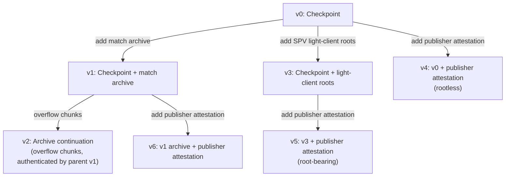
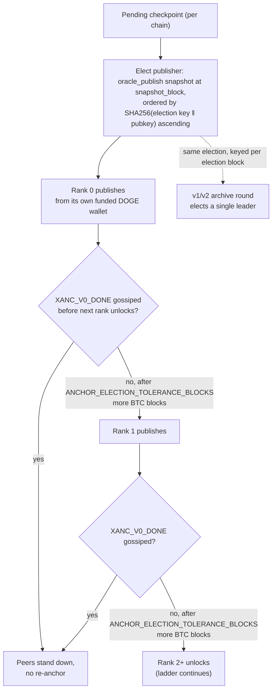
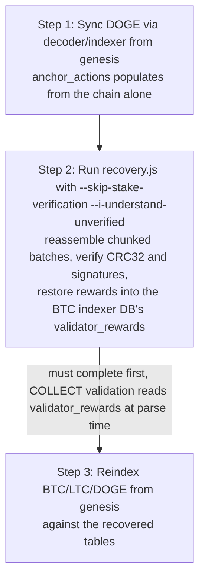

<!-- SPDX-License-Identifier: AGPL-3.0-or-later -->
<!-- Copyright © 2025–2026 Dankest, LLC -->

# XChain Platform Action - ANCHOR

On-chain commitment of federation-signed state, checkpoints and the cross-chain match
archive, in a single action with seven version-discriminated phases:

- **v0: Checkpoint.** Validator-broadcast. Commits one chain's quorum-signed state checkpoint
  (the per-block `ledger`/`actions`/`contract` hash triple) to the anchor chain.
- **v1: Checkpoint + match archive.** Validator-broadcast. A v0 checkpoint plus a compressed
  batch of full `cross_chain_matches` records (including their validator signatures and the
  `capability_snapshots` rows needed to re-verify them), making cross-chain match data
  recoverable from chain parse alone.
- **v2: Archive continuation.** Validator-broadcast. Carries overflow chunks when a v1 archive
  payload exceeds the per-action data limit. Authenticated by its parent v1 (carries no
  signatures of its own).
- **v3: Checkpoint + light-client roots.** Validator-broadcast. A v0 checkpoint plus the additive
  SPV light-client roots (`STATE_ROOT` + `BLOCK_MERKLE_ROOT` and their version bytes), gated by the
  `CHECKPOINT_COMMITMENT` flag-day. Post-flag-day the publisher emits v3 instead of v0; the
  federation signatures cover the roots (they are part of the signed checkpoint canonical), so an
  on-chain-anchored state root is recoverable from chain parse alone.
- **v4 / v5: Checkpoint + publisher attestation.** Validator-broadcast. A v0 (v4, rootless) / v3
  (v5, root-bearing) checkpoint plus the elected `PUBLISHER` pubkey and a second 2f+1
  `oracle_publish` attestation (the `XANCPUB` canonical) binding which validator earns the fixed
  anchor reward, gated by the `ANCHOR_REWARD` flag-day. The indexer re-derives the reward from
  these bytes, retiring the previously trusted (and forgeable) `pushvalidatorrewards` push.
  Post-flag-day the publisher emits v4/v5 in place of v0/v3; a degraded federation that cannot
  reach the attestation quorum falls back to a legacy v0/v3 so the anchor still lands (no reward).
- **v6: Archive + publisher attestation.** Validator-broadcast. The v1 archive anchor plus the
  elected archive leader's `PUBLISHER` pubkey and the same 2f+1 `oracle_publish` attestation tail
  as v4/v5, attested over an `anchor_archive` `XANCPUB` canonical keyed on `MATCH_BATCH_SEQ` and
  gated by the `ARCHIVE_REWARD` flag-day . The indexer re-derives the archive reward from
  these bytes, retiring the last key-authenticated `pushvalidatorrewards` rail. Post-flag-day the
  archive leader emits v6 in place of v1; a degraded federation falls back to a legacy v1 so the
  archive still lands (no reward).



`ANCHOR` is valid **only on the anchor chain; DOGE** (all networks). Indexers on other chains
reject it. BTC and LTC state is still covered: each v0/v1/v3/v4/v5/v6 names the `CHAIN` it
checkpoints, so one cheap chain carries the commitments for all three.

ANCHOR supersedes the hub's legacy raw `XDEXANCHOR` payload (which was not a protocol action and
was invisible to the decoder). The `XDEXANCHOR` publisher (`CrossChainDexAnchor`) was removed
from the hub on 2026-06-11 after ANCHOR verified end-to-end on mainnet; rows it stamped
(`batch_root`) remain readable but nothing publishes the legacy payload anymore.

## Purpose

1. **Verifiable state.** Light clients verify any indexer/explorer response against a
   checkpoint signed by `2f+1` `oracle_publish` validators, without trusting a single operator.
2. **Full-parse recoverability.** Cross-chain match records are the only consensus-relevant
   dataset not natively on-chain (they are mirror-delivered; see
   [Cross-Chain DEX](../cross-chain-dex.md)). The v1/v2 archive places the records themselves
   on-chain, so the entire platform state is reconstructible from a full parse of the three
   blockchains with no surviving hub database.

## PARAMS
| Name                  | Type    | Versions | Description                                                            |
| --------------------- | ------- | -------- | ---------------------------------------------------------------------- |
| `VERSION`             | Integer | all      | Format version (0=checkpoint, 1=checkpoint+archive, 2=continuation, 3=checkpoint+SPV roots, 4=v0+publisher, 5=v3+publisher, 6=v1+publisher) |
| `CHAIN`               | String  | 0, 1, 3, 4, 5, 6 | Chain being checkpointed: `BTC` \| `LTC` \| `DOGE`                     |
| `NETWORK`             | String  | 0, 1, 3, 4, 5, 6 | `mainnet` \| `testnet` \| `regtest`                                    |
| `BLOCK_INDEX`         | Integer | 0, 1, 3, 4, 5, 6 | Checkpointed block height on `CHAIN`                                   |
| `BLOCK_HASH`          | String  | 0, 1, 3, 4, 5, 6 | 64-hex block hash of `CHAIN` at `BLOCK_INDEX`                          |
| `LEDGER_HASH`         | String  | 0, 1, 3, 4, 5, 6 | 64-hex chained ledger hash (`blocks.ledger_hash` at `BLOCK_INDEX`)     |
| `ACTIONS_HASH`        | String  | 0, 1, 3, 4, 5, 6 | 64-hex chained actions hash                                            |
| `CONTRACT_HASH`       | String  | 0, 1, 3, 4, 5, 6 | 64-hex chained contract hash                                           |
| `CHECKPOINT_SEQ`      | Integer | 0, 1, 3, 4, 5, 6 | Monotonic checkpoint counter per (`CHAIN`,`NETWORK`)                   |
| `SNAPSHOT_BLOCK`      | Integer | 0, 1, 3, 4, 5, 6 | BTC block selecting the `oracle_publish` validator set for the sigs    |
| `STATE_ROOT`          | String  | 3, 5     | 64-hex SPV state root (SMT over balances+stakes) at `BLOCK_INDEX`      |
| `STATE_ROOT_VERSION`  | Integer | 3, 5     | Merkle scheme version the `STATE_ROOT` was computed under              |
| `BLOCK_MERKLE_ROOT`   | String  | 3, 5     | 64-hex SPV per-block content Merkle root at `BLOCK_INDEX`              |
| `BLOCK_MERKLE_VERSION`| Integer | 3, 5     | Merkle scheme version the `BLOCK_MERKLE_ROOT` was computed under       |
| `MATCH_BATCH_SEQ`     | Integer | 1, 2, 6  | Monotonic archive-batch counter (ties v2 chunks to their v1/v6)        |
| `MATCH_COUNT`         | Integer | 1, 6     | Number of match records in this archive batch                         |
| `BATCH_CRC32`         | String  | 1, 6     | 8-hex CRC32 of the **uncompressed** archive JSON bytes                 |
| `ARCHIVE_B64`         | String  | 1, 6     | base64url of `gzip(archive JSON)`: chunk 0 when the batch is chunked  |
| `CHUNK_INDEX`         | Integer | 2        | 1-based continuation index (the v1/v6 head itself carries chunk 0)     |
| `TOTAL_CHUNKS`        | Integer | 1, 2, 6  | Total chunks in the batch (1 = unchunked, archive-head-only)           |
| `ARCHIVE_B64_CHUNK`   | String  | 2        | This continuation's slice of the base64url payload                    |
| `SIG_COUNT`           | Integer | 0, 1, 3, 4, 5, 6 | Number of (pubkey, sig) pairs that follow                         |
| `PUBKEY_n`            | String  | 0, 1, 3, 4, 5, 6 | 64-hex Ed25519 pubkey, in the `oracle_publish` set at `SNAPSHOT_BLOCK` |
| `SIG_n`               | String  | 0, 1, 3, 4, 5, 6 | 128-hex Ed25519 signature over the canonical checkpoint message    |
| `PUBLISHER`           | String  | 4, 5, 6  | 64-hex Ed25519 pubkey of the elected publisher that earns the anchor reward |
| `ATTEST_SIG_COUNT`    | Integer | 4, 5, 6  | Number of (pubkey, sig) attestation pairs that follow                  |
| `APUBKEY_n`           | String  | 4, 5, 6  | 64-hex pubkey in the `oracle_publish` set at `SNAPSHOT_BLOCK` (attestation signer) |
| `ASIG_n`              | String  | 4, 5, 6  | 128-hex Ed25519 signature over the `XANCPUB` canonical                 |

## Formats

### Version `0`: Checkpoint (validator-broadcast)
- `ANCHOR|0|CHAIN|NETWORK|BLOCK_INDEX|BLOCK_HASH|LEDGER_HASH|ACTIONS_HASH|CONTRACT_HASH|CHECKPOINT_SEQ|SNAPSHOT_BLOCK|SIG_COUNT|PUBKEY1|SIG1|PUBKEY2|SIG2|...`

### Version `1`: Checkpoint + match archive (validator-broadcast)
- `ANCHOR|1|CHAIN|NETWORK|BLOCK_INDEX|BLOCK_HASH|LEDGER_HASH|ACTIONS_HASH|CONTRACT_HASH|CHECKPOINT_SEQ|SNAPSHOT_BLOCK|MATCH_BATCH_SEQ|MATCH_COUNT|BATCH_CRC32|TOTAL_CHUNKS|ARCHIVE_B64|SIG_COUNT|PUBKEY1|SIG1|...`

### Version `2`: Archive continuation (validator-broadcast; no signatures)
- `ANCHOR|2|MATCH_BATCH_SEQ|CHUNK_INDEX|TOTAL_CHUNKS|ARCHIVE_B64_CHUNK`

### Version `3`: Checkpoint + light-client roots (validator-broadcast)
- `ANCHOR|3|CHAIN|NETWORK|BLOCK_INDEX|BLOCK_HASH|LEDGER_HASH|ACTIONS_HASH|CONTRACT_HASH|CHECKPOINT_SEQ|SNAPSHOT_BLOCK|STATE_ROOT|STATE_ROOT_VERSION|BLOCK_MERKLE_ROOT|BLOCK_MERKLE_VERSION|SIG_COUNT|PUBKEY1|SIG1|...`

### Version `4`: Checkpoint + publisher attestation (validator-broadcast)
- `ANCHOR|4|CHAIN|NETWORK|BLOCK_INDEX|BLOCK_HASH|LEDGER_HASH|ACTIONS_HASH|CONTRACT_HASH|CHECKPOINT_SEQ|SNAPSHOT_BLOCK|SIG_COUNT|PUBKEY1|SIG1|...|PUBLISHER|ATTEST_SIG_COUNT|APUBKEY1|ASIG1|...`
- The rootless v0 checkpoint with the `PUBLISHER` + attestation list appended **after** the root signature list (never inserted mid-string, so old positional parsers are unaffected). Emitted in place of v0 at/above the `ANCHOR_REWARD` flag-day.

### Version `5`: Checkpoint + light-client roots + publisher attestation (validator-broadcast)
- `ANCHOR|5|CHAIN|NETWORK|BLOCK_INDEX|BLOCK_HASH|LEDGER_HASH|ACTIONS_HASH|CONTRACT_HASH|CHECKPOINT_SEQ|SNAPSHOT_BLOCK|STATE_ROOT|STATE_ROOT_VERSION|BLOCK_MERKLE_ROOT|BLOCK_MERKLE_VERSION|SIG_COUNT|PUBKEY1|SIG1|...|PUBLISHER|ATTEST_SIG_COUNT|APUBKEY1|ASIG1|...`
- The root-bearing v3 checkpoint with the same `PUBLISHER` + attestation tail as v4. Emitted in place of v3 at/above the `ANCHOR_REWARD` flag-day (so v5 also requires the `CHECKPOINT_COMMITMENT` flag-day). Set the mainnet `ANCHOR_REWARD` flag-day `>=` `CHECKPOINT_COMMITMENT` to keep mainnet on v5-only (always root-bearing) and avoid the rootless v4.
- The two roots + version bytes are appended after `SNAPSHOT_BLOCK` (never inserted mid-string, so old positional parsers are unaffected). Emitted in place of v0 at/above the `CHECKPOINT_COMMITMENT` flag-day.

### Version `6`: Checkpoint + match archive + publisher attestation (validator-broadcast)
- `ANCHOR|6|CHAIN|NETWORK|BLOCK_INDEX|BLOCK_HASH|LEDGER_HASH|ACTIONS_HASH|CONTRACT_HASH|CHECKPOINT_SEQ|SNAPSHOT_BLOCK|MATCH_BATCH_SEQ|MATCH_COUNT|BATCH_CRC32|TOTAL_CHUNKS|ARCHIVE_B64|SIG_COUNT|PUBKEY1|SIG1|...|PUBLISHER|ATTEST_SIG_COUNT|APUBKEY1|ASIG1|...`
- The v1 archive anchor with the `PUBLISHER` + attestation list appended **after** the wrapper signature list (never inserted mid-string). Emitted in place of v1 at/above the `ARCHIVE_REWARD` flag-day . Continuation chunks stay v2, tied by `MATCH_BATCH_SEQ` exactly as for a v1 head.

## Examples

```
ANCHOR|0|BTC|mainnet|900123|00000000...|3f9a...|b81c...|44d0...|417|900120|3|a1b2...|c3d4...|e5f6...|0718...|292a...|3b4c...
Quorum-signed checkpoint of BTC mainnet block 900123, published on DOGE
```

```
ANCHOR|1|BTC|mainnet|900123|00000000...|3f9a...|b81c...|44d0...|418|900120|42|17|9c4e1b22|1|H4sIAAAA...|3|a1b2...|c3d4...|...
Checkpoint plus archive batch 42 (17 match records, single chunk)
```

```
ANCHOR|2|42|1|3|AAAB7Rxe...
Continuation chunk 1 of 3 for archive batch 42
```

## Canonical signing message (v0 / v1 / v3)
Each `SIG_n` covers the UTF-8 bytes of:

```
XCHECKPOINT|CHAIN|NETWORK|BLOCK_INDEX|BLOCK_HASH|LEDGER_HASH|ACTIONS_HASH|CONTRACT_HASH|CHECKPOINT_SEQ|SNAPSHOT_BLOCK
```

and for v1, with the archive structure appended:

```
XCHECKPOINT|...|SNAPSHOT_BLOCK|MATCH_BATCH_SEQ|MATCH_COUNT|BATCH_CRC32|TOTAL_CHUNKS
```

and for v3, with the SPV light-client roots appended (the byte the federation signs, so the roots are covered by the quorum, not merely transported):

```
XCHECKPOINT|...|SNAPSHOT_BLOCK|STATE_ROOT|STATE_ROOT_VERSION|BLOCK_MERKLE_ROOT|BLOCK_MERKLE_VERSION
```

The v3 suffix is byte-identical to the post-flag-day checkpoint canonical the hub `StateCheckpointEngine` signs and the SDK / explorer verifiers reconstruct (the publisher reuses the checkpoint row's signatures verbatim). Gated on `SNAPSHOT_BLOCK` by `CHECKPOINT_COMMITMENT_ACTIVATION`; a v3 below the flag-day is rejected.

`ARCHIVE_B64` is **not** part of the signed bytes; the blob is bound to the signed structure by
`BATCH_CRC32`, computed over the uncompressed JSON. (CRC over uncompressed bytes keeps
verification independent of the zlib version that produced the gzip stream.) Chain/network are
uppercase/lowercase exactly as on the wire; numerics are decimal with no leading zeros; hashes
are lowercase hex. A signature counts only if its pubkey is in the `oracle_publish` capability
snapshot at `SNAPSHOT_BLOCK` **and** the Ed25519 signature verifies.

The v4/v5 root signatures (`SIG_n`) cover the SAME canonical as v0/v3 respectively (rootless for
v4, root-bearing for v5), and the v6 wrapper signatures cover the SAME archive canonical as v1;
the publisher attestation below is a SEPARATE signature list.

## Publisher-attestation canonical (`XANCPUB`, v4 / v5 / v6)
Each `ASIG_n` covers the UTF-8 bytes of the reward tuple:

```
XANCPUB|anchor_<CHAIN>|CHECKPOINT_SEQ|SNAPSHOT_BLOCK|PUBLISHER|ANCHOR_REWARD_AMOUNT
```

`ANCHOR_REWARD_AMOUNT` is the **frozen consensus constant** `10.00000000` (read from the
`ANCHOR_REWARD_ACTIVATION` twin module, NEVER taken from the wire; changing it is itself a
flag-day). `PUBLISHER` is lowercase hex. At/above the `EQUIV_HEADER` flag-day the bytes are wrapped
once in the uniform equivocation header, with a distinct `XANCPUB|...` round id so this attestation
forms its own equivocation family (a validator that signs both the checkpoint root canonical and
this reward attestation in the same round is never falsely slashable):

```
EQUIV|XCHECKPOINT|XANCPUB|CHAIN|NETWORK|CHECKPOINT_SEQ|SNAPSHOT_BLOCK|0||XANCPUB|anchor_<CHAIN>|CHECKPOINT_SEQ|SNAPSHOT_BLOCK|PUBLISHER|ANCHOR_REWARD_AMOUNT
```

The v6 archive attestation  uses the same shape keyed on the archive batch, with the
frozen `ARCHIVE_REWARD_AMOUNT` (`10.00000000`, from the same twin module) and an
`XANCPUB|archive|...` round id disjoint from every per-chain round id (the two attestation
families can never equivocation-collide):

```
XANCPUB|anchor_archive|MATCH_BATCH_SEQ|SNAPSHOT_BLOCK|PUBLISHER|ARCHIVE_REWARD_AMOUNT
```

and at/above the `EQUIV_HEADER` flag-day:

```
EQUIV|XCHECKPOINT|XANCPUB|archive|NETWORK|MATCH_BATCH_SEQ|SNAPSHOT_BLOCK|0||XANCPUB|anchor_archive|MATCH_BATCH_SEQ|SNAPSHOT_BLOCK|PUBLISHER|ARCHIVE_REWARD_AMOUNT
```

These bytes are byte-identical across the hub producer (`StateAnchorPublisher._attestationCanonical`),
the indexer verifier (`actions/anchor.js` `_rewardCanonical`) and this spec; a divergence forks the
derived reward row. An `ASIG_n` counts only if its pubkey is in the SAME `oracle_publish` snapshot at
`SNAPSHOT_BLOCK` used for the root quorum **and** the Ed25519 signature verifies.

## Archive JSON (v1/v2 payload, after gunzip)

A single JSON object with **fixed key order** (required: `BATCH_CRC32` is computed over these
exact bytes):

```json
{
  "v": 1,
  "network": "mainnet",
  "batch_seq": 42,
  "matches": [ { ...full cross_chain_matches row... } ],
  "calls": [ { ...cross_chain_calls relay row... } ],
  "rewards": [ { "validator_pubkey": "...", "source": "1Stake...", "round_number": 17, "reward_type": "anchor_BTC", "amount": "10.00000000", "block_index": 900120 } ],
  "capability_snapshots": [ { "snapshot_block": 900120, "capability": "cross_chain", "signing_pubkey": "...", "amount": "..." } ]
}
```

- `matches[]` rows carry every wire-relevant `cross_chain_matches` column: `match_id`,
  `snapshot_block`, `network`, both legs (`a_*`/`b_*` including `kind`/`filled_before`),
  `effective_time`, `validator_signatures` (the raw JSON string, verbatim), and `status`
  (`finalized` or `retracted`). Hub-side audit columns (`batch_root`, `anchor_txid`) are
  excluded.
- `capability_snapshots[]` carries the `cross_chain` snapshot rows for every distinct
  `snapshot_block` referenced by `matches[]` (to re-verify match signatures) **plus** the
  `oracle_publish` rows at the wrapper checkpoint's `SNAPSHOT_BLOCK` (to re-verify the v1
  anchor's own signatures). They are included because historical `min_stake` governance values
  are not on-chain, archiving the snapshot rows makes signature re-verification
  self-contained during recovery. Recovery additionally cross-checks archived pubkeys against
  on-chain BTC stakes (a fabricated snapshot row cannot survive, staking is on-chain), so the
  chain remains the root of trust.
- `rewards[]` carries the **anchor-publish reward rows** (`reward_type` `anchor_<chain>` /
  `anchor_archive` only) that have not yet ridden an archive. These are the one
  `validator_rewards` rail a chain parse cannot re-derive (`oracle_round` and `attest_fee`
  rows are derived deterministically from PRICE/ATTEST actions and are **never archived**:
  recovery rejects an archive that claims them). Reward rows carry no per-row signatures;
  every co-signing hub instead **re-derives** each field before signing: the pubkey must be in
  its own `oracle_publish` resolution at `block_index`, the amount must equal its configured
  publish reward, and `source` must match its own block-scoped indexer resolution of the
  earn-time staking address (pinned into the archive because recovery restores rewards into an
  EMPTY BTC DB, and a later re-stake of the pubkey must not move the credit). `block_index` is
  the quorum-agreed `SNAPSHOT_BLOCK` of the rewarded checkpoint, so every hub records
  identical row bytes.
- All amounts are decimal strings (full precision, as stored).
- A match **retracted after it was archived** is re-published in a later batch with
  `status:"retracted"`. Recovery applies latest-status-wins ordered by `batch_seq`.
- `calls` and `rewards` are additive keys, archives published before each existed simply
  omit them, and recovery treats a missing key as an empty list.

## Rules

### All versions
- Valid **only where `COIN = DOGE`**, indexers on other chains mark the action invalid.
- No XCHAIN fee and no native-coin protocol fee (validator protocol action, same fee treatment
  as `PRICE` v0). The publisher pays only the DOGE miner fee.

### Version 0 / 1 / 3 / 4 / 5 / 6
- `CHAIN` must be one of `BTC`/`LTC`/`DOGE`; `NETWORK` must equal the indexer's own network.
- Each `PUBKEY_n` is checked against the `oracle_publish` capability snapshot at
  `SNAPSHOT_BLOCK` (a BTC height; non-BTC indexers resolve it from the hub-mirrored
  `capability_snapshots` table, exactly as cross-chain settlement resolves `cross_chain`).
- Each `SIG_n` must Ed25519-verify against the canonical message.
- Valid signatures must reach `max(2f+1, ceil((N+1)/2))` of the snapshot set; PBFT `2f+1`
  floored at a simple majority, so N=3 requires 2 (single-validator sets require 1).
- `CHECKPOINT_SEQ` must be ≥ any previously accepted seq for (`CHAIN`,`NETWORK`), replays of
  older checkpoints are recorded but flagged `stale`, never `valid`. Equal-seq records are
  accepted: a v0 and its v1 share the same wrapper seq by design, and an exact replay is
  signature-bound to identical content (harmless duplicate). The same ≥ rule applies to
  `MATCH_BATCH_SEQ` on v1/v6. The checkpoint replay watermark counts v0/v1/v3/v4/v5/v6 together.

### Version 3 only
- Valid only at/above the `CHECKPOINT_COMMITMENT` flag-day (gated on `SNAPSHOT_BLOCK`); a v3
  below it is invalid (its signed canonical would have no root suffix, so the sigs could
  never verify). Post-flag-day the publisher emits v3 in place of v0.
- `STATE_ROOT` and `BLOCK_MERKLE_ROOT` must be 64-hex; the two version bytes must be integers.
  Both roots are part of the signed canonical, so a swapped root fails the signature check.

### Version 4 / 5 only
- Valid only at/above the `ANCHOR_REWARD` flag-day (gated on `SNAPSHOT_BLOCK`); a v4/v5 below it
  is invalid. v5 additionally requires the `CHECKPOINT_COMMITMENT` flag-day (it carries roots).
  Post-flag-day the publisher emits v4/v5 in place of v0/v3.
- `PUBLISHER` must be 64-hex. The attestation list (`APUBKEY_n`/`ASIG_n`) is verified as a SECOND
  quorum over the `XANCPUB` canonical against the SAME `oracle_publish` snapshot at `SNAPSHOT_BLOCK`
  used for the root quorum, reaching the same `max(2f+1, ceil((N+1)/2))` (stake-weighted at/above
  `STAKE_WEIGHTED_QUORUM`) threshold.
- The anchor reward is credited (a COLLECT-spendable `validator_rewards` row keyed
  `(CHECKPOINT_SEQ, anchor_<CHAIN>)`, amount = the frozen `ANCHOR_REWARD_AMOUNT`, never the wire)
  **only** when the root quorum passed, the attestation quorum is met, and `PUBLISHER` is in the
  snapshot set. A failed, short, or forged attestation **never** invalidates the anchor: the
  checkpoint still records as `valid` and only the reward is skipped, deterministically across
  the fleet. A failover double-publish converges to the smallest-pubkey winner (the same
  reconcile the retired push + recovery use), so the COLLECT rail stays single-winner.
- The trusted, unauthenticated `pushvalidatorrewards` reward push is retired for `anchor_<chain>`
  at/above the flag-day: every indexer DERIVES the reward from these bytes instead.

### Version 6 only
- Valid only at/above the `ARCHIVE_REWARD` flag-day (gated on `SNAPSHOT_BLOCK`); a v6 below it is
  invalid. Post-flag-day the archive leader emits v6 in place of v1.
- All v1 rules apply unchanged (archive integrity, `MATCH_BATCH_SEQ` monotonicity, v2 chunk tie).
- `PUBLISHER` + attestation verification follows the v4/v5 rules verbatim, over the archive
  `XANCPUB` canonical. The credited row is keyed `(MATCH_BATCH_SEQ, anchor_archive)`, amount =
  the frozen `ARCHIVE_REWARD_AMOUNT`, never the wire. A failed, short, or forged attestation
  never invalidates the archive anchor; only the reward is skipped.
- The `pushvalidatorrewards` push is retired for `anchor_archive` at/above the flag-day: every
  indexer DERIVES the archive reward from these bytes instead (; closes the
  insider-with-key forge surface the per-chain flag-day left open).

### Version 1 only
- `MATCH_COUNT` must equal `matches.length` after decompression (when `TOTAL_CHUNKS` = 1;
  otherwise checked at reassembly).
- `BATCH_CRC32` must match the CRC32 of the uncompressed JSON (checked at reassembly when
  chunked).
- `MATCH_BATCH_SEQ` must be ≥ any previously accepted batch seq for the network.

### Version 2 only
- `MATCH_BATCH_SEQ` must reference a previously indexed v1 with `TOTAL_CHUNKS` > 1 (out-of-order
  arrival within the same block is tolerated; the batch assembles when all chunks are present).
- `CHUNK_INDEX` must be in `[1, TOTAL_CHUNKS-1]` and not a duplicate.
- The chunk's source address must equal the head's: "authenticated by its parent v1" is
  enforced, so only the publisher whose batch it is can fill a slot.
- Carries no signatures; a v2 is meaningful only joined to its authenticated v1; orphan or
  CRC-failing batches are flagged `invalid_archive` and ignored by recovery.

#### Archive batch identity (flag-day gated)

`MATCH_BATCH_SEQ` is not unique: an equal seq is accepted (re-broadcast, failover
double-publish), so more than one head can carry it. At/after the per-network
`ARCHIVE_BATCH_AUTHOR` flag-day an archive batch is identified by
**(`MATCH_BATCH_SEQ`, head source address)**, not by the seq alone:

- a chunk's parent is the earliest head for that seq **authored by the same address**,
- `TOTAL_CHUNKS`, slot occupancy and `BATCH_CRC32` reassembly are all evaluated within
  that publisher's own batch, and
- a chunk whose publisher has no head for the seq is an orphan.

Before the flag-day the parent is the earliest head for the seq regardless of author, which
lets anyone deny a batch by broadcasting a junk head at the next seq: its `TOTAL_CHUNKS`
invalidates every legitimate chunk, and its address becomes the only one whose chunks count.
A publisher publishing one head per seq sees no difference between the two rules.

## Effects
- Persists into `anchor_actions` (action-indexed; rolled back on reorg like any data table).
- A `valid` v0/v1 records the checkpoint; the indexer's mirrored `state_checkpoints` copy is
  the live source for verification APIs, while `anchor_actions` is the permanent on-chain
  record.
- **No ledger effect.** ANCHOR never credits, debits, escrows, or alters token state. A bad or
  missing anchor can never corrupt balances; the worst failure mode is a missing audit/recovery
  record.

## Publisher
- Published by the hub's `StateAnchorPublisher`. **Per-chain publisher election**: each pending
  checkpoint elects its own publisher from the `oracle_publish` capability snapshot at the
  checkpoint's `snapshot_block`, ordered by `SHA256(election key ‖ pubkey)` ascending (the
  attestation responsible-set idiom; the key binds chain/network/seq/snapshot_block, so a
  different validator typically wins each chain's anchor in a cycle). Rank 0 publishes from its
  own funded DOGE wallet; each further rank unlocks after `ANCHOR_ELECTION_TOLERANCE_BLOCKS`
  more BTC blocks elapse without a publish (deterministic failover ladder; a gossiped
  `XANC_V0_DONE` back-fill stops peers from re-anchoring a checkpoint someone already paid
  for). The v1/v2 archive round elects a single leader the same way, keyed per election block.
  A single-validator federation degenerates to today's serialized single-wallet behavior.



- Each successful publish records an `anchor_<chain>` (round = `checkpoint_seq`) or
  `anchor_archive` (round = `batch_seq`) reward of `ANCHOR_REWARD_PER_PUBLISH` XCHAIN
  (default 10) on the `validator_rewards` rail, collectable on BTC via `COLLECT` like
  oracle-round rewards.
- P2SH encoding via the standard encoder pipeline.
- Default cadence: one v0 per chain plus pending v1/v2 archive batches per anchor interval
  (`ANCHOR_INTERVAL_MS`, default daily), or early when `ANCHOR_MATCH_BATCH_SIZE` matches are
  pending. Checkpoint *signing* happens more often (hourly, mirror-only, no chain writes); the
  anchor commits the latest signed checkpoint at publish time. Operators can also trigger an
  immediate flush via the hub's authenticated `anchorflush` JSON-RPC method.

### Where the publisher constants come from

None of these is consensus data: they are per-hub operator knobs, and two hubs running
different values still produce mutually verifiable anchors. What follows is the derivation of
each magnitude, so a tuner can tell what is load-bearing from what is merely a round number.
The arithmetic is pinned by `xchain-hub/test/unit/StateAnchorPublisher.constant-derivations.test.js`.

**`ANCHOR_CHUNK_MAX_BYTES` (6000).** The hard ceiling is `MAX_ACTION_DATA_LENGTH` = 8192
compiled bytes (`protocol/constants.js`). The decoder is the arbiter and *silently drops* any
action above it, so an oversize anchor is lost on every node rather than rejected loudly. Chunk
0 never travels alone: it sits inside the v1/v6 head beside the checkpoint prefix (four 64-hex
hashes plus the chain/network/seq/index fields, about 322 bytes at mainnet heights) and the
signature lists, which cost 194 bytes per `(PUBKEY, SIG)` pair. A v6 adds roughly 67 bytes for
`PUBLISHER` + `ATTEST_SIG_COUNT` and another 194 bytes per attesting signer. So `8192 - 6000 -
322` leaves about 1870 bytes of head budget, which is about nine signature pairs on a v1, or
four wrapper plus four attestation pairs on a v6. That reserve is the reason for 6000 rather
than a figure nearer 8000. It constrains chunk 0 only (a v2 continuation carries about 30 bytes
of overhead and could hold far more), but a single uniform slice keeps the splitter trivial.
**This is the knob to lower as the federation grows:** a v6 with a 5+5 quorum needs
`ANCHOR_CHUNK_MAX_BYTES` at or below about 5860, a 7+7 quorum about 5080. Raising it saves v2
transactions but overflows the head first, and the encoder rejects the oversize v1/v6.

**`ANCHOR_MATCH_BATCH_SIZE` (200) and `ANCHOR_MAX_BATCH` (1000).** The first is a latency
trigger, not a size cap: 200 pending rows flush an archive early instead of waiting out
`ANCHOR_INTERVAL_MS`, which bounds how much settled cross-chain state exists only in hub
databases. The second is the per-cycle SQL `LIMIT` and therefore the DOGE spend bound. Archived
rows are dominated by validator signatures and do not compress: roughly 0.55 KB of gzip+base64
per settled match, so 1000 rows is about 550 KB, about 93 chunks, about 93 DOGE transactions in
one cycle, while 200 rows is about 19. Both trade cost against archive latency and neither
changes what the archive means; too large spends more DOGE per cycle, too small drains the
backlog more slowly.

**`ANCHOR_ELECTION_TOLERANCE_BLOCKS` (36).** The unit is BTC *blocks*, not wall clock, precisely
so every hub computes the same rank unlock without clock synchronisation. 36 BTC blocks is about
6 hours at the 10-minute target, so each failover rank waits about 6 hours of elected-publisher
silence. The ordering is the load-bearing property:

```
signing round (120s) + DOGE burial (60 confs, ~1h)  <<  36 blocks (~6h)  <<  ANCHOR_INTERVAL_MS (24h)
```

The left inequality keeps a healthy but slow rank-0 publisher from being overtaken, so the
federation never pays DOGE twice for the same checkpoint, and it keeps the on-chain
confirmation wait in the `XANC_V0_DONE` path well inside a single rank. The right inequality
means ranks 1 to 3 unlock at about 6, 12 and 18 hours, so up to three backups still get a slot
inside one publishing cycle and a dead rank 0 cannot cost a whole day of anchoring. Anything in
roughly 6 to 144 blocks (1 to 24 hours) preserves both bounds: below the DOGE burial window the
ladder burns DOGE on duplicate anchors, above about 144 a dead leader stalls a cycle. Neither
direction is a divergence risk, because concurrently unlocked publishers build byte-identical
archives; the cost of getting it wrong is DOGE or delay, never a fork. The same value bounds how
far a peer's claimed election block may sit from the receiver's own BTC tip when co-signing,
which is anti-spam only.

## Recovery procedure (full-parse)
1. Sync DOGE through the decoder/indexer from genesis: `anchor_actions` populates from the
   chain alone.
2. Run `xchain-indexer/src/recovery.js --skip-stake-verification --i-understand-unverified`:
   reassembles
   chunked batches by `MATCH_BATCH_SEQ`, gunzips, verifies `BATCH_CRC32`, verifies each
   archived match's/call's `validator_signatures` against the archived
   `capability_snapshots`, rebuilds `cross_chain_matches` + `cross_chain_calls` +
   `capability_snapshots` (latest-status-wins), and restores archived `rewards[]` rows into
   the **BTC indexer DB's `validator_rewards`** (seeding the id maps is safe pre-reindex,
   they are append-only get-or-create).
3. Reindex BTC/LTC/DOGE from genesis against the recovered tables, cross-chain settlements,
   XCALL injections, `oracle_round`/`attest_fee` rewards, and historical COLLECT claims all
   re-derive identically; final `blocks` hash triples must match the anchored checkpoints.



**Ordering is load-bearing:** the reward restore (step 2) MUST complete before the BTC reindex
(step 3); COLLECT validation reads `validator_rewards` synchronously at parse time, so a
reindex that reaches a historical COLLECT before its anchor rewards are restored replays it
`invalid: no unclaimed rewards` and the recovered ledger diverges. The stake cross-check is ON by
default and requires `BTC_INDEXER_DB_NAME`; against the empty pre-reindex BTC DB it would fail
every batch, so the writing reward-restore pass explicitly opts out with
`--skip-stake-verification --i-understand-unverified` (a bare `--skip-stake-verification` is forced
to a dry run). AFTER the BTC reindex, run a verifying pass with `--dry-run` (stake cross-check
default-on) to confirm every archived validator set is backed by real on-chain stake.

## Notes
- `SNAPSHOT_BLOCK` is distinct from `BLOCK_INDEX`: `BLOCK_INDEX` is the checkpointed height on
  `CHAIN`; `SNAPSHOT_BLOCK` is always a **BTC** height (capability staking is BTC-only).
- The handler reads `BLOCK_INDEX`/`SNAPSHOT_BLOCK` from the wire payload. Not from the DOGE
  block the ANCHOR lands in.
- Checkpoints for a reorged height are simply re-signed and re-anchored for the canonical
  chain; the superseding record has a higher `CHECKPOINT_SEQ`.

---

**Copyright &copy; 2025–2026 Dankest, LLC**

**Based on XChain Platform by Dankest, LLC &ndash; https://dankest.llc**

Licensed under the **GNU Affero General Public License v3.0** (AGPL-3.0-or-later)
with a commercial license available for proprietary use.

You may use, modify, and distribute this material under the terms of the License.
See [LICENSE](../../LICENSE.md) and [NOTICE](../../NOTICE.md) for full terms.
See the [licensing overview](https://docs.xchain.io/legal/LICENSING.html).
