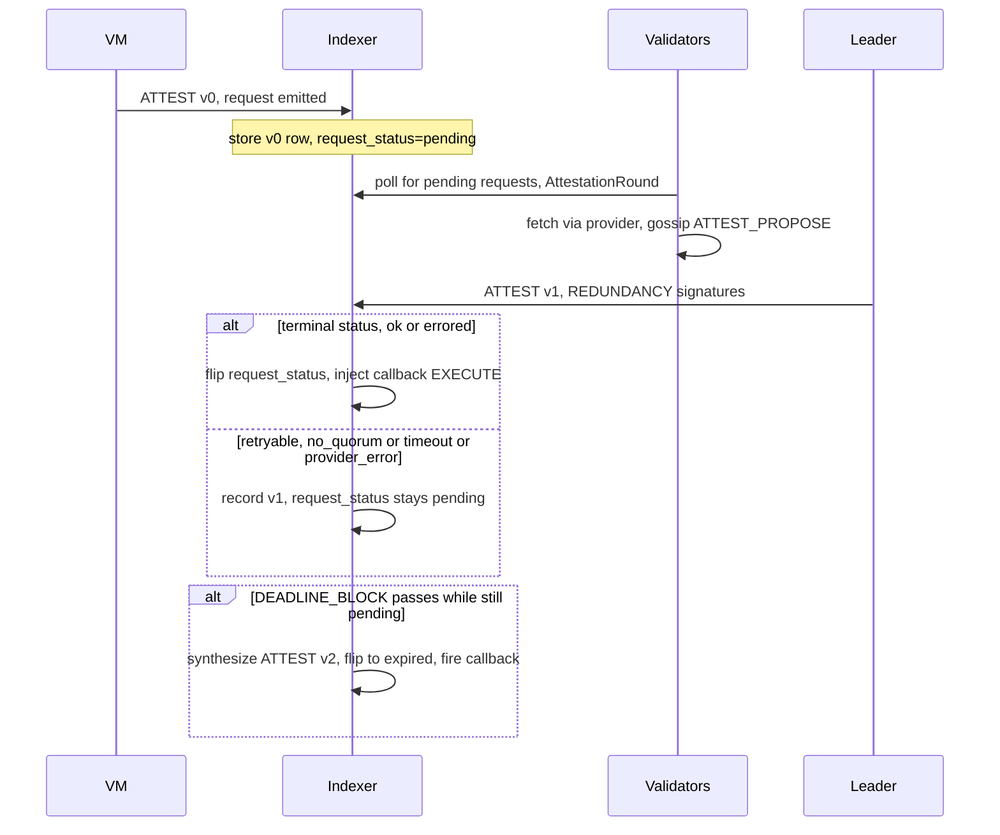
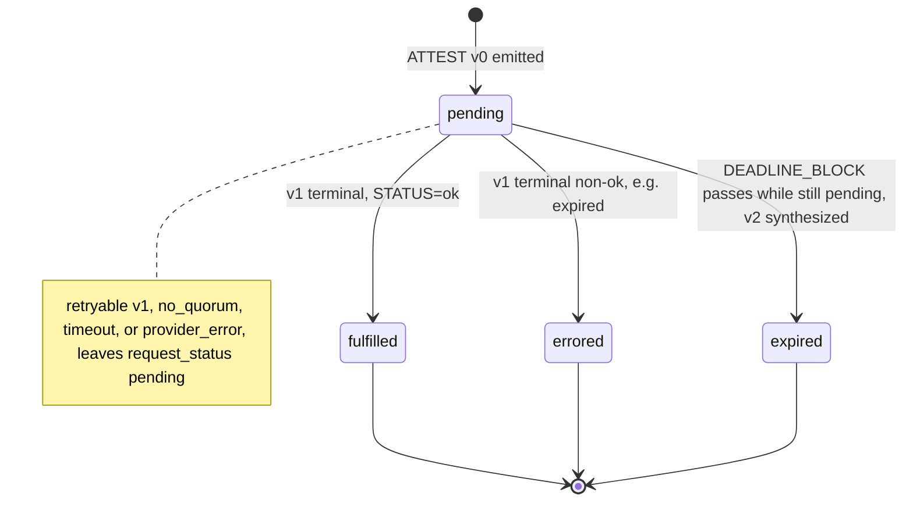

<!-- SPDX-License-Identifier: AGPL-3.0-or-later -->
<!-- Copyright © 2025–2026 Dankest, LLC -->

# XChain Platform Action - ATTEST
This action covers the external-data attestation lifecycle. A request is v0 (VM-emitted). Below a network's response-mirror activation height, the answer is v1, a validator-broadcast transaction. At or above that height, a finalized response does not arrive as its own on-chain transaction: it is agreed by the validator network and delivered to every indexer through the hub, and only shows up on chain afterward, batched together with other responses, as v5 (batch head) and v6 (batch continuation). See Response delivery, below, for how the two paths work and which one a given request uses. Two more versions round out the lifecycle: v2 (system-synthesized expiry) and the cross-chain relay legs v3 (a request materialized onto BTC) and v4 (the response relayed back to the origin chain).

All `attestation` capability stake lives on BTC, so a request emitted by an LTC or DOGE contract has no responsible set where it landed and cannot be fulfilled there. v3 materializes such a request onto BTC, giving it a real BTC `block_index`; from that point the ordinary v0/v1 machinery services it. v4 carries the outcome back so the origin chain fires the contract callback. Both legs are gated (see the Formats section) and inert until then.

## PARAMS
| Name                   | Type    | Description                                                                                     |
| ---------------------- | ------- | ----------------------------------------------------------------------------------------------- |
| `VERSION`              | Integer | Format version (0=request, 1=response, 2=expire, 3=relay request, 4=relay response, 5=batch head, 6=batch continuation) |
| `ORIGIN_CHAIN`         | String  | Chain a relayed request was emitted on (`LTC` or `DOGE`); v3 only                              |
| `ORIGIN_ACTION_INDEX`  | Integer | The origin chain's v0 `action_index`: the relay correlation key, and together with `ORIGIN_CHAIN` the exactly-once relay identity on BTC; v3 only |
| `HOME_RESPONSE_ACTION_INDEX` | Integer | The BTC v1 `action_index` whose outcome is being relayed; v4 only                        |
| `SNAPSHOT_BLOCK`       | Integer | BTC-anchored block the `cross_chain` signer set is pinned at, and the plane both relay gates resolve on; v3 and v4 |
| `REQUEST_ID`           | String  | 64-hex SHA-256 over `tx_hash:root_action_index:emitter_path:contract_index:emitter_position` (colon-delimited) |
| `PROVIDER_ID`          | String  | Governance-registered provider (`http_get`, `llm`, etc.); present in v0 and v1                 |
| `REQUEST_PAYLOAD`      | String  | Provider-specific payload (URL for `http_get`, JSON envelope for `llm`); v0 only               |
| `CALLBACK_METHOD`      | String  | Contract method to invoke on response (max 64 chars); v0 only                                  |
| `CALLBACK_PARAMS` | String  | JSON array of developer-supplied params echoed back to the callback; v0 only                   |
| `REDUNDANCY`           | Integer | Required validator signatures (1, 3, or 5); v0 only                                            |
| `DEADLINE_BLOCKS`      | Integer | Blocks until the request auto-expires (capped by provider's `deadline_window_blocks`); v0 only  |
| `FEE_TICK`             | String  | (optional) Tick the attestation fee is paid in; only XCHAIN accepted; v0 only                  |
| `FEE_AMOUNT`           | String  | (optional) Attestation fee, precision no finer than the GAS tick's own decimals; v0 only       |
| `RESPONSE_PAYLOAD`     | String  | Response body (base64-encoded on the wire, decoded to UTF-8 for storage and callback); v1 only  |
| `STATUS`               | String  | `ok`, `timeout`, `no_quorum`, `provider_error`, or `expired`; v1 only                          |
| `META`                 | String  | Provider-defined metadata (HTTP status code for `http_get`; model ID for `llm`); v1 only       |
| `SIG_COUNT`            | Integer | Number of (pubkey, sig) pairs that follow; v1 only                                              |
| `PUBKEY_n`             | String  | 64-hex Ed25519 pubkey, qualified for `attestation` at the request block; v1 only               |
| `SIG_n`                | String  | 128-hex Ed25519 signature over the canonical message; v1 only                                  |
| `BATCH_KEY`            | String  | 64-hex SHA-256 over `ATTESTBATCH:NETWORK:WINDOW_START:WINDOW_END` (colon-delimited); the batch's own identifier, and the key a v6 wire cites to find its head; v5 and v6 |
| `WINDOW_START`         | Integer | Start of the batch's time window, unix seconds; v5 only                                         |
| `WINDOW_END`           | Integer | End of the batch's time window, unix seconds; v5 only                                           |
| `ROW_COUNT`            | Integer | Number of responses carried in the batch (0 for an empty window); v5 only                       |
| `BTC_BLOCK_HEIGHT`     | Integer | BTC block height the batch's validator signer set is checked against; v5 only                   |
| `BATCH_CRC32`          | String  | 8-hex CRC32 checksum of the batch's uncompressed contents, checked after reassembly; v5 and v6   |
| `TOTAL_CHUNKS`         | Integer | Total number of wires (the head plus its continuations) the batch is split across; v5 and v6     |
| `BODY_B64`             | String  | Base64 of the batch's compressed contents, or the head's share of them when the batch continues into v6 wires; v5 only |
| `CHUNK_INDEX`          | Integer | This continuation's position among the batch's wires (the head is position 0); v6 only          |
| `BODY_B64_CHUNK`       | String  | Base64 continuation of the compressed contents begun in the head; v6 only                       |

## Formats

### Version `0` - Request (VM-emitted)
- `ATTEST|0|REQUEST_ID|PROVIDER_ID|REQUEST_PAYLOAD|CALLBACK_METHOD|CALLBACK_PARAMS|REDUNDANCY|DEADLINE_BLOCKS[|FEE_TICK|FEE_AMOUNT]`

The trailing `FEE_TICK|FEE_AMOUNT` pair is optional. A feeless request omits them entirely (the SDK serializer trims trailing empties), so feeless v0 wire strings are byte-identical to the pre-fee format with no migration needed.

### Version `1` - Response (validator-broadcast, variable-length signature list)
- `ATTEST|1|REQUEST_ID|PROVIDER_ID|RESPONSE_PAYLOAD|STATUS|META|SIG_COUNT|PUBKEY1|SIG1|PUBKEY2|SIG2|...`

### Version `2` - Expire (system-synthesized; never user-broadcast)
- `ATTEST|2|REQUEST_ID`

### Version `3` - Relay request (cross-chain, BTC only, flag-day gated)
- `ATTEST|3|REQUEST_ID|ORIGIN_CHAIN|ORIGIN_ACTION_INDEX|PROVIDER_ID|REQUEST_PAYLOAD|REDUNDANCY|DEADLINE_BLOCKS|SNAPSHOT_BLOCK|SIG_COUNT|PUBKEY1|SIG1|...`

### Version `4` - Relay response (cross-chain, origin chain only, flag-day gated)
- `ATTEST|4|REQUEST_ID|HOME_RESPONSE_ACTION_INDEX|RESPONSE_PAYLOAD|STATUS|META|SNAPSHOT_BLOCK|SIG_COUNT|PUBKEY1|SIG1|...`

Both relay versions activate at `ATTEST_RELAY_ACTIVATION` (BTC 963000 on mainnet, genesis on testnet and regtest). Below the height they are rejected as an unknown VERSION and persist nothing. Every indexer and hub must be deployed before that height.

### Version `5` - Batch head (system-published, Dogecoin only)
- `ATTEST|5|BATCH_KEY|NETWORK|WINDOW_START|WINDOW_END|ROW_COUNT|BTC_BLOCK_HEIGHT|BATCH_CRC32|TOTAL_CHUNKS|BODY_B64`

### Version `6` - Batch continuation (system-published, Dogecoin only)
- `ATTEST|6|BATCH_KEY|CHUNK_INDEX|TOTAL_CHUNKS|BATCH_CRC32|BODY_B64_CHUNK`

Both are published once every wall-clock hour on Dogecoin, never user-broadcast, and exist so a node with no connection to the validator network can still reconstruct the complete history of attestation responses from the chain alone (see Response delivery, below). A batch head, plus as many continuations as it needs, carries every response the validator network finalized in that hour, compressed and split so each wire fits inside a single action; an hour that produced no responses still publishes a head with `ROW_COUNT=0`, so every hour's coverage is provable even when nothing happened. A batch is capped at 256 responses and 1,048,576 bytes (1 MiB) of uncompressed content; a window that would need more than that is refused outright, loudly, rather than silently dropped or truncated.

## Examples
```
ATTEST|0|abc...def|http_get|https://example.com/v1/score/42|handleResponse|["ctx-42"]|1|10
VM-emitted request for an off-chain HTTP GET, single-validator redundancy, 10-block deadline, feeless
```

```
ATTEST|0|abc...def|http_get|https://example.com/v1/score/42|handleResponse|["ctx-42"]|1|10|XCHAIN|0.5
Same request carrying a 0.5 XCHAIN attestation fee (escrowed from FEE_PAYER at request time)
```

```
ATTEST|1|abc...def|http_get|{"score":7}|ok|200|1|a1b2...|c3d4...
Validator-broadcast response with one Ed25519 signature
```

```
ATTEST|2|abc...def
System-synthesized expiry for request abc...def
```

## Rules

### Version 0 (request)
- VM emission only; the `IS_EMISSION` flag must be set by `execute.processEmission`. User-broadcast v0 is rejected.
- `PROVIDER_ID` must be governance-registered (indexer validates against its provider registry).
- `REDUNDANCY` must appear in the provider's `allowed_redundancy` list.
- `REQUEST_PAYLOAD` size must be no larger than the provider's `max_request_bytes`.
- `DEADLINE_BLOCKS` must be greater than 0 and no larger than the provider's `deadline_window_blocks`.
- `CONTRACT_INDEX` (carried via `EMITTER`) must reference an existing contract.
- `REQUEST_ID` is verified by re-deriving from `tx_hash:root_action_index:emitter_path:contract_index:emitter_position` (colon-delimited; defends against compromised VM).
- Admission flag-day (`ATTEST_ADMISSION_ACTIVATION` in `protocol/constants.js`; mainnet 961000, testnet/regtest genesis): at/above the height, a request whose responsible set at its own block is smaller than `REDUNDANCY` (e.g. after the stake-weighted-quorum source-dedupe) is rejected at admission, since the v1 path can never collect `REDUNDANCY` signatures from a smaller set. Below the height the request is accepted and expires at `DEADLINE_BLOCK` unchanged (replay bit-identical).
- Per-block admission caps (`ATTEST_REQUEST_CAP_ACTIVATION` and `ATTEST_REQUEST_CAPS` in `protocol/constants.js`; testnet/regtest genesis, mainnet unset): a block admits at most `perContract` (2) requests from any one contract and `perBlock` (10) in total, counted over the admitted v0s earlier in the same block (`action_index` order, which is total, so every node counts the same prefix). An admitted request obliges `REDUNDANCY` validators to make a provider call the requester does not pay for, so the ceiling is what bounds validator spend; the per-contract share stops one contract taking the whole ceiling. Over-cap produces `invalid: ATTEST cap (…)`, which, being an emission validation failure, fails the whole enclosing EXECUTE: the over-cap request, the under-cap requests the same EXECUTE already emitted, and its state writes all roll back together. A contract that needs more than two attestations spaces them across blocks. Where the activation height is unset the rule is inert and admission is uncapped.

#### Responsible-set selection

The responsible set is the top `REDUNDANCY` validators ranked by `SHA256(request_id || pubkey)` ascending over the validators holding the `attestation` capability at the request's block. At and above `STAKE_WEIGHTED_QUORUM_ACTIVATION` two further rules apply, in this order:

1. **Provider stake floor.** Staking sources whose aggregate `attestation` stake is below the request provider's `min_stake_xchain` are dropped before ranking, so a freed slot goes to the next qualifying validator rather than shrinking the set. This is a higher, per-provider bar on top of the `attestation` capability `MIN_STAKE` (1000 XCHAIN): `http_get` requires 10000 and `llm` requires 25000, because serving an `llm` attestation carries more trust and more upstream cost. The bar is on the staking SOURCE, not on each delegated key, so one 25000 stake qualifies all of that source's keys and splitting 25000 across five keys qualifies none of them. Comparison is exact decimal and inclusive at the boundary. The floor is block-anchored (governance changes carry an activation block), so every hub and indexer resolves the same value for the same request; a node that cannot resolve a floor computes an EMPTY responsible set rather than assuming zero.
2. **Source dedupe.** Of the survivors, one slot per staking source (the source's lowest-hash key), so a source that delegates N keys cannot occupy N responsible slots.

Below the activation neither rule applies and the legacy per-key ranking runs unchanged, so replay of pre-activation history is bit-identical. The canonical conformance vectors for the whole rule live in `protocol/test-vectors/responsible_set.json`.

#### Fee fields (v0, optional)
- `FEE_TICK`, when present, must equal the GAS tick (XCHAIN); any other value produces `invalid: FEE_TICK (only XCHAIN accepted)`. Arbitrary fee ticks are a post-launch rule loosening; the wire carries the tick now so no future format change is needed.
- `FEE_AMOUNT` must parse to a precision no finer than the GAS tick's own decimals; a finer value produces `invalid: FEE_AMOUNT (precision > N dp)` where N = `min(8, gasDecimals)`. The escrow/debit/credit ledger rows round to the tick's decimals, so a finer fee would be charged rounded while `attests.fee_amount` kept the unrounded string, desyncing the reward split from the escrow. The production XCHAIN genesis issuance is pinned to 8 decimals, so in production the cap is 8 dp; on a decimals-0 regtest GAS tick the cap is 0 (integer fees only). The VM gateway (`xchain.attestation.request`) additionally rejects values above 8 dp at emit time as an outer sanity bound.
- `FEE_AMOUNT > 0` requires a non-null `FEE_TICK`; absent tick produces `invalid: FEE_TICK (required when FEE_AMOUNT > 0)`.
- `FEE_PAYER` (the contract address emitting the request) must hold at least `FEE_AMOUNT` of the GAS tick; insufficient balance produces `invalid: insufficient funds (FEE_AMOUNT)`. As with any failed emission validation, this fails the whole enclosing EXECUTE.
- A valid `FEE_AMOUNT > 0` debits `FEE_PAYER` and writes an escrow row at the v0 `action_index`. Absent or zero value means feeless with no ledger movement.

### Version 1 (response)
- Checked before anything else: if the request is at or above its network's response-mirror activation height, an on-chain v1 is rejected outright with `invalid: ATTEST v1 after mirror activation`. Such a request is answered only through the hub mirror (see Response delivery, below); a v1 transaction reaching the chain for it is stale or hostile.
- Indexer rejects if `REQUEST_ID` does not match a `pending` row from a prior v0.
- `PROVIDER_ID` must equal the request's provider.
- Indexer's `BLOCK_INDEX` must be no greater than the request's `DEADLINE_BLOCK`.
- Each `PUBKEY_n` is checked against the `attestation` capability snapshot at the request's `block_index` (not the response's; every hub must compute the same set).
- Each `SIG_n` must Ed25519-verify against the canonical message under `PUBKEY_n`.
- Valid signature count must be at least `REDUNDANCY` (the request's `REDUNDANCY` parameter). Sub-quorum responses are rejected and the request remains pending.

### Version 2 (expire)
- Never user-broadcast: `VALID_ACTION_NAMES` accepts `ATTEST` for the decoder's v0/v1 paths, but v2 is rejected if it appears in a user transaction.
- Synthesized once per stale pending request: indexer queries `SELECT * FROM attests WHERE version=0 AND request_status='pending' AND deadline_block < <current_block>` and synthesizes one v2 per row.
- `REQUEST_ID` must match an existing `pending` row.

### Version 3 (relay request, BTC only)
- Accepted only on BTC, and only at/above `ATTEST_RELAY_ACTIVATION` resolved on BOTH planes: this action's own BTC `block_index` and the `SNAPSHOT_BLOCK` it carries. The landing height is what makes the leg inert before the flag day, since it cannot be forged the way a broadcaster-supplied `SNAPSHOT_BLOCK` can; the snapshot is the plane the hub resolves the same flag-day on, and the only one it has when it decides whether to co-sign, so gating on the landing height alone would accept a v3 the federation never produced and resolve its quorum against the pre-activation signer set. Below the height on either plane, and on any other chain, it is treated exactly as an unknown VERSION: nothing is persisted.
- `ORIGIN_CHAIN` must be `LTC` or `DOGE`. `ORIGIN_ACTION_INDEX` must be a positive integer.
- `SNAPSHOT_BLOCK` must not exceed this action's `block_index`, so a broadcaster cannot pin a future signer set.
- `PROVIDER_ID`, `REDUNDANCY`, `REQUEST_PAYLOAD` size and the derived deadline are validated exactly as for v0.
- `REQUEST_ID` must not already exist on this chain; one request materializes once.
- The relay identity `(ORIGIN_CHAIN, ORIGIN_ACTION_INDEX)` must not already name a request on this chain; one origin request materializes once on BTC. This is a second, independent gate and is not implied by the `REQUEST_ID` rule above: `REQUEST_ID` is derived from the origin transaction's `tx_hash`, so an origin-chain reorg that re-emits the same `ORIGIN_ACTION_INDEX` from a different transaction yields a different `REQUEST_ID` and clears that rule. A duplicate relay identity produces `invalid: ORIGIN_ACTION_INDEX (relay identity already materialized on this chain)`, an explicit stored verdict every node reaches identically, rather than a silent drop or a second BTC materialization that nothing on BTC can retract.
- The signature list must meet the `cross_chain` federation quorum at `SNAPSHOT_BLOCK`: stake-weighted (source-deduped) at/above `STAKE_WEIGHTED_QUORUM_ACTIVATION`, otherwise the legacy 2f+1 signer count. This is the same rule the XCALL dispatch leg applies.
- The stored request row is feeless, carries no callback and no `contract_index` (the contract is on the origin chain), and pins its responsible set at this action's BTC `block_index`. A v1 fulfilling it closes the request but fires no local callback.

### Version 4 (relay response, origin chain only)
- Accepted only off BTC, and only at/above `ATTEST_RELAY_ACTIVATION` resolved on the `SNAPSHOT_BLOCK` the action carries. The gate is deliberately NOT resolved on the local `block_index`: a BTC-derived height is already exceeded by LTC and DOGE local heights, so gating there would activate the leg immediately.
- `STATUS` must be `ok` or `expired`. The retryable statuses (`no_quorum`, `timeout`, `provider_error`) are refused, because the home chain may still fulfill the request.
- `REQUEST_ID` must name a `pending` request on this chain whose `origin_chain` is this chain, i.e. one this chain admitted for relay. A native request cannot be closed by a v4.
- The signature list must meet the same `cross_chain` quorum as v3, over the relay-response canonical.
- On acceptance the request goes `fulfilled` (`ok`) or `errored` (`expired`), its v0 fee escrow settles, and the contract callback is injected with the identical argument shape a locally serviced attestation produces.

### Version 5 (batch head, Dogecoin only)
- Accepted only on Dogecoin; system-published only, never user-broadcast.
- `BATCH_KEY` must equal the SHA-256 of `ATTESTBATCH:NETWORK:WINDOW_START:WINDOW_END`; a head whose key does not match its own declared window is rejected.
- `WINDOW_START` must not exceed `WINDOW_END`, and `ROW_COUNT` must not exceed 256.
- `TOTAL_CHUNKS` is the number of wires (this head plus its continuations) the batch is split across; once every continuation arrives, the reassembled and decompressed contents must decode to exactly `ROW_COUNT` responses matching the header fields exactly, or the whole batch is invalid with no partial acceptance.
- The Dogecoin indexer checks the batch's own quorum signature, covering the whole window, against the validator capability snapshot at `BTC_BLOCK_HEIGHT`; it does not separately re-check each carried response's own signatures there. Those are checked, using the same rule a live response is checked against (see Canonical signing message, mirror era, below), once the responses reach Bitcoin, the chain that actually applies them, through the same delivery path a live response takes.

### Version 6 (batch continuation, Dogecoin only)
- Accepted only on Dogecoin; system-published only, never user-broadcast.
- Belongs to the head sharing its `BATCH_KEY`; `CHUNK_INDEX` numbers its position among the batch's wires (the head itself is position 0), and `TOTAL_CHUNKS` must match the head's.
- A batch missing any of its declared continuations cannot be reassembled; it stays incomplete until the missing wire arrives, rather than being rejected outright.

## Canonical signing messages (v3/v4)
The relay legs sign pipe-joined field lists, with free-form payloads folded in as SHA-256 digests so the signed bytes stay bounded:

```
ATTEST|RELAY_REQUEST|request_id|snapshot_block|network|origin_chain|origin_action_index|provider_id|sha256(request_payload)|redundancy|deadline_blocks
ATTEST|RELAY_RESPONSE|request_id|snapshot_block|network|origin_chain|home_response_action_index|provider_id|sha256(response_body)|status|meta
```

At/above `EQUIV_HEADER_ACTIVATION` (resolved on `SNAPSHOT_BLOCK`) each is wrapped in the uniform equivocation header with `TAG=XATTEST` and a phase-specific `ROUND_ID`, so the request and response legs of one `request_id` never share a round key.

## Canonical signing message (v1)
Each `SIG_n` covers the canonical bytes:

```
request_id || provider_id || sha256(response_payload) || status || meta
```

Where `sha256(response_payload)` is the lowercase hex digest of the raw response bytes (after base64-decoding the wire field).

### Canonical signing message (v1, mirror era)
At or above the response-mirror activation height, the signed message carries one more field, separated from the rest by a `|`: the effective time at which the response becomes bindable.

```
request_id || provider_id || sha256(response_payload) || status || meta | effective_time
```

The round's leader proposes the effective time a short margin ahead of the moment of agreement; every other signer checks the proposed time against its own clock before it signs, so a leader proposing an implausible time simply fails to collect a valid quorum. Below the activation height the signed message is the five-field concatenation above with no separator and no effective time, unchanged. Because the two messages are built differently, a signature valid for one can never be mistaken for a signature under the other, so a request cannot be admitted under one era and answered under the other.

## Lifecycle
1. VM EXECUTE emits ATTEST v0; indexer stores a v0 row in the consolidated `attests` table (`version=0`) with `request_status='pending'`.
2. Validators staked for the `attestation` capability detect the request via the hub's `AttestationRound` polling.
3. Top-`REDUNDANCY` validators (deterministic leader sort by `SHA-256(request_id || pubkey)`) fetch via the provider and gossip `ATTEST_PROPOSE`.
4. What happens next depends on the request's own response-mirror activation height (see Response delivery, below). Below it, the leader publishes ATTEST v1 on-chain with `REDUNDANCY` Ed25519 signatures, paying the broadcast cost itself. At or above it, nobody broadcasts a transaction: the finalized response is written into the validator network's shared database, passed on to every hub, and delivered to every indexer that way.
5. On a terminal response, whether it arrived as an on-chain v1 or through the mirror, the indexer flips the request to `fulfilled` (`STATUS=ok`) or `errored` (a genuinely terminal failure such as `expired`) and injects a system EXECUTE invoking the callback. A retryable v1 (`STATUS` of `no_quorum`, `timeout`, or `provider_error`) is recorded but leaves `request_status='pending'`, so the responsible set can attempt another round before the deadline; no callback fires yet.
6. If `DEADLINE_BLOCK` passes while still `pending` (no terminal v1, or only retryable rounds), the indexer's per-block expiry pipeline synthesizes ATTEST v2 (flips status to `expired`, fires the callback with `status='expired'`).





### Response delivery: on-chain versus the hub mirror

Each network has its own response-mirror activation height, `ATTEST_RESPONSE_MIRROR_ACTIVATION` in `protocol/constants.js`, checked against the request's own block: mainnet is `null` (inactive; every mainnet request today uses the on-chain path above), testnet is `null` until the operator arms it, and regtest is `0` (active from genesis, so every regtest request already uses the mirror).

Steps 1 through 3 above are unchanged either way: the request is emitted the same way, and the same top-`REDUNDANCY` validators still agree on the answer together. What changes is what happens with that agreed answer.

Below the activation height, the leader broadcasts it on-chain as an ATTEST v1 transaction, paying the broadcast cost, and the callback fires once that transaction mines.

At or above the activation height, nobody broadcasts a transaction for the response. Instead, the agreed answer, together with a signed effective time the leader picks a short margin ahead of the moment of agreement, is written into the validator network's shared database and passed on to every hub in the federation, so every indexer receives it regardless of which hub it is connected to. Each indexer then applies the response on its own, deterministically, at the first block whose own clock has reached the response's signed effective time, as long as that block is still at or before the request's deadline; a response that would not become due until after the deadline never applies; the deadline's own expiry (v2) closes that request instead. The applied response is recorded exactly like an on-chain one, a v1 row with the agreed body and the verifying signatures, except that it carries no transaction: it is generated by the indexer itself, the same way a request's expiry (v2) is. Because delivery already happened through the mirror, an ATTEST v1 that reaches the chain for a request at or above the height is rejected as `invalid: ATTEST v1 after mirror activation`.

The full history of mirror-delivered responses still reaches the chain: periodically, every finalized response is republished on Dogecoin as one of the batches described under Version 5 and Version 6 above, so a node with no connection to the validator network can still reconstruct every response and replay every callback from the chain alone.

## Effects on v1 with valid signatures
- At or above the response-mirror activation height, only a terminal `ok` response is ever delivered this way: a retryable round stays in the validator network's own records rather than becoming a row here, and `expired` is already handled locally by v2. Such a response is generated by the indexer itself from the mirror-delivered response rather than parsed from a broadcast transaction (see Response delivery, above), but is otherwise persisted exactly as below.
- Persists a v1 row into the `attests` table (`version=1`) with the agreed body and the verified federation sigs inlined as a JSON array in `validator_signatures` (always, including retryable rounds on the on-chain path, for audit). A v0 request and its v1 response(s) are separate rows correlated by `request_id`.
- Terminal statuses flip the matching v0 `attests` row: `fulfilled` (`STATUS=ok`) or `errored` (a terminal failure such as `expired`).
- Retryable statuses (`no_quorum`, `timeout`, `provider_error`) leave `request_status='pending'` untouched so a later round can still reach quorum before the deadline (or the v2 expiry path takes over). No status flip and no callback for these.
- On a terminal status only, synthesizes an EXECUTE injecting the callback with params `[request_id, provider_id, status, response_payload, ...original_callback_params]`.
- Every `original_callback_params` element is coerced to a string before injection (the VM parameter bus is string-typed), so a request that supplied `[42, true, null]` reaches the callback as `['42', 'true', 'null']`. Contracts must re-parse numeric or boolean context with `parseInt`, `parseFloat`, or `JSON.parse` as needed.
- `SOURCE` is set to `contract_address` so `xchain.getSourceAddress() === xchain.getContractAddress()` inside the callback.
- Callback is wrapped in a savepoint; a callback failure does NOT roll back the response row.

## Effects on v2 (expire)
- Creates an entry in the `actions` table (gets a new `action_index` so the synthetic event is replay-deterministic and rollback-correct).
- Flips the matching v0 `attests.request_status` from `pending` to `expired` (v2 writes no row of its own).
- Synthesizes an EXECUTE injecting the contract's callback with params `[request_id, provider_id, 'expired', '', ...original_callback_params]`.
- As on the v1 path, every `original_callback_params` element is coerced to a string before injection; re-parse typed context inside the callback.
- `SOURCE` is set to `contract_address` (matches the v1 callback convention).
- Callback is wrapped in a savepoint; a callback failure does not roll back the status flip.

## Fee flow

When a v0 request carries `FEE_AMOUNT > 0`, the fee is escrowed from `FEE_PAYER` at request time and disposed of when the request reaches a terminal state. All movements are GAS-denominated (XCHAIN). Settlement is deterministic across validators (`bcmulfloor` to GAS decimals; remainder dust stays in the REWARD pool).

| Event | Fee movement |
| ----- | ------------ |
| v0 valid, `FEE_AMOUNT > 0` | Debit `FEE_PAYER` and write escrow row (at the v0 `action_index`). |
| v1 → `fulfilled` (`STATUS=ok`) | Release escrow and credit the REWARD pool; one `validator_rewards` row per responsible-set pubkey (`reward_type='attest_fee'`, `round_reference=` request `action_index`), each `bcmulfloor(bcdiv(fee, N, 18), '1', 8)`. Floor dust stays in the pool. Empty responsible set means full fee stays in the pool. |
| v1 → `errored` (terminal non-ok, e.g. `expired`) | Release escrow and refund `FEE_PAYER` (service not rendered). |
| v1 retryable (`no_quorum` / `timeout` / `provider_error`) | No movement: escrow stays locked, request stays `pending`. |
| v2 expiry (synthesized) | Release escrow and refund `FEE_PAYER`. |

At and above the response-mirror activation height, nobody broadcasts a transaction for the response, so there is nothing to reimburse: the full escrow above is split across the responsible-set pubkeys with nothing carved out first. Below the height, on networks where a reimbursement for the leader's on-chain broadcast cost is active, that reimbursement is paid to the responsible set's lowest-hash member before the remaining escrow is split among the whole set; where no such reimbursement is active the full escrow already splits the same way as above the height.

`validator_rewards` rows are paid out to stakers via `COLLECT` (the same path as protocol rewards, hence the XCHAIN-only constraint, since that chain has no per-row tick column). A reorg mid-fulfillment rolls back the release and reward rows generically (credits/debits/escrows by `action_index`, rewards by `block_index`) and resets `request_status` to `pending`; the earlier v0 escrow row survives.

## Notes
- `REQUEST_ID` is the cross-version foreign key; every v1 and v2 must reference an existing v0.
- The positional label in the indexer's internal format string for v0 is `CALLBACK_PARAMS_JSON` (so named to signal that the field carries a JSON array). The data object key used throughout the handler and the stored column name is `CALLBACK_PARAMS`. The name in this PARAMS table (`CALLBACK_PARAMS`) is the canonical user-facing name and matches the stored key; the `_JSON` suffix in the format string is an implementor hint, not a separate field.
- Storage is consolidated into a single `attests` table: v0 (request) and v1 (response) rows are version-discriminated and correlated by `request_id`, mirroring how `messages` holds every MESSAGE variant in one table. v2 (expire) writes no row, it only flips the v0 row's `request_status`. Validator sigs live inline as a JSON array in the response row's `validator_signatures` column; per-validator accountability tallies live in `attest_validator_stats`.
- The optional `FEE_TICK`/`FEE_AMOUNT` request fee is live. The separate `gas_escrow` (callback-gas) field remains stubbed at `'0'`; real callback-gas escrow is Phase 3 economic work, independent of the request fee.
- Publishing a v5/v6 batch pays no reward of its own; it is a durability measure, not a service the protocol compensates separately.
- Which path answers a given request (on-chain broadcast or the hub mirror) is fixed for that request the moment it is admitted, by `ATTEST_RESPONSE_MIRROR_ACTIVATION` in [`protocol/constants.js`](../constants.js) checked against the request's own block, so a request is never admitted under one rule and answered under the other.
- See [`EXECUTE.md`](./execute.md) for the system-synthesized EXECUTE that delivers attestation callbacks and for the cross-contract call mechanics that share the same emission and savepoint patterns.

---

**Copyright &copy; 2025–2026 Dankest, LLC**

**Based on XChain Platform by Dankest, LLC &ndash; https://dankest.llc**

Licensed under the **GNU Affero General Public License v3.0** (AGPL-3.0-or-later)
with a commercial license available for proprietary use.

You may use, modify, and distribute this material under the terms of the License.
See [LICENSE](../../LICENSE.md) and [NOTICE](../../NOTICE.md) for full terms.
See the [licensing overview](https://docs.xchain.io/legal/LICENSING.html).
