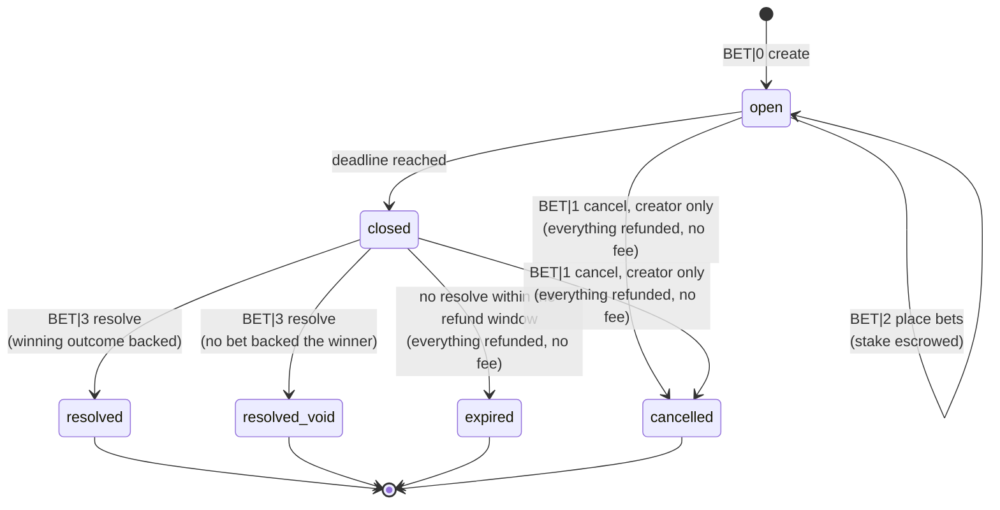

<!-- SPDX-License-Identifier: AGPL-3.0-or-later -->
<!-- Copyright © 2025–2026 Dankest, LLC -->

# XChain Platform Action - BET
This action runs a decentralized betting market end to end: it creates a betting market (a "feed"), places wagers on it, cancels it, and publishes the result. Anyone can create a market, anyone can bet any XChain token on it, the protocol escrows every wager, and the market's creator (the oracle) publishes the winning outcome. The protocol then pays the winners automatically and takes the oracle's percentage fee out of the pot.

Betting is **parimutuel**: all wagers on a market go into one pot, and everyone who backed the winning outcome splits that pot in proportion to what they staked. There is no order book, no counterparty matching, and no fixed odds, so a bet never sits unfilled.

## PARAMS
| Name                | Type   | Description                                                                                  |
| ------------------- | ------ | -------------------------------------------------------------------------------------------- |
| `VERSION`           | String | Format Version                                                                               |
| `LABEL`             | String | Short name of the market (1-250 characters)                                                  |
| `OUTCOMES`          | String | Comma-separated list of the outcomes that can be bet on (2-16 entries)                       |
| `TICK`              | String | Ticker name or Ticker ID that all wagers on this market are denominated in                   |
| `FEE`               | String | Oracle's cut as a **percent of the total pot** (`1.00` = 1%), `0`-`10`, empty = no fee        |
| `DEADLINE`          | String | Unix timestamp when betting closes; also the earliest time the market may be resolved         |
| `REFUND_WINDOW`     | String | Seconds after `DEADLINE` the oracle has to resolve, empty = 1209600 (14 days)                 |
| `MIN_AMOUNT`        | String | Optional minimum stake per bet, empty = no minimum                                            |
| `ALLOW_LIST`        | String | `ACTION_INDEX` of a `LIST` of addresses allowed to bet on this market                         |
| `BLOCK_LIST`        | String | `ACTION_INDEX` of a `LIST` of addresses NOT allowed to bet on this market                     |
| `DETAILS`           | String | Optional base64-encoded JSON object describing the market (see [DETAILS](#details-json))      |
| `MEMO`              | String | An optional memo to include                                                                   |
| `FEED_ACTION_INDEX` | String | `ACTION_INDEX` of the `BET` Version `0` that created the market                               |
| `OUTCOME`           | String | Zero-based index into `OUTCOMES` (first outcome is `0`)                                       |
| `AMOUNT`            | String | Quantity of the market's `TICK` to stake                                                      |

## Formats

### Version `0` - Create Market
- `VERSION|LABEL|OUTCOMES|TICK|FEE|DEADLINE|REFUND_WINDOW|MIN_AMOUNT|ALLOW_LIST|BLOCK_LIST|DETAILS|MEMO`

### Version `1` - Cancel Market
- `VERSION|FEED_ACTION_INDEX|MEMO`

### Version `2` - Place Bet
- `VERSION|FEED_ACTION_INDEX|OUTCOME|AMOUNT|MEMO`

### Version `3` - Resolve Market
- `VERSION|FEED_ACTION_INDEX|OUTCOME|MEMO`

## Examples
```
BET|0|Superbowl LX winner|Chiefs,49ers|PEPECASH|1.00|1770000000||||||Bet on the big game
This example creates a market on the Superbowl with two outcomes, wagered in PEPECASH, with a 1% oracle fee, betting closing at the given Unix time, the default 14-day resolve window, no minimum stake, no gating lists, and no DETAILS.
```

```
BET|0|BTC above 150k on Jan 1|Yes,No|XCHAIN|2.50|1767225600|604800|10.00000000|||eyJ0aXRsZSI6IkJUQyBhYm92ZSAxNTBrIn0=|Settles from the daily close
This example creates a market wagered in XCHAIN with a 2.5% fee, a 7-day resolve window, a 10 XCHAIN minimum stake, and a base64 DETAILS payload carrying the full market description.
```

```
BET|0|Club championship winner|Alice,Bob,Carol|CLUBCOIN||1770000000|||4321
This example creates a members-only market: only addresses on the LIST with ACTION_INDEX 4321 may bet. The oracle charges no fee.
```

```
BET|2|1234|0|25.00000000|Chiefs all day
This example stakes 25.00000000 of the market's TICK on outcome `0` (the first entry in OUTCOMES) of the market created by ACTION_INDEX 1234, and includes a memo.
```

```
BET|3|1234|1|Final score 24-21
This example resolves market 1234 to outcome `1` (the second entry in OUTCOMES). Everyone who backed outcome 1 splits the pot; the oracle receives its fee.
```

```
BET|1|1234|Game postponed, refunding everyone
This example cancels market 1234. Every open bet is refunded in full and the oracle collects no fee.
```

## Rules

### Creating a Market (Version `0`)
- `LABEL` is required, 1-250 characters
- `OUTCOMES` is required and splits on commas into 2-16 entries. Each entry is trimmed, must be non-empty, and must be 64 characters or fewer
- Outcome labels may not contain a comma `,`, a pipe `|`, a semicolon `;`, or ASCII control characters
- Outcome labels must be unique compared byte-for-byte after trimming. Case variants (`Yes` and `yes`) are technically distinct and both allowed; wallets warn about them because bettors misread them
- `TICK` is required. An empty `TICK` means native coin (BTC/LTC/DOGE), which betting does **not** support
- The token must exist, must not be sleeping, and must not have a `trade` controller bound. Controller-bound tokens are rejected because betting would otherwise route those tokens around the controller's veto and royalty legs
- `FEE` is a percent of the total pot with at most 2 decimal places, from `0` to `10`. `1.00` means one percent. It is **not** a fraction: `0.01` is one hundredth of one percent
- `DEADLINE` is a required Unix timestamp, must be later than the block's timestamp, and may be at most one year (31536000 seconds) ahead of it
- `REFUND_WINDOW` is in seconds, from 3600 (1 hour) to 31536000 (1 year), and defaults to 1209600 (14 days) when empty
- `MIN_AMOUNT`, when set, must be a valid amount at the token's `DECIMALS` and greater than zero
- `ALLOW_LIST` and `BLOCK_LIST` each reference an existing `LIST` of type `2` (address list) by `ACTION_INDEX`. When both are set they must be different lists, a market listing the same list as both allowed and blocked is one nobody could ever bet on
- The market's terms are **fixed at creation**. There is no edit format. To fix a mistake before anyone bets, cancel the market and create a new one

### Placing a Bet (Version `2`)
- The market must exist and still be open, and the block's timestamp must be earlier than `DEADLINE`
- The bettor may **not** be the market's own creator. The oracle decides whether the market resolves at all, and an unresolved market refunds every stake in full, so a betting oracle would hold a free option to walk away from a losing bet
- `OUTCOME` is a zero-based index into `OUTCOMES`, from `0` to one less than the number of outcomes
- `AMOUNT` must be a valid amount at the token's `DECIMALS`, strictly positive, and at least the market's `MIN_AMOUNT` when one is set
- The market must hold fewer than 10000 bets
- When the market has an `ALLOW_LIST`, the bettor must be on it. When it has a `BLOCK_LIST`, the bettor must not be on it. **`BLOCK_LIST` wins**: an address on both lists is rejected. Membership is checked at the moment the bet is placed, so later edits to the underlying `LIST` never disturb bets that are already down
- The stake is debited and escrowed when the bet is placed
- **Bets are final.** There is no bet-cancel format. One address may place any number of independent bets, on any number of outcomes

### Resolving a Market (Version `3`)
- Only the market's creator can resolve it
- The block's timestamp must be at or past `DEADLINE`. There is no early resolution
- The block's timestamp must be before `DEADLINE + REFUND_WINDOW`. After that the market has expired and refunds automatically
- `OUTCOME` is a zero-based index into `OUTCOMES`
- Payouts are calculated and credited in the same transaction (see [Settlement](#settlement))

### Cancelling a Market (Version `1`)
- Only the market's creator can cancel it, and only while the market is open or closed (i.e. any time before it resolves or expires)
- Every open bet is refunded in full and the oracle collects no fee. This is the oracle's honest exit for a postponed or voided event
- Cancel stays available even after `DEADLINE + REFUND_WINDOW` has passed, right up until the market actually expires

### Market Lifecycle


A market's status is one of `open`, `closed`, `resolved`, `resolved_void`, `cancelled`, or `expired`. A bet's status is one of `open`, `won`, `lost`, or `refunded`.

- **`closed`** is written by the protocol at the end of the first block whose timestamp reaches `DEADLINE`. It is permanent and one-way. Block timestamps do not always move forward, so closing is recorded as a fact rather than recalculated from the clock; otherwise a later block with a backdated timestamp could be used to sneak in a bet after the event was already known
- **`expired`** is written by the protocol when a market is still unresolved at `DEADLINE + REFUND_WINDOW`. Every open bet is refunded in full and no fee is taken
- Both of these run after all user transactions in a block, and both are capped per block. When more markets are due than the cap allows, the rest are handled in following blocks in a fixed order (earliest `DEADLINE` first for closing, earliest expiry first for expiring). Deferral is safe: a bet after `DEADLINE` and a resolve after the refund window are both rejected by their own timestamp checks, whether or not the market has been marked yet
- If a resolve transaction and the expiry condition land in the same block, **expiry wins** and the resolve is rejected. A cancel in that same block wins instead and pre-empts expiry. Both refund identically, only the final status differs

### Settlement
When the market resolves and at least one bet backed the winning outcome:

1. `T` is the total staked across all outcomes; `W` is the total staked on the winning outcome
2. The oracle's fee is `T * FEE / 100`, rounded down at the token's `DECIMALS`
3. The pot is `T - fee`
4. Each winning bet receives `stake * pot / W`, rounded down at the token's `DECIMALS`. A winner's payout already includes their own stake back; there is no separate refund
5. Whatever rounding remainder is left over ("dust") is credited to the oracle along with the fee
6. Winning bets become `won`, losing bets become `lost`, and the market becomes `resolved`

When **no** bet backed the winning outcome, every stake is refunded in full, **no fee is taken**, all bets become `refunded`, and the market becomes `resolved_void`. Bettors never lose money to an outcome nobody backed.

Every payout, refund, and fee credit on a settling, voiding, cancelled, or expired market is unconditional: it is paid even if the token has since been put to sleep or the recipient has since been added to a token block list. Entry is gated, exit never is.

#### Worked example
A token with 8 decimals, `FEE` of `1.00` (1%). Three bets, in the order they were placed:

| Bettor | Outcome | Stake        |
| ------ | ------- | ------------ |
| A      | `0`     | 10.00000000  |
| B      | `1`     | 5.00000000   |
| C      | `0`     | 2.50000000   |

The market resolves to outcome `0`.

- `T` = 17.50000000, `W` = 12.50000000
- fee = 17.5 × 1 ÷ 100 = **0.17500000**
- pot = 17.5 − 0.175 = **17.32500000**
- A receives 10 × 17.325 ÷ 12.5 = **13.86000000**
- C receives 2.5 × 17.325 ÷ 12.5 = **3.46500000**
- paid out = 17.32500000, dust = **0**
- The oracle receives 0.17500000 (fee + dust)
- B's 5.00000000 is consumed by the pot

Everything balances: 13.86 + 3.465 + 0.175 = 17.50000000 = `T`.

#### When everyone backs the winner
If every stake sits on the winning outcome, the pot is smaller than the winning pool and each winner gets back slightly less than they staked. That is the oracle's rake and it is normal parimutuel behaviour, not a bug. Wallets show the projected payout before you sign so it is never a surprise.

A winning stake small enough that its rounded-down payout is exactly zero still becomes `won`, receives no credit, and its amount goes to the oracle as dust.

### DETAILS JSON
`DETAILS` carries the full human-readable market definition **on-chain**, so a market never depends on an off-chain file staying online. It is a JSON object, base64-encoded.

The protocol enforces only the following:

- Strict base64: characters `A-Za-z0-9+/` with `=` padding, length a multiple of 4, and it must re-encode to exactly the same bytes
- At most 4096 bytes once decoded. Base64 expands by a third, and the whole `BET` action string shares one 8192-byte on-chain ceiling with `LABEL`, `OUTCOMES`, `TICK` and `MEMO`, so a larger market definition could not be broadcast at all
- It must parse as JSON, the top level must be an **object** (not an array or a bare value), and it may nest at most 8 levels deep
- If it has an `outcomes` key, that key must be an array whose entries exactly match the `OUTCOMES` field, in the same order, byte-for-byte after trimming. A present-but-not-an-array `outcomes` is a mismatch

Every other key is convention, not consensus. The recommended schema, which the SDK's `buildBetDetails()` helper validates and wallet forms are built from, is:

| Key                   | Type            | Notes                                                              |
| --------------------- | --------------- | ------------------------------------------------------------------ |
| `title`               | String          | Required. Full market question, longer than `LABEL` if useful      |
| `description`         | String          | Optional. What is being bet on, in plain language                  |
| `outcomes`            | Array of String | Optional. Must match the `OUTCOMES` field exactly (see above)      |
| `outcome_details`     | Array of String | Optional. One explanation per outcome, same order as `outcomes`    |
| `resolution_criteria` | String          | Optional. Exactly how the oracle will decide the winner            |
| `source`              | String          | Optional. Where the result will be read from. **Informational only** |
| `category`            | String          | Optional. Free-text grouping, e.g. `sports`, `politics`            |

Example, before encoding:
```json
{
  "title": "Who wins Superbowl LX?",
  "description": "Settles to the winner of Superbowl LX as declared by the NFL.",
  "outcomes": ["Chiefs", "49ers"],
  "outcome_details": ["Kansas City Chiefs", "San Francisco 49ers"],
  "resolution_criteria": "Official final score published on nfl.com within 24 hours of the game.",
  "source": "https://www.nfl.com/scores",
  "category": "sports"
}
```

**Any URL inside `DETAILS` is informational.** Nothing in the protocol, and nothing in the explorer, ever fetches it. `LABEL`, `OUTCOMES`, and `DETAILS` are written by whoever created the market, so treat them as untrusted text: display them escaped, never as markup.

### Sweep
`SWEEP` does **not** move bet escrows and does **not** transfer the oracle role. Refunds and payouts always credit the address that placed the bet, and a swept oracle key must still resolve its own markets (or cancel them, or let them expire). Sweep before you bet, or accept that bet credits land on the old address. See [`SWEEP`](./sweep.md).

### Dividends
Escrowed bet stakes are treated exactly like escrowed `ORDER` balances when a `DIVIDEND` is paid on the token.

## What a market costs

Two different things get called a "fee" around betting, and they are unrelated:

- the **oracle fee** is the `FEE` field, a percentage of the pot that the market
  creator keeps out of the winnings. It is set per market, paid by the bettors,
  and described under [Settlement](#settlement)
- the **market fee** is what the protocol charges in `XCHAIN` to run the market.
  It is paid by whoever creates the market, and it is what this section is about

The market fee is priced by **how long the market lives**, not by how many bets
it takes. "How long it lives" means all the way to the end of the resolve window
(`DEADLINE + REFUND_WINDOW`), not just to `DEADLINE`, because the protocol has to
keep checking on the market until it can finally be settled or refunded.

**The first 90 days are free.** A market that finishes inside 90 days costs
nothing to create, so short-term markets, and anyone trying the system out, pay
nothing. Past that you pay for each additional day:

| Market lives for | Costs to create |
|---|---|
| Up to 90 days | Free |
| 91 days | 0.0055 XCHAIN |
| 120 days | 0.165 XCHAIN |
| 1 year | 1.5125 XCHAIN |
| 2 years (the maximum) | 3.52 XCHAIN |

Day counts round to the nearest whole day, so a market lasting 90 days and 12
hours is billed as 91 days.

The rest of the lifecycle:

- **Placing a bet** costs 0.001 XCHAIN. This prepays the payout or refund that
  bet will eventually receive, which is why nobody is charged again at the end
- **Resolving** is free, no matter how many bets are on the book. An oracle is
  never billed more for doing the right thing on a busy market
- **Cancelling** is free
- **Cancelling and recreating** pays the creation fee again. Markets cannot be
  edited, so fixing a mistake means making a new market, and that is a new market

Wallets can quote the exact cost before you sign, using the SDK's
`projectFeedCreateFee`.

## Notes
- Use `^` (caret) as prefix when passing `TICK_ID` for `TICK` (^1234 = `TICK_ID` 1234); see [Index ID References](../index-id-references.md)
- `ALLOW_LIST` and `BLOCK_LIST` are plain `ACTION_INDEX` values, not caret references
- `MEMO` characters **NOT** allowed are:
   - pipe `|` (used as field separator)
   - semicolon `;` (used as command separator)
- A market lives on one chain. Wagers, escrow, and settlement all happen on the chain the market was created on
- `DETAILS` is usually too large for an `OP_RETURN`, so a market creation normally encodes as a two-transaction `P2SH`/`P2WSH` payload, which the size fallback selects automatically. An unusually large `DETAILS` that outgrows the 8,192-byte script-output ceiling needs the `TAPROOT` envelope, requested explicitly or via `encoding: AUTO`

## Trust Model
Read this before betting on, or running, a market.

- **The oracle is trusted to report the outcome honestly.** This is unavoidable in any oracle design. The protocol guarantees that escrow and payout arithmetic are correct; it cannot guarantee the reported outcome is true
- **The oracle cannot bet on its own market from the market's own address.** That is rejected outright
- **An oracle can still bet from a second address it controls, and the protocol cannot see the link.** Such an oracle could bet, watch the result, and simply never resolve, since expiry refunds every stake in full. The attack costs it its public track record and returns everyone's money, so it buys information rather than money, but it exists. Explorers and wallets may flag heavy bettors who funded, or were funded by, the market creator. That is a hint, never proof
- **Whoever holds the market creator's key chooses the outcome and receives the fee.** There is no way to rotate or transfer the oracle role on an existing market, so a compromised key means a compromised market, bounded by that market's pot
- **Accountability is reputation only.** The explorer's oracle page (markets resolved, voided, cancelled, expired) is the entire reputation system. There is no bonding, staking, or slashing of oracles. **That reputation is per-address, and addresses are free**, so a dishonest oracle can start over from a new address at any time. An empty history means *unknown*, not *safe*
- **Set `DEADLINE` with margin before the event starts.** Block timestamps can lag real time by up to roughly two hours, so information arriving close to the deadline can still be bettable. Closing well before the event removes the problem

---

**Copyright &copy; 2025–2026 Dankest, LLC**

**Based on XChain Platform by Dankest, LLC &ndash; https://dankest.llc**

Licensed under the **GNU Affero General Public License v3.0** (AGPL-3.0-or-later)
with a commercial license available for proprietary use.

You may use, modify, and distribute this material under the terms of the License.
See [LICENSE](../../LICENSE.md) and [NOTICE](../../NOTICE.md) for full terms.
See the [licensing overview](https://docs.xchain.io/legal/LICENSING.html).
