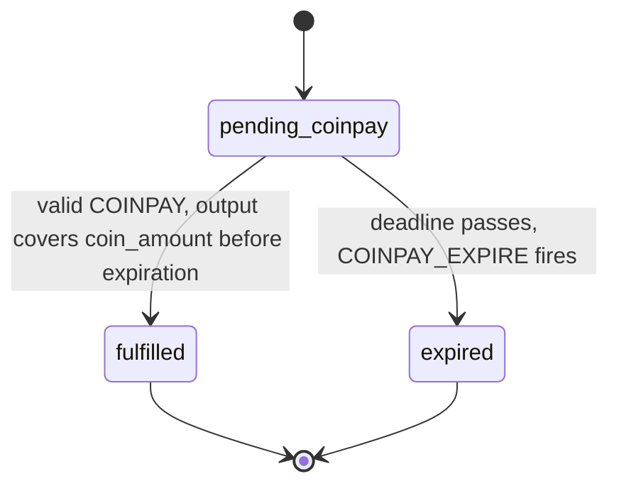

<!-- SPDX-License-Identifier: AGPL-3.0-or-later -->
<!-- Copyright © 2025–2026 Dankest, LLC -->

# XChain Platform Action - COINPAY

This action fulfills a native coin payment obligation created by an ORDER_MATCH for native coin DEX pairs (e.g., trading tokens for BTC/LTC/DOGE). The COINPAY transaction includes both the action data (OP_RETURN) and a native coin output paying the seller.

## PARAMS
| Name                       | Type   | Description                                             |
| -------------------------- | ------ | ------------------------------------------------------- |
| `VERSION`                  | String | Format Version                                          |
| `ORDER_MATCH_ACTION_INDEX` | String | `ACTION_INDEX` of the `ORDER_MATCH` being paid          |

## Formats

### Version `0` - Fulfill COINPay Obligation
- `VERSION|ORDER_MATCH_ACTION_INDEX`

## Examples
```
COINPAY|0|12345
This example fulfills the COINPay obligation for ORDER_MATCH with ACTION_INDEX 12345.
The transaction must also include a native coin output to the seller's GET_ADDRESS
for the owed amount (or more).
```

## Rules
- The referenced `ORDER_MATCH` must exist and have status `pending_coinpay`
- The `ORDER_MATCH` must not have expired (current block timestamp < obligation expiration)
- The transaction must include a native coin output to the obligation's payee address
- The output amount must be >= the obligation's `coin_amount`
- Overpayment goes to the seller as a tip; the obligation is fulfilled at the owed amount
- If the obligation has expired, the COINPAY is recorded as invalid and no tokens are released
- The buyer loses native coin if the COINPAY transaction confirms after the obligation expires (accepted risk)
- Anyone can send a COINPAY on behalf of the buyer; the escrowed tokens always go to the buyer's `GET_ADDRESS`

## Notes
- COINPAY is always an explicit ACTION. Never a bare payment. This avoids the decoder scanning every transaction output for potential order payments.
- Each transaction output is processed separately by the indexer. Only the output matching the payee address and amount triggers settlement.
- The obligation's expiration is timestamp-based (match block timestamp + `COINPAY_EXPIRATION` config, default 7200 seconds / 2 hours).
- On valid COINPAY: escrowed tokens are released to the buyer, ORDER_MATCH status changes to `valid`, and the obligation status changes to `fulfilled`.
- **Send a `COINPAY` as its own transaction, not inside a [`BATCH`](./batch.md).** The payment output is recognized by reading the transaction's top-level action name, so on a chain where `BATCH_SUBCOMMAND_OUTPUT_CAPTURE_ACTIVATION` is not armed, a `COINPAY` carried inside a `BATCH` reaches the indexer with no payment attached and settles nothing while the coin is already spent. The same applies to a Mode B `DISPENSER`, whose oracle-fee output goes unrecognized in a `BATCH` and which is then rejected as unpaid. That gate is active from genesis on testnet and regtest, and on **mainnet it activates at `2026-08-16T00:00:00Z`**, the same instant as `BATCH_ISSUANCE_LIMITS`. Below that instant this warning is live on mainnet; at and above it, the payment decision is made over the batch's command list and a batched `COINPAY` captures the same outputs a top-level one does.
- **Inside a `BATCH`, one seller paid twice needs ONE output, not two.** Once a chain has both `BATCH_SUBCOMMAND_OUTPUT_CAPTURE_ACTIVATION` and `BATCH_ISSUANCE_LIMITS` armed (testnet and regtest from genesis; **mainnet at `2026-08-16T00:00:00Z`, where both arrive at the same instant**), a batched `COINPAY` obligation resolves its payment output by scanning the batch's outputs and taking the FIRST one that pays the obligation's payee address. Every obligation owed to that same payee then draws on that SAME output, not on any later output paying the same address: a second output to the same seller is never read at all. So if one batch settles two (or more) obligations owed to the same seller, the composer must combine every one of those obligations' amounts into a SINGLE output for that seller. Paying the same seller with two separate outputs (one per obligation) is not equivalent: the first obligation settles against the first output, and the second obligation is judged against what is LEFT of that same first output, not against the second output, and fails as underpaid if the first output alone cannot cover both amounts. A single output larger than any one obligation is fine and expected: the amount above what the first obligation owes stays in that payee's pool for a sibling obligation to draw on, the same "surplus stays in the pool" behavior that governs one obligation overpaid on its own. This is a composition rule for the composing client, not a new indexer check; the `xchain-sdk` mirrors it as `planCoinpayOutputs` (derive the required output set from a list of obligations) and `checkCoinpayOutputPlan` (validate a planned output set) in `src/batchLimits.js`.
- Expired obligations are cleaned up by `COINPAY_EXPIRE`, a system action fired automatically by the indexer at the block where an obligation's deadline passes. `COINPAY_EXPIRE` is not user-invocable: it releases escrowed tokens back to the seller's order, cancels the coin-offering party's order if needed, and sets the ORDER_MATCH status to `expired`. The coin offerer's order (the side that was not holding tokens) remains open and can match again.



---

**Copyright &copy; 2025–2026 Dankest, LLC**
