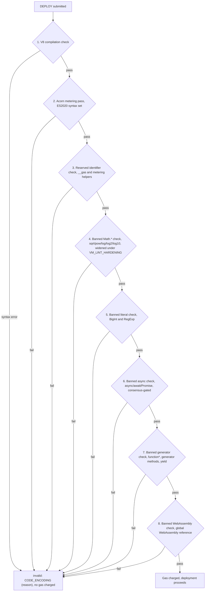
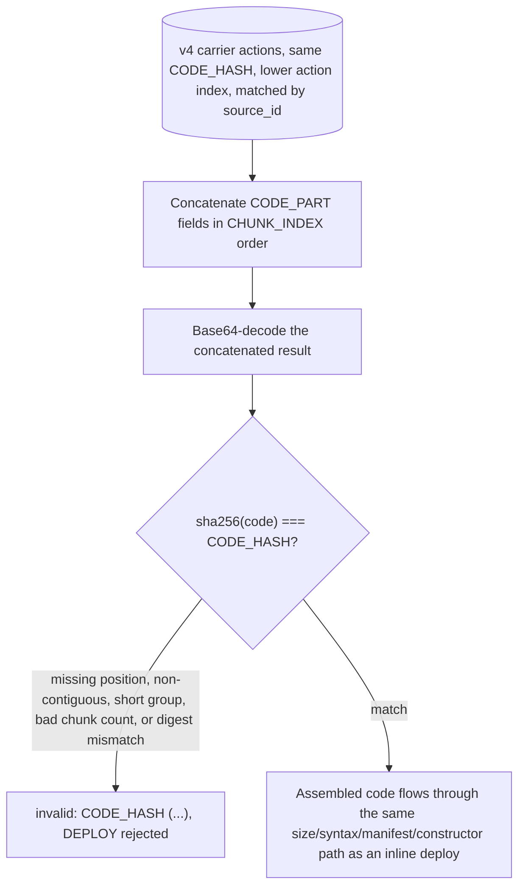

<!-- SPDX-License-Identifier: AGPL-3.0-or-later -->
<!-- Copyright © 2025–2026 Dankest, LLC -->

# XChain Platform Action - DEPLOY
This action deploys a smart contract to the XChain VM in one of five versioned formats covering inline, stakeable, chunked, and chunk-carrier deployments.

## PARAMS
| Name                 | Type    | Description                                                                                   |
| -------------------- | ------- | --------------------------------------------------------------------------------------------- |
| `VERSION`            | String  | Format Version (0 = standard, 1 = stakeable, 2 = chunked, 3 = chunked + stakeable, 4 = chunk carrier) |
| `CODE_ENCODING`      | String  | v0/v1 only: UTF-8 contract source, base64-encoded at/after `DEPLOY_BASE64_CODE` activation, hex-encoded before it |
| `CODE_HASH`          | String  | v2/v3/v4: sha256 hex of the assembled UTF-8 source; both the chunk-group id and integrity check |
| `GAS_LIMIT`          | Integer | v0–v3: maximum gas units allowed for deployment (not used by v4)                             |
| `CONSTRUCTOR_PARAMS` | String  | v0–v3: optional constructor parameters (pipe-delimited in v0/v2; single field in v1/v3)      |
| `COOLDOWN_BLOCKS`    | Integer | v1/v3 only: unstaking cooldown for STAKE v3 against this contract (1..100000)                |
| `SLASH_DESTINATION`  | String  | v1/v3 only: address that receives slashed stake, or `BURN` for the chain's burn address      |
| `CHUNK_INDEX`        | Integer | v4 only: 0-based position of this slice within the group                                      |
| `TOTAL_CHUNKS`       | Integer | v4 only: declared number of slices in the group (`1..MAX_DEPLOY_CHUNKS`)                     |
| `CODE_PART`          | String  | v4 only: one base64 slice of `base64(code)`; plain concatenation in `CHUNK_INDEX` order restores `base64(code)` exactly |

## Formats

### Version `0` - Standard (non-stakeable)
- `VERSION|CODE_ENCODING|GAS_LIMIT|...CONSTRUCTOR_PARAMS`

### Version `1` - Stakeable contract
- `VERSION|CODE_ENCODING|GAS_LIMIT|CONSTRUCTOR_PARAMS|COOLDOWN_BLOCKS|SLASH_DESTINATION`

### Version `2` - Chunked (non-stakeable)
- `VERSION|CODE_HASH|GAS_LIMIT|...CONSTRUCTOR_PARAMS`

### Version `3` - Chunked + stakeable
- `VERSION|CODE_HASH|GAS_LIMIT|CONSTRUCTOR_PARAMS|COOLDOWN_BLOCKS|SLASH_DESTINATION`

### Version `4` - Chunk carrier
- `VERSION|CODE_HASH|CHUNK_INDEX|TOTAL_CHUNKS|CODE_PART`

## Examples
```
DEPLOY|0|<base64_code>|200000|arg1|arg2
Deploy a non-stakeable contract with constructor arguments
```

```
DEPLOY|0|<base64_code>|100000|
Deploy a non-stakeable contract with no constructor parameters
```

```
DEPLOY|1|<base64_code>|200000||1000|BURN
Deploy a stakeable contract: 1000-block cooldown on STAKE v3 unstakes, slashed tokens go to the chain's burn address
```

```
DEPLOY|1|<base64_code>|200000||100|bc1q...recipient
Deploy a stakeable contract: 100-block cooldown, slashed tokens routed to a specific recipient address (not BURN)
```

```
DEPLOY|4|4651d57c...b6021765|0|3|<base64_slice_0>
First of three v4 carrier slices for the contract whose assembled source hashes to 4651d5...
```

```
DEPLOY|4|4651d57c...b6021765|2|3|<base64_slice_2>
Final slice of the same group; a later DEPLOY|2 (or DEPLOY|3) then assembles by CODE_HASH
```

## Rules
- Available on all chains
- `CODE_ENCODING` must be valid UTF-8 JavaScript source code (base64-encoded at/after the `DEPLOY_BASE64_CODE` activation, hex-encoded before it; see Encoding activation below) and must not exceed 64KB (65536 bytes decoded)
- `GAS_LIMIT` must be a positive integer
- The VM validates syntax before charging gas:
  1. V8 compilation check, rejects JavaScript syntax errors
  2. Acorn metering pass, rejects syntax beyond ES2020 (the supported syntax set)
  3. Reserved identifier check, rejects code containing `__gas` (reserved for gas metering), the allocator metering helpers (`__concat`, `__setconcat`, `__setconcatL`, `__tmpl`, `__tmpltag`, `__tmpltagm`, `__arrspread`, `__objspread`, `__objspreadmeter`), or the call-depth metering helpers (`__depth_enter`, `__depth_exit`); all are harness-injected and a contract may not define or reference them
  4. Banned `Math.*` check, rejects `Math.sqrt`/`Math.pow`/`Math.log`/`Math.log2`/`Math.log10` (widening under `VM_LINT_HARDENING` to the complement of the deterministic SafeMath whitelist, plus the `**`/`**=` exponentiation operator)
  5. Banned literal check, rejects `BigInt` and `RegExp` literals
  6. Banned async check (consensus-gated), rejects `async`/`await`/`Promise` references after the `VM_BANNED_ASYNC` flag-day
  7. Banned generator check (consensus-gated), rejects `function*`, generator methods, and `yield`; live from genesis on testnet/regtest
  8. Banned WebAssembly check (consensus-gated), rejects any reference to the global `WebAssembly`; live from genesis on testnet/regtest
- If syntax validation fails, the deployment is rejected with `invalid: CODE_ENCODING (<reason>)` and no gas is charged


- A non-blocking float usage warning is generated if decimal number literals are detected (visible in the execution record)
- A gas fee is charged at deployment: `VM_DEPLOY_BASE + (code_bytes * VM_DEPLOY_PER_BYTE)`
- `SOURCE` address must hold sufficient XCHAIN tokens to cover the gas fee
- `CONSTRUCTOR_PARAMS` is a rest-field in v0/v2 (the indexer joins all pipe-segments from position 3 onward with `|`, so a multi-argument constructor passes each argument as its own pipe-delimited segment). In v1/v3 it is a single fixed field (position 3 only) because `COOLDOWN_BLOCKS` and `SLASH_DESTINATION` follow; a v1/v3 constructor that needs multiple arguments must sub-delimit them within that one field.
- If `CONSTRUCTOR_PARAMS` is provided, the VM executes the contract's `initialize` method immediately after deployment:
  - Constructor gas is added to the deployment gas: `total_gas = deploy_gas + constructor_gas`
  - If the constructor fails (reverts, out of gas, etc.), the entire deployment is rolled back; the contract is not stored
  - The caller pays the combined gas even on constructor failure
- A derived address is created for the contract in the format `C:<CHAIN>:<ACTION_INDEX>` (e.g., `C:BTC:500`). This address participates in the standard balance system for token custody via DEPOSIT/WITHDRAW.

### Staking fields (v1/v3)
- Both staking fields are optional in the wire format. A v1 DEPLOY with empty `COOLDOWN_BLOCKS` is treated the same as a v0 deploy (the contract is not stakeable). `SLASH_DESTINATION` without `COOLDOWN_BLOCKS` is rejected as `invalid: SLASH_DESTINATION (requires COOLDOWN_BLOCKS)`.
- `COOLDOWN_BLOCKS` must be an integer in `[1, 100000]`. Sets the unstaking cooldown for STAKE v3 actions against this contract (overrides the global `STAKING.COOLDOWN_BLOCKS` for v3 unstakes on this contract).
- `SLASH_DESTINATION` accepts either an address (must be valid on the deploying chain) or the literal sentinel `BURN`. The sentinel resolves to the chain's configured burn address.
- If `COOLDOWN_BLOCKS` is set but `SLASH_DESTINATION` is empty, the indexer defaults `SLASH_DESTINATION` to the chain's burn address.
- A contract deployed with both staking fields can receive STAKE v3 actions targeting it; without them, STAKE v3 rejects with `invalid: TARGET_CONTRACT_INDEX (contract is not stakeable)`.
- Stakeable-contract metadata is immutable after deployment: there is no mechanism to update `COOLDOWN_BLOCKS` or `SLASH_DESTINATION` later.

### Permissions manifest (optional)
- A contract may export a permissions manifest alongside its methods to declare its own bound; the indexer reads it deterministically at deploy time (by instantiating the module top-level, no method runs, so it works even without a constructor) and persists it to the `contract_permissions` table. Both fields are optional:
  - `permissions`: an array of action-type strings (e.g. `['SEND','ISSUE']`). The contract may emit only these action types, on every path (constructor, `EXECUTE`, or controller `guard`); any other emission is rejected fail-closed. Absent means unrestricted (the default); `[]` means the contract may emit nothing.
  - `maxTakeBps`: an integer in `[0, 10000]` that tightens this contract's controller royalty cap to `min(CONTROLLER_MAX_TAKE_BPS, maxTakeBps)`. Absent means the global cap applies. See [Controller-Bound Tokens](../controller-bound-tokens.md#permissions-manifest).
- A malformed manifest (`permissions` not an array of strings, or `maxTakeBps` not an integer in range) rejects the deployment with `invalid: CONTRACT_MANIFEST (<reason>)`. The manifest is immutable after deployment (the code is immutable).

### ABI (optional)
- A contract may also export a static `abi` object describing its methods (names, typed params, one-line summaries, read-only flags) for wallets and explorers. Unlike the permissions manifest, the `abi` is **never read or validated at deploy time**: it is advisory display metadata parsed off-chain from the source, participates in no consensus rule, and a malformed `abi` neither rejects nor affects the deployment. See [Contract ABI](../contract-abi.md).

### Chunk carrier rules (v4)
- Available on all chains
- `CODE_HASH` must be a 64-char lowercase sha256 hex string
- `CHUNK_INDEX` and `TOTAL_CHUNKS` must be non-negative integers with `CHUNK_INDEX < TOTAL_CHUNKS`, and `TOTAL_CHUNKS` in `[1, MAX_DEPLOY_CHUNKS]`
- `CODE_PART` must be a non-empty base64-alphabet string (`A-Za-z0-9+/=`) no larger than `MAX_DEPLOYCHUNK_PART_BYTES`. It is a slice of `base64(code)` and is not individually decoded; the assembling DEPLOY concatenates every slice then decodes and sha256-verifies the whole, so a corrupt or misordered slice surfaces as `invalid: CODE_HASH (assembly mismatch)` on the assembling DEPLOY, not on the carrier.
- Gas: a valid v4 carrier is charged `len(CODE_PART) * VM_DEPLOY_PER_BYTE` (valued at `GAS_PRICE`), payable in XCHAIN or (when a `FEE_DESTINATION` output is present) the native coin, exactly like a deploy. An invalid carrier is recorded with its rejection status and charged nothing.
- Every carrier (valid or invalid) is recorded so the explorer can surface its status; a chunked DEPLOY assembles only the valid carriers, and if a deployer broadcasts the same `(source, CODE_HASH, CHUNK_INDEX)` more than once the lowest action index deterministically wins.

### Chunked assembly (v2/v3)
- A chunked DEPLOY assembles its code from the deploying address's prior v4 carrier actions that share the same `CODE_HASH` and were recorded at a lower action index than the DEPLOY. Carriers are matched to their submitter (`source_id`), so a third party cannot hijack another deployer's chunk group.
- The indexer concatenates the carriers' `CODE_PART` fields in `CHUNK_INDEX` order, base64-decodes the result, and rejects unless `sha256(code) === CODE_HASH`. A missing position, a non-contiguous set, a short group, a bad chunk count, or a digest mismatch each rejects the DEPLOY (`invalid: CODE_HASH (...)`); the assembled code then flows through the exact same size/syntax/manifest/constructor path as an inline deploy.
- Gas: each v4 carrier pays the per-byte component (`VM_DEPLOY_PER_BYTE`) for the bytes it puts on-chain, so the assembling DEPLOY v2/v3 charges `VM_DEPLOY_BASE` plus constructor gas only; the net cost approximates a single-shot inline deploy of the same source.
- Reorg/recovery: because a DEPLOY only ever consumes carriers at a lower action index, any reorg that removes a carrier also removes the dependent DEPLOY (and its contract) via the standard action-index rollback. No bespoke logic. The code is fully on-chain in the v4 carrier actions, so a from-scratch chain re-parse reconstructs the contract with no ANCHOR change.
- Submit the carriers before the assembling DEPLOY: a DEPLOY v2/v3 only consumes carriers recorded at a lower action index than itself.
- The SDK (`sdk.deployContract`) auto-selects: it deploys inline (v0/v1) when `base64(code)` fits one action, else uploads the slices as v4 carriers (awaiting indexer confirmation of each) and assembles via v2/v3.



## Encoding activation

The inline `CODE_ENCODING` field (v0/v1) was originally hex-encoded and later changed to base64 (1.33x the source vs hex's 2x, lifting the single-action contract-size ceiling). To keep the change consensus-safe, the format is gated behind the `DEPLOY_BASE64_CODE` protocol activation rather than flipped unconditionally:

- Before the activation, the indexer decodes `CODE_ENCODING` as hex (`Buffer.from(field, 'hex')`).
- At/after the activation, it decodes as base64 (`Buffer.from(field, 'base64')`, round-tripped to reject non-canonical input).

This makes every historical inline DEPLOY decode identically across node versions and on a from-genesis re-parse, so its `code_hash` and therefore the per-block contract hash and the federation checkpoint preimage are stable.

The activation is keyed on block time (a single coordinated flag-day), not block height, because DEPLOY runs on BTC, LTC and DOGE, whose heights diverge by millions of blocks; one timestamp names the same cutover on all three chains. Testnet/regtest activate at genesis (base64-native). The mainnet flag-day must be aligned with the SDK's base64 rollout: the SDK emits the matching encoding for the target block so an inline DEPLOY is always decoded on the side of the gate it was encoded for. v4 carrier slices (assembled by chunked v2/v3) are base64 from genesis and are unaffected.

## Notes
- Use `^` (caret) as prefix when passing an `ADDRESS_ID` for `SLASH_DESTINATION` (^57 = `ADDRESS_ID` 57); `SLASH_DESTINATION` may instead be the `BURN` sentinel, which is never compacted. See [Index ID References](../index-id-references.md)
- The deployed contract is assigned an action index derived from the transaction that contains this action
- `CODE_ENCODING` (v0/v1) is base64-encoded UTF-8 at/after the `DEPLOY_BASE64_CODE` activation (hex before it); decode the active format with `Buffer.from(field, 'base64'|'hex').toString('utf8')`
- The `contracts` table stores the decoded plain-text JavaScript, not the base64 encoding
- The `contracts` table's `api_version` field (currently frozen at 1) records which gateway API version the contract targets; it is assigned by the indexer at deploy time, not a field a deployer sets in the DEPLOY action wire format
- Use `EXECUTE` to call methods on a deployed contract
- Use `DEPOSIT` and `WITHDRAW` to transfer token balances into and out of the contract's derived address
- Deployed contracts are immutable: there is no mechanism to update code after deployment
- `VM_DEPLOY_BASE` and `VM_DEPLOY_PER_BYTE` constants are defined in the gas schedule configuration

---

**Copyright &copy; 2025–2026 Dankest, LLC**

**Based on XChain Platform by Dankest, LLC &ndash; https://dankest.llc**

Licensed under the **GNU Affero General Public License v3.0** (AGPL-3.0-or-later)
with a commercial license available for proprietary use.

You may use, modify, and distribute this material under the terms of the License.
See [LICENSE](../../LICENSE.md) and [NOTICE](../../NOTICE.md) for full terms.
See the [licensing overview](https://docs.xchain.io/legal/LICENSING.html).
