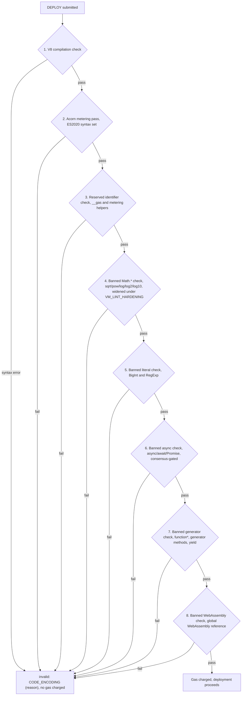
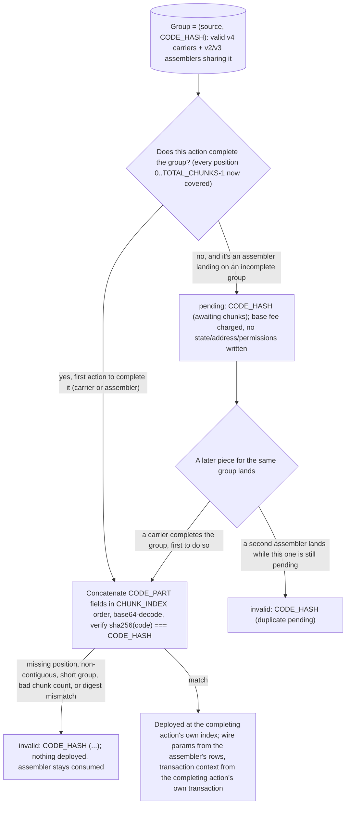

<!-- SPDX-License-Identifier: AGPL-3.0-or-later -->
<!-- Copyright © 2025–2026 Dankest, LLC -->

# XChain Platform Action - DEPLOY
This action deploys a smart contract to the XChain VM in one of five versioned formats covering inline, stakeable, chunked, and chunk-carrier deployments.

## PARAMS
| Name                 | Type    | Description                                                                                   |
| -------------------- | ------- | --------------------------------------------------------------------------------------------- |
| `VERSION`            | String  | Format Version (0 = standard, 1 = stakeable, 2 = chunked, 3 = chunked + stakeable, 4 = chunk carrier) |
| `CODE_ENCODING`      | String  | v0/v1 only: UTF-8 contract source, base64-encoded at/after `DEPLOY_BASE64_CODE` activation, hex-encoded before it |
| `CODE_HASH`          | String  | v2/v3/v4: sha256 hex of the assembled UTF-8 source; both the chunk-group id and integrity check |
| `GAS_LIMIT`          | Integer | v0–v3: maximum gas units allowed for deployment (not used by v4)                             |
| `CONSTRUCTOR_PARAMS` | String  | v0–v3: optional constructor parameters (pipe-delimited in v0/v2; single field in v1/v3)      |
| `COOLDOWN_BLOCKS`    | Integer | v1/v3 only: unstaking cooldown for STAKE v3 against this contract (1..100000)                |
| `SLASH_DESTINATION`  | String  | v1/v3 only: address that receives slashed stake, or `BURN` for the chain's burn address      |
| `CHUNK_INDEX`        | Integer | v4 only: 0-based position of this slice within the group                                      |
| `TOTAL_CHUNKS`       | Integer | v4 only: declared number of slices in the group (`1..MAX_DEPLOY_CHUNKS`)                     |
| `CODE_PART`          | String  | v4 only: one base64 slice of `base64(code)`; plain concatenation in `CHUNK_INDEX` order restores `base64(code)` exactly |

## Formats

### Version `0` - Standard (non-stakeable)
- `VERSION|CODE_ENCODING|GAS_LIMIT|...CONSTRUCTOR_PARAMS`

### Version `1` - Stakeable contract
- `VERSION|CODE_ENCODING|GAS_LIMIT|CONSTRUCTOR_PARAMS|COOLDOWN_BLOCKS|SLASH_DESTINATION`

### Version `2` - Chunked (non-stakeable)
- `VERSION|CODE_HASH|GAS_LIMIT|...CONSTRUCTOR_PARAMS`

### Version `3` - Chunked + stakeable
- `VERSION|CODE_HASH|GAS_LIMIT|CONSTRUCTOR_PARAMS|COOLDOWN_BLOCKS|SLASH_DESTINATION`

### Version `4` - Chunk carrier
- `VERSION|CODE_HASH|CHUNK_INDEX|TOTAL_CHUNKS|CODE_PART`

## Examples
```
DEPLOY|0|<base64_code>|200000|arg1|arg2
Deploy a non-stakeable contract with constructor arguments
```

```
DEPLOY|0|<base64_code>|100000|
Deploy a non-stakeable contract with no constructor parameters
```

```
DEPLOY|1|<base64_code>|200000||1000|BURN
Deploy a stakeable contract: 1000-block cooldown on STAKE v3 unstakes, slashed tokens go to the chain's burn address
```

```
DEPLOY|1|<base64_code>|200000||100|bc1q...recipient
Deploy a stakeable contract: 100-block cooldown, slashed tokens routed to a specific recipient address (not BURN)
```

```
DEPLOY|4|4651d57c...b6021765|0|3|<base64_slice_0>
First of three v4 carrier slices for the contract whose assembled source hashes to 4651d5...
```

```
DEPLOY|4|4651d57c...b6021765|2|3|<base64_slice_2>
Final slice of the same group; a later DEPLOY|2 (or DEPLOY|3) then assembles by CODE_HASH
```

## Rules
- Available on all chains
- `CODE_ENCODING` must be valid UTF-8 JavaScript source code (base64-encoded at/after the `DEPLOY_BASE64_CODE` activation, hex-encoded before it; see Encoding activation below) and must not exceed 64KB (65536 bytes decoded)
- `GAS_LIMIT` must be a positive integer
- The VM validates syntax before charging gas:
  1. V8 compilation check, rejects JavaScript syntax errors
  2. Acorn metering pass, rejects syntax beyond ES2020 (the supported syntax set)
  3. Reserved identifier check, rejects code containing `__gas` (reserved for gas metering), the allocator metering helpers (`__concat`, `__setconcat`, `__setconcatL`, `__tmpl`, `__tmpltag`, `__tmpltagm`, `__arrspread`, `__objspread`, `__objspreadmeter`), or the call-depth metering helpers (`__depth_enter`, `__depth_exit`); all are harness-injected and a contract may not define or reference them
  4. Banned `Math.*` check, rejects `Math.sqrt`/`Math.pow`/`Math.log`/`Math.log2`/`Math.log10` (widening under `VM_LINT_HARDENING` to the complement of the deterministic SafeMath whitelist, plus the `**`/`**=` exponentiation operator)
  5. Banned literal check, rejects `BigInt` and `RegExp` literals
  6. Banned async check (consensus-gated), rejects `async`/`await`/`Promise` references after the `VM_BANNED_ASYNC` flag-day
  7. Banned generator check (consensus-gated), rejects `function*`, generator methods, and `yield`; live from genesis on testnet/regtest
  8. Banned WebAssembly check (consensus-gated), rejects any reference to the global `WebAssembly`; live from genesis on testnet/regtest
- If syntax validation fails, the deployment is rejected with `invalid: CODE_ENCODING (<reason>)` and no gas is charged


- A non-blocking float usage warning is generated if decimal number literals are detected (visible in the execution record)
- A gas fee is charged at deployment: `VM_DEPLOY_BASE + (code_bytes * VM_DEPLOY_PER_BYTE)`
- `SOURCE` address must hold sufficient XCHAIN tokens to cover the gas fee
- `CONSTRUCTOR_PARAMS` is a rest-field in v0/v2 (the indexer joins all pipe-segments from position 3 onward with `|`, so a multi-argument constructor passes each argument as its own pipe-delimited segment). In v1/v3 it is a single fixed field (position 3 only) because `COOLDOWN_BLOCKS` and `SLASH_DESTINATION` follow; a v1/v3 constructor that needs multiple arguments must sub-delimit them within that one field.
- If `CONSTRUCTOR_PARAMS` is provided, the VM executes the contract's `initialize` method immediately after deployment:
  - Constructor gas is added to the deployment gas: `total_gas = deploy_gas + constructor_gas`
  - If the constructor fails (reverts, out of gas, etc.), the entire deployment is rolled back; the contract is not stored
  - The caller pays the combined gas even on constructor failure
- A derived address is created for the contract in the format `C:<CHAIN>:<ACTION_INDEX>` (e.g., `C:BTC:500`). This address participates in the standard balance system for token custody via DEPOSIT/WITHDRAW.

### Staking fields (v1/v3)
- Both staking fields are optional in the wire format. A v1 DEPLOY with empty `COOLDOWN_BLOCKS` is treated the same as a v0 deploy (the contract is not stakeable). `SLASH_DESTINATION` without `COOLDOWN_BLOCKS` is rejected as `invalid: SLASH_DESTINATION (requires COOLDOWN_BLOCKS)`.
- `COOLDOWN_BLOCKS` must be an integer in `[1, 100000]`. Sets the unstaking cooldown for STAKE v3 actions against this contract (overrides the global `STAKING.COOLDOWN_BLOCKS` for v3 unstakes on this contract).
- `SLASH_DESTINATION` accepts either an address (must be valid on the deploying chain) or the literal sentinel `BURN`. The sentinel resolves to the chain's configured burn address.
- If `COOLDOWN_BLOCKS` is set but `SLASH_DESTINATION` is empty, the indexer defaults `SLASH_DESTINATION` to the chain's burn address.
- A contract deployed with both staking fields can receive STAKE v3 actions targeting it; without them, STAKE v3 rejects with `invalid: TARGET_CONTRACT_INDEX (contract is not stakeable)`.
- Stakeable-contract metadata is immutable after deployment: there is no mechanism to update `COOLDOWN_BLOCKS` or `SLASH_DESTINATION` later.

### Permissions manifest (optional)
- A contract may export a permissions manifest alongside its methods to declare its own bound; the indexer reads it deterministically at deploy time (by instantiating the module top-level, no method runs, so it works even without a constructor) and persists it to the `contract_permissions` table. Both fields are optional:
  - `permissions`: an array of action-type strings (e.g. `['SEND','ISSUE']`). The contract may emit only these action types, on every path (constructor, `EXECUTE`, or controller `guard`); any other emission is rejected fail-closed. Absent means unrestricted (the default); `[]` means the contract may emit nothing.
  - `maxTakeBps`: an integer in `[0, 10000]` that tightens this contract's controller royalty cap to `min(CONTROLLER_MAX_TAKE_BPS, maxTakeBps)`. Absent means the global cap applies. See [Controller-Bound Tokens](../controller-bound-tokens.md#permissions-manifest).
- A malformed manifest (`permissions` not an array of strings, or `maxTakeBps` not an integer in range) rejects the deployment with `invalid: CONTRACT_MANIFEST (<reason>)`. The manifest is immutable after deployment (the code is immutable).

### Contract identity manifest (`meta`, required at the flag day)

A contract is addressed only by its derived `C:<CHAIN>:<ACTION_INDEX>`, which tells a reader nothing. At/after the `CONTRACT_META_REQUIRED` activation (see [Flag-Day Values](../flag-days.md)) a contract must carry its own human-readable identity in its exports, or the DEPLOY is rejected:

```js
module.exports = {
    meta: {
        name:        'Escrow',                           // REQUIRED, 1..64 bytes
        description: 'Two-party escrow with an arbiter', // REQUIRED, 1..512 bytes
        version:     '1.0.0'                             // optional, 1..32 bytes
    },
    permissions: ['SEND'],
    initialize(xchain) { /* ... */ },
    release(xchain)    { /* ... */ }
};
```

A function-style contract attaches the same object as a property, and the manifest read takes it from there too:

```js
function contract(xchain) { /* ... */ }
contract.meta = { name: 'Ping', description: 'Returns ok', version: '1.0.0' };
module.exports = contract;
```

- The indexer reads `meta` on the same deterministic module instantiation that reads the permissions manifest: no method runs, and the value is read once, at deploy, under the deploy's own block context. The evaluated value is what is stored and shown.
- Unknown keys inside `meta` are **allowed and ignored** by consensus. They are stored verbatim alongside the named fields, so a display field can be added later without another flag day. `author` and `url` are not named fields today; put them in `meta` and they ride along.
- The name is a **label, not an identity**. Names are not unique and never will be: the derived address stays the identity, and every surface that prints a name prints the address with it.
- A contract deployed before the activation, or one whose `meta` was absent or malformed below it, simply has no recorded identity; the explorer shows it as "Unnamed contract".
- The stored identity is immutable after deployment, because the code is.

#### Verdicts

Evaluated strictly top to bottom, first failure wins, and **after** the `permissions` and `maxTakeBps` verdicts above: a contract malformed on both keeps reporting the permissions string.

| # | Condition | Verdict |
|---|-----------|---------|
| 1 | the manifest read failed: the module top level threw, or it hit the CPU or memory limit during the read, or the report was unparseable | `invalid: CONTRACT_MANIFEST (manifest read failed)` |
| 2 | no `meta` export | `invalid: CONTRACT_MANIFEST (meta required)` |
| 3 | `meta` is not a plain object (`null`, an array, a function, a primitive), or it could not be serialised (circular, `BigInt`, a throwing getter or `toJSON`), or it serialises to a value that is not an object | `invalid: CONTRACT_MANIFEST (meta must be a plain object)` |
| 4 | the serialised `meta` exceeds 4096 characters | `invalid: CONTRACT_MANIFEST (meta exceeds 4096 characters)` |
| 5 | `name` missing, not a string, or failing the text grammar below at 64 bytes | `invalid: CONTRACT_MANIFEST (meta.name must be a string of 1..64 bytes, printable, trimmed)` |
| 6 | `description` missing, not a string, or failing the text grammar at 512 bytes | `invalid: CONTRACT_MANIFEST (meta.description must be a string of 1..512 bytes, printable, trimmed)` |
| 7 | the `version` key is present and its value is not a string, or fails the text grammar at 32 bytes | `invalid: CONTRACT_MANIFEST (meta.version must be a string of 1..32 bytes, printable, trimmed)` |

`version` is optional, but it is validated whenever the **key exists**, so `version: ''` and `version: 3` are rejected rather than silently dropped. The 4096-character total cap is measured on `JSON.stringify(meta)` inside the VM isolate, in UTF-16 code units, before the report crosses back to the indexer; the per-field caps are measured host-side in UTF-8 bytes, so a 5000-byte `name` trips row 5 rather than row 4.

#### Text grammar

One grammar, applied identically to `name`, `description` and `version`. A value that does not conform is **rejected, never repaired**: the bytes a node stores are always the author's bytes.

- The value must be a string containing no unpaired surrogates.
- Its UTF-8 length must be `1..maxBytes` inclusive for that field. Bytes, like every other size gate on this path.
- No code point anywhere in the banned set: C0 controls `U+0000`-`U+001F`, `DEL` and the C1 controls `U+007F`-`U+009F`, the zero-width characters `U+200B`-`U+200D`, `U+2060` and `U+FEFF`, and the bidi controls `U+200E`, `U+200F`, `U+202A`-`U+202E`, `U+2066`-`U+2069`. `U+000A` is admitted **inside** `description` only, which is the one field a line break can legitimately appear in.
- "Trimmed" means the first and last code point are not whitespace, against an explicit set (`U+0020`, `U+00A0`, `U+1680`, `U+2000`-`U+200A`, `U+2028`, `U+2029`, `U+202F`, `U+205F`, `U+3000`, plus `U+000A` for `description`). An explicit set rather than `String.prototype.trim()`, whose whitespace table follows the running engine's Unicode version; a consensus verdict cannot move with the host's Node build.

Rendering is a separate concern: wallets and explorers still harden the text they display, because homoglyphs and mixed scripts are not a byte rule's job.

#### What the flag day changes

- Below the activation the verdicts above are not applied and every historic DEPLOY keeps its recorded status byte for byte, so a from-genesis replay is unaffected. A conforming `meta` found below the activation is still extracted and stored, so a pre-activation contract that already names itself displays its name for free.
- **A contract whose module top level throws changes verdict.** It deploys `valid` today and fails at its first EXECUTE; at/after the activation it is `invalid: CONTRACT_MANIFEST (manifest read failed)`. A required field cannot live inside a branch a sender can skip, which is why the meta verdict is evaluated outside the manifest-read success guard the permissions verdict sits in.
- A `CONTRACT_MANIFEST` verdict pre-empts the fee and sleeping verdicts, exactly as the permissions verdict already does.
- A chunked deploy (v2/v3/v4) is judged **once, at the completing piece**, on the assembled source. A pending assembler writes no contract and is never judged on `meta`; a meta rejection at the completing piece still consumes the assembler.
- Every deploy pays for the bytes. `meta` is source like any other source, priced into `VM_DEPLOY_BASE + (code_bytes * VM_DEPLOY_PER_BYTE)` forever. Measured over the 14 library templates the shipped block costs 568 to 675 bytes of source (median 605); see [Smart Contract Development](../../developer-guide/smart-contract-development.md#contract-identity) for the sizing.

### ABI (optional)
- A contract may also export a static `abi` object describing its methods (names, typed params, one-line summaries, read-only flags) for wallets and explorers. Unlike the permissions manifest and the identity manifest, the `abi` is **never read or validated at deploy time**: it is advisory display metadata parsed off-chain from the source, participates in no consensus rule, and a malformed `abi` neither rejects nor affects the deployment. See [Contract ABI](../contract-abi.md).

### Chunk carrier rules (v4)
- Available on all chains
- `CODE_HASH` must be a 64-char lowercase sha256 hex string
- `CHUNK_INDEX` and `TOTAL_CHUNKS` must be non-negative integers with `CHUNK_INDEX < TOTAL_CHUNKS`, and `TOTAL_CHUNKS` in `[1, MAX_DEPLOY_CHUNKS]`
- `CODE_PART` must be a non-empty base64-alphabet string (`A-Za-z0-9+/=`) no larger than `MAX_DEPLOYCHUNK_PART_BYTES`. It is a slice of `base64(code)` and is not individually decoded; the action that completes the group concatenates every slice then decodes and sha256-verifies the whole, so a corrupt or misordered slice surfaces as `invalid: CODE_HASH (assembly mismatch)` there, never on a carrier that only supplied one slice. Before the `DEPLOY_DEFERRED_ASSEMBLY` activation that action is always the assembling DEPLOY (see [Chunked assembly](#chunked-assembly-v2v3) below); at/after it, it may instead be the carrier that lands the group's final slice.
- Gas: a valid v4 carrier is charged `len(CODE_PART) * VM_DEPLOY_PER_BYTE` (valued at `GAS_PRICE`), payable in XCHAIN or (when a `FEE_DESTINATION` output is present) the native coin, exactly like a deploy. An invalid carrier is recorded with its rejection status and charged nothing.
- Every carrier (valid or invalid) is recorded so the explorer can surface its status; a chunked DEPLOY assembles only the valid carriers, and if a deployer broadcasts the same `(source, CODE_HASH, CHUNK_INDEX)` more than once the lowest action index deterministically wins.

### Chunked assembly (v2/v3)

At/above the `DEPLOY_DEFERRED_ASSEMBLY` activation (regtest and mainnet from genesis; testnet at `1788868800`, 2026-09-08T12:00:00Z; see [Flag-Day Values](../flag-days.md)), a chunk group deploys exactly once, deterministically, in the block where its last piece confirms, whichever action that piece is and whatever order the pieces arrived in.

- A group is `(source, CODE_HASH)`. Its pieces are its valid v4 carriers, matched to their submitter by `source_id` so a third party cannot hijack another deployer's chunk group, plus its v2/v3 assemblers for that hash. A group is complete once its valid carriers cover every position `0..TOTAL_CHUNKS-1` (dedup by position, lowest action index wins, exactly the assembly rule below).
- **The first action that completes a group deploys it, at its own action index.** If that action is a carrier, the contract's `contract_index`, its derived address `C:<CHAIN>:<action_index>`, and every row the deployment writes (`contracts`, `contract_permissions`, state, the constructor's `contract_executions` row) are keyed at that carrier, and the constructor row additionally carries `assembler_action_index`, pointing back at the assembler that opened the group. If that action is the assembler itself, because every carrier the group needs already landed before it, the contract is keyed at the assembler's own index and `assembler_action_index` is left null; this is the sequential (carriers-first) path and looks the same before and after the activation. A later duplicate slice for a group that already deployed is stored valid but deploys nothing; a second assembler submitted after the group deployed finds its carriers all present and deploys a second, independent contract at its own index (the sequential path again), so a deployer who re-sends an assembler pays for and gets a second contract.
- **An assembler that lands before its group is complete is pending, not invalid.** It is recorded `pending: CODE_HASH (awaiting chunks)`, pays the base deployment fee in its own fee mode, and writes no contract state, address, or permissions; its status is never mutated afterward, even once a later carrier completes the group and deploys the contract elsewhere. A second assembler landing while one is already pending for the same group is rejected `invalid: CODE_HASH (duplicate pending)`; a group has at most one pending assembler at a time. A pending assembler whose carriers never arrive simply stays pending; it costs no more than the base fee it already paid, and there is no expiry.
- **Wire parameters travel with the assembler; transaction context travels with whichever action completes the group.** `GAS_LIMIT`, `CONSTRUCTOR_PARAMS`, and (v3) `COOLDOWN_BLOCKS`/`SLASH_DESTINATION` always come from the assembler's own rows, wherever the assembler landed. The block index and time, the derived block hash, the transaction hash and vout, and the contract's derived address instead come from the completing action's own transaction.
- The indexer concatenates the group's `CODE_PART` fields in `CHUNK_INDEX` order, base64-decodes the result, and rejects unless `sha256(code) === CODE_HASH`. A missing position, a non-contiguous set, a short group, a bad chunk count, or a digest mismatch each rejects the deployment (`invalid: CODE_HASH (...)`) at the completing action; the assembled code then flows through the exact same size/syntax/manifest/constructor path as an inline deploy.
- Gas: the assembler always pays `VM_DEPLOY_BASE` at landing, in its own fee mode, whether it completes the group itself or lands pending. Constructor gas is charged separately, at the action that completes the group: in XCHAIN fee mode it is debited from the source there, after a `min(GAS_LIMIT, GAS_CEILING) * GAS_PRICE` check against the source's balance following that action's own fee (a shortfall fails the deployment `invalid: insufficient funds (GAS)`, the constructor never runs, and the assembler stays consumed with no contract); in native fee mode nothing further is charged at the completing action, matching an inline native deploy's debits exactly. A v4 carrier never itself pays constructor gas.
- **Consumption, not mutation.** An assembler is consumed the moment a constructor `contract_executions` row exists naming it as `assembler_action_index`, whether the deployment that follows succeeds, fails its hash check, or fails for insufficient gas. A consumed assembler's own row is never rewritten; a corrected deploy is a new assembler for the group (which deploys immediately, the group already being complete) or a new group under a corrected hash.
- **Reorg/recovery.** Rollback is the ordinary action-index rollback: every row a deployment writes is keyed at the action that produced it, so removing that action removes the contract, its state, and its permissions, and un-consumes its assembler by construction if the assembler survives the reorg. Because the code is fully on-chain in the v4 carrier actions, a from-scratch chain re-parse always reconstructs the same contract at the same action index, deterministically, whatever order the pieces are re-mined in.
- The SDK (`sdk.deployContract`) auto-selects: it deploys inline (v0/v1) when `base64(code)` fits one action, else uploads the slices as v4 carriers and assembles via v2/v3; sequential submission (waiting for indexer confirmation of each piece before sending the next) stays the default. It resolves the deployed contract through the explorer's `deployed_contract_index` and `assembly_status` fields on the assembler's own action (`workflows.resolveDeployedContract`) rather than assuming the assembler's own index is the contract's, and the wallet's chunked-deploy resume flow reads the same fields before deciding whether to re-send anything.

**Before the `DEPLOY_DEFERRED_ASSEMBLY` activation** (and, on testnet, for the one historical occurrence that predates 2026-09-08T12:00:00Z), none of the above applies. A chunked DEPLOY assembles its code only from the deploying address's prior v4 carrier actions that share the same `CODE_HASH` and were recorded at a lower action index than the DEPLOY; carriers are matched to their submitter (`source_id`). **Submit the carriers before the assembling DEPLOY.** An assembler that lands before every one of its carriers is permanently `invalid: CODE_HASH (no chunks)` (or `(missing chunk i)`), pays no gas, and nothing retries; the deployer must resend a corrected assembler once every carrier is confirmed. Because a DEPLOY only ever consumes carriers at a lower action index, a reorg that removes a carrier also removes the dependent DEPLOY (and its contract) via the standard action-index rollback.



## Encoding activation

The inline `CODE_ENCODING` field (v0/v1) was originally hex-encoded and later changed to base64 (1.33x the source vs hex's 2x, lifting the single-action contract-size ceiling). To keep the change consensus-safe, the format is gated behind the `DEPLOY_BASE64_CODE` protocol activation rather than flipped unconditionally:

- Before the activation, the indexer decodes `CODE_ENCODING` as hex (`Buffer.from(field, 'hex')`).
- At/after the activation, it decodes as base64 (`Buffer.from(field, 'base64')`, round-tripped to reject non-canonical input).

This makes every historical inline DEPLOY decode identically across node versions and on a from-genesis re-parse, so its `code_hash` and therefore the per-block contract hash and the federation checkpoint preimage are stable.

The activation is keyed on block time (a single coordinated flag-day), not block height, because DEPLOY runs on every supported chain (BTC, LTC, and DOGE today), whose heights diverge by millions of blocks; one timestamp names the same cutover on all three chains. Testnet/regtest activate at genesis (base64-native). The mainnet flag-day must be aligned with the SDK's base64 rollout: the SDK emits the matching encoding for the target block so an inline DEPLOY is always decoded on the side of the gate it was encoded for. v4 carrier slices (assembled by chunked v2/v3) are base64 from genesis and are unaffected.

## Notes
- Use `^` (caret) as prefix when passing an `ADDRESS_ID` for `SLASH_DESTINATION` (^57 = `ADDRESS_ID` 57); `SLASH_DESTINATION` may instead be the `BURN` sentinel, which is never compacted. See [Index ID References](../index-id-references.md)
- The deployed contract is assigned an action index derived from the transaction that contains this action
- `CODE_ENCODING` (v0/v1) is base64-encoded UTF-8 at/after the `DEPLOY_BASE64_CODE` activation (hex before it); decode the active format with `Buffer.from(field, 'base64'|'hex').toString('utf8')`
- The `contracts` table stores the decoded plain-text JavaScript, not the base64 encoding
- The `contracts` table's `meta_name`, `meta_description`, `meta_version` and `meta_json` fields hold the identity manifest extracted at deploy time; all four are left null unless the deploy is `valid` and its `meta` conforms
- The `contracts` table's `api_version` field (currently frozen at 1) records which gateway API version the contract targets; it is assigned by the indexer at deploy time, not a field a deployer sets in the DEPLOY action wire format
- Use `EXECUTE` to call methods on a deployed contract
- Use `DEPOSIT` and `WITHDRAW` to transfer token balances into and out of the contract's derived address
- Deployed contracts are immutable: there is no mechanism to update code after deployment
- `VM_DEPLOY_BASE` and `VM_DEPLOY_PER_BYTE` constants are defined in the gas schedule configuration

---

**Copyright &copy; 2025–2026 Dankest, LLC**

**Based on XChain Platform by Dankest, LLC &ndash; https://dankest.llc**

Licensed under the **GNU Affero General Public License v3.0** (AGPL-3.0-or-later)
with a commercial license available for proprietary use.

You may use, modify, and distribute this material under the terms of the License.
See [LICENSE](../../LICENSE.md) and [NOTICE](../../NOTICE.md) for full terms.
See the [licensing overview](https://docs.xchain.io/legal/LICENSING.html).
