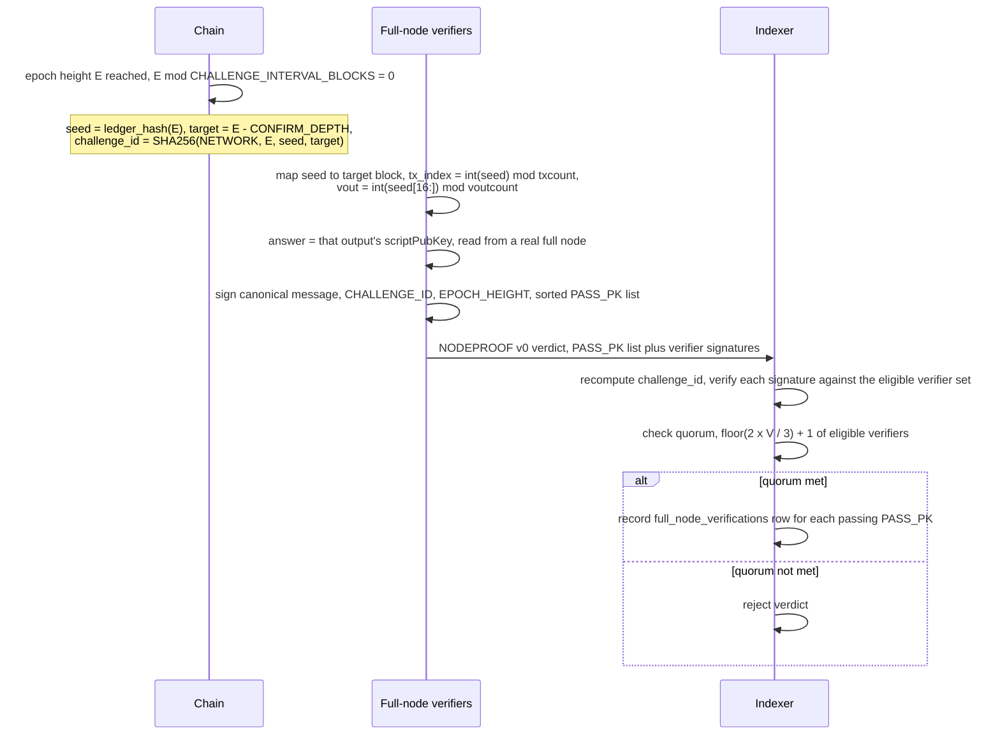

<!-- SPDX-License-Identifier: AGPL-3.0-or-later -->
<!-- Copyright © 2025–2026 Dankest, LLC -->

# XChain Platform Action - NODEPROOF
This action records an on-chain, quorum-signed verdict asserting which validators answered a periodic possession challenge, proving they run a real coin full node rather than mirroring the decoder/indexer DBs via `xchain-sync`.

## PARAMS
| Name          | Type    | Description                                                                         |
| ------------- | ------- | ----------------------------------------------------------------------------------- |
| `VERSION`     | String  | Format Version                                                                      |
| `CHALLENGE_ID`| String  | 64-hex challenge identifier, derived from the epoch (see Rules)                     |
| `EPOCH_HEIGHT`| Integer | Block height of the challenge epoch; must be a multiple of `CHALLENGE_INTERVAL_BLOCKS` |
| `PASS_COUNT`  | Integer | Number of validators that produced the correct answer                               |
| `PASS_PK_i`   | String  | 64-hex Ed25519 public keys of passing validators (one per passing validator)        |
| `SIG_COUNT`   | Integer | Number of verifier signatures over the canonical message                            |
| `PUBKEY_i`    | String  | 64-hex Ed25519 public key of each verifier                                          |
| `SIG_i`       | String  | 128-hex Ed25519 signature from the corresponding verifier                           |

## Formats

### Version `0` - Verdict (validator-broadcast)
- `VERSION|CHALLENGE_ID|EPOCH_HEIGHT|PASS_COUNT|PASS_PK_1|...|PASS_PK_n|SIG_COUNT|PUBKEY_1|SIG_1|...|PUBKEY_m|SIG_m`

## Examples
```
NODEPROOF|0|a3f1e9...c42|1008|2|aa01bb...|cc02dd...|3|aa01bb...|sig1aaa...|cc02dd...|sig2bbb...|ee03ff...|sig3ccc...
A verdict for epoch height 1008, listing 2 passing validators, signed by 3 eligible verifiers
```

```
NODEPROOF|0|7b8d2a...f91|2016|1|ff00aa...|2|ff00aa...|sig4ddd...|bb11cc...|sig5eee...
A verdict for epoch height 2016 with 1 passing validator, signed by 2 verifiers (meeting 2f+1 quorum from 2 eligible)
```

## Rules
- Available on BTC chain only; scope extends to other chains in a later version
- `EPOCH_HEIGHT` must be a multiple of `CHALLENGE_INTERVAL_BLOCKS` and must not exceed the current `BLOCK_INDEX`
- `BLOCK_INDEX - EPOCH_HEIGHT` must not exceed `VERDICT_ACCEPT_WINDOW_BLOCKS`; verdicts must land promptly to bound replay and reorg exposure
- The challenge target block is `EPOCH_HEIGHT - CONFIRM_DEPTH`; the target must be non-negative
- `CHALLENGE_ID` must equal `SHA256(NETWORK ":" EPOCH_HEIGHT ":" ledger_hash(EPOCH_HEIGHT) ":" target)` as recomputed by the indexer; any mismatch or unknown epoch block causes rejection
- Eligible verifiers at `snapshotBlock = EPOCH_HEIGHT` are `verified_full_nodes(EPOCH_HEIGHT)` union `GENESIS_VERIFIERS`; quorum is `floor(2 * V / 3) + 1` where `V` is the eligible count; `V == 0` causes rejection (feature dormant until `GENESIS_VERIFIERS` is seeded)
- Each signature must come from a member of the eligible set, must be a valid Ed25519 signature over the canonical message, and must not be duplicated; the total count of valid, deduplicated signers must meet quorum
- For each `PASS_PK` that holds `full_node` capability stake at `EPOCH_HEIGHT`, the indexer writes a `full_node_verifications` row; the insert is idempotent on `(epoch_height, signing_pubkey)`
- This action is validator-broadcast; it is not VM-emitted and not meaningful for end users
- This action writes no ledger rows; reward eligibility is derived later during `PRICE` finalization

### Canonical signed message

The canonical message signed by each verifier is:

```
CHALLENGE_ID "|" EPOCH_HEIGHT "|" sort(lower(PASS_PK)) joined by ","
```

At and above the EQUIV flag-day, this canonical string is wrapped with the uniform header (`TAG = XNODEPROOF`, `ROUND_ID = CHALLENGE_ID`, `VIEW = 0`). Below the flag-day, the bare bytes are used. The indexer `_buildCanonical` and the hub publisher must agree byte-for-byte; this is consensus-critical.

### Reward eligibility

A staking source earns the full-node reward tranche at block `B` only if:
- It has a `passed` `full_node_verifications` row with `block_index` in `(B - PROOF_WINDOW_BLOCKS, B]` and still holds `full_node` capability stake at `B` (this makes the node verifier-eligible: able to vouch in later verdicts)
- Over the trailing `REWARD_PASS_WINDOW_BLOCKS`, the source answered at least `MIN_PASS_RATE_BPS` basis points of the challenge epochs that actually produced a verdict (the denominator counts only epochs the federation ran, so an outage never costs anyone)

The gate uses integer math: `passed_epochs * 10000 >= MIN_PASS_RATE_BPS * total_epochs`. The verified set is deduplicated by staking source (one operator, one full node, one share). A validator that does not run a full node simply fails the challenges, earns nothing from the full-node tranche, and is never penalised: its `full_node` bond is untouched and there is no failed-challenge slash.

See `db.getFullNodeParticipation` and `PRICE` for the reward derivation.

## The Derived Challenge

The challenge is derived deterministically from the chain, not broadcast. Every node (full and light, including the indexer) can recompute a challenge's identity from on-chain data; only a node with a real coin full node can compute the answer. This avoids leader election, per-challenge fees, and the non-determinism of "who broadcasts the challenge."

For each epoch height `E` where `E % CHALLENGE_INTERVAL_BLOCKS == 0`:

- `seed = ledger_hash(E)`, the indexer's stored per-block ledger hash at `E` (deterministic and identical across every honest node)
- `target = E - CONFIRM_DEPTH`, a buried block (reorg-stable) whose contents the possession query targets
- `challenge_id = SHA256(NETWORK ":" E ":" seed ":" target)`

Full-node verifiers map `seed` to a concrete query inside the `target` block: `tx_index = int(seed) mod txcount`, `vout = int(seed[16:]) mod voutcount`, answer = that output's `scriptPubKey` (hex). This datum is provably absent from a synced mirror: the decoder stores no `scriptPubKey`, no raw tx/block bytes, no non-XChain transactions, and no UTXO set. The within-block mapping and the answer are resolved entirely by the verifiers (who have the block); the indexer never needs them and only recomputes `challenge_id`, trusting the quorum.



## Config (`STAKING.CAPABILITIES.full_node`, `FULLNODE`)

| Key | Default | Meaning |
| --- | ------- | ------- |
| `CAPABILITIES.full_node.MIN_STAKE` | `2000.00000000` | Entrance stake to claim the capability |
| `FULLNODE.CHALLENGE_INTERVAL_BLOCKS` | `144` | Epoch cadence (~daily on BTC) |
| `FULLNODE.CONFIRM_DEPTH` | `100` | Target-block burial depth (reorg safety) |
| `FULLNODE.PROOF_WINDOW_BLOCKS` | `300` | How long a passed proof keeps a node verifier-eligible (able to vouch in later verdicts) |
| `FULLNODE.VERDICT_ACCEPT_WINDOW_BLOCKS` | `24` | Max lag from epoch to accepted verdict |
| `FULLNODE.REWARD_SHARE` | `'0'` | Fraction of the oracle-round budget routed to full nodes (raise to `'0.25'` to enable; see `PRICE`) |
| `FULLNODE.REWARD_PASS_WINDOW_BLOCKS` | `1008` | Trailing window the reward pass-rate is measured over (= 7 daily challenge epochs) |
| `FULLNODE.MIN_PASS_RATE_BPS` | `7000` | Min pass rate to earn the tranche, in basis points (`7000` = 70%, i.e. pass at least 5 of 7, miss up to 2) |
| `FULLNODE.GENESIS_VERIFIERS` | `[]` | Bootstrap verifier pubkeys (operator-seeded) |

## Reorg Safety

`full_node_verifications` rows carry the verdict's `action_index` and `block_index`. The generic action-rollback removes them on reorg exactly like any other action's rows. The `(epoch_height, signing_pubkey)` unique key makes re-recording on replay idempotent.

## Bootstrap and Degradation

With no seeded `GENESIS_VERIFIERS` and no verified nodes, no verdict can reach quorum, so the verified set is empty and the full-node tranche rolls back into the base tranche (see `PRICE`). Behavior is identical to pre-feature. The mechanism activates as the operator seeds genesis verifiers and independent full nodes join and get verified, at which point verified nodes (not just genesis) can vouch for new joiners.

## Notes
- The verified set earns the full-node tranche of the oracle-round reward; light mirrors keep the base tranche only
- The only thing that reaches the wire is the federation's signed verdict over who answered correctly, exactly the trust model of `ATTEST v1` (the indexer verifies signatures and schedule; the federation verifies the off-chain fact)
- `PUBKEY` is the consensus token name for verifier public keys (consistent with ANCHOR, ATTEST, and PRICE)
- See [`ATTEST`](./attest.md) for the signature-verification and responsible-set template this models on
- See [`PRICE`](./price.md) for oracle-round reward derivation (two-tranche split) and `validator_rewards` / `COLLECT` for the reward ledger and claim flow

---

**Copyright &copy; 2025–2026 Dankest, LLC**

**Based on XChain Platform by Dankest, LLC &ndash; https://dankest.llc**

Licensed under the **GNU Affero General Public License v3.0** (AGPL-3.0-or-later)
with a commercial license available for proprietary use.

You may use, modify, and distribute this material under the terms of the License.
See [LICENSE](../../LICENSE.md) and [NOTICE](../../NOTICE.md) for full terms.
See the [licensing overview](https://docs.xchain.io/legal/LICENSING.html).
