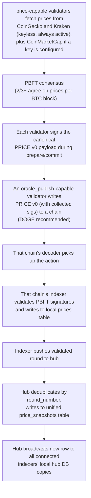
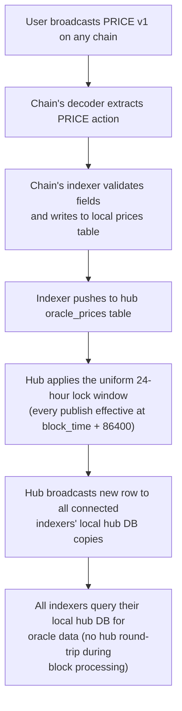

<!-- SPDX-License-Identifier: AGPL-3.0-or-later -->
<!-- Copyright © 2025–2026 Dankest, LLC -->

# XChain Platform Action - PRICE
This action publishes oracle price data on-chain. Version 0 anchors PBFT-consensus COIN/FIAT price snapshots produced by validators qualifying for the `price` capability and broadcast on-chain by a validator qualifying for the `oracle_publish` capability (both capabilities are auto-qualified by aggregate stake amount per the capability model (see [STAKE](stake.md)). Version 1 is permissionless: any address may operate a user-run TOKEN/FIAT price oracle, no stake required.

## PARAMS

### Version 0: Validator COIN/FIAT Price Snapshot
`PAIR_ID` and `PAIR_PRICE` repeat `PAIR_COUNT` times in the wire payload. `PUBKEY` and `SIG` repeat `SIG_COUNT` times. See the Formats section below for the exact wire layout.

| Name              | Type    | Description                                                        |
| ----------------- | ------- | ------------------------------------------------------------------ |
| `VERSION`         | String  | Format version (`0`)                                               |
| `ROUND`           | Integer | Oracle round number (= BTC block height that triggered the round)  |
| `TIMESTAMP`       | Integer | `block_time` of the BTC block that triggered the round (seconds)   |
| `BTC_BLOCK_HEIGHT`| Integer | BTC chain-tip height the round was anchored to; part of the signed canonical payload and the EQUIV activation anchor |
| `PAIR_COUNT`      | Integer | Number of COIN/FIAT price pairs in this payload                    |
| `PAIR_ID`         | String  | COIN/FIAT pair identifier, e.g. `BTC/USD` (repeated per pair)      |
| `PAIR_PRICE`      | String  | Price as decimal string, 8 decimal places (repeated per pair)      |
| `SIG_COUNT`       | Integer | Number of `price`-capable validator signatures                              |
| `PUBKEY`          | String  | 64-char hex Ed25519 signing pubkey (repeated per signature)        |
| `SIG`             | String  | 128-char hex Ed25519 signature over round data (repeated per sig)  |

### Version 1: User Oracle TOKEN/FIAT Price
| Name              | Type    | Description                                                        |
| ----------------- | ------- | ------------------------------------------------------------------ |
| `VERSION`         | String  | Format version (`1`)                                               |
| `COIN`            | String  | Chain identifier for the token (e.g. `BTC`, `LTC`, `DOGE`)         |
| `TICK`            | String  | Token name (e.g. `PEPECASH`)                                       |
| `FIAT`            | String  | Fiat currency code (e.g. `USD`, `JPY`, `EUR`)                      |
| `VALUE`           | String  | Price as decimal string, 8 decimal places                          |
| `FEE`             | String  | Oracle usage fee as decimal (e.g. `0.01` = 1%)                     |
| `MEMO`            | String  | Optional description or timestamp                                  |

## Formats

### Version `0`: Validator COIN/FIAT Price Snapshot
```
VERSION|ROUND|TIMESTAMP|BTC_BLOCK_HEIGHT|PAIR_COUNT|PAIR_ID|PAIR_PRICE|...|SIG_COUNT|PUBKEY|SIG|...
```
Pair data (`PAIR_ID|PAIR_PRICE`) repeats `PAIR_COUNT` times.
Signature data (`PUBKEY|SIG`) repeats `SIG_COUNT` times.
`BTC_BLOCK_HEIGHT` is the BTC chain-tip height the round was anchored to. It is part of the signed canonical payload and is the activation anchor for the EQUIV anti-equivocation header (so the hub and every indexer flip the header on the same BTC height every other engine uses).

### Version `1`: User Oracle TOKEN/FIAT Price
```
VERSION|COIN|TICK|FIAT|VALUE|FEE|MEMO
```

## Examples
```
PRICE|0|1402|1712500000|850010|3|BTC/USD|100000.12345678|LTC/USD|85.50000000|DOGE/USD|0.15000000|3|aabb...01|ccdd...sig1|aabb...02|ccdd...sig2|aabb...03|ccdd...sig3
An `oracle_publish`-capable validator anchors PBFT-consensus price snapshot for round 1402 (BTC anchor block 850010) with 3 COIN/FIAT pairs and 3 `price`-capable validator signatures
```

```
PRICE|0|1402|1712500000|850010|6|BTC/USD|100000.12345678|BTC/EUR|92000.00000000|LTC/USD|85.50000000|LTC/EUR|78.50000000|DOGE/USD|0.15000000|DOGE/EUR|0.14000000|5|aa...01|cc...s1|aa...02|cc...s2|aa...03|cc...s3|aa...04|cc...s4|aa...05|cc...s5
Multi-FIAT snapshot (round 1402, BTC anchor block 850010): 3 coins × 2 fiat currencies = 6 pairs, signed by 5 validators
```

```
PRICE|1|BTC|PEPECASH|USD|0.05000000|0.01|hourly update
User oracle publishes PEPECASH price on BTC chain at $0.05 USD with 1% usage fee
```

```
PRICE|1|BTC|PEPECASH|JPY|7.50000000|0.02|
User oracle publishes PEPECASH price in JPY with 2% usage fee
```

## Rules

### Version 0: Validator COIN/FIAT Price Snapshot

#### Chain & Publisher
- Publishable on **any chain** (BTC, LTC, DOGE); DOGE is recommended for lowest tx fees but the protocol does not require it
- `SOURCE` must own an active stake against a pubkey that qualifies for the `oracle_publish` capability at the publishing BLOCK_INDEX (i.e. the pubkey's aggregate active stake ≥ `min_stake[oracle_publish]`, governance-configurable)

#### Round Identity
- `ROUND` is the oracle round number (a wall-clock-derived counter shared by every hub via a common epoch anchor)
- `BTC_BLOCK_HEIGHT` is the BTC chain-tip height the round was anchored to when it was triggered; it is the BTC-anchored value used for the EQUIV header activation gate and as `reference_block`
- Each round may only be published once, duplicate `ROUND` values are deduplicated by the hub (first valid submission wins)

#### Leader Rotation & Failover
- Pubkeys qualifying for `oracle_publish` at round N are sorted by `signing_pubkey` (deterministic ordering; every node agrees)
- Leader for round N: `N % oracle_publish_capable_count` (index into sorted list)
- If round N is not published by the time BTC block N+1 arrives, the next `oracle_publish`-capable validator in rotation becomes eligible to publish
- Failover cascades: if that validator also misses, the next one is eligible at BTC block N+2, and so on
- The first valid PRICE tx on-chain for a given round wins (and defines the round's reward split. see Round Rewards)

#### Batch Publishing
- A single PRICE v0 transaction may contain multiple rounds (for failover catch-up)
- When a failover publisher takes over, they batch all missed rounds into one or more transactions
- No artificial cap on rounds per batch, bounded only by the P2SH compiled-ACTION encoding limit (8,192 bytes, see [Format Selection](../../components/encoder/format-selection.md))
- If the batch exceeds a single P2SH transaction, multiple PRICE transactions are sent
- Each round in the batch derives its own reward split from its own signer list (publishing itself earns no extra reward. see Round Rewards)

#### Signature Validation
- Each `PUBKEY` must correspond to a pubkey qualifying for `price` at the BLOCK_INDEX of the PRICE tx (`SUM(amount)` across active stake rows ≥ `min_stake[price]`, governance-configurable; rows are active where `activation_block ≤ block_index < COALESCE(deactivation_block, +∞)`)
- Each `SIGNATURE` must be a valid Ed25519 signature over the canonical PRICE v0 payload by the corresponding `PUBKEY`
- Canonical payload format: `JSON.stringify({round, timestamp, btc_block_height, pairs})` where `pairs` is sorted ascending by `pair` field. At/above the EQUIV activation height (keyed on `btc_block_height`) the canonical is prefixed with the uniform header `EQUIV|XORACLE|<btc_block_height>|0||` before signing
- The qualified signers must meet the `price` quorum. Which rule applies is keyed on the round's **signed `BTC_BLOCK_HEIGHT`** (the BTC anchor carried in the payload, the same plane the EQUIV header gate uses), not on the PRICE tx's own BLOCK_INDEX: PRICE v0 is publishable on any chain, so keying on the landing chain's local height would flip the rule months early on LTC/DOGE and resolve one signed round under two rules
  - **At/above `STAKE_WEIGHTED_QUORUM_ACTIVATION`**: stake-weighted and source-deduplicated. The summed weight of the qualified signers' distinct staking sources must exceed two thirds of the total weight over all distinct sources qualifying for `price` at the PRICE tx's BLOCK_INDEX (`3 · Σ signer weight > 2 · S`). A staking source counts once however many of its keys sign (DELEGATE is additive), and the predicate fails closed on a truncated, blank-source or negative-weight stake snapshot
  - **Below activation**: the legacy count quorum. `SIG_COUNT >= max(2 * floor((price_capable_count - 1) / 3) + 1, ceil((price_capable_count + 1) / 2))`, where `price_capable_count` is the number of pubkeys qualifying for `price` at the PRICE tx's BLOCK_INDEX. The simple-majority floor prevents the bare `2f+1` form from degenerating to a quorum of 1 at N=3
- Duplicate pubkeys in the signature list count only once
- Rounds that fail signature validation are marked `invalid` and not pushed to the hub
- A pubkey qualifies either as a stake key or as a delegated key, see the effective signer set in [DELEGATE](delegate.md)

#### Round Rewards (derived on-chain)
- A **valid** PRICE v0 is the round's signed participation record: the indexer splits the configured per-round reward (`STAKING.ORACLE_REWARD_PER_ROUND`, default 10 XCHAIN) equally across the action's **verified, capability-qualified, deduplicated signer set**, floored to 8 decimals
- Rewards are written to `validator_rewards` (`reward_type = oracle_round`, `round_reference = ROUND`) during block processing; a deterministic function of the chain, so any reindex or full-parse recovery reproduces them exactly
- A round that finalizes off-chain but never lands a valid PRICE action earns **nothing**; a duplicate PRICE for an already-rewarded round re-derives the same rows (idempotent)
- Signers credited are exactly the on-chain signature list that passed validation; PBFT participants whose signatures were not included in the published action are not rewarded

#### Skipped Rounds
- If PBFT fails to reach consensus for a BTC block, no PRICE v0 is published for that round
- The gap in round numbers is a silent skip. No explicit skip marker is published
- Indexers use the most recent valid price when no snapshot exists for a given round

#### Activation Delay
- A validator's STAKE, UNSTAKE, or DELEGATE action in its capability form (STAKE v1/v2, UNSTAKE v0, DELEGATE v0/v2, including revoke) does not take effect until **6 BTC blocks (~1 hour)** after confirmation
- Eliminates BTC reorg edge cases for reorgs of ≤5 blocks
- Applies to every capability and every validator state change (see `activation_block` / `deactivation_block` on the `stakes` table). Capability staking is BTC-only, so the flat 6-block figure holds here; the contract-targeted forms (STAKE v3, UNSTAKE v1, DELEGATE v1/v3) never touch the validator set and use a per-chain delay (see [STAKE](./stake.md))

#### Supported COIN/FIAT Pairs
- Validators publish all supported COIN × FIAT combinations per round
- Initial COIN set: `BTC`, `LTC`, `DOGE` (3 coins)
- Initial FIAT set: `USD`, `CAD`, `AUD`, `MXN`, `GBP`, `JPY`, `CNY`, `CHF`, `BRL`, `INR`, `EUR`, `KRW` (12 currencies)
- Initial pair count: **3 coins × 12 fiats = 36 pairs per round**
- Adding new coins or fiat currencies does not require a protocol change: `PAIR_COUNT` is dynamic
- Validators fetch prices from CoinGecko and Kraken (both keyless and always active); CoinMarketCap is an optional third source, enabled only when `COINMARKETCAP_API_KEY` is set. CoinGecko and CoinMarketCap each fetch all 12 fiat prices per coin in a single API call (`vs_currencies` and `convert` parameters, respectively)

#### Publisher Persistent Queue
- `oracle_publish`-capable validators must durably store finalized rounds to a local persistent queue (JSONL with fsync) before acknowledging receipt to the hub
- On restart, the publisher replays any unconfirmed rounds from the queue
- Rounds are removed from the queue only after publishing-chain confirmation
- If the queue is unwritable, the publisher refuses new rounds (fail loud, not silent)

#### Publishing-Chain Balance Monitoring
- Publishers check their own wallet balance on the publishing chain (typically DOGE) before each publish attempt
- **WARN** logged when balance falls below configurable threshold (default: 10 native units) with estimated rounds remaining at current fee rate
- **ERROR** logged when a publish tx fails due to insufficient balance
- No protocol-level enforcement, if a publisher runs out of funds, failover kicks in naturally and the next `oracle_publish`-capable validator in rotation takes over

#### Rewards
- PRICE v0 rewards pay the round's SIGNERS, not the publisher: the indexer derives them from the on-chain signer set of each finalized PRICE v0 action, splitting the per-round budget (`STAKING.ORACLE_REWARD_PER_ROUND`) equally across the qualified `price`-capable signers (recorded in `validator_rewards` as `reward_type='oracle_round'` in the legacy regime, or `oracle_base` / `oracle_full_node` once the full-node reward tier is active: see [COLLECT](collect.md))
- There is no per-publish PRICE reward for the `oracle_publish` publisher; publisher rewards are the ANCHOR checkpoint rewards (`anchor_<chain>` / `anchor_archive`, see [COLLECT](collect.md))
- When batch-publishing missed rounds on failover, each published round derives its own signer split
- Rewards are gathered via the `COLLECT` action on BTC

### Version 1: User Oracle TOKEN/FIAT Price

#### Chain
- Publishable on any supported chain (BTC, LTC, DOGE)
- DOGE recommended for low-cost frequent updates

#### Publisher
- Any address may publish PRICE v1. No staking requirement
- The `SOURCE` address becomes the oracle identity
- Dispensers reference the oracle by `SOURCE` address

#### COIN Field
- Identifies which chain's token the price is for
- A DOGE transaction can publish a price for a BTC token (cross-chain oracle)
- Dispensers on any chain may reference any oracle regardless of publishing chain

#### Price Lock Window
- **Every** PRICE v1 broadcast for a `(SOURCE, COIN, TICK, FIAT)` combination (the first one included) takes effect **86400 seconds (24 hours)** after `block_time`
- For updates, the delay prevents oracle front-running attacks on dispensers: without it, an oracle operator could see an incoming dispenser payment and rush a price update to manipulate the exchange rate
- For first publishes, the delay is a **consensus requirement**: an immediately-effective first publish would be *retroactively* effective, its `effective_at` (the action's `block_time`) precedes the moment the price can exist in any indexer's hub-DB mirror (source-chain indexing lag plus propagation). A FIAT dispense settled in that window would settle differently on replay, forking the ledger. The uniform delay guarantees every operator holds the row long before any block can read it
- 24-hour delay matches the `FIAT_DISPENSER_PRICE_WINDOW`; any payment that enters the mempool before a price update will settle at the old price before the new one activates
- User TOKEN/FIAT oracles target illiquid markets where prices change infrequently, so the 24-hour delay (including the one-time onboarding delay for a new oracle) is not a practical limitation
- Enforced by the `effective_at` column on the hub's `oracle_prices` table

#### FIAT Dispenser Reverse Price Matching
- When a FIAT dispenser referencing a user oracle receives a payment, the system **reverse-matches** the payment amount against historical oracle prices within a **24-hour window** (86400 seconds) before the payment's `block_time`
- Cross-conversion combines the user oracle (TOKEN/FIAT) with the validator oracle (COIN/FIAT) for the same currency:
  - User oracle: 1 PEPECASH = ¥7.50 JPY
  - Validator oracle: 1 BTC = ¥15,000,000 JPY
  - Buyer pays 0.001 BTC → receives `floor((0.001 × 15000000) / 7.50)` = 2000 PEPECASH
- See `DISPENSER` documentation for full reverse price matching details and examples

#### FEE Field
- Decimal value representing the oracle usage fee percentage
- `0.01` = 1%, `0.05` = 5%, etc.
- Dispensers that reference this oracle pay the fee to the oracle `SOURCE` address. The charge lands **once, up front, on the address opening (or refilling) the dispenser** - not on buyers per dispense - and is paid as a real native-coin output in the `DISPENSER` transaction itself:

```
oracle_fee = FEE x (oracle_price x GIVE_ESCROW) / validator_coin_price
```

  which is `FEE` percent of the coin the whole escrow is projected to earn. A `DISPENSER` naming an `ORACLE_ADDRESS` is **invalid** without that output, or with one below the amount, so compose it with the quote endpoint rather than by hand:

  `GET /{COIN}/api/oraclefeequote?oracleAddress=..&giveTick=..&fiatCode=USD&giveEscrow=..`
  → `{ requiredFeeNative, requiredFeeSats, belowDust }` (SDK: `explorer.getOracleFeeQuote()`)

  The indexer computes that quote from the same code path it validates against, so an output sized from it is accepted. No output is required when `FEE` is `0` (the common case) or when the computed fee falls below the chain's dust threshold. A refill is charged on the escrow it adds, not on the whole balance.

  The referenced oracle must already have an **effective** price, which means published at least 24 hours earlier (see the effective-time rule above). A dispenser pointing at an oracle with no effective price is rejected.

  The paying `DISPENSER` must name the oracle by its **full address**, not a `^<id>` reference: the fee output is recognized by reading `ORACLE_ADDRESS` out of that transaction's payload, and an id reference cannot be resolved there. On **mainnet** the output is recognized from the coordinated [contract-era flag day](../flag-days.md#contract-era-flag-day) onward, so a fee-charging oracle earns nothing from dispensers created before that instant (their creates are rejected); testnet and regtest recognize it from genesis.

- [`BET`](./bet.md) markets do **not** use `PRICE` oracles. A betting market's oracle is the address that created the market, and its `FEE` is a percent of that market's own pot

## Staking gate for `oracle_publish`

PRICE v0 publishers are auto-qualified by the capability model. No special "Tier 3 STAKE" exists. A pubkey gets the `oracle_publish` capability iff its aggregate active stake ≥ `min_stake[oracle_publish]` (governance-configurable). Same model applies to the `price` capability used by signers; a single pubkey can hold both capabilities simultaneously.

| Property         | Value                                                  |
| ---------------- | ------------------------------------------------------ |
| Capability       | `oracle_publish`                                       |
| Role             | Broadcasts finalized PRICE v0 rounds on-chain          |
| Stake gate       | `SUM(amount)` across the pubkey's active stake rows ≥ `min_stake[oracle_publish]` (governance default; see hub `ProviderRegistry` / capability config) |
| Chain            | STAKE happens on BTC; PRICE v0 can be published on any chain (DOGE recommended for fees) |
| Overlap          | Allowed: same pubkey may hold both `price` and `oracle_publish` (and earn both rewards in the same round) |
| Cooldown         | Configurable, default 1000 blocks                      |
| Activation delay | 6 BTC blocks (~1 hour)                                 |

To become an `oracle_publish` publisher, stake against a pubkey using the standard STAKE action:
```
STAKE|1|<AMOUNT>|<SIGNING_PUBKEY>      # new stake
STAKE|2|<AMOUNT>|<SIGNING_PUBKEY>      # top-up of existing pubkey
```
See [STAKE.md](stake.md) for the full action spec.

**Publishing-chain wallet** (e.g. the DOGE wallet for broadcasting PRICE v0 to DOGE) is operator-side configuration on the hub; it is **not** recorded on-chain. Each `oracle_publish`-capable validator chooses its own publishing-chain address; the protocol simply verifies that the broadcasting `SOURCE` address owns a stake against a pubkey with the capability at the publishing BLOCK_INDEX.

## Architecture

### Data Flow: Validator Prices (v0)

This mirrors the PRICE Oracle Data Flow diagram in [architecture/Data_Pipeline.md](../../architecture/data-pipeline.md), with the extra detail specific to v0.



### Data Flow: User Oracle Prices (v1)



### Three-Database Model
Each indexer maintains three database connections:

| Database | Connection | Owner | Contains |
|----------|-----------|-------|----------|
| Decoder DB | Read | Decoder | Raw blockchain data, decoded txs |
| Indexer DB | Read/Write | Indexer | Chain-specific indexed state: actions, balances, tokens, plus the local `prices` action log |
| Hub DB (local) | Read | Hub (synced via WebSocket) | Cross-chain infrastructure: `price_snapshots`, `oracle_prices`, `validator_rewards`, etc. |

The indexer's `prices` table is the raw on-chain action log (one row per PRICE tx). The hub's `price_snapshots` and `oracle_prices` tables are the deduplicated, cross-chain aggregated views that indexers actually query for price lookups.

### DOGE Chain Role
- DOGE is the recommended publishing chain for PRICE v0 due to lowest tx fees
- However the protocol allows publishing on any supported chain: `source_chain` is recorded in the hub's `price_snapshots` for audit
- Indexers do not need to run a DOGE node; they get prices from their local hub DB copy
- A new node syncing from genesis can reconstruct full oracle history from any chain that carried PRICE v0 transactions

### Determinism Guarantee
- Two independent nodes reading the same blockchains and running the same validator set arrive at identical price state
- Validator prices are anchored on-chain with full PBFT cryptographic proof (publishable on any chain)
- User oracle prices are on-chain on their publishing chain
- Hub aggregates `price_snapshots` and `oracle_prices` from all chains, single source of truth
- Indexers query their local hub DB copy. No hub round-trip during block processing
- No off-chain data is required to reconstruct the complete oracle history

## Notes
- This action replaces the oracle functionality previously available via `BROADCAST` version 1
- Validator price snapshots include all 12 supported FIAT currencies per coin, enabling cross-currency dispenser pricing without double-conversion
- The reverse price matching mechanism for FIAT dispensers is documented in the `DISPENSER` action specification
- `PRICE` can coexist with `BROADCAST`, existing BROADCAST oracles continue to function

---

**Copyright &copy; 2025–2026 Dankest, LLC**

**Based on XChain Platform by Dankest, LLC &ndash; https://dankest.llc**

Licensed under the **GNU Affero General Public License v3.0** (AGPL-3.0-or-later)
with a commercial license available for proprietary use.

You may use, modify, and distribute this material under the terms of the License.
See [LICENSE](../../LICENSE.md) and [NOTICE](../../NOTICE.md) for full terms.
See the [licensing overview](https://docs.xchain.io/legal/LICENSING.html).
