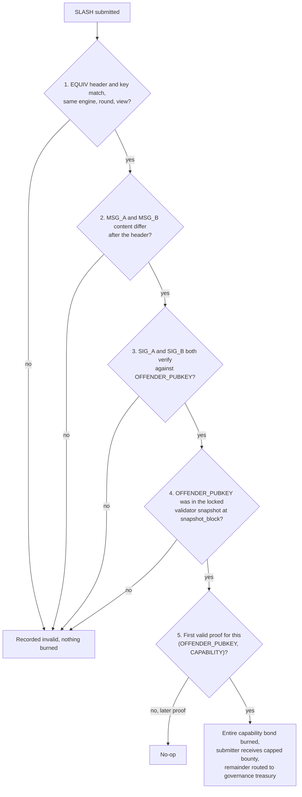

<!-- SPDX-License-Identifier: AGPL-3.0-or-later -->
<!-- Copyright © 2025–2026 Dankest, LLC -->

# XChain Platform Action - SLASH
This action submits a permissionless equivocation proof that burns a capability validator's entire bond when they signed two conflicting values for the same consensus slot.

## PARAMS
| Name              | Type    | Description                                                                                                                                                                                                                                                                      |
| ----------------- | ------- | -------------------------------------------------------------------------------------------------------------------------------------------------------------------------------------------------------------------------------------------------------------------------------- |
| `VERSION`         | Integer | Format version (`0`)                                                                                                                                                                                                                                                             |
| `CAPABILITY`      | String  | Membership label the equivocation occurred in: `cross_chain`, `oracle_publish`, `price`, `attestation`, or `config` (sentinel for `XCONFIG`: config-change PBFT, authorized by the whole federation). Must match the engine the `EQUIV_KEY` names; this is derived, not trusted  |
| `OFFENDER_PUBKEY` | String  | Equivocating validator's Ed25519 capability signing key, 64 hex chars                                                                                                                                                                                                            |
| `MSG_A`           | String  | base64url of the first signed canonical string (an `EQUIV`-headered string: `EQUIV\|<ENGINE_TAG>\|<ROUND_ID>\|<VIEW>\|\|<CONTENT>`)                                                                                                                                              |
| `SIG_A`           | String  | Ed25519 signature over `MSG_A` by `OFFENDER_PUBKEY`, 128 hex chars                                                                                                                                                                                                              |
| `MSG_B`           | String  | base64url of the second signed canonical; equal to `MSG_A` through the header, different in `<CONTENT>`                                                                                                                                                                         |
| `SIG_B`           | String  | Ed25519 signature over `MSG_B` by `OFFENDER_PUBKEY`, 128 hex chars                                                                                                                                                                                                              |

## Formats

### Version `0` - Equivocation Slash
- `VERSION|CAPABILITY|OFFENDER_PUBKEY|MSG_A|SIG_A|MSG_B|SIG_B`

## Examples
```
SLASH|0|cross_chain|abc1...ef|<b64 msgA>|<sigA>|<b64 msgB>|<sigB>
Proof that validator abc1...ef signed two different XMATCH settlements for the same cross-chain match and view (msgA and msgB share the EQUIV header EQUIV|XDEX|m_42|3||... but differ in content). Burns its entire cross_chain bond.
```

## Rules
The slash is applied only when every check passes; otherwise the action is recorded `invalid` and nothing is burned.

1. **EQUIV header and key.** `MSG_A` and `MSG_B` must both literally begin with `EQUIV|<EQUIV_KEY>||` (same engine, round, and view). Because the view is in the key, an honest view change cannot be paired; because the v0 per-block checkpoint and the v1 archive use distinct round ids, they cannot be falsely paired either.
2. **Conflicting content.** The bytes after the header must differ. Identical messages (e.g. a PREPARE and a COMMIT over the same value) are not equivocation and are rejected.
3. **Signatures.** Both `SIG_A` and `SIG_B` must verify against `OFFENDER_PUBKEY` over the full signed bytes.
4. **Membership.** `OFFENDER_PUBKEY` must have been in the locked validator snapshot that authorized the slot at its `snapshot_block`. The `snapshot_block` is recovered deterministically from the proof itself: from the signed content for `XDEX` / `XCALL` / `XCHECKPOINT` / `XCONFIG`, from the round id for `XORACLE` (the round is a BTC block), from the BTC anchor carried in the first segment of the composite round id for `XORACLEB`, and from the referenced request for `XATTEST`. For the six capability-scoped engines the snapshot is `CAPABILITY`'s MIN_STAKE-qualified set; for `XCONFIG` it is the whole federation (every active staker, since config-change PBFT has no capability subset), hence the `config` label. `CAPABILITY` must be the one the engine maps to; it is derived, not trusted. This snapshot-block rule covers seven of the eight EQUIV-headered engines; the eighth, `XNODEPROOF`, has no `snapshot_block` rule and no `CAPABILITY` mapping, so an `XNODEPROOF`-headered proof is rejected (see the Notes bullet below).
5. **Idempotency.** A first valid proof burns the whole bond, active stake and cooldown-locked unstakes alike. Later proofs for the same `(OFFENDER_PUBKEY, CAPABILITY)` are no-ops.



### Effect
- The offender's entire capability bond (active `stakes` plus cooldown-locked `unstakes`) is burned in place; each reduction is logged so a chain reorg restores the pre-slash amounts exactly.
- The submitter receives a capped bounty and the remainder is routed to a governance treasury (both governance-configured; until set, the burn pays no bounty and routes nothing, making it a pure burn).
- A `capability_slash_events` audit row records the burn, the proven `EQUIV_KEY`, and the bounty/treasury split.
- **Permanent disqualification.** A slashed signing key is barred from the effective validator set globally and permanently, across every capability (not just the one it was slashed in), and not only until its current bond burns to zero: any future re-stake or re-delegation of the same key never re-qualifies. The exclusion is block-gated (it applies only at and after the slash's block, so historical re-derivation is byte-identical) and reorg-safe (a reorg that orphans the slash restores eligibility).

### Activation
- `SLASH` accepts proofs only when the messages carry the `EQUIV` header, so equivocation slashing is naturally inert until the EQUIV header's BTC-anchored flag-day; it cannot act on any pre-flag-day (headerless) signature.

## Notes
- **BTC chain only.** Capability stake is BTC-only, so `SLASH` is a BTC-chain action.
- **Wire key omission.** The equivocation key (`ENGINE_TAG|ROUND_ID|VIEW`) is not a wire field. It contains `|` and would break the pipe-delimited action, and it is fully recoverable from `MSG_A`'s header (`EQUIV|<key>||...`). The verifier derives it and requires `MSG_B` to carry the identical header prefix.
- **`XCONFIG` content format.** For `XCONFIG`, the signed `<CONTENT>` is `<snapshot_block>|<config_digest>`; the round's locked whole-federation snapshot block is carried in-content so the proof alone yields the membership block (the base-10 block and hex digest are pipe-free, so the action still splits cleanly).
- **Seven of the eight EQUIV engines are slashable.** As of the WI-2 bump 2 Phase-A amendment the config-change engine (`XCONFIG`) is slashable: its signed canonical now carries the round's locked `snapshot_block` in-content, and membership resolves against the whole-federation set. This changes the bytes hubs sign for config at and above the EQUIV flag-day, so it is a consensus-breaking change. Deploy the hub and all indexers atomically (it is mainnet-inert until the flag-day). The PRICE-batch engine (`XORACLEB`) is slashable too, and under the same `price` capability as `XORACLE`, so a batch equivocation burns the same bond; the tag is distinct only so a v0 round and a batch at one BTC anchor can never share an equivocation key (see `price.md`). The eighth EQUIV engine, `XNODEPROOF`, is deliberately **not** slashable: it carries no `CAPABILITY` mapping and no `snapshot_block` recovery rule, so a proof whose messages carry an `XNODEPROOF` header is recorded `invalid: ENGINE_TAG (not slashable)`. A node that fails challenges is penalized separately (see `NODEPROOF.md`); its `full_node` bond is untouched by `SLASH`.
- **Anyone may submit.** There is no privileged accuser and no off-chain data; the proof is self-contained and self-verifying.

---

**Copyright &copy; 2025–2026 Dankest, LLC**

**Based on XChain Platform by Dankest, LLC &ndash; https://dankest.llc**

Licensed under the **GNU Affero General Public License v3.0** (AGPL-3.0-or-later)
with a commercial license available for proprietary use.

You may use, modify, and distribute this material under the terms of the License.
See [LICENSE](../../LICENSE.md) and [NOTICE](../../NOTICE.md) for full terms.
See the [licensing overview](https://docs.xchain.io/legal/LICENSING.html).
