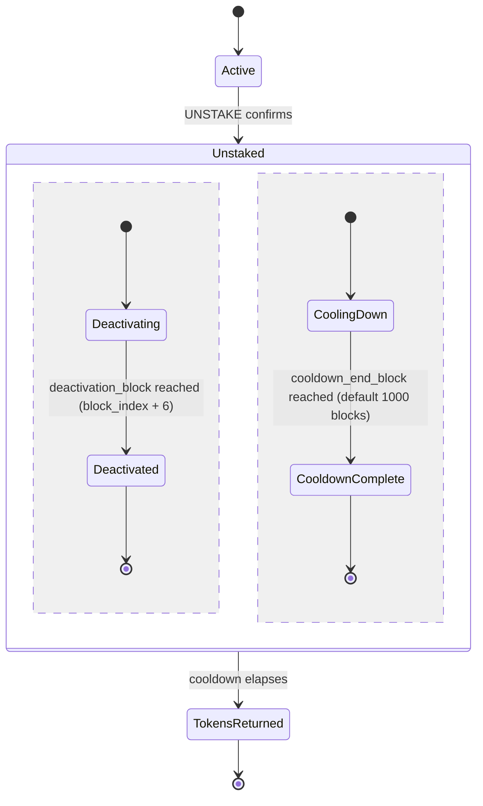

<!-- SPDX-License-Identifier: AGPL-3.0-or-later -->
<!-- Copyright © 2025–2026 Dankest, LLC -->

# XChain Platform Action - UNSTAKE
This action begins the unstaking cooldown for an active stake identified by its signing pubkey, supporting both capability stakes (v0) and contract-targeted stakes (v1).

## PARAMS
| Name                    | Type    | Description                                                             |
| ----------------------- | ------- | ----------------------------------------------------------------------- |
| `VERSION`               | String  | Format Version (0 = capability unstake, 1 = contract-targeted unstake) |
| `SIGNING_PUBKEY`        | String  | Ed25519 public key of the stake to unstake                              |
| `TARGET_CONTRACT_INDEX` | Integer | v1 only: `action_index` of the stakeable contract                      |
| `TICK`                  | String  | v1 only: token ticker of the stake row to release                      |
| `AMOUNT`                | String  | Optional trailing partial-unstake amount; absent = full sweep           |

## Formats

### Version `0` - Capability Unstake
- `VERSION|SIGNING_PUBKEY[|AMOUNT]`

### Version `1` - Contract-Targeted Unstake
- `VERSION|SIGNING_PUBKEY|TARGET_CONTRACT_INDEX|TICK[|AMOUNT]`

## Examples
```
UNSTAKE|0|abc123...def
Begin unstaking the capability stake bound to pubkey abc123...def (returns all rows for that pubkey, original plus any v2 top-ups)
```

```
UNSTAKE|0|abc123...def|250
Begin unstaking 250 XCHAIN of the capability stake bound to pubkey abc123...def; the residual stays staked and keeps counting toward capability thresholds
```

```
UNSTAKE|1|abc123...def|500|MYTOKEN
Begin unstaking the (contract=500, tick=MYTOKEN) stake row for pubkey abc123...def
```

```
UNSTAKE|1|abc123...def|500|MYTOKEN|40
Begin unstaking 40 MYTOKEN of the (contract=500, tick=MYTOKEN) stake for pubkey abc123...def; the residual stays staked
```

## Partial Unstake (optional AMOUNT)
The trailing `AMOUNT` is activated by the `PARTIAL_UNSTAKE_COLLECT` protocol change (mainnet: the coordinated [contract-era flag day](../flag-days.md#contract-era-flag-day); testnet/regtest: genesis). Semantics:

- **Absent**: full sweep, byte-identical to the historical behavior
- **Present (at/after the flag-day)**: only `AMOUNT` enters cooldown; the residual is re-staked seamlessly (it activates at the exact block the swept rows deactivate, so stake weight is continuous with no double-count and no gap)
- **Present (below the flag-day)**: ignored (full sweep), matching what a pre-upgrade node parses
- An `AMOUNT` equal to the full staked balance is treated exactly as absent
- An `AMOUNT` of zero, malformed, finer than the token's decimals (8 for XCHAIN), or greater than the active staked balance is rejected; over-asks are never clamped
- During the deactivation-delay handoff window a second UNSTAKE on the same pubkey (or `(target, pubkey, tick)`) rejects, exactly like the existing re-unstake guard; the residual becomes unstakeable once it activates

## Rules
- `SIGNING_PUBKEY` must be a valid 64-character hex-encoded Ed25519 public key
- The active stake lookup is gated by the activation delay; only fully-active stakes can be unstaked
- Begins the cooldown period; staked tokens are not immediately returned

### v0 (capability)
- BTC chain only
- A capability stake must exist for `SIGNING_PUBKEY`, and the broadcasting address must be that stake's original source
- Returns all capability stake rows for that pubkey (original stake plus any v2 top-ups)

### v1 (contract-targeted)
- Works on any chain (BTC, LTC, DOGE)
- A contract-targeted stake row must exist for `(TARGET_CONTRACT_INDEX, SIGNING_PUBKEY, TICK)`, owned by the broadcasting address
- Cooldown for v1 is determined by the target contract's `COOLDOWN_BLOCKS` setting (set at DEPLOY time), not the global `STAKING.COOLDOWN_BLOCKS`

## Deactivation Delay
Validator removal does not take effect immediately; the validator continues to participate for 6 BTC blocks after the UNSTAKE confirms.

- Tracked via the `deactivation_block` column on all active stake rows for the pubkey (set to `block_index + 6`)
- Active-stake queries filter by `(deactivation_block IS NULL OR deactivation_block > current_block)`
- Prevents short-range BTC reorgs from affecting the active validator set

## Cooldown Period
Separate from the deactivation delay, tracked via the `cooldown_end_block` column on the `unstakes` table.

- Default cooldown: 1000 blocks (configurable via `STAKING.COOLDOWN_BLOCKS`)
- After cooldown elapses, the staked XCHAIN tokens are returned to the broadcasting address



## Notes
- Two distinct delays apply on UNSTAKE:
  1. 6 blocks: validator removal from the active set (BTC reorg safety)
  2. 1000 blocks: XCHAIN token return (security cooldown)
- The 6-block deactivation delay applies to capability unstaking (v0), which is BTC-only. Contract-targeted UNSTAKE v1 runs on every chain and uses that chain's calibrated activation delay (6 blocks on BTC, 24 on LTC, 60 on DOGE) for equivalent ~60-min reorg protection
- The unstake amount is the SUM of all active stake rows for the pubkey (original stake plus any top-ups via STAKE v2)
- Use `STAKE` (v1) to re-stake after the cooldown period completes
- Use `COLLECT` to gather any accrued rewards before or after unstaking

---

**Copyright &copy; 2025–2026 Dankest, LLC**

**Based on XChain Platform by Dankest, LLC &ndash; https://dankest.llc**

Licensed under the **GNU Affero General Public License v3.0** (AGPL-3.0-or-later)
with a commercial license available for proprietary use.

You may use, modify, and distribute this material under the terms of the License.
See [LICENSE](../../LICENSE.md) and [NOTICE](../../NOTICE.md) for full terms.
See the [licensing overview](https://docs.xchain.io/legal/LICENSING.html).
