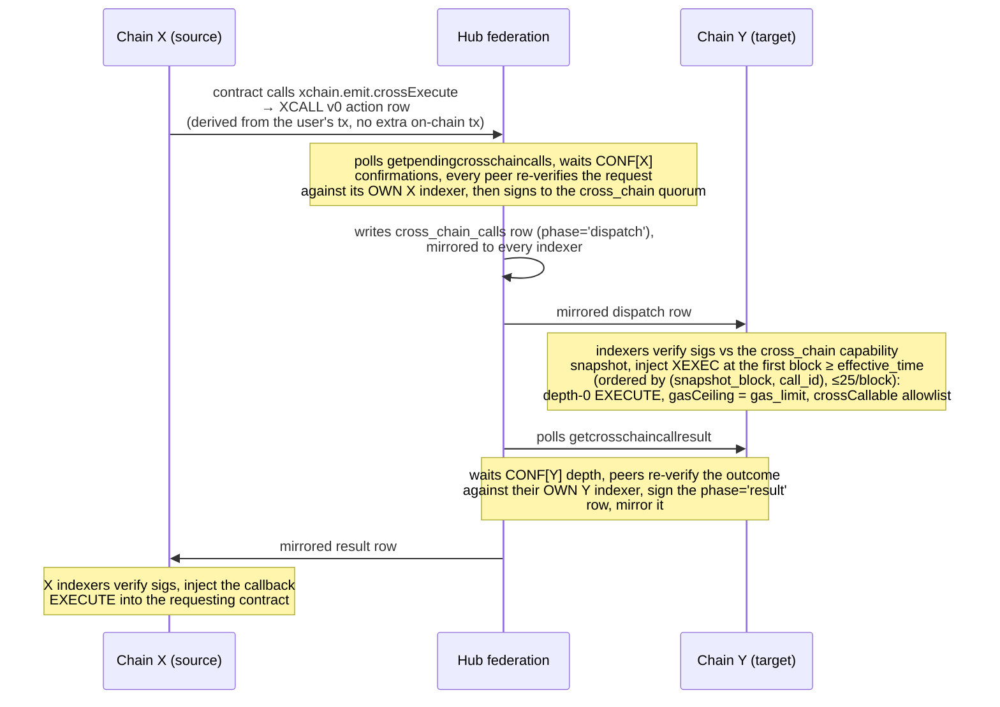

# Cross-Chain Contract Calls

A smart contract on one chain (BTC/LTC/DOGE) asynchronously invokes a method on
a contract deployed on another chain and receives the outcome via a callback.
Built from the platform's existing primitives: the emission pipeline
(same-chain `emit.execute`), the ATTEST request/callback lifecycle, the
federation's confirmation-gated PBFT, the quorum-signed hub-DB mirror with
deterministic injection (the cross-chain DEX settlement transport), and ANCHOR
recoverability.

## Architecture

**Zero per-call on-chain transactions.** The only chain footprint is the
user's original transaction on X (the XCALL request is an emitted action row
derived from it) plus the periodic ANCHOR archive on DOGE, amortized across
many calls.

## Trust model

The `cross_chain` capability quorum is the authority that tells chain Y
"this call happened on X"; Y cannot read X's chain. This is the same trust
that releases cross-chain DEX escrow, but with a larger potential blast radius
(invoking contract methods vs releasing escrowed funds).

Both relay legs resolve that quorum against the capability snapshot the row pins at its
`snapshot_block`, and that height also decides **which** quorum rule applies: **stake-weighted
(source-deduped) at/above `STAKE_WEIGHTED_QUORUM_ACTIVATION`**, where the summed stake of the
qualified signers must exceed two thirds of the total staked amount and one staking source counts
once however many of its keys sign; **otherwise the legacy `2f+1` signer count**. It is the same
rule cross-chain DEX settlement and the ATTEST relay legs apply. Below, "the quorum" means
whichever of the two the `snapshot_block` selects.

The quorum is bounded by:

1. **`crossCallable` opt-in**; a contract must export a `crossCallable`
   array naming the methods reachable cross-chain. A forged dispatch can only
   reach methods the target consciously exposed.
2. **Params-only v1**. No token value rides the call.
3. **Local signature verification everywhere**. No indexer ever acts on a
   mirror row without verifying that its Ed25519 signatures meet the quorum
   above against the mirrored, BTC-anchored capability snapshot. Mirror
   equivocation degrades to censorship, which the deadline bounds.
4. **Independent peer re-verification**; a hub follower only co-signs a
   dispatch/result after re-fetching it from its OWN indexer for that chain;
   a Byzantine leader cannot collect a quorum for a call no chain made.

**Liveness vs safety:** a dead or censoring federation can only delay or expire
calls (the `expired` callback is derived from block height alone, hub-free); it cannot forge them.

## Finality and irreversibility

The federation relays a request only after it is buried `CONF[source]` deep
(BTC 6 / LTC 12 / DOGE 60, the cross-chain swap thresholds), and relays a
result only after the injected execution is `CONF[target]` deep. **A
target-chain execution cannot be retracted from the source chain.** A source
reorg deeper than the confirmation gate after the target executed is outside
the security model; the same posture cross-chain DEX settlement takes on a
confirmed give-side. (Defense-in-depth retraction exists for the sub-depth
window: relay rows are marked retracted and broadcast as mirror deletions, and
indexers that have not yet injected skip them.)

## Latency

Inherent, not incidental: `CONF[X] + hub round + mirror grace + Y block +
execution + CONF[Y] + hub round + mirror grace + X block`, minutes to tens of
minutes depending on the chain pair. Contracts must be designed fully async:
emit the call, return, and handle the outcome in the callback.

## Determinism rules (consensus-critical)

- Every indexer applies relay rows at the same block: the `cross_chain_calls`
  mirror has its own sync barrier (`waitForCallSync`, with the stream-watermark
  quiet-table escape) plus snapshot-presence gating, mirroring the match
  barriers.
- Injection order is `(snapshot_block, call_id)`, quorum-agreed row content,
  identical in every hub DB, so the order does not depend on which hub an
  indexer mirrors (the per-hub AUTO_INCREMENT `id` is provenance only, though
  ANCHOR still archives it); the per-block cap carries overflow forward;
never drops.
- Result delivery and deadline expiry share an exactly-once interlock on the
  request's status; both are block-height-driven.
- The injected execution's synthetic TX_HASH is chain/network-namespaced
  (`sha256('XCALL:'+network+':'+chain+':'+call_id)`) so anything it emits
  derives collision-free identifiers.
- Reorg: target-side injections and source-side callbacks are anchored to
  rollback-able action rows; the request's terminal flip is reset by the
  rollback pass via `resolved_block`, so replays re-deliver identically.
- A result row the source chain can never deliver is **retired** rather than
  re-rejected forever (see below). Retirement is consensus-visible and
  flag-day gated (`XCALL_RESULT_ORPHAN_RETIREMENT`).

### Retiring undeliverable result rows

The result pass takes only `XCALL_MAX_CALLS_PER_BLOCK` rows per block, ordered
by `(snapshot_block, call_id)`, skipping whatever already has a recorded
callback. Three outcomes are permanent rather than transient: the `call_id`
matches no local request at all, the local request routes to a different target
chain, or the signatures do not meet the `cross_chain` quorum. Recording nothing
for those left them selected on every block forever, so as few as 25 of them at
a low `snapshot_block` held the head of the queue permanently and starved every
real result behind them.

Such a row is retired once it can no longer become deliverable, which is decided
only from consensus inputs (the block being processed and the quorum-signed
mirror row), never wall-clock:

- **A local request exists** (routing mismatch, failed quorum): retire once the
  processing block is past the request's own `deadline_block`. By then the
  request is terminal, so no future block can turn the row into a callback.
- **No local request exists**: the mirrored row carries no deadline, so the
  clock is its quorum-signed `effective_time` plus
  `XCALL_RESULT_ORPHAN_GRACE_SECONDS` (3600) of block time. The federation only
  signs a result once the request is buried at its source chain's relay
  confirmation depth, and that grace covers the deepest of those windows (BTC 6
  blocks, LTC 12, DOGE 60), so a request still absent that far past
  effectiveness is absent because its branch is gone.

A row deferred because the capability snapshot is not mirrored yet is **never**
retired: it is still expected to deliver, and the expiry gate keeps its request
alive to receive it.

Retirement records a `retired:<reason>` row in `cross_chain_call_callbacks`
against a freshly minted action index and delivers no callback; a contract whose
request expired hears `expired` from the deadline path, the only outcome a chain
that never saw the request can agree on. It is consensus-visible in two ways (it
mints an action row, and freeing a capped delivery slot moves which block a real
callback lands in), so it is flag-day gated and, like every other cross-chain
bookkeeping row, anchored to a rollback-able action index: a source-chain reorg
that restores the missing request erases the retirement and the result delivers
normally on the branch that carries the request.

## Client integration boundary (wallets, composers, SDK)

No wallet, batch composer, or SDK call site ever submits an XCALL, and the
absence of an XCALL entry in a client's action menu is the correct behaviour,
not a coverage gap:

- XCALL v0 exists only as an emission from inside contract code
  (`xchain.emit.crossExecute(...)`), and XCALL v2 is synthesized by every
  indexer from block height. Neither has a user-broadcast path, so the SDK
  ships no XCALL encoder and `action-manifest.json` gives XCALL a category
  outside `wire-user`, with neither `userEncodable` nor `walletForm` set (both
  of which DEPLOY and EXECUTE do carry).
- A client's entire request-side involvement is generic contract tooling:
  DEPLOY a contract whose CODE calls `crossExecute`, then EXECUTE one of that
  contract's methods. Those two forms are the client surface worth testing.
  The XCALL is a consequence of the deployed contract, not of the client.

### Exercising the request side

Producing a real XCALL on chain is a two-contract engineering exercise rather
than a UI flow:

1. Deploy the TARGET contract on chain Y, exporting a `crossCallable` array
   naming the method to be reached cross-chain.
2. Deploy the SOURCE contract on chain X, whose method calls
   `xchain.emit.crossExecute({ targetChain, contractIndex, method, gasLimit,
   callbackMethod, ... })` against the target's DEPLOY action index on Y.
3. Mine both deploys, then EXECUTE the source method from any wallet.

The verifiable request-side half ends there: the EXECUTE indexes valid on X
and X's indexer records an emitted XCALL v0. Everything past that point
(dispatch, XEXEC injection on Y, the result callback) is federation work and
requires the XCALL relay wired across both chains' indexers plus a hub. A
single-chain wallet stack cannot settle a call no matter what the client
does, so client test plans should assert the request half and leave
settlement to a federation drill venue.

## Wire/spec details

Formats, canonical signing strings, statuses, gas buckets, and the lifecycle
state machine: [actions/XCALL.md](actions/xcall.md). Constants:
[constants.js](constants.js). Developer-facing API:
`developer-guide/Smart_Contract_Development.md` (§ Calling contracts on other
chains).

## Deliberately out of scope (v1)

- Gas refunds for unused target-side gas (would require trusting/settling
  hub-reported usage).
- Token transfer riding the call (compose with cross-chain DEX settlement).
- Synchronous cross-chain reads or return values (callback pattern only).
- Calls from DEPLOY constructors.
