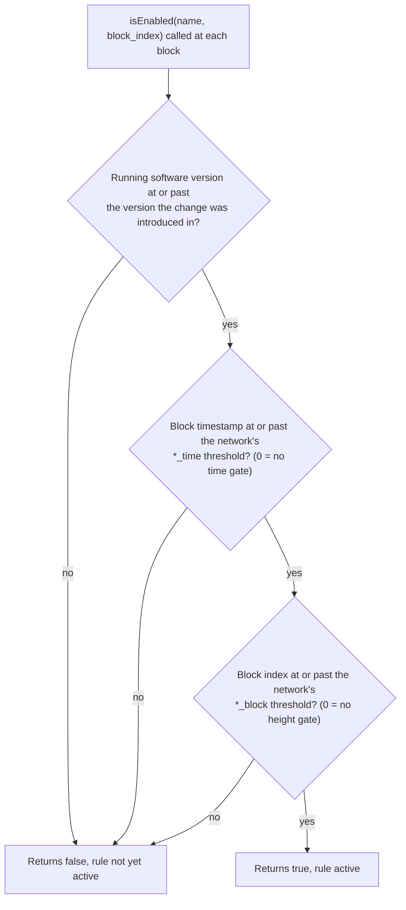
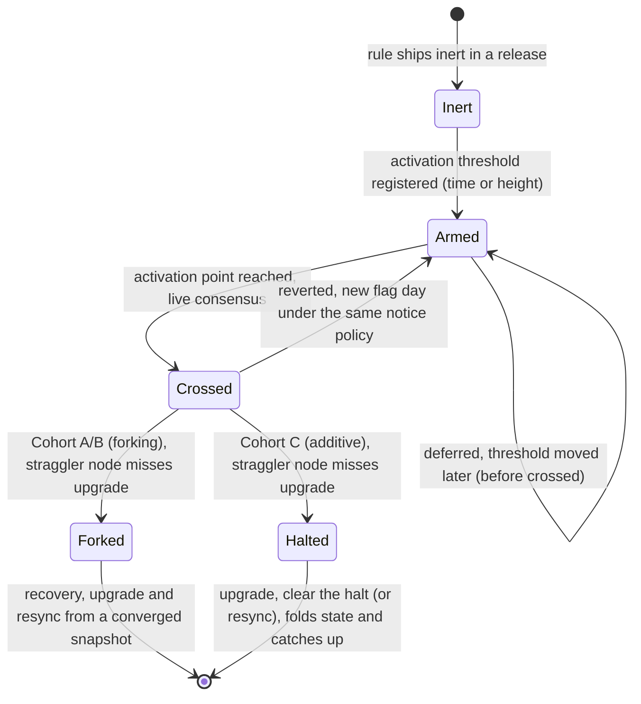

# Protocol Activation (Flag Days)

**Status:** mechanism in production; the first coordinated multi-cohort activation was armed 2026-07-07.

A consensus change cannot simply ship and take effect the moment a node updates: nodes update at
different times, and any node that evaluates a block under different rules than its peers computes a
different ledger and forks. XChain solves this the same way Bitcoin soft-forks do, with a **flag
day**: the new rule ships inert in a release, carries a fixed activation point (a block time or a
block height, per network), and every node switches to the new rule at exactly that point regardless
of when it installed the release.

This document describes the activation mechanism, the three activation cohorts, where the values
live, and what happens to a node that misses an upgrade. For the minimum lead time between shipping
an activation value and the moment it fires, see [Upgrade Notice Policy](./upgrade-notice-policy.md).

## The gate

Every gated rule is registered once with an activation threshold per network. In the indexer this is
`protocol_changes.js`:

```
addChange(name, version, mainnet_time, testnet_time, regtest_time, mainnet_block, testnet_block, regtest_block)
```

At each block the indexer asks `isEnabled(name, block_index)`, which returns true only when **all** of
these hold for the node's own network:

1. **Version has caught up.** The running software version is at or past the `version` the change was
   introduced in (semantic compare). A node running older code treats the rule as not-yet-active even
   past the activation point, which is what lets a release ship the rule inert ahead of the flag day.
2. **The block is at or past the time threshold.** The block's timestamp is `>=` the network's
   `*_time` value (0 means "no time gate").
3. **The block is at or past the height threshold.** The block's index is `>=` the network's `*_block`
   value (0 means "no height gate").



A gate is keyed on **time** or **height**, not both: set the one you want and leave the other 0. The
choice matters (below). The check is per network, so mainnet, testnet, and regtest each carry their
own threshold and cross independently.

A rule may also leave **both** at 0, in which case condition 1 is the whole gate. That is how the
ACTIONs themselves are registered: all 36 carry `0` for every time and height, 21 at version `0.1.0`
and 15 at `0.2.0`, so an action becomes available as soon as the node runs new enough code. Every
non-zero threshold in the registry therefore belongs to a *behaviour* change applied to an
already-live action, not to the arrival of an action.

### Time-keyed vs height-keyed

- **Height-keyed** gates pin activation to a specific block on one chain. Use this when the change is
  anchored to a single chain's timeline, e.g. a Bitcoin-anchored validator rule pinned to a BTC
  height.
- **Time-keyed** gates pin activation to a wall-clock instant. Use this when one coordinated cutover
  must land on **multiple chains at once**. Bitcoin, Litecoin, and Dogecoin heights diverge by
  millions of blocks, so no single shared height names one moment across all three; a single Unix
  timestamp does. The contract-era gates (which run on all three chains) are time-keyed for exactly
  this reason.

## Where the values live

**The mainnet time-keyed values themselves are on [Flag-Day Values](./flag-days.md)**, a page
generated straight from the indexer's registry. No page in this documentation set quotes a flag-day
date in prose, this one included: a flag-day value is the current setting of a constant, it has been
repinned before, and prose cannot notice its source moving. Pages name the gate and link there.

[`constants.js`](constants.js) in this repository is the canonical source for the **validator-era
(Cohort B)** and **state-commitment (Cohort C)** gates below, and for the **encoding-recognition**
gate ([below](#encoding-recognition-decoder-carried)), which sits outside all three cohorts because it
is evaluated in the decoder rather than the indexer. Each consuming service carries a
**byte-identical twin** of the maps it needs, and a cross-repo conformance gate fails CI if a twin
drifts. Cohort A (contract-era) values are not carried in `constants.js` at all: they are
service-carried in `xchain-indexer/protocol_changes.js` and the `xchain-vm` gate constants (see the
table below), byte-guarded against each other rather than against this file, pending a future
consolidation.

Ten later consensus gates are armed but **not yet folded into `constants.js`**: they currently live
only as service-carried modules (see [Additional armed gates](#additional-armed-gates-service-carried)
below). Until they are consolidated here, `constants.js` is not the complete inventory, and each of
those ten is guarded against whatever twin it has rather than against this file. Several are
**indexer-only** by design: a gate on the execution path (which actions or deploys validate) has no
`xchain-sync` twin at all, because `BlockHasher` replicates already-materialized rows and never
re-runs an action handler, a deploy validator, or the VM.

| Service | Carries |
|---|---|
| `xchain-indexer` | `protocol_changes.js` (contract-era gates) + the state-commitment and validator-era activation modules |
| `xchain-vm` | the seven contract-era VM gate constants (async ban, binary-alloc metering, deploy-linter hardening, state-key NUL-reject, state-key type normalization, metering eval-order fix, call-spread metering) |
| `xchain-hub` | the nine validator-era gate modules it consumes (checkpoint, equivocation header, stake-weighted quorum, anchor reward, archive reward, cross-chain royalty canonical, retraction signing, attestation relay, price signature tally). The tenth Cohort B gate, attestation admission, is indexer-only |
| `xchain-decoder` | `ENVELOPE_RECOGNITION_ACTIVATION`, the one activation map consumed in the decoder's own parse path |
| `xchain-sync`, `xchain-explorer`, `xchain-sdk` | the subset each needs to verify or display |

Because the values are byte-identical everywhere, a heterogeneous fleet and any from-genesis replay
evaluate every historical block the same way.

## The three cohorts

Activation values are grouped into cohorts by what kind of point they key on. Grouping lets one
coordinated fleet rollout retire a whole batch at once.

| Cohort | Keyed on | Rules | Straggler behavior |
|---|---|---|---|
| **A (contract era)** | one shared **time** (all three chains) | base64 DEPLOY encoding, VM async ban, VM binary-alloc metering, VM deploy-linter hardening, VM state-key NUL-reject, VM state-key type normalization, VM metering eval-order fix, VM call-spread metering, controller guards, VM balance/token-info surface, issuance-fee exemption, unstake-cooldown completion, cross-chain royalty create-side, XCALL undeliverable-result retirement | **forks** |
| **B (validator era)** | a **BTC height** (not always the same height across every Cohort B rule; see below) | checkpoint commitment, equivocation header, stake-weighted quorum, anchor reward, cross-chain royalty canonical, attestation admission, archive reward, retraction signing, attestation relay, price signature tally | **forks** |
| **C (state commitment)** | per-chain **local height** | light-client state commitment (state root + block-merkle root) and its state-hash classes (e.g. token-supply, poll-finalize) | **halts, recoverable** |

The ten Cohort B rules arm in two batches. Six share mainnet BTC height 961000: checkpoint
commitment, equivocation header, stake-weighted quorum, anchor reward, cross-chain royalty canonical,
and attestation admission. The other four share 963000, one deploy-train boundary later: archive
reward, retraction signing, attestation relay, and price signature tally. So "one BTC height" is
shorthand for "a BTC height per rule, in two batches" rather than a single shared value across the
whole cohort.

The cohort is its **armed** rules. `constants.js` also carries validator-era maps that are inert:
`SNAPSHOT_BURIAL_ACTIVATION`, `ANCHOR_REWARD_DERIVE_ACTIVATION` and `ATTEST_BROADCAST_FEE_ACTIVATION`
each hold `null` on mainnet, which is the encoding of "never" and the fail-closed default until an
operator ratifies a height. They are not counted above and carry no flag day yet.

Regtest runs every cohort **genesis-active** (threshold 0), so a fresh regtest stack exercises the
post-activation behavior end to end. Testnet runs the time-keyed (Cohort A) and BTC-height-keyed
(Cohort B) gates genesis-active as well, with **two** exceptions:

- **Cohort C (state commitment) is armed at future _per-chain_ heights on testnet, not from genesis**
  (`STATE_COMMITMENT_ACTIVATION`: `BTC:testnet 145000`, `LTC:testnet 4805000`,
  `DOGE:testnet 67000000`), because it gates on each chain's own local block height rather than a
  BTC-anchored flag-day.
- **The checkpoint commitment (Cohort B) is armed at `BTC:testnet` 146000**, the first testnet anchor
  past all three of those state-commitment heights. At 0 it forced the SPV root suffix from testnet
  genesis, before the indexer had computed any roots, so the hub refused to sign every testnet
  checkpoint. It is the only Cohort B rule not genesis-active on testnet; the other nine carry
  `testnet: 0`.

Mainnet is genesis-active for nothing: every cohort is armed at a real, non-zero threshold. Several
of those have since been crossed. Cohort C's mainnet heights are past (`BTC:mainnet` 958500 and
`LTC:mainnet` 3143000 both sit below the envelope heights that crossed 2026-08-03), the main Cohort B
anchor 961000 went by with them, and the shared Cohort A instant has passed as well. A crossed value
stays in the tree for the same reason the envelope map does: below its threshold each gate still runs
its legacy path, which is what keeps a from-genesis replay matching history, so the constant is
history rather than a control. Still scheduled ahead of mainnet, as of 2026-08-15, are the BTC 963000
Cohort B batch, the later per-chain gates under
[Additional armed gates](#additional-armed-gates-service-carried) below, and the four time-keyed
gates that carry a date of their own (`BATCH_ISSUANCE_LIMITS`, `CONTRACT_DELEGATION_MATERIALIZE`,
`DISPENSER_ORACLE_PER_TOKEN_PRICE`, `CROSS_CHAIN_ROYALTY`), whose instants are on
[Flag-Day Values](./flag-days.md).

## Additional armed gates (service-carried)

These eleven consensus gates are **armed** on mainnet but are not yet mirrored into
[`constants.js`](constants.js); each currently lives only in the service module named below (where a
gate has a second copy it is byte-identical, and that pair is the drift guard; an execution-path gate
has no second copy, see [above](#where-the-values-live)). They are listed here so the flag-day
inventory stays complete pending consolidation into the canonical file, and because
[Flag-Day Values](./flag-days.md) covers only the time-keyed thresholds: every height-keyed one is
inventoried on this page.

| Gate | Keyed on | Mainnet threshold | Straggler | Lives in |
|---|---|---|---|---|
| **SWQ source cap** (`SWQ_SOURCE_CAP_ACTIVATION`, caps `STAKE_WEIGHT_MAX_SOURCES=1000`, `STAKE_WEIGHT_MAX_KEYS_PER_SOURCE=64`) | BTC height | `BTC:mainnet` 960000 (after state commitment 958500, before stake-weighted quorum 961000; LTC/DOGE inert) | forks | `xchain-indexer` / `xchain-sync` `src/swq_source_cap_activation.js` |
| **Slash burns pending stake** (`SLASH_BURNS_PENDING_STAKE`) | BTC height | 961000 (Cohort-B anchor) | forks | `xchain-indexer/src/protocol_changes.js` |
| **Slash oracle-round discriminated** (`SLASH_ORACLE_ROUND_DISCRIMINATED`, the sibling registry entry one row from slash-burns) | BTC height | 961000 (Cohort-B anchor) | forks | `xchain-indexer/src/protocol_changes.js` |
| **VM deploy-lint Pkg 3** (`VM_DEPLOY_LINT_PKG3_ACTIVATION`, adds the two Package-3 deploy-blocking `CONSENSUS_RULES`, so it changes which contracts the chain accepts) | per-chain local height | `BTC:mainnet` 961000, `LTC:mainnet` 3154250, `DOGE:mainnet` 6319000 (armed 2026-07-22) | forks | `xchain-indexer/src/vm_deploy_lint_pkg3_activation.js`; the runtime half is `PKG3_SANDBOX_ACTIVATION` in `xchain-vm/src/index.js`, pinned to the same three heights so the deploy-time and execution-time halves stay coherent |
| **Oracle snapshot-age causality** (`ORACLE_SNAPSHOT_AGE_CAUSALITY_ACTIVATION`, caps the snapshot-age query at the processing block; the uncapped value is VM-visible and forks `contract_hash` between a synced and a catching-up node) | per-chain local height | `BTC:mainnet` 961000, `LTC:mainnet` 3154250, `DOGE:mainnet` 6319000 (armed 2026-07-22) | forks | `xchain-indexer/src/oracle_snapshot_age_causality_activation.js` |
| **Dispenser freshness** (`DISPENSER_FRESHNESS_ACTIVATION`, redefines freshness against indexer-local chain state instead of the external utxo tracker, changing which historical DISPENSER creates were valid) | per-chain local height | `BTC:mainnet` 961000, `LTC:mainnet` 3154250, `DOGE:mainnet` 6319000 (armed 2026-07-22) | forks | `xchain-indexer/src/dispenser_freshness_activation.js` |
| **List-edit resolution** (`LIST_EDIT_RESOLUTION_ACTIVATION`, resolves a list to its newest valid edit; `getList` gates BET place, ORDER/SWAP match, DISPENSE, DIVIDEND, CALLBACK and AIRDROP, so action acceptance changes) | per-chain local height | `BTC:mainnet` 963000, `LTC:mainnet` 3162000, `DOGE:mainnet` 6338000 | forks | `xchain-indexer` / `xchain-explorer` `src/list_edit_resolution_activation.js` |
| **Caret-ref strict** (`CARET_REF_STRICT_ACTIVATION`, makes an unresolvable address reference a hard reject at three sites that previously failed open, which moves the block's credits and debits) | per-chain local height | `BTC:mainnet` 963000, `LTC:mainnet` 3162000, `DOGE:mainnet` 6338000 (kept value-equal to list-edit resolution) | forks | `xchain-indexer/src/caret_ref_strict_activation.js` |
| **Oracle stale-round visibility** (`ORACLE_STALE_ROUND_VISIBILITY_ACTIVATION`, keeps a stale tip round in the `getPrice()` view with its price withheld instead of dropping the round outright, so a contract can tell an oracle stall apart from an oracle that never ran; VM-visible, so it changes `contract_hash`) | per-chain local height | `BTC:mainnet` 963000, `LTC:mainnet` 3162000, `DOGE:mainnet` 6338000 (kept value-equal to list-edit resolution) | forks | `xchain-indexer/src/oracle_stale_round_visibility_activation.js` |
| **State-key collation** (`STATE_KEY_COLLATION_ACTIVATION`) | per-chain local height | `BTC:mainnet` 962500, `LTC:mainnet` 3160000, `DOGE:mainnet` 6335000 (armed 2026-07-10, ~10 days past Cohort-B) | halts, recoverable | `xchain-indexer` / `xchain-sync` `src/state_key_collation_activation.js` |
| **DISPENSE cancelling-dispenser match** (`DISPENSE_CANCELLING_MATCH_ACTIVATION`, corrects the `db.findMatchingDispensers` latest-status correlation on the native-coin DISPENSE trigger path) | block time | the coordinated 2.0.0 [contract-era flag day](./flag-days.md#contract-era-flag-day); deploy all indexers before it | forks | `xchain-indexer/src/dispense_cancelling_match_activation.js` |

The SWQ source cap, slash-burns and slash-oracle-round gates are BTC-height forking rules that belong
with **Cohort B**; state-key collation is a per-chain additive gate that behaves like **Cohort C**
(halts, recoverable). The six remaining per-chain gates (VM deploy-lint Pkg 3, oracle snapshot-age
causality, dispenser freshness, list-edit resolution, caret-ref strict, oracle stale-round
visibility) are the reason this section
exists rather than a cohort row: they are **keyed** like Cohort C, on each chain's own `block_index`,
but they **fork** like Cohort A and B, because each changes an acceptance or deploy verdict rather
than adding a commitment. Below its threshold each one runs its legacy path byte-identically, which
is what keeps a from-genesis replay reproducing history.

The DISPENSE cancelling-dispenser match gate is a block-time forking rule keyed on the shared 2.0.0
contract-era timestamp, so it belongs with **Cohort A**; it is registered as a
standalone twin-style module rather than a `protocol_changes.addChange` entry to keep it self-contained
next to the query it gates.

## Encoding recognition (decoder-carried)

One gate does not belong to any cohort, and the difference is worth stating because everything above
describes the **indexer's** `isEnabled` check. `ENVELOPE_RECOGNITION_ACTIVATION` is evaluated in the
**decoder**, while it parses a transaction, and it governs what counts as an action-bearing
transaction in the first place. It is canonical in [`constants.js`](constants.js).

| Gate | Keyed on | Thresholds | Straggler | Lives in |
|---|---|---|---|---|
| **Taproot envelope recognition** (`ENVELOPE_RECOGNITION_ACTIVATION`, and with it every [envelope consensus rule](./taproot-envelope.md): end-indexed witness parsing, annex refusal, input-0 binding, mixed-carrier and multi-envelope rejection) | per-chain **local height** | `BTC:mainnet` 960850, `LTC:mainnet` 3153500 (both crossed 2026-08-03), `DOGE` **null on every network**; testnet and regtest genesis-active (0) | forks | `xchain-decoder/src/XChainDecoder.js`, mirrored in `xchain-encoder/src/CryptoNetworks.js` |

The **encoder** carries a byte-identical twin of this map, which is unusual enough to explain: no
other activation gate is consulted by a transaction *builder*. The encoder refuses to build an
envelope below the height its decoder counterpart would recognize, because the failure it prevents is
not a fork but a loss. A caller would pay a real miner fee for a commit and reveal carrying an action
that no decoder on the network will ever index, and nothing about the transaction would look wrong.
Drift between the two copies in the other direction is the ordinary forking hazard.

Three further properties of this gate differ from the cohorts above:

- **It is keyed on each chain's own local height**, like Cohort C and unlike the BTC-anchored Cohort
  B, because recognition happens while parsing that chain's blocks. There is no cross-chain moment to
  coordinate.
- **`DOGE` is null rather than a future height**, and that is the encoding of "never". Dogecoin has no
  SegWit, therefore no Taproot and no envelope. A DOGE entry holding a number would mean somebody had
  scheduled a flag day on a chain that cannot carry the format.
- **Below the height the decoder behaves exactly as it shipped.** A pre-flag transaction carrying an
  envelope alongside an `XCHN` OP_RETURN replays as the OP_RETURN action, which is how the fleet
  indexed it live. This is what keeps a from-genesis replay matching history, and it is why the
  constant stays in the tree now that both mainnet heights have passed: it is history, not a control.

Within **Cohort A**, the **cross-chain royalty create-side** gate is the one rule that does not share
the single contract-era timestamp: it is deliberately armed one quarter later (both values are on
[Flag-Day Values](./flag-days.md)), so the deny window between the two dates is the safe interim while the
fleet upgrades to legs-in-canonical. Its match-canonical partner is a Cohort-B gate (`CROSS_CHAIN_ROYALTY_ACTIVATION`,
armed months earlier at BTC anchor 961000), preserving the canonical-first ordering. So Cohort A is
"one shared time" in its keying *mechanism* (wall-clock time, synchronized across all three chains), but
the royalty create-side carries a later time *value* than the rest of the cohort.

## Straggler behavior

What happens to a node that crosses a flag day still running pre-activation code depends on whether
the gated change is **forking** or **additive**:

- **Cohort A and B rules are forking.** They change action validity, ledger hashes, or the signature
  preimage a validator signs. A node that misses the upgrade computes a different ledger or produces
  signatures its peers reject, and it **forks**. Recovery requires upgrading and resyncing from a
  converged snapshot. This is why these cohorts carry the full upgrade-notice window.
- **Cohort C is additive.** The state commitment adds a new per-block state root; it does not change
  the ledger, actions, or contract hashes. A replica that reaches the activation height still running
  pre-activation code cannot fold the new state and **halts** on a state-hash divergence rather than
  silently diverging. Recovery is clean: upgrade to the armed code, clear the halt (or resync), and it
  folds state and catches up. The halt-not-fork property was verified end-to-end in the 2026-07-07
  transition drill.

The distinction is the safety net: an additive change fails loud and recoverable, so a Cohort-C
straggler is an operational blip, not a consensus split.

## Deferring and reverting

- An armed value may be **deferred** (moved later) at any time before it is crossed, by shipping a new
  release. Nothing has taken effect yet, so this is free.
- Once a value is **crossed**, it is live consensus. Reverting it is itself a consensus change and
  requires a new flag day under the same [notice policy](./upgrade-notice-policy.md).



## Related documentation

- [Upgrade Notice Policy](./upgrade-notice-policy.md): minimum lead time before an armed value fires.
- [Controller-Bound Tokens](./controller-bound-tokens.md): the programmable-policy and cross-chain
  royalty rules gated by cohorts A and B.
- [SDK Light Client](../components/sdk/light-client.md): the SPV verifier that consumes the Cohort-C
  state commitment.
- [`constants.js`](constants.js): the canonical activation values.
