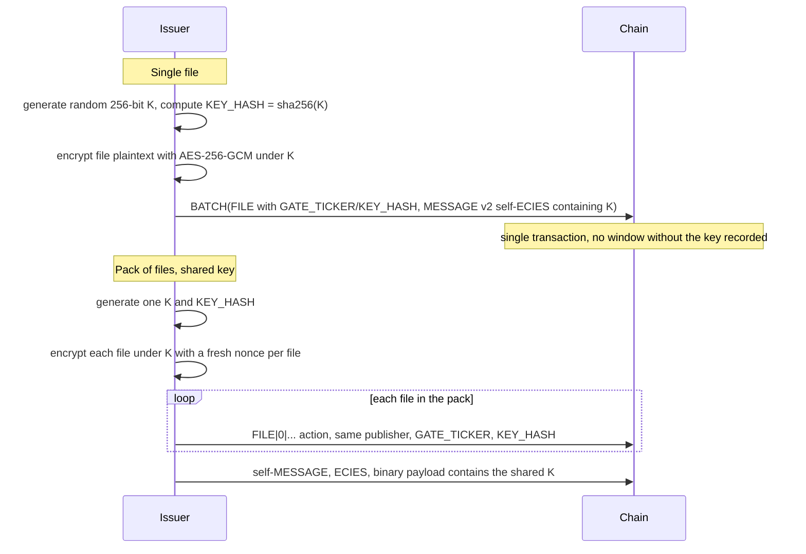
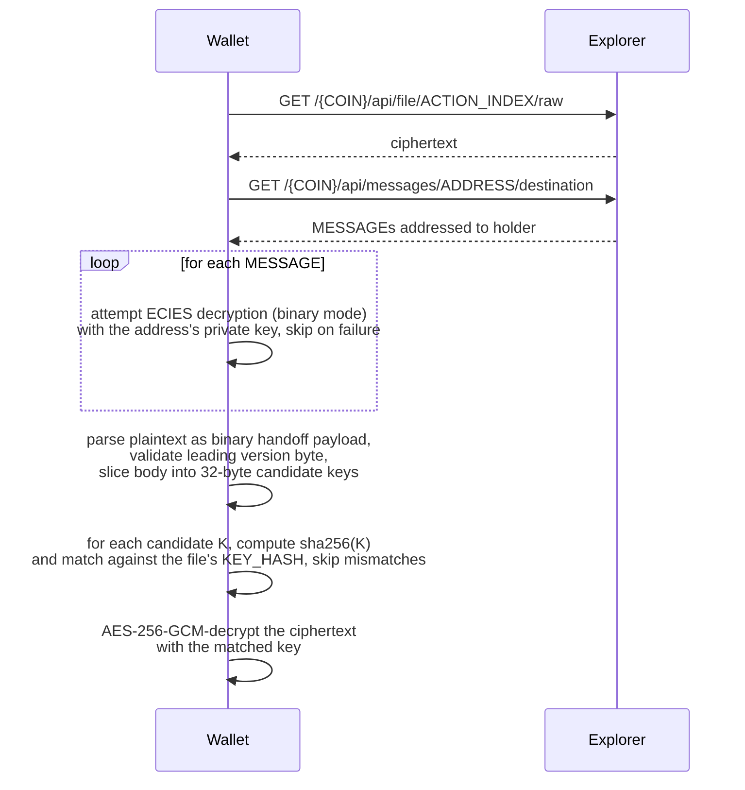

<!-- SPDX-License-Identifier: AGPL-3.0-or-later -->
<!-- Copyright © 2025–2026 Dankest, LLC -->

# Token-Gated Content

Token-gated content is XChain's protocol-native mechanism for publishing files that are readable only by holders of a specific token. Files are encrypted on-chain with a symmetric key, and the key is delivered to each holder through standard ECIES messaging. Owning the token cryptographically grants the ability to decrypt, without an on-chain unlock transaction, without third-party infrastructure, and without storing the content off-chain.

This is the platform's first cryptographically secure publishing capability. It composes three existing primitives, the [`FILE`](./actions/file.md) ACTION, the [`MESSAGE`](./actions/message.md) ACTION (ECIES mode), and the [`BATCH`](./actions/batch.md) ACTION, by appending four optional fields (`GATE_TICKER`, `ENCRYPTION_METHOD`, `KEY_HASH`, `GATE_MIN_AMOUNT`) to `FILE` format 0 and adding one indexer rule on `SEND`. No new ACTIONs. No new format versions. No new infrastructure. No external services.

---

## What it lets a creator do

- **Publish a single encrypted file** that anyone running an XChain node can see on-chain but only token holders can decrypt and read.
- **Publish a multi-file pack** that unlocks atomically, owning the token decrypts every file in the pack with a single key.
- **Set a minimum holding** with `GATE_MIN_AMOUNT`, so content unlocks at a balance rather than at the first satoshi of the token. Holders below the threshold receive no key until a transfer takes them over it.
- **Sell the token freely** on the built-in DEX. Whoever buys the token automatically receives the decryption key as part of the transfer transaction.
- **Walk away after publishing.** No server to keep running, no key escrow service to maintain. The encrypted content and the key handoff machinery live entirely on the blockchain.

---

## Trust model

- **What it guarantees.** Until a holder unlocks, no party (including miners, indexer operators, and explorer hosts) can read the plaintext. The encryption is AES-256-GCM with a 256-bit random key. The key is delivered only via ECIES envelopes encrypted to the receiver's address public key.
- **What it does not guarantee.** Once a holder decrypts, they have the bytes. Token gating is a *first-access* lock, not DRM; a holder can rehost the plaintext anywhere. Loss of the address private key means loss of access (same custody model as the token itself). And a malicious sender could refuse to attach the key handoff at transfer time; the protocol prevents the OMISSION by rejecting any gated `SEND` that owes a handoff and is not paired with a `MESSAGE` to the recipient, but it cannot inspect the ciphertext, so a sender can still attach a wrong key. Recipients detect that themselves by checking the delivered key against `KEY_HASH`.

---

## How publishing works

The token issuer composes one or more on-chain transactions that publish the encrypted file(s) and record the key.

### Single file

1. Issuer generates a random 256-bit symmetric key `K` and computes `KEY_HASH = sha256(K)` (hex).
2. Issuer **compresses the plaintext, then encrypts it** with AES-256-GCM under `K`. Output ciphertext is `[12-byte nonce][16-byte GCM authentication tag][ciphertext]`. The order is not a preference: GCM ciphertext is incompressible, so encrypting first throws the saving away entirely. When the compressed form is kept, the `FILE` action's `COMPRESSION` field is set to `1` and means **inflate after decrypt** (see [Compression ordering](#compression-ordering) below).
3. Issuer constructs `BATCH(FILE, MESSAGE-to-self)`:
   - `FILE|0|NAME|TYPE|TITLE|MEMO|GATE_TICKER|1|KEY_HASH|GATE_MIN_AMOUNT|COMPRESSION` (where `1` = AES-256-GCM in the `ENCRYPTION_METHOD` field) with the ciphertext as the action's `rawData` (transported via P2WSH per [Transaction Encoding](../concepts/encoding.md)). `GATE_MIN_AMOUNT` is optional and may be omitted entirely; the eight-field form is unchanged and still valid, so every historical `FILE` reads identically.
   - `MESSAGE|2|COIN|<issuer-address>|<ECIES ciphertext>` whose decrypted plaintext is the binary payload below, encrypted to the issuer's own address so the issuer can recover `K` later for redistribution.
4. The single transaction is signed and broadcast. There is no window in which the encrypted file exists on-chain without the key being recorded.

### Pack of files (shared key)

A pack is two or more gated `FILE` actions by the **same publisher** sharing the same `KEY_HASH` and the same `GATE_TICKER`. The protocol does not need a "pack" concept: pack membership is implicit in that triple.

The publisher is part of the key because token ownership transfers. A former issuer's files and the current issuer's files legitimately carry different publishers, and merging them into one pack would let an owner who no longer controls the token set that pack's unlock threshold (see below, where a pack's threshold is the minimum across its files).

1. Issuer generates one `K` and `KEY_HASH`.
2. Issuer encrypts each file plaintext under `K`. Each file gets a fresh 12-byte nonce, but they all share `K`.
3. Issuer publishes a `FILE|0|...` action per file (one `rawData` per transaction; small files can be combined in a single `BATCH`).
4. After (or alongside) the last file, issuer publishes a self-`MESSAGE` whose binary payload contains the single shared `K`.

Because every file in the pack shares the same `K`, one 32-byte entry in the handoff unlocks every file in the pack regardless of how many there are.



---

### Compression ordering

For a gated file the pipeline is `deflate(plaintext)` then `encrypt`, and the client inverts it: `decrypt` then `inflate`. `KEY_HASH` semantics are unchanged - it still commits to `K`, not to the bytes.

Two consequences worth stating plainly:

- **Serve layers must never inflate gated ciphertext.** On a gated FILE, `COMPRESSION` describes the plaintext inside the encryption, so an explorer or indexer that inflated the stored bytes would be inflating ciphertext. Gated files are always served exactly as stored; only the holder's client, after decrypting, inflates. The encoder never sets the field on a gated FILE for the same reason: it belongs to whoever performed compress-then-encrypt.
- **A known side channel, documented rather than hidden.** The on-chain ciphertext length reveals how compressible the plaintext was (a CRIME-family leak). It is low value against file storage, but it is real. Where the compressibility of the content is itself sensitive, publish without compression: the opt-out exists for exactly this.

## How transfers work

Once a token has at least one active gated `FILE`, the indexer enforces a rule on every `SEND` of that token:

> A `SEND` of a token with active gated content must be in the same transaction as a `MESSAGE` v2 addressed to the SEND's destination, **unless every pack gating that token sets an unlock threshold the recipient will still be below after the transfer.**

The wallet sending the gated token composes `BATCH(SEND, MESSAGE)`. The MESSAGE carries the ECIES-encrypted key handoff payload re-encrypted to the recipient's address public key (resolved from on-chain transaction history per [`MESSAGE` v2 ECIES](./actions/message.md)).

If the MESSAGE is required and missing, the indexer rejects the `SEND` only; the rest of the BATCH (if any) survives. This prevents a sender from delivering a gated token without the means to unlock it.

The sending wallet must already hold the key, i.e. the sender must have previously unlocked the content. A wallet that has never decrypted the content has no key to re-encrypt to a new holder. The wallet should block the transfer at compose time with a clear message rather than producing an invalid transaction.

### Unlock thresholds (`GATE_MIN_AMOUNT`)

A gated `FILE` may name a minimum balance of the gate token at which content unlocks. Without one, any holder of the token is owed the key on transfer, which is the original behaviour and what every `FILE` published before this field carries.

The rule the indexer applies, in order:

1. **Threshold per pack, not per file.** A pack's effective threshold is the **minimum** `GATE_MIN_AMOUNT` across its files. Any file in the pack with no threshold makes the whole pack unconditional: the files share one key, so the weakest condition governs what that key unlocks.
2. **Measured on the post-send balance.** The recipient's balance of the token *before* the transfer, plus the total this action sends them across all of its legs. The total, not a per-leg amount: otherwise one transaction could split 120 into two legs of 60 against a threshold of 100 and deliver an above-threshold balance with no key.
3. **A pack requires the handoff** when its effective threshold is unconditional, or when the post-send balance reaches it.
4. **The `MESSAGE` is required if at least one pack requires it.** If every pack sits above the recipient's post-send balance, a plain `SEND` with no `MESSAGE` is valid and the recipient deliberately receives no key. They can be sent one later, or acquire more of the token and be handed the key on the transfer that crosses the threshold.

Publishing a gated `FILE` against a token is restricted to that token's issuer, so an outsider cannot attach a pack (or a threshold) to someone else's token.

Format rules for the field: a decimal amount strictly greater than zero (every zero form is rejected), at most 40 characters, digits and at most one `.`, no leading zeros unless the integer part is exactly `0`, a non-empty fractional part whenever a `.` is present, and no more decimal places than the gate token's own divisibility (capped at 18). A present-but-invalid value rejects the `FILE` rather than being ignored: a `FILE` is immutable, so silently dropping a malformed threshold would leave the publisher believing a threshold was in force while the chain recorded none.

### What the handoff rule does and does not guarantee

The rule enforces the **presence** of a key-handoff `MESSAGE`, not the correctness of what is inside it. Consensus cannot look inside the ciphertext, so an adversarial sender can satisfy the rule with garbage. Recipients verify the delivered key against the file's `KEY_HASH` client-side (step 5 of the unlock flow below) and ignore anything that does not match. The protocol guarantees a sender cannot *quietly omit* the handoff; it cannot guarantee the sender was honest.

---

## How unlock works (no on-chain transaction required)

Unlocking is entirely client-side and offline-capable once the wallet has fetched the relevant on-chain data:

1. Wallet fetches the ciphertext from any explorer's `/{COIN}/api/file/<ACTION_INDEX>/raw` REST endpoint.
2. Wallet queries `/{COIN}/api/messages/<address>/destination` for MESSAGEs addressed to the holder's address.
3. For each MESSAGE, wallet attempts ECIES decryption (binary mode) with the address's private key. Skips on failure.
4. On success, wallet parses the plaintext as the binary handoff payload (see below): validates the leading version byte, slices the body into 32-byte candidate keys.
5. For each candidate `K`, wallet computes `sha256(K)` and matches against the target file's `KEY_HASH`. Mismatches are skipped (defends against malicious senders shipping wrong keys).
6. Wallet AES-256-GCM-decrypts the ciphertext with the matched key.
7. If the `FILE` action carries `COMPRESSION=1`, wallet **inflates the decrypted bytes** (deflate-raw) under the same streamed 150:1 guard every reader applies. On an invalid stream or a tripped guard it presents the decrypted bytes as stored-form with an explicit error, never partial output. Result is the plaintext file bytes.



No on-chain action is required to unlock. The holder can decrypt and re-decrypt as often as they like.

---

## Key handoff payload format

The plaintext inside every ECIES key-handoff MESSAGE is a compact binary blob:

```
+--------+----------+----------+-----+
|  0x01  | K1 (32B) | K2 (32B) | ... |
+--------+----------+----------+-----+
  ^         ^
  |         +-- raw 32-byte AES-256-GCM key(s), one per distinct gated key
  +-- handoff version byte (currently 0x01)
```

- **Wire size:** `1 + 32 × N` bytes for N keys. A single-key handoff is 33 bytes; the common case for any token with one gated `FILE` or one pack.
- **No `KEY_HASH` is sent on the wire.** The recipient hashes each 32-byte candidate (`sha256(K)`) and matches against the `KEY_HASH` of whichever gated `FILE` it cares to unlock. This is the same hash check the wallet already performs as a tamper defense, doubled as the identification step.
- **Pack support is implicit.** A pack with N files shares one `K`, which means one 32-byte entry in the handoff unlocks every file in the pack.
- **Multi-key handoffs** (a token with multiple distinct gated `KEY_HASH`es, e.g. two unrelated packs under one ticker) carry one 32-byte entry per distinct `K`. The recipient hashes each and matches independently.
- **Version byte** is `0x01`. Reserved for future format evolution, readers must reject unknown version bytes rather than guessing the layout.
- **Transport.** The plaintext bytes are passed to ECIES (`MESSAGE` v2, method 1) **in binary mode**. No UTF-8 conversion. The on-chain `ENCRYPTED_MESSAGE` field is the ECIES ciphertext (KDF version byte `0x01` ‖ ephemeral pubkey, 33 bytes ‖ IV, 12 bytes ‖ GCM tag, 16 bytes ‖ encrypted bytes), opaque to anyone without the recipient's private key. Byte 0 selects the key-derivation version (`0x01` = HKDF-SHA256 v1; legacy v0 is sniffed as `0x02`/`0x03`); readers must reject unknown version bytes rather than guessing the layout.

### Why binary (and not JSON)

A JSON wrapper with `KEY_HASH`-keyed base64 entries costs ~154 plaintext bytes for the single-key case, most of which is JSON structural overhead, hex encoding of `KEY_HASH`, and base64 padding of `K`. The binary form drops to 33 plaintext bytes (~78% reduction), which propagates through ECIES (+~61 bytes envelope) and base64 transport into the on-chain `ENCRYPTED_MESSAGE` field, shrinking the per-handoff overhead of every gated `SEND` and every issuer self-handoff.

---

## Indexer validation rules

These are the protocol-level rules the indexer enforces. See the individual action specs for the canonical statement.

- **Gated `FILE` publishing.** When `GATE_TICKER` is non-empty, the SOURCE address must be the issuer of the gated token (i.e. the OWNER returned by the token's current `ISSUE`). Otherwise the FILE is rejected. This prevents third parties from gating arbitrary content to popular tickers as spam.
- **`SEND` of a gated token.** Defined above. The indexer checks for a structurally valid sibling `MESSAGE`; it does not decrypt or validate the payload contents (it can't; the payload is encrypted to the recipient). The wallet at unlock time verifies key correctness via the `KEY_HASH` check.

---

## Use cases

- **Album drops / track packs.** Issuer mints a token, publishes a multi-file pack of FLAC stems plus liner notes PDF. Buyers of the token unlock everything atomically the moment the transfer confirms.
- **Sealed bundles.** A creator can guarantee that no one has seen any file in the pack (not even the indexer operators or block explorers) until a holder unlocks. Useful for time-locked reveals, lottery / raffle distributions, surprise drops.
- **Paid downloads.** Issuer sells the token via DISPENSER or ORDER. Anyone who buys gets the decryption key in the same transaction. No payment gateway, no checkout server.
- **Holder-only resources.** Brand guidelines, board minutes, premium research: published once on-chain, accessible only to holders, durable as long as the chain exists.
- **Whitepapers and supporting docs.** Sealed at issuance, opens to holders, persists forever.

---

## Non-goals (initial release)

- **Key rotation.** If a key is leaked, the only recourse is to republish the affected files under a new key.
- **Per-file granular gating.** All gated files for a token are unlocked atomically when the holder receives the keys. If a creator wants tiered access, they should mint multiple tokens.
- **Revocation.** Knowledge can't be ungranted. A holder who unlocks and then transfers the token still has the bytes. The chain reflects who holds it now, not who has ever read it.
- **DRM.** A holder can rehost plaintext anywhere.
- **Threshold or proxy re-encryption.** The initial release uses simple symmetric encryption + per-recipient ECIES envelopes. More advanced schemes are out of scope.

---

## Related specs

- [`FILE`](./actions/file.md): format 0 including the optional gating fields.
- [`MESSAGE`](./actions/message.md): v2 ECIES used for key handoff.
- [`SEND`](./actions/send.md): gated-SEND validation rule.
- [`BATCH`](./actions/batch.md): composition pattern for publish-with-key and transfer-with-handoff in one transaction. A `BATCH` is not atomic, so confirm both commands settled valid.
- [Token Information Standard](./token-information-standard.md): TIS file-entry extension (`data_ref`, `locked`, `pack_id`, top-level `packs` map).
- [Transaction Encoding](../concepts/encoding.md): how P2WSH carries the encrypted file bytes.

---

**Copyright &copy; 2025–2026 Dankest, LLC**

**Based on XChain Platform by Dankest, LLC &ndash; https://dankest.llc**

Licensed under the **GNU Affero General Public License v3.0** (AGPL-3.0-or-later)
with a commercial license available for proprietary use.

You may use, modify, and distribute this material under the terms of the License.
See [LICENSE](../LICENSE.md) and [NOTICE](../NOTICE.md) for full terms.
See the [licensing overview](https://docs.xchain.io/legal/LICENSING.html).
