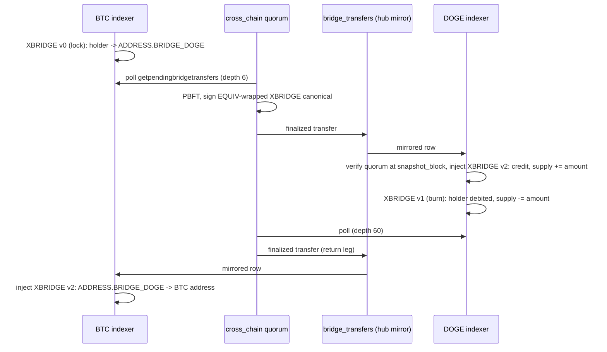

<!-- SPDX-License-Identifier: AGPL-3.0-or-later -->
<!-- Copyright © 2025–2026 Dankest, LLC -->

# XChain Platform: Cross-Chain Bridge

This document describes how XCHAIN, the platform's own fee token, moves between the chains
XChain runs on. XCHAIN is issued, minted, capped and priced on **BTC only**: one supply means
one price, and it keeps a Dogecoin XCHAIN, a Litecoin XCHAIN and a Bitcoin XCHAIN from drifting
apart. The bridge gives every other chain a **shadow balance** of that one supply, provably
backed one for one in a protocol-owned escrow on BTC, redeemable by anyone. See
[`XBRIDGE`](./actions/xbridge.md) for the wire action and [Token Bridge](./token-bridge.md) for
the general framework this same mechanism extends to any issuer's token.

## The problem

The fee role already works everywhere: every chain can pay gas in native coin at the oracle
rate. Two roles do not:

- **Base pair.** On BTC a new token lists against XCHAIN and the DEX fills it, fire and forget.
  On DOGE and LTC there is no XCHAIN balance to list against, so a seller's only same-chain
  option is native coin, which cannot be escrowed and needs a `COINPAY` leg.
- **Distribution.** A genesis-style allocation to BTC addresses is easy. Holders on another
  chain have nowhere to land it: there is no XCHAIN on that chain's ledger.

## The model: lock and mint, burn and release

A unit on DOGE that is provably one unit held in a BTC escrow address, and that anyone can burn
to get the BTC unit back, is the same asset in a second place. Arbitrage through the bridge
holds the two venues within the round-trip cost (two fees plus the confirmation delay each way),
exactly as the same coin on two exchanges is held together; a persistent price gap is free money
and closes on its own.

1. **Lock (BTC).** A holder broadcasts [`XBRIDGE`](./actions/xbridge.md) version `0` on BTC
   naming a destination chain and address. The indexer moves the amount from the holder's
   balance to that chain's escrow address on BTC, an ordinary protocol address nobody holds a
   key for.
2. **Attest.** After the source chain's confirmation depth (BTC 6 / LTC 12 / DOGE 60 by
   default), the hub federation's `cross_chain` quorum signs a transfer record and writes it to
   `bridge_transfers`, streamed to every indexer over the existing hub-DB mirror, the same
   channel `cross_chain_matches` and `capability_snapshots` already ride. No per-transfer
   on-chain transaction.
3. **Mint (destination).** The destination indexer applies the record at the first block whose
   protocol time is at or past the record's `effective_time`, verifies the quorum against the
   mirrored capability snapshot at the record's `snapshot_block`, and injects `XBRIDGE` version
   `2`: credit the destination address, raise that chain's XCHAIN supply by the amount.
4. **Burn (destination) and release (BTC).** The reverse: `XBRIDGE` version `1` on DOGE or LTC
   debits the holder and lowers that chain's supply; the federation attests after that chain's
   own depth; the BTC indexer injects `XBRIDGE` version `2` that moves the amount from the
   escrow address to the named BTC address.
5. **Retract.** If the source action is rolled back by a reorg before the transfer is applied,
   the federation retracts the record (mirror deletion) and it is never applied. A leg that was
   already applied on the other chain is **not** unwound; the platform has no such path and the
   cross-chain DEX ships with the same residual (see [Reorgs and finality](#reorgs-and-finality)).

## The supply invariant

For every foreign chain C: `balance_BTC(ADDRESS.BRIDGE_C, XCHAIN) >= supply_C(XCHAIN)`, modulo
in-flight transfers, and equality is the expected state. The inequality is deliberate: nothing
on the platform refuses a plain credit to a protocol role address, so an ordinary `SEND`, an
`ORDER` fill, a `DISPENSER` or an `AIRDROP` on BTC can land XCHAIN on the escrow with no transfer
record behind it. That is a **surplus**: the sender's own loss, the same as a send to a burn
address, and no other holder is unbacked by it. A **deficit** (`supply_C` exceeds the escrow) is
the only direction where someone else's units have nothing behind them, and is either a forgery
or a reorg (see [Reorgs and finality](#reorgs-and-finality)).

`getbridgeinvariant` (below) reports the signed delta per chain: positive is a surplus (WARN),
negative a deficit (CRIT). A transfer counts as **in flight** from the block its source leg
(lock or burn) applies until the block its destination leg (mint or release) applies, which
includes the confirmation wait and the attestation round.

The `MAX_SUPPLY` cap binds on BTC only: the BTC token row's supply is every unit ever minted,
circulating plus escrowed, and a foreign chain's supply is a shadow of its escrow, never counted
against the cap. Nothing off BTC can raise supply except an `XBRIDGE` v2 credit, and nothing off
BTC can lower it except `XBRIDGE` v1: a broadcast `ISSUE` of XCHAIN off BTC is refused
unconditionally, and so is a `DESTROY` of it, both closures explained under
[`XBRIDGE`](./actions/xbridge.md#rules).

## Trust model

Today the cross-chain DEX's mirror can delay a settlement but cannot forge one, because both
legs of a match are pre-escrowed on chain before the mirror ever gets involved. A bridge is
different: a forged transfer record mints on the destination with nothing held on the source.
Off BTC, the validator set itself is pulled from the hub's own mirror
(`capability_snapshots`, applied with `INSERT IGNORE`), which is the same authority that verifies
the transfer record. So in **milestone 1** a compromised hub can supply both the record and the
roster that verifies it, and every destination indexer mints: milestone 1 is a **hub-trusted
mint**. That is defensible on testnet if stated, and it is stated here and in the testnet
announcement.

Closing that trust boundary is a stated follow-on, gating mainnet: the destination indexer checks
the lock against the quorum-signed BTC state checkpoint that [`ANCHOR`](./actions/anchor.md)
version `0` carries, so a mint needs a signed transfer record **and** a BTC ledger that agrees.
That reduces the assumption to "the `cross_chain` quorum and the checkpoint quorum both lied,"
the same assumption every validator action on the platform already rests on. Nothing arms on
mainnet before that check lands and is proven.

## Reorgs and finality

A lock or burn reorged out of the source chain before the federation signs it never produces a
transfer record. A finalized record whose source is reorged out before it applies is retracted
(fenced, co-signed) and the destination never applies it. **Once a mint or release has applied,
it stays applied**: the destination chain did not itself reorg, so there is nothing on it to roll
back, and there is no forward "un-mint" path on the platform. Milestone 1 ships no destination-
side unwind: an applied mint is final, the confirmation depth (BTC 6 / LTC 12 / DOGE 60 by
default, raise-only per token) is the attacker's price for forcing that outcome, and the checkpoint
cross-check above (before mainnet) is the defence beyond it.

## The XCHAIN token off BTC

The token row on a foreign chain is created lazily, by the first `XBRIDGE` v2 credit on that
chain, with parameters byte-identical to the BTC genesis row (`MAX_SUPPLY` 100,000,000,
`DECIMALS` 8, mint disabled). No chain but BTC ever gains a genesis pass or a genesis credit;
distributing XCHAIN to another chain is an ordinary treasury operation on the bridge's own rails
(mint on BTC, lock to an operator-held address on the destination, `AIRDROP` there), not a
protocol-level concern.

Once the row exists, handlers that resolve XCHAIN unconditionally (guard-gas reservations, fee
mode detection) start seeing it where they previously saw nothing; see
[Gas and Fees](../concepts/gas.md) for the fee side of that boundary.

## Reads

- **`getbridgeinvariant`** (hub, open read): escrow balance, shadow supply, in-flight amount and
  the signed delta, per destination chain.
- **`getpendingbridgetransfers`** and **`getbridgetransfer(transfer_id)`** (indexer, open read):
  confirmed locks and burns awaiting attestation, and any transfer by id. Escrow balances need
  no new read; they are ordinary balances on a role address.

## Watch

The platform's operator watch item carries one entry over the signed delta from
`getbridgeinvariant`: a deficit beyond the in-flight set on any network is CRIT, a surplus is
WARN.

## Activation

`XCHAIN_BRIDGE_ACTIVATION` is a standalone height-keyed module, the same shape as every other
flag day: regtest active from genesis, testnet and mainnet held at the platform's sentinel until
armed. It is keyed `'<COIN>:<network>'`, with the bare network key as the fallback for a chain
that has no slot of its own. The bridge arms on three chains at once and their heights are not
comparable (a BTC testnet tip is around 152,000 while a DOGE testnet tip is around 67,900,000),
so one number per network would be already passed on two chains and out of reach on the third;
each chain therefore gets its own instant, sized at the train that arms it. Roll order is the
**reverse** of the cross-chain DEX precedent: indexers and readers
first, the hub last, because a hub rolled ahead of the fleet stamps a schema version every
mirror closed against an un-upgraded indexer would fail. See
[Flag-Day Values](./flag-days.md) for where the height stands on each network.

---

**Copyright &copy; 2025–2026 Dankest, LLC**

**Based on XChain Platform by Dankest, LLC &ndash; https://dankest.llc**

Licensed under the **GNU Affero General Public License v3.0** (AGPL-3.0-or-later)
with a commercial license available for proprietary use.

You may use, modify, and distribute this material under the terms of the License.
See [LICENSE](../LICENSE.md) and [NOTICE](../NOTICE.md) for full terms.
See the [licensing overview](https://docs.xchain.io/legal/LICENSING.html).
