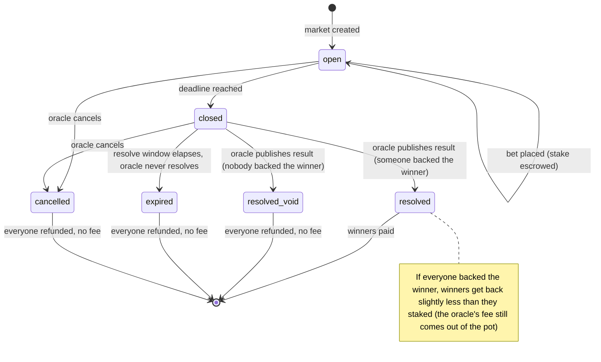

<!-- SPDX-License-Identifier: AGPL-3.0-or-later -->
<!-- Copyright © 2025–2026 Dankest, LLC -->

# Betting on XChain

XChain has a betting system built directly into the protocol. Anyone can open a market on any question, anyone can bet on it with any XChain token, and the protocol holds every wager and pays out the winners automatically. There is no bookmaker, no house, and no company holding the money.

This guide covers both sides: **placing a bet**, and **running a market of your own**.

---

## How Betting Works Here

XChain betting is **parimutuel**, the same system used by racetracks. Everyone's wager goes into a shared pool. When the result is published, the losing wagers are split among the winners in proportion to how much each of them staked.

That has one consequence worth understanding before you bet: **the odds are not fixed when you place your bet.** You are not betting against a bookmaker who quotes you a price. You are betting against everyone else who bets on the same market, including people who bet after you. If a lot of money arrives on your side later, your share of the pot shrinks. If it arrives on the other side, your share grows.

Every market has three moving parts:

- the **outcomes**, a fixed list of possible answers, set when the market is created and never changeable
- the **deadline**, the moment betting closes
- the **oracle**, the person who created the market and who publishes the result

---

## Placing a Bet

### What happens when you bet

You pick a market, pick one of its outcomes, and stake an amount of the market's token.

Your stake is moved into **escrow** immediately. This is not a company freezing your funds; it is a protocol-level hold recorded on-chain. The tokens leave your spendable balance and are accounted for against your bet until the market settles, at which point they either come back as a refund or are consumed as a loss.

**Bets are final.** There is no cancel and no edit. Once your bet is on-chain it stays there until the market resolves, is cancelled by its oracle, or expires. Decide before you sign.

You can bet more than once on the same market, including on different outcomes. Each bet is its own separate wager and is paid out separately.

**A market can fill up.** No market holds more than 10,000 open bets, which caps how much settlement work one block has to do. A very busy market therefore stops accepting wagers before its deadline arrives, and your wallet will report it as full rather than as closed. This is rare; it needs ten thousand separate bets on one question.

### Betting closes at the deadline

Once a block arrives with a timestamp at or past the deadline, the market closes and no further bets are accepted. This is one-way: a later block cannot reopen it, even if that block carries an earlier timestamp.

That last point matters more than it sounds. Block timestamps are not perfectly ordered, so a market that decided "is betting still open?" purely by looking at the clock could be reopened by a miner after the result was effectively known. XChain records the closure permanently the first time any block crosses the deadline, which removes that possibility.

### What you win

If your outcome wins, you receive your share of the pot, in proportion to your stake against everyone else who backed the same outcome.

The pot is everything wagered on the market, minus the oracle's fee. Your payout already includes your original stake, so there is no separate refund of it.

Amounts are always rounded **down** to the token's smallest unit. If you stake a very small amount in a large market, your payout can round down to nothing. Your bet still counts as a win; it just does not pay.

### When everyone is right

If every wager on a market is on the winning outcome, there is nothing to win from anybody else, and the oracle's fee still comes out of the pool. In that case winners get back slightly **less** than they staked.

This is normal parimutuel behaviour, not a fault. It is also why wallets show you a projected payout before you sign, so the result is never a surprise.

### When you get your money back

Your full stake is returned, with no fee taken, in any of these cases:

- **Nobody backed the winning outcome.** The market is voided and everyone is refunded
- **The oracle cancelled the market.** This is the honest exit for an event that was postponed or called off
- **The oracle never resolved it.** Every market has a resolve window after the deadline. If the oracle does not publish a result before that window closes, the protocol refunds everyone automatically. Nobody has to ask for it

Refunds and payouts are unconditional. They still arrive even if the token has since been put to sleep, or your address has since been added to a token's block list. Getting in is gated; getting out never is.

### Two things that will catch you out

- **Sweeping your address does not move your bets.** If you sweep your wallet to a new address after betting, the payout still goes to the address that placed the bet. Sweep first, then bet
- **Staked tokens do not earn dividends.** While your tokens sit in a bet's escrow they are not counted as held, so a dividend paid on that token during your bet will skip them

---

## Running a Market

Anyone can create a market. You do not need permission, a licence from us, or a relationship with anyone.

### Creating one

You set:

- a **question** and a list of **outcomes** (between 2 and 16). Both are permanent
- the **token** wagers are made in. Betting is token-only; you cannot wager the coin itself, and you cannot use a controller-bound token: a token whose `trade` class (or the catch-all `all`) is bound to a contract is rejected when the market is created, because betting it would route around the controller's veto and its royalty legs. See [Controller-Bound Tokens](../protocol/controller-bound-tokens.md)
- your **fee**, from 0% to 10% of the pot
- the **deadline**, when betting closes
- the **resolve window**, how long you have after the deadline to publish the result. The default is 14 days, and you may set anything from 1 hour to 1 year; a market asking for a window outside that range is rejected
- optionally, a **minimum stake**, and **membership lists** to restrict who may bet

You can also attach a full description of the market, so the terms live on-chain with the market itself rather than on a website that might disappear.

**Set the deadline with margin.** Block timestamps can lag real time by up to roughly two hours, so a deadline set right at the start of an event may still be bettable once the outcome is becoming obvious. Close betting well before the event begins.

### What it costs you

Two separate things get called a "fee", and mixing them up is the most common confusion:

- **your fee** is your cut of the pot, as a percentage. Bettors pay it, and you receive it when you resolve the market
- **the market fee** is what the protocol charges you to run the market, priced in XCHAIN

The market fee is priced by **how long the market lives**, counted all the way to the end of the resolve window rather than just to the deadline. **The first 90 days are free**, so short-term markets and anything you create to try the system out cost nothing. Past that:

| Market lives for | Costs to create |
|---|---|
| Up to 90 days | Free |
| 91 days | 0.0055 XCHAIN |
| 120 days | 0.165 XCHAIN |
| 1 year | 1.5125 XCHAIN |
| 2 years (the maximum) | 3.52 XCHAIN |

Those prices are always denominated in XCHAIN, but XCHAIN is not always what pays them. On **Litecoin and Dogecoin, paying in the native coin is the only option**: a market created, or a bet placed, without a native-coin fee output is rejected. On **Bitcoin** you may instead have the fee deducted from an XCHAIN balance, if you hold one and prefer that.

Placing a bet costs the bettor a small fee, priced in XCHAIN and paid the same way as above. **Resolving is free**, no matter how many bets are on the book, so a busy market never costs you more to settle honestly. **Cancelling is free** too.

Markets cannot be edited. If you get the terms wrong, cancel and create a new one, which means paying the creation fee again.

### Publishing the result

After the deadline, you publish the winning outcome. The protocol immediately works out every payout, takes your fee, and credits everyone. You do not distribute anything by hand.

You cannot resolve early. The deadline is both the moment betting closes and the earliest moment you may publish a result.

If the event was cancelled, postponed, or is otherwise unanswerable, **cancel the market** instead. Everyone is refunded in full and you collect nothing. This is the right thing to do, and it is visible on your record as a cancellation rather than an abandonment.

If you do nothing, the market expires at the end of the resolve window and everyone is refunded automatically. That is a worse outcome for your reputation than cancelling, because it looks the same as walking away.

### You cannot bet on your own market

Betting on your own market from the market's own address is rejected outright. You decide the result, and an unresolved market refunds everyone in full, so an oracle who could also bet would hold a free option to un-bet by simply walking away.

Be aware that the protocol can only enforce this for the market's own address. Betting from a second address you control is not something the chain can detect, but it is visible to anyone watching funding patterns, and it is the fastest way to destroy the only thing an oracle actually has.

### Your reputation is the whole system

There is no bonding, staking, or slashing of oracles. Nobody is holding a deposit that gets taken away if you report dishonestly. Both the explorer and the wallet show each oracle's history: markets resolved, voided, cancelled, and expired, and the fees that address has earned from settling. That history is the entire accountability mechanism.

It is also **per-address, and addresses are free**. A dishonest oracle can start again from a new address at any time. So an empty history means *unknown*, not *safe*, and bettors should read it that way.

---

## Before You Bet on Someone Else's Market

- **The oracle is trusted to report honestly.** The protocol guarantees the escrow and the arithmetic are correct. It cannot guarantee the reported result is true. This is unavoidable in any oracle design
- **Read the oracle's history** before you stake anything, and treat a blank one as unknown. In the wallet, tap the address next to "Run by" on the market page; on the explorer it is the oracle page. Both show how many markets that address has settled, cancelled, or left to expire, and what it has earned in fees. The number to look at hardest is markets left to expire: everyone got refunded, but the oracle took their money out of play and decided nothing
- **Read the market's terms**, including how it says it will be settled. Anything linked from a market is informational only; the protocol never reads it
- **Whoever holds the creator's key chooses the result and receives the fee.** The oracle role cannot be transferred or rotated, so a compromised key means a compromised market

---

## Where To Go Next

- [Trading](./trading.md) covers the decentralized exchange, which is where you would acquire the tokens a market is wagered in
- [Creating Tokens](./creating-tokens.md) covers making a token of your own, including one to run markets in
- The protocol reference for developers is [`BET`](../protocol/actions/bet.md)

---

**Copyright &copy; 2025–2026 Dankest, LLC**

**Based on XChain Platform by Dankest, LLC &ndash; https://dankest.llc**

Licensed under the **GNU Affero General Public License v3.0** (AGPL-3.0-or-later)
with a commercial license available for proprietary use.

You may use, modify, and distribute this material under the terms of the License.
See [LICENSE](../LICENSE.md) and [NOTICE](../NOTICE.md) for full terms.
See the [licensing overview](https://docs.xchain.io/legal/LICENSING.html).
