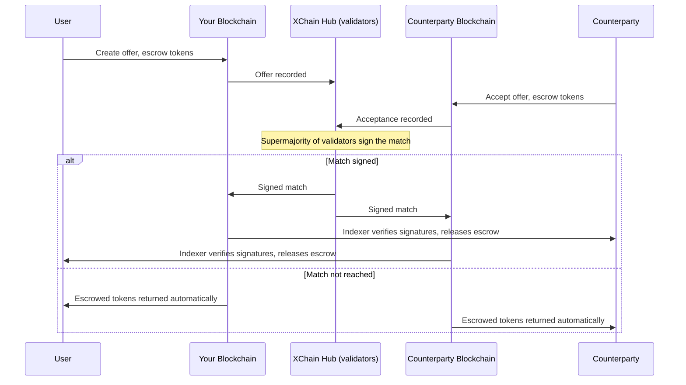
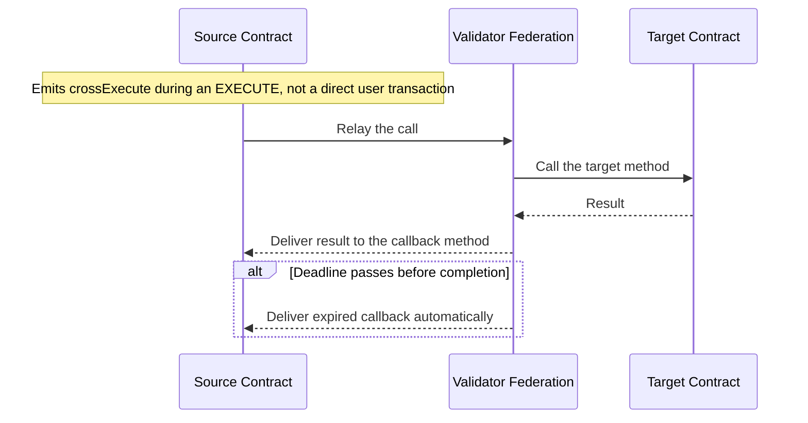

<!-- SPDX-License-Identifier: AGPL-3.0-or-later -->
<!-- Copyright © 2025–2026 Dankest, LLC -->

# Cross-Chain Trading on XChain

XChain runs on every supported chain simultaneously, today Bitcoin, Litecoin, and Dogecoin; but these are separate blockchains. A token created on Bitcoin exists on Bitcoin. A token created on Litecoin exists on Litecoin. Normally, trading between them would require a bridge, a centralized exchange, or a complex multi-step process involving trust in a third party.

XChain solves this with **SWAP**; a cross-chain exchange that lets you trade tokens on one blockchain for tokens on another, without any intermediary holding your assets. To move a token you already hold onto another chain without trading it, XChain also has a native bridge, covered in [Moving a Token to Another Chain](#moving-a-token-to-another-chain-xbridge).

---

## The Problem

Imagine you hold a token on Bitcoin and want to trade it for a token on Litecoin. On a centralized exchange, you would deposit your Bitcoin token, trust the exchange to hold it, find a counterparty, execute the trade, and then withdraw your Litecoin token. At every step, you are trusting the exchange not to lose your funds, freeze your account, or disappear.

With cross-chain bridges, you lock your asset on one chain and mint a representative version on another. The security of your asset depends entirely on the bridge's security; a single point of failure that has been exploited for billions of dollars across the industry. XChain's own bridge uses the same lock-and-mint shape, so its section below states exactly what it trusts.

XChain offers a different path.

---

## The Solution: Escrowed Cross-Chain Swaps

A SWAP on XChain never hands your asset to a counterparty on trust. Your tokens sit in protocol-level escrow on your own blockchain, and they are released only against a match that a supermajority of hub validators has signed. If no match is signed before your deadline, the escrow returns to you automatically.

Think of it like a currency exchange booth, but automated and trustless. You put your tokens in your side of a locked box. The other person puts their tokens in their side of a locked box. Neither box opens until the validators agree the trade is real; if they never agree, both boxes open back to their owners.

What XChain does *not* have is a single settlement step spanning two blockchains. Two chains cannot commit together, so each chain's indexer settles its own leg independently once it sees the signed match. In the normal case both legs settle within a few blocks of each other. See [Safety](#safety) below for the residual risk that follows from this and how the protocol bounds it.

---

## How It Works

Cross-chain swaps on XChain follow a straightforward flow:

1. **You create an offer.** You specify what token you are offering (on your chain), what token you want in return (on the other chain), and the quantities. This offer is recorded on your blockchain.

2. **Someone accepts.** A counterparty on the other chain sees your offer and agrees to the terms. They record their acceptance on their blockchain.

3. **The match settles on each chain.** The hub records a match signed by a supermajority of validators, and only after each side's escrow has reached that chain's required confirmation depth. Each chain's indexer then independently checks those signatures before releasing the escrowed tokens to the counterparty, less any royalty or fee split the counterparty's listing carries (see [Available Pairs](#available-pairs)), so the two legs settle separately rather than in one step. If no match is signed, both sides get their tokens back automatically at the deadline.

At no point does a company, server, or third party hold your tokens. Your assets remain under protocol-level escrow on your own blockchain until the swap finalizes.

---

## The Role of the Hub

The XChain Hub coordinates cross-chain swaps; it acts as the communication layer that lets the Bitcoin and Litecoin sides of a trade find each other and confirm completion. Importantly, the hub never holds your tokens. It is a coordination service, not a custody service.

The hub is a decentralized validator network; coordination is performed by PBFT consensus across multiple validators rather than a central server. There is no single point of control or single point of failure.

---

## Safety

Cross-chain swaps are designed to be safe by construction:

- **Escrowed on your chain.** Your tokens are locked on your blockchain; they never move to another chain or to a third party.
- **Time-bounded.** Every swap has a deadline. If the counterparty does not complete their side in time, the swap fails and your tokens are returned to you automatically.
- **No release without a signed match.** Your escrow is released only against a match that a supermajority of hub validators has independently verified and signed. A single validator, or the hub operator, cannot move it.
- **Confirmation floors before matching.** Validators will not sign a match until both escrows are buried under that chain's required number of confirmations (deeper on faster chains: currently 6 on Bitcoin, 12 on Litecoin, 60 on Dogecoin).

### Residual risk

Because the two chains settle their legs independently, there is one edge case the protocol bounds rather than eliminates. If one chain undergoes a reorganization deeper than its confirmation floor *after* the other chain has already settled its leg, that leg can be undone while the counter-leg stands, leaving one party paid and the other not. The confirmation floors above exist to make a reorg that deep implausible, and a swap that never gets matched always refunds. This is not the same guarantee as a single-chain atomic trade, where both sides of the exchange commit in one transaction and no such window exists.

---

## Available Pairs

Any token that exists on one supported chain can potentially be swapped for any token on another supported chain, as long as there is a willing counterparty. Today that means trades between Bitcoin, Litecoin, and Dogecoin tokens.

There is one exception for now. A token bound to a controller contract that takes a cut of each sale (a royalty or fee split) cannot be listed cross-chain: the proceeds settle on the counterparty's chain, which does not run the contract, so the cut could not be collected there. Rather than let the sale go through and quietly drop the cut, the protocol refuses the listing when it is created, with the error `invalid: royalty not enforceable cross-chain`. Tokens with no such binding are unaffected, and so are same-chain sales of a bound token. The restriction lifts on mainnet at the `CROSS_CHAIN_ROYALTY` flag day, whose date is listed in [Flag Days](../protocol/flag-days.md), and is already lifted on testnet and regtest. See [Cross-chain sales](../protocol/controller-bound-tokens.md#cross-chain-sales-cross_chain_royalty) and [Flag Days](../protocol/flag-days.md).

As XChain adds support for more Bitcoin-compatible blockchains, the number of available cross-chain trading pairs grows automatically. Every new chain that joins the platform opens up swap routes with every existing chain.

---

## Cross-Chain Orders

SWAP is not the only way to trade across chains. XChain also supports cross-chain **limit orders**; an order book where your offer can be matched and filled partially over time, rather than all at once.

- **SWAP**: an exact, one-shot trade: you offer a fixed quantity and it either fills completely or not at all.
- **ORDER**: a price book entry: you set a rate, and the protocol fills it against counterparties in pieces as they appear, until your full amount is traded.

Use SWAP when you want a precise exchange with a single counterparty. Use a cross-chain ORDER when you want your offer to fill gradually at your target price.

## When to Use a Swap vs. the Order Book

The DEX order book is best when you are trading two tokens that both exist on the same blockchain. Swaps are for when the tokens you want to exchange live on different blockchains.

You can combine both: use the order book to trade on a single chain, and use SWAP or cross-chain ORDER when you need to move value across chains. To move a token you hold to another chain without trading it for anything, use the bridge below.

---

## Moving a Token to Another Chain (XBRIDGE)

SWAP and ORDER exchange one token for a different token with a counterparty. The bridge does something else: it moves a token you already hold to another chain, as the same asset, with no counterparty and no trade.

**How it works.** You lock the token on the chain it was issued on, in a protocol-owned escrow address that nobody holds a key for. Once the lock has the source chain's required confirmations (by default 6 on Bitcoin, 12 on Litecoin and 60 on Dogecoin), the hub's validator federation signs a record of the transfer, and the destination chain credits the same amount to the address you named. To come back, you burn the copy on the destination chain, and after that chain's confirmations the same amount is released from the escrow to the address you name on the origin chain. Every unit is either held in the escrow or circulating as exactly one copy, so the supply never doubles.

In the wallet, **Move across chains** performs the move, and **Bridge settings** is where an issuer opts a token in.

**What is live today.** Only XCHAIN can be bridged, between Bitcoin and Litecoin or Dogecoin, and only on testnet and regtest. The bridge is not active on mainnet. Bridging other tokens through the issuer opt-in is built but not yet switched on for testnet or mainnet. [Flag-Day Values](../protocol/flag-days.md) lists where each activation stands.

**What it trusts.** The credit on the destination chain relies on the hub's validator federation: a compromised hub could supply both the transfer record and the validator roster that checks it, so this is a hub-trusted mint, not a trustless one. The bridge stays off on mainnet until each credit must also agree with a validator-signed checkpoint of the Bitcoin ledger.

**Finality.** Once a credit has been applied on the destination chain, it cannot be undone or redirected. A lock reversed by a reorg before its credit is applied is withdrawn and never applied; the confirmation depth is what makes a deeper reorg expensive.

See [Token Bridge](../concepts/token-bridge.md) for the general model and the issuer opt-in, [Cross-Chain Bridge](../protocol/xchain-bridge.md) for XCHAIN's own bridge and its trust model, and [XBRIDGE](../protocol/actions/xbridge.md) for the action itself.

---

## Contract-to-Contract Cross-Chain Calls (XCALL)

SWAP and ORDER are about trading tokens across chains. XCALL is a different mechanism for a different purpose: it lets a smart contract on one chain call a method on a contract deployed on another chain, then receive the result back through a callback.

Where SWAP moves value between users, XCALL moves logic between contracts. A contract on Bitcoin can trigger an action on a Litecoin contract and act on the outcome, all within the same application flow.

**How it works:**

1. A contract on the source chain calls `xchain.emit.crossExecute(...)` from inside its code. This is not a transaction a user submits directly; it is emitted by the VM during an EXECUTE.
2. The validator federation relays the call to the target chain, where the specified method runs on the target contract.
3. The result is relayed back and delivered to the callback method on the source contract.
4. If the call does not complete before the deadline, the source contract receives an `expired` callback automatically.

**When to use XCALL instead of SWAP:**

- Your contracts need to share state or coordinate logic across chains (not just exchange tokens between users).
- You want one chain's contract to trigger another chain's contract as part of a multi-chain application.
- You are building cross-chain automation, oracles, or governance where the outcome of a call on one chain drives behavior on another.

XCALL is a system-level mechanism used by contract authors, not an action end users submit directly. The DEX (SWAP and ORDER) remains the right tool for cross-chain token trading between addresses, and the bridge for moving your own tokens between chains.

---

*See also: [Trading](./trading.md) | [Betting](./betting.md) | [Use Cases](./use-cases.md) | [FAQ](./faq.md)*

---

**Copyright &copy; 2025–2026 Dankest, LLC**

**Based on XChain Platform by Dankest, LLC &ndash; https://dankest.llc**

Licensed under the **GNU Affero General Public License v3.0** (AGPL-3.0-or-later)
with a commercial license available for proprietary use.

You may use, modify, and distribute this material under the terms of the License.
See [LICENSE](../LICENSE.md) and [NOTICE](../NOTICE.md) for full terms.
See the [licensing overview](https://docs.xchain.io/legal/LICENSING.html).
