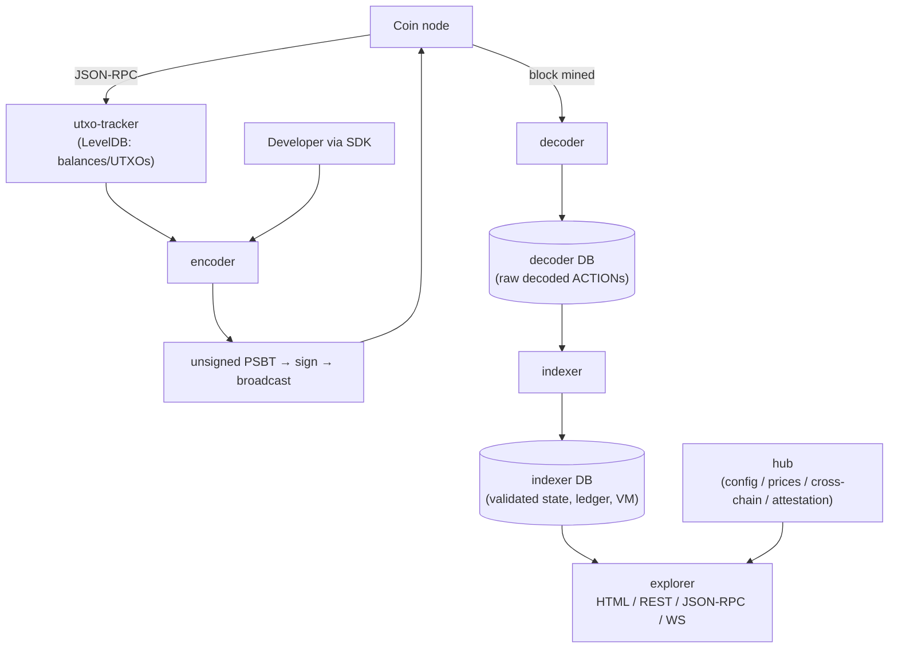
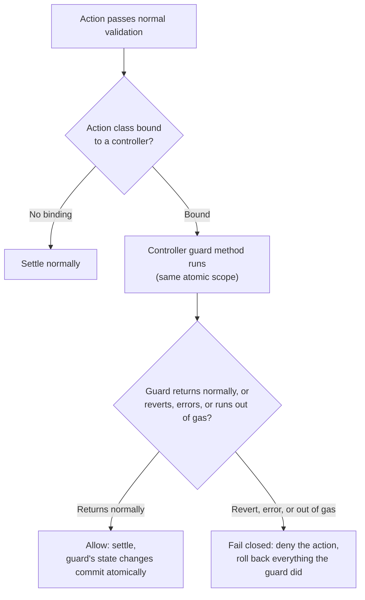
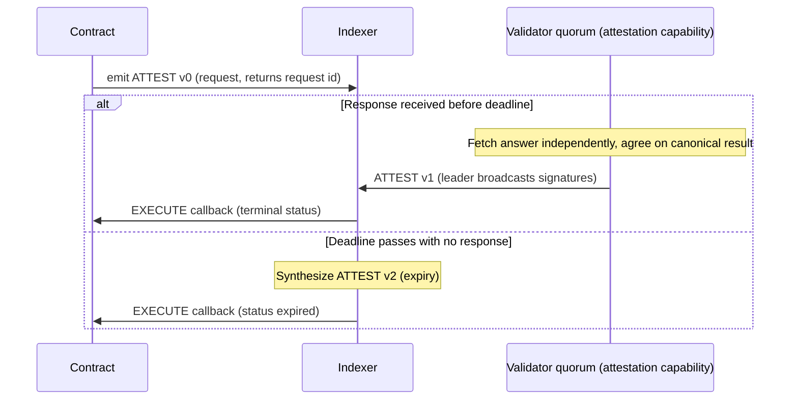
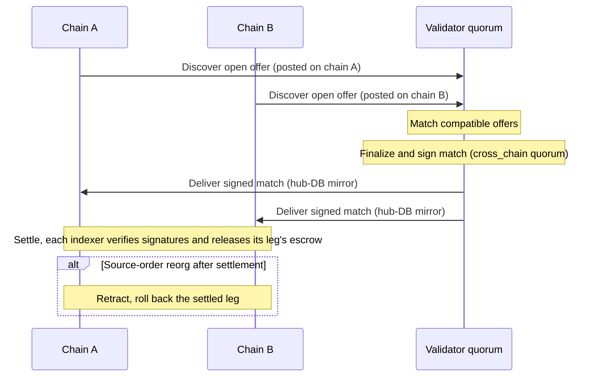
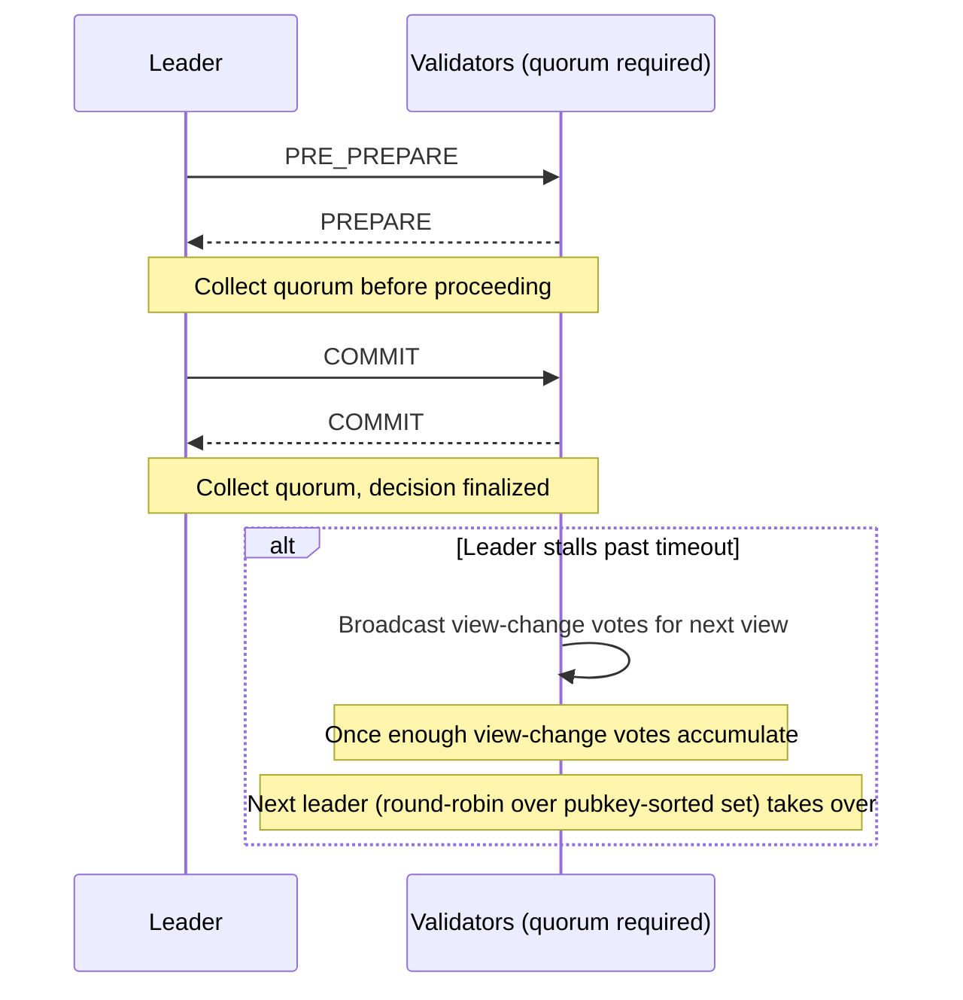

<!-- SPDX-License-Identifier: AGPL-3.0-or-later -->
<!-- Copyright (c) 2025-2026 Dankest, LLC -->

# XChain Platform White Paper

**A Chain-Agnostic Token, Exchange, and Smart-Contract Metalayer**

**Authors:** Jeremy Johnson & Javier Varona Zavatti, Co-Founders, Dankest, LLC · **Version 1.3**

**Date:** 2026-08-15

> **What is final and what is not.** The protocol described here (the wire format, the ledger rules, the ACTION set, the VM, the validator network) is implemented and running. Two things are deliberately **not final and remain pre-launch**: the **gas schedule and `GAS_PRICE`** (§13.1, Appendix A), and the **initial XCHAIN distribution**, meaning the holder airdrop, the open-mint terms, and the allocation table (§13.2, §13.3, Appendix B). Both are consensus-critical, both are shown here at their current values so the model is legible, and both are finalized before the mainnet distribution runs; until then they may change. Features marked *(pre-launch)* are specified and implemented but not yet switched on for mainnet, where they activate at a coordinated flag-day; the current values are listed on [Flag-Day Values](./protocol/flag-days.md), generated from the indexer's activation registry rather than restated here.

---

## Abstract

XChain is a token-and-settlement **metalayer** for UTXO blockchains. It embeds a complete digital-asset protocol (tokens, a native decentralized exchange, trustless cross-chain swaps, on-chain data and messaging, and a deterministic smart-contract virtual machine) inside ordinary transactions on an unmodified base chain, so that every asset and every state transition is secured directly by the host chain's existing proof-of-work consensus. There are no sidechains, no bridges, and no new consensus layer to trust.

The protocol is chain-agnostic by construction. It is deployed and running on the **Bitcoin, Litecoin, and Dogecoin** testnets, with mainnet launch pending; adding any further UTXO chain is a configuration change rather than a protocol change, and the platform is designed to extend toward a broad set of blockchains over time. The same protocol, the same ACTION set, and the same tooling operate identically across every supported chain.

XChain advances the metalayer approach on four fronts. First, a **smart-contract VM** that runs on Bitcoin-class chains by *orchestrating* the protocol's validated actions rather than mutating ledger state directly, giving general-purpose programmability while keeping a small, fixed, auditable state-transition surface. Second, an **attestation framework** that lets contracts ask the outside world a question (an HTTPS fetch, or a prompt to an approved AI model) and receive a validator-verified answer back on-chain, deterministically; the same rails extend outward, letting web services charge AI agents for access and letting agents query and pay on the platform natively (§8.5). Third, **native multi-chain operation** with trustless cross-chain swaps and cross-chain contract calls coordinated by a stake-weighted Byzantine-fault-tolerant validator network that never takes custody. Fourth, a **programmable policy layer**: a token or an account may bind a contract whose guard the settlement layer itself consults before a transfer, trade, mint, burn, or ownership change settles, which makes rules such as royalties, compliance gates, and spending controls unavoidable rather than dependent on marketplace goodwill (§7.8).

This paper specifies the protocol in full: the encoding and wire format, the double-entry ledger and state model, the complete ACTION set, the virtual machine and its gas-metering and determinism guarantees, the programmable policy layer, the attestation framework and its agent-facing extensions, the cross-chain settlement and call mechanisms, the validator network and its consensus, the staking systems, the security model, and the economics.

---

## 1. Introduction

### 1.1 What XChain is

A blockchain like Bitcoin maintains one thing extremely well: a decentralized, tamper-proof, proof-of-work-secured ledger of transactions. It does not natively provide tokens, an exchange, programmable contracts, or structured data. The dominant industry response has been to move value *off* the most secure chains, onto sidechains, bridges, and separate Layer-1s with their own validator sets and their own trust assumptions. That migration is also where the largest losses occur; cross-chain bridges remain among the most exploited constructs in the entire ecosystem.

XChain takes the opposite path. It is a **metalayer**: a protocol layered *above* an unmodified base blockchain that uses the base chain purely as a data-availability and ordering substrate. Protocol commands are encoded into the data of ordinary transactions. Software running the XChain protocol reads those transactions, applies a fixed set of deterministic rules, and derives its own state: token balances, order books, contract storage. The base chain is never modified, never forked, and never asked to understand the protocol. An XChain token on Bitcoin literally exists inside a Bitcoin transaction and is secured by exactly the consensus that secures every other Bitcoin transaction.

### 1.2 Design principles

Three commitments run through every layer of the system.

**Inherited security.** XChain introduces no new chain, no new consensus for transaction ordering, and no bridge. Finality, ordering, and double-spend resistance come entirely from the host chain. The validator network described in §10 exists only for configuration, price data, cross-chain coordination, and attestation, never for ordering or settling token state.

**Determinism.** Every node that processes the same base-chain data computes byte-identical state. There is no randomness, no wall-clock-dependent branching, and no un-replayable external input anywhere in state processing. This is the property that makes the system independently verifiable: anyone can run the software, replay the chain from genesis, and confirm every balance for themselves.

**Constraint over generality.** Every state change, including every change produced by a smart contract, flows through one fixed, audited set of ACTION handlers. The protocol's state-transition surface is finite and known. This is a deliberate trade: XChain is not a general-purpose world computer, and in exchange it offers a small attack surface and uniform, auditable state.

### 1.3 Scope and non-goals

XChain is a token-and-settlement layer. Its exclusions are deliberate design choices, each preserving a core guarantee:

- **No confidentiality.** All state is public. The obfuscation applied to payloads (§4.2) is not encryption; its key derives from public transaction data. Public, replayable state is what makes independent verification possible.
- **Block-speed, not real-time.** Confirmation, order matching, and cross-chain settlement proceed at the cadence of blocks. There are no payment channels or rollups; the protocol is unsuited to point-of-sale or high-frequency trading.
- **Not an EVM-style world computer.** Contracts orchestrate validated ACTIONs; they cannot mutate the ledger directly. Same-chain contract calls (`emit.execute`) and cross-chain calls (XCALL) are supported, but a contract cannot observe its own emissions mid-execution (§7).
- **UTXO chains.** XChain runs on Bitcoin-compatible (UTXO) chains. Interoperation with account-model ecosystems (Ethereum, Solana) is a longer-term research direction (§16), not a current capability; there are no wrapped external assets.

Honest current boundaries: full trustless verification still requires running a node or trusting a snapshot, because the light client's root of trust is the validator federation, not host-chain proof-of-work. That light-client path is now implemented: the SDK verifies balance and action inclusion proofs locally against quorum-signed, optionally DOGE-anchored checkpoints (§14), and the reference wallet is its first consumer. It is active on testnet and regtest but gated off on mainnet pending a flag-day; escrow (locked-balance) and contract-state proofs are implemented behind the same gate and activate with it. A token's security tracks its host chain's security (use higher confirmation thresholds on lower-hashpower chains); and rich token metadata lives off-chain by reference (§5.3).

### 1.4 What you can build

The mechanism chapters that follow are organized by subsystem; this list is organized by outcome. Everything below is protocol-native, with no marketplace contract, key server, or off-chain operator required:

- **Tokens and fair launches.** Fixed-supply currencies, permissionless public mints with per-address caps and time windows, and time-bounded instruments (bonds, redemptions) via issuer callback terms (§5.3, §6.1).
- **Collectibles and editions.** 1-of-1s and bounded editions with consensus-guaranteed supply, collections whose membership the chain itself proves, and owner-signed content attachments of any type (§5.3).
- **Enforced royalties and compliance.** Bind a guard contract to a token and its rules apply at settlement, on every venue, because there is no other settlement path (§7.8).
- **Markets.** On-chain limit orders, token-for-token swaps, vending-machine dispensers with fiat-denominated pricing, native-coin settlement, and cross-chain trades with no bridge (§6.3, §9).
- **Prediction markets.** Parimutuel betting on any outcome, wagered in any token, escrowed and paid out by consensus (§6.9).
- **Token-holder governance.** Weighted polls (including quadratic and time-weighted modes) whose results can bind a contract to execute the outcome (§6.10).
- **Programmable applications.** Deterministic JavaScript contracts orchestrating all of the above; the open template library includes collateralized vaults, auctions, bonded escrow, and oracle-settled binary markets (§7).
- **AI-reachable, AI-payable services.** Contracts that ask an approved AI model or fetch a URL through validator consensus (§8), and web services that charge AI agents per request over an HTTP 402 flow settled on-chain (§8.5).
- **Media, messaging, and gated content.** Encrypted messaging, on-chain files, and token-gated content packs that unlock for holders and follow the token on every transfer (§6.7, §15).
- **Bonded services.** Contract-targeted staking in any token, with programmatic slashing, for security deposits, reputation, and validator-style services (§11.2).

---

## 2. The Metalayer Model

### 2.1 Embedding a protocol in transactions

Each XChain operation is expressed as a compact, pipe-delimited **ACTION string** (for example `ISSUE|0|MYTOKEN|1000000|...`). Before broadcast, the string is lightly obfuscated and embedded in a standard transaction using one of five encoding formats, chosen by payload size and cost (§4). To the base chain these are ordinary transactions; to XChain software they are protocol commands.

A node running the protocol observes each new block, extracts and de-obfuscates any embedded ACTION strings, validates them against the protocol rules, and applies their effects to its derived state. Because the inputs (the block data) and the rules (the protocol) are both fixed and public, the derived state is reproducible by anyone.

### 2.2 Chain-agnostic by construction

Nothing in the metalayer technique is specific to Bitcoin. Any chain whose transactions can carry arbitrary data and whose history is ordered and reorg-bounded can host the protocol. XChain is therefore **chain-agnostic**: Bitcoin, Litecoin, and Dogecoin are the first three supported chains, not the definition of the platform.

In the current UTXO-based implementation, **adding a new chain is a configuration operation, not a code change**: a new chain descriptor wires the existing decoder, indexer, encoder, and tracker to a new coin node. The supported set is expected to grow across the UTXO family over time; account-model chains are addressed as a roadmap item in §16. Each chain maintains an entirely independent ledger (§9.1); a ticker on one chain is a distinct asset from the same ticker on another.

---

## 3. System Architecture

### 3.1 Components

XChain is a pipeline of independent services, each runnable separately and most instantiated once per chain/network combination. All services are implemented in Node.js and require **Node.js 22** exactly (Node 18 fails with `ERR_REQUIRE_ESM`; Node 24 cannot build the `isolated-vm` native module the VM depends on). Relational state uses MariaDB (raw parameterized SQL, no ORM); UTXO indexing uses LevelDB.

| Service | Role | Store |
|---|---|---|
| **utxo-tracker** | Indexes every transaction output from a coin node; serves address balances and spendable UTXOs | LevelDB |
| **encoder** | Stateless; turns an ACTION string plus UTXOs plus pubkey into an unsigned PSBT | none |
| **decoder** | Polls a coin node, extracts and de-obfuscates XChain transactions from blocks, writes raw decoded data | MariaDB (decoder DB) |
| **indexer** | Reads the decoder DB, validates and applies ACTION logic, runs the VM, maintains the ledger | MariaDB (indexer DB) |
| **explorer** | Stateless REST plus JSON-RPC plus WebSocket plus web UI over the indexer DB | none |
| **hub** | Decentralized config oracle, price oracle, cross-chain coordinator, attestation engine, governance | MariaDB (hub DB) |
| **sync** | Replicates the decoder and indexer DBs to validators via REST snapshots and WebSocket streaming | none |
| **node** | Docker-based installer/manager for the whole stack | none |
| **vm** | The contract engine; a library embedded inside the indexer | none |
| **sdk / wallet / regtest-miner / e2e-test** | Developer SDK, reference client, regtest automation, integration tests | none |

The hub runs as a single shared instance across all chains; the core pipeline services run per chain/network. (Sync replicates the indexer DB and most of the decoder DB; the transparency-log and mempool tables are excluded by design.)

### 3.2 The data pipeline



The pipeline is strictly unidirectional: raw data enters at the decoder, is promoted to validated state by the indexer, and is served read-only by the explorer.

### 3.3 The decoder/indexer split

The separation of *extraction* (decoder) from *interpretation* (indexer) is deliberate and yields three properties the protocol depends on:

- **Replay.** The indexer DB is a pure function of the decoder DB. Destroy it and re-run the indexer against the same decoder DB and you obtain bit-for-bit identical state.
- **Independent verification.** Multiple indexers reading the same decoder DB converge to identical state, including identical per-block integrity hashes (§5.5).
- **Auditability.** Any balance traces through ledger entries to an exact block and action; the decoder DB itself is reproducible from the raw chain, so the entire indexer state is ultimately derivable from the blockchain alone.

---

## 4. Encoding and the Wire Format

### 4.1 ACTION string format and versioning

Every operation is a pipe-delimited string whose first field is the ACTION name and second field is an integer `VERSION`:

```
ACTION|VERSION|PARAM1|PARAM2|...
```

`VERSION` determines how the remaining fields are parsed, so a single ACTION name can serve multiple shapes over time. New versions add capability without invalidating old encodings. Multiple commands can be combined in one transaction with the `BATCH` action, which separates sub-commands by semicolons.

Tickers (`TICK`) are 1-250 characters and case-sensitive; `BTC`, `LTC`, `DOGE`, and `XCHAIN` are reserved. Memos are limited to 250 characters and may not contain `|` or `;`. The decoder canonicalizes a handful of legacy action aliases (`TRANSFER` to `SEND`, `ADDR` to `ADDRESS`, `DROP` to `AIRDROP`, `CAST` to `BROADCAST`, `MSG` to `MESSAGE`).

> Pre-launch, not final: an ACTION's field layout for a given VERSION may be edited in place for additive changes without incrementing the version. After protocol freeze, any wire-format change requires a new VERSION.

### 4.2 The obfuscation layer

Before embedding, the protocol prepends a 4-byte magic prefix `XCHN` to the ACTION string and applies **AES-128-CTR**. The key material derives from the spending transaction's first input txid: the txid is reversed from little-endian to big-endian, then the leading hex forms the key and the following hex forms the IV. Because that txid is fully public once the transaction is broadcast, this is **obfuscation, not encryption**: anyone who knows the algorithm can reverse it. Its purpose is to prevent naive keyword scanning of the chain and accidental misinterpretation of unrelated data, not to provide confidentiality. For the OP_RETURN and bare-multisig formats the `XCHN` prefix sits on the payload itself; the two-transaction formats instead carry a separate marker output (`XCHNp2sh` / `XCHNp2wsh`). A decoder recognizes an XChain transaction by de-obfuscating a candidate payload and checking for the prefix or marker.

### 4.3 Transaction embedding formats

The encoder measures the obfuscated payload and selects a format that fits. The caller may also force a format.

| Format | Per-output data capacity | Txs | Mechanism | Notes |
|---|---|---|---|---|
| **OP_RETURN** | 80 bytes total (incl. 4-byte prefix) | 1 | Data in a provably-unspendable output | No UTXO bloat; the common case |
| **Bare multisig** | 60 data bytes per key slot | 1 | Payload packed into fake pubkey slots of an `m-of-n` multisig | Single-tx flow for medium payloads; leaves a spendable (dust) output |
| **P2SH** | 476 bytes per chunk, many outputs | 2 | Fund a script hash, then reveal the redeem script in the spend's scriptSig | Fund must reach mempool before the spend is valid |
| **P2WSH** | 476 bytes per chunk, many outputs | 2 | Fund a witness script hash, then reveal the witness script | SegWit witness discount makes this the most fee-efficient chunked format |
| **Taproot envelope** | up to 390,000 bytes in one witness | 2 | Commit to a P2TR output whose script tree holds one data leaf; reveal it through the script path | BTC and LTC only (DOGE has no SegWit); the large-payload carrier |

A **ceiling of 8,192 bytes** caps the assembled compiled payload across the four script-output formats, enforced identically by the encoder and the decoder. This is a per-transaction limit, not a per-format one: the chunked formats pack 476 data bytes per output across as many outputs as needed up to that ceiling. The Taproot envelope has its own ceiling, `ENVELOPE_MAX_PAYLOAD` = **390,000 bytes**, sized against Bitcoin's standard transaction weight rather than chosen as a round number.

Auto-selection is two-tier: if `payload + 4 bytes <= 80` the encoder uses OP_RETURN, otherwise it uses P2SH. P2WSH, bare multisig and the envelope are not auto-selected by default and are requested via the `encoding` argument, or by asking the encoder for the **cheapest carrier**, which weighs every lane the chain supports for that payload and picks the lowest fee. Payloads above a lane's ceiling are rejected at encode time and dropped by the decoder.

**The Taproot envelope.** For large payloads on chains with Taproot, the envelope writes a whole file into a single tapscript witness instead of spraying it across hundreds of script outputs, at roughly half the weight per byte of the P2WSH chunk lane (one input and one output replace about 820 outputs per 390 KB). The commit transaction creates one P2TR output whose script tree contains a single `OP_FALSE OP_IF <"XCHN"> <format byte> <payload pushes...> OP_ENDIF` leaf under a sender-owned internal key; the reveal spends it through the script path and **is the transaction the action belongs to**. The magic and format byte are cleartext by design (recognition must be free pattern-matching, or every unrelated inscription would cost an indexer a cipher attempt), the payload itself travels raw like the P2WSH lane, and the action is attributed to the address that funded the commit, the same walk-back the chunk lanes use. Its recognition rules are consensus: the envelope must be input 0, a reveal carrying a BIP341 annex or mixed with any other carrier is not an action, and an unknown format byte is invisible rather than invalid. Recognition is height-gated per chain (crossed on BTC and LTC mainnet in August 2026; DOGE never), and the encoder refuses to build an envelope below the height its decoder twin would recognize, because that failure would be a paid transaction nobody indexes.

**Payload compression.** Independently of the carrier, `FILE` payloads may be stored compressed (deflate-raw, signalled by a `COMPRESSION` field the encoder sets by default) so what goes on chain is smaller than the file. Compression is presentational, never consensus: validity rules do not inspect the raw bytes, readers derive the flag from the stored action at serve time, and no reader may reject a value it does not understand, since shipped indexers ignore unknown trailing fields. Together the envelope and compression make a stored byte roughly 50x cheaper than the legacy chunk lane; DOGE, which has no envelope, still gets the compression saving.

**Large contract code (chunked DEPLOY).** A contract's code may reach **64 KB**, well beyond the 8,192-byte ceiling of the script-output formats. On chains without the Taproot envelope it is assembled from up to 16 **DEPLOY v4** carrier transactions of up to 7,800 bytes each; the assembling `DEPLOY` references the parts by `CODE_HASH` and the carriers must occupy lower action indices than the assembler. The per-transaction ceiling itself is unchanged; chunking is how a payload larger than one transaction is carried.

The encoder is fully stateless and returns BIP-174 PSBTs (two PSBTs for the fund-plus-reveal formats); it never handles private keys. Signing and broadcasting are the caller's responsibility.

### 4.4 ACTION_INDEX and replay protection

Every successfully processed action is assigned a sequential integer `ACTION_INDEX`. This is the protocol's universal cross-reference: `LINK`, `DISPENSER`, `LIST`, `ORDER` cancellation, attestation callbacks, chunked-DEPLOY carriers, and more all reference prior actions by index. References may only point to *lower* indices (forward references are invalid), which provides replay protection intrinsically: an ACTION exists at exactly one position in the chain and is processed exactly once. Rebroadcast is further prevented by the base chain's own double-spend rules, since each ACTION is anchored to a specific transaction.

### 4.5 The XChain URI scheme

A BIP21-style opaque URI scheme lets applications hand off pre-filled operations:

```
xchain:<COINCODE>/<action>[?param=value&...]
```

Coin codes use the canonical ticker for mainnet, a `T` prefix for testnet, and an `R` prefix for regtest (`BTC`/`TBTC`/`RBTC`, and so on). Registered actions are `send` (pre-fills a send screen with `to`, `amount`, `tick`, `memo`, and optional `feePriority`/`label`/`message`) and `receive`. The scheme borrows BIP21's `req-` convention: a consumer must honor any `req-`-prefixed parameter or reject the URI. The reference wallet dispatches on the `xchain:` scheme specifically.

---

## 5. The Ledger and State Model

### 5.1 Double-entry ledger

XChain state is a strict double-entry ledger. No balance field is ever mutated in place; every movement is recorded as an immutable entry. There are three entry kinds: **credits** (tokens in), **debits** (tokens out), and **escrows** (tokens locked pending a non-final outcome). A balance is always *derived*, never stored authoritatively:

```
total_balance     = SUM(credits) - SUM(debits)
available_balance = total_balance - SUM(active_escrows)
```

`available_balance` is what the validation layer checks before permitting any transfer or trade. Validation and execution are atomic; there is no optimistic execution.

### 5.2 Escrow accounting

Tokens committed to an open order, a funded dispenser, or a pending swap are recorded as escrow entries, not removed from the ledger and not counted as available. This makes double-spending an escrowed balance structurally impossible. Escrow is released, as a credit to the counterparty on settlement or back to the owner on cancellation/expiry, by ordinary ledger entries.

Native-coin trades cannot be escrowed by the indexer (the coin lives on the base chain, outside protocol custody). For these, matching creates a `coinpay_obligation`; the token side stays escrowed until a `COINPAY` transaction fulfills the obligation (releasing escrow to the buyer) or the obligation expires (releasing escrow back to the seller). See §9.3.

### 5.3 The token model

Tokens are created and updated by `ISSUE`. The principal fields:

| Field | Meaning |
|---|---|
| `TICK` | Ticker, 1-250 chars, one per chain; first valid ISSUE establishes ownership |
| `MAX_SUPPLY` | Hard cap on circulating supply (up to 10^21 base units) |
| `DECIMALS` | Precision 0-18; immutable once any supply exists |
| `MINT_SUPPLY` / `MAX_MINT` | Supply minted immediately to the issuer at `ISSUE`; cap on the amount any single `MINT` may issue |
| `MINT_START_BLOCK` / `MINT_STOP_BLOCK` / `MINT_ADDRESS_MAX` | Mint window and per-address cumulative mint amount cap (enables permissionless public mints) |
| `ALLOW_LIST` / `BLOCK_LIST` | References to `LIST` actions gating who may interact with the token; both the sending and receiving address are checked |
| `CALLBACK_BLOCK` / `CALLBACK_TICK` / `CALLBACK_AMOUNT` | Force-recall terms (see below) |
| Lock flags | One-way, irreversible locks on supply, mint, description, lists, callback, and owner-transfer |

Beyond issuance, `MINT` adds supply within the rules, `DESTROY` permanently burns the holder's balance (reducing circulating supply), `SLEEP` pauses a token's (or an address's) activity until a resume block, and `CALLBACK` lets an issuer force-recall outstanding supply after a set block, paying holders a defined compensation token (the basis for bonds, redemptions, and other time-bounded instruments). Locks let an issuer make any of these guarantees permanent and publicly verifiable.

The same fields express **non-fungible and limited-edition tokens**. The NFT Standard is a documented composition of existing primitives, not a special token type: a token follows the collectible pattern when `DECIMALS` is 0 and its supply cap is permanently locked (`MAX_SUPPLY` 1 is a unique; N is an edition of N indivisible prints), parent/child ticker names form collections whose membership the chain itself proves was added by the collection's owner, and `FILE`/`LINK` attach owner-signed content of any type, including content stored on a different chain. Enforced royalties for these tokens come from the controller mechanism (§7.8), not from marketplace cooperation. A related composition, the **Project Registry**, lets a project token publish an owner-attested `LIST` of member tickers via `LINK`, giving explorers and wallets a chain-native "officially part of this project" signal with no off-chain curation. No separate NFT or registry action is required.

Every transfer runs the full check set atomically before any state change: token exists, sufficient available balance, not sleeping, allow-list membership, block-list exclusion, and recipient memo requirements.

Rich metadata (media, descriptions, links) lives off-chain under the **Token Information Standard** (TIS): the on-chain `DESCRIPTION` field carries a URI to a JSON document, optionally with a `;<sha256>` integrity suffix, or to IPFS/Arweave/Ordinals references. The indexer treats `DESCRIPTION` as an opaque string (length and lock checks only); the structured TIS parse is performed client-side. TIS also describes display metadata for token-gated content packs (§15).

### 5.4 Database design and per-chain isolation

State is partitioned by chain and network. Databases follow the convention `XChain_{CHAIN}_{NETWORK}_{COMPONENT}`, for example `XChain_BTC_Mainnet_Indexer` or `XChain_DOGE_Testnet_Decoder`. Each indexer holds three connections: a read-only decoder DB (its input), its own indexer DB (its output), and a read-only local mirror of hub state. This isolation means re-indexing one chain never touches another, and re-syncing hub data never touches chain state. The indexer DB comprises over 100 normalized tables: ledger tables (`credits`, `debits`, `escrows`, `fees`), one or more tables per ACTION, normalization/index tables, the COINPAY subsystem, VM tables, and the staking tables.

### 5.5 Block-hash integrity chaining

After each block the indexer computes three independent SHA-256 **consensus hashes**, each chained to the previous block's hash of the same kind:

```
hash = SHA256( JSON.stringify({ <ordered table rows>, block_index, previous_hash, hash_version }) )
```

- **Ledger hash** covers `credits`, `debits`, `escrows`.
- **Actions hash** covers the `actions` table.
- **Contract hash** covers contract code, state, executions, emissions, deposits, withdrawals.

Rows are ordered deterministically by `action_index`, with binary-collation secondary keys (address, tick, amount) on the keyless ledger tables so ordering is stable even where `action_index` repeats; bignumbers are stringified for cross-platform stability. The hashed projection now also includes system-injected actions that carry no transaction index (for example `ORDER_MATCH` and the various `*_EXPIRE` actions), so replicated state covers them. `BLOCK_HASH_VERSION` is `1` (after the pre-launch version collapse). Because each hash incorporates the prior block's hash, altering any historical row changes that block's hash and cascades forward.

These three hashes cover only the append-only rows scoped to a block. They deliberately cannot see **in-place mutations** of earlier rows (deactivation stamps, slash cuts, request-status flips, cooldown maturity, backdated refund credits, anchor-invalidation stamps). To close that gap, the indexer also computes a fourth, additive **state hash** (`STATE_HASH_VERSION` 2) over exactly those mutation classes. The state hash is *not* chained and is *not* a consensus hash; it is recomputed by a replication follower at apply time and used to detect silent divergence (§14). *(pre-launch: the state hash is implemented and verified; fleet-wide activation is operator-gated.)*

For light-client proofs, the indexer additionally commits two Merkle roots per block (a Sparse Merkle state root over balances and the validator stake set, and a hardened content root over the block's ledger and action rows); unlike the flat hashes above, these support compact inclusion proofs and are folded into the quorum-signed checkpoint and the on-chain ANCHOR (§14). They are additive and flag-day gated (active on testnet and regtest, mainnet pending).

Empty blocks still produce non-null, chained hashes. Validators and replication clients use these hashes to cross-check indexer state (§14); a node whose hashes diverge from the network halts rather than propagate bad data.

### 5.6 Atomicity, sanity checks, and reorgs

All database writes for a block commit inside one MariaDB transaction: the whole block applies or none of it does, so a mid-block crash leaves a clean pre-block state. After each block, for **every active token**, the indexer asserts the invariant:

```
token_supply == SUM(credits) - SUM(debits)
```

A mismatch is a fatal violation: the transaction rolls back and the indexer halts rather than persist inconsistent state. On a host-chain reorganization, the decoder detects the divergent block hash, records the fork point, and the indexer rolls back all affected tables atomically (deleting rows at or above the fork's first action index), recomputes balances from the remaining ledger, and re-indexes the canonical fork. The utxo-tracker keeps a per-chain reorg undo window (default BTC 12, LTC 48, DOGE 120 blocks, env-overridable) for the same purpose.

---

## 6. The ACTION Set

The protocol defines 36 named ACTIONs across ten categories. Of these, 31 are user-submittable (all except ANCHOR, ATTEST, NODEPROOF, SLASH, and XCALL); the remaining five are validator-broadcast or VM-emitted actions described where relevant, along with system-synthesized actions (order/swap matching and expiry, betting market close and expiry, cross-chain settlement, XCALL relay, and so on). Thirty-five of the 36 are decoded from a wire transaction; XCALL alone is mirror-injected into the destination chain's index instead. All user ACTIONs are available on every supported chain unless noted. A `^`-prefixed ticker field passes a numeric token id instead of a name.

### 6.1 Token lifecycle

- **ISSUE** creates a token or updates one you own. v0 is full creation (supply, decimals, mint window, lists, callback terms, locks); v1-v5 are targeted edits (description; mint params; lock flags; callback params; access lists); v6 binds or unbinds a controller contract that guards a class of the token's actions (§7.8). `DECIMALS` is immutable once supply exists. Non-fungible and edition tokens use these same fields (§5.3).
- **MINT** mints supply within the token's rules. Permissionless within an open mint window; the owner may mint beyond `MAX_MINT`; nothing may exceed `MAX_SUPPLY`.
- **DESTROY** permanently burns the holder's balance. v0 single; v1/v2 multi-token batches.
- **CALLBACK** lets the owner force-recall all outstanding supply after `CALLBACK_BLOCK`, paying holders the defined compensation token. Fee scales with holder count.
- **SLEEP** pauses an address (v0) or a token (v1) until a resume block. Dispenser dispenses, order matches, and swap matches are exempt; a token-level SLEEP can itself be batched (pause, operate, unpause).

### 6.2 Transfers

- **SEND** transfers balances. v0 single; v1 multi (same tick); v2 multi (mixed ticks); v3 per-transfer memos. For a token with active gated content, a SEND must be batched with a `MESSAGE v2` carrying the re-encrypted content key to the recipient (§15).
- **SWEEP** moves all balances and/or ownerships from an address, optionally closing market positions. Five flags: `BALANCES`, `OWNERSHIPS` (default on), `ORDERS`, `SWAPS`, `DISPENSERS` (default off). Escrowed value is only reachable via the corresponding position flag.
- **AIRDROP** distributes a token to every member of a `LIST` (of addresses, or of holders of listed tokens). v0-v3 scale from single to multi-token, multi-list, with memos. Fee scales with recipient count.
- **DIVIDEND** pays a dividend token pro-rata to all holders of a token. The source is excluded; sub-unit rounding excludes zero-share holders. Fee scales with recipients.

### 6.3 Trading (DEX)

- **ORDER** places (v0), cancels (v1), or edits (v2) a limit order. The give side is escrowed at creation. An empty give/get tick denotes native coin on that side; native-coin gets settle via COINPAY. Cross-chain orders are matched and settled by the validator federation (§9). `GIVE_OWNERSHIP`/`GET_OWNERSHIP` flags trade token *ownership* (single-fill); while ownership is escrowed, issuance/callback/sleep/link/file on that token are blocked.
- **COINPAY** fulfills a native-coin obligation from an order match by paying the seller's address. Anyone may pay on the buyer's behalf; tokens always route to the buyer. Default obligation window 2 hours; a late payment forfeits the coin (the inherent risk of native-UTXO settlement, surfaced prominently by clients).
- **DISPENSER** is a vending machine: send `GET_AMOUNT` of a coin/token to the address and automatically receive the dispensed token (the synthetic `DISPENSE` action records the payout). Create (v0), cancel (v1), edit (v2). Supports fiat-denominated pricing via the oracle. Third-party dispensers require the target address to opt in. Up to 1,000 dispenses; 1-hour close window. A dispenser may *give* ownership (`GIVE_OWNERSHIP`) but cannot request it.
- **SWAP** is a same-chain or cross-chain token-for-token exchange. Create/cancel/edit; same ownership flags as ORDER; no native-coin side (use a dispenser for coin-for-token). Cross-chain settlement is handled by the validator federation.

### 6.4 Smart contracts

- **DEPLOY** deploys a JavaScript contract (base64-encoded, up to 64 KB; larger code is carried by chunked DEPLOY v4, §4.3). v0 standard; v1 adds `COOLDOWN_BLOCKS` plus `SLASH_DESTINATION` to make the contract stakeable. Three-phase syntax validation before any gas is charged; the constructor runs immediately if constructor params are present; code and staking metadata are immutable after deploy. The contract receives a derived address `C:<CHAIN>:<action_index>`.
- **EXECUTE** calls a method on a deployed contract. Gas is actual consumption times gas price. All state changes and emitted actions are atomic via a database savepoint. Attestation callbacks (§8), cross-contract calls, and cross-chain calls are synthesized as system EXECUTEs.
- **DEPOSIT / WITHDRAW** move tokens into a contract's derived address / back out to the contract owner. No gas fee; only the owner may withdraw (even from a disabled contract).
- **XCALL** (cross-chain contract call) is emitted by a contract via `xchain.emit.crossExecute(...)`; the federation relays it to a contract on the target chain and returns the result as a callback (§9.5). It is VM-emitted, not user-broadcast.

### 6.5 Outside-world data

- **PRICE** publishes on-chain oracle prices. v0 is the validator COIN/FIAT snapshot (one round per BTC block, PBFT-signed); v1 is a permissionless user TOKEN/FIAT oracle with a 24-hour anti-front-running delay on updates.
- **ATTEST** drives the attestation lifecycle (§8): v0 request (VM-emitted only), v1 validator response (multi-signed), v2 system-synthesized expiry, and v3/v4 the cross-chain relay pair that carries an LTC- or DOGE-emitted request to BTC, where all `attestation` stake lives, and its outcome back *(relay: gated at BTC height 963,000 on mainnet)*.
- **ANCHOR** is a validator-broadcast, DOGE-only action that publishes quorum-signed state checkpoints and the cross-chain match archive used for full-parse recovery (§9), across seven wire versions: v0/v1/v2 carry the base checkpoint, checkpoint-plus-archive, and archive continuation; v3 adds the light-client roots of §14; and v4/v5/v6 add a second quorum attestation naming the elected publisher, replacing the earlier trusted reward push with a derived, attested anchor reward. The base versions are already in service on DOGE; the root- and reward-bearing versions activate with their flag-days.

### 6.6 Staking and validator proofs

- **STAKE** is v1 new capability stake / v2 top-up (validator staking, BTC plus XCHAIN only); v3 is contract-targeted stake (any chain, any token).
- **UNSTAKE** begins cooldown: v0 capability, v1 contract-targeted. Both accept an optional trailing amount for a partial unstake, with the residual re-staked seamlessly; absent, the historical full sweep. *(partial forms: gated on the [contract-era flag day](./protocol/flag-days.md#contract-era-flag-day), whose armed instant has passed; live on testnet/regtest, and on mainnet from network launch.)*
- **DELEGATE** rotates (v0/v1) or revokes (v2/v3) a stake's signing key without touching the staked amount.
- **COLLECT** claims accrued validator rewards (BTC only); paid from the reward pool, never minted. An optional amount claims partially, leaving the remainder pending. *(partial form: same flag-day as partial UNSTAKE.)*
- **SLASH** is a permissionless, BTC-only equivocation fraud proof: anyone may broadcast a self-contained proof of a validator double-signing, which the indexer verifies deterministically and which burns the offender's capability bond, paying a bounty to the submitter and routing the remainder to treasury. *(consensus-affecting: gated on the [validator-era batch](./protocol/protocol-activation.md#the-three-cohorts) at BTC height 961,000, whose armed height has passed; mainnet availability follows the network launch.)*
- **NODEPROOF** is a validator-broadcast, BTC-only verdict over which validators answered the epoch's full-node possession challenge, gating the verified-node reward tier (§11.1).

### 6.7 Data and communication

- **BROADCAST** carries general on-chain text and oracle/data feeds (v0-v3). It plays no part in betting; see **BET** (§6.9).
- **MESSAGE** carries encrypted or plaintext messaging. v0/v1 ECDH handshake; v2 encrypted payload; v3 plaintext. Three methods: ECIES (ephemeral key per message, no handshake, used for token-gated key delivery), ECDH (session), and pre-shared AES. The destination coin is independent of the broadcast chain (a message to a BTC address can be sent cheaply on DOGE).
- **FILE** stores file metadata and optionally an encrypted payload on-chain. Supports AES-256-GCM token-gating with an optional `GATE_MIN_AMOUNT` unlock threshold (hold at least this much of the gate token, rather than any amount); files by the same publisher sharing a gate ticker and key hash form an implicit pack (§15). A trailing `COMPRESSION` field records deflate-raw storage (§4.3); on a gated file it describes the plaintext, so a reader inflates after decrypting.

### 6.8 Configuration and utility

- **ADDRESS** sets per-address preferences: fee bucket preference, require-memo, dispenser permission. v1 binds a controller contract to the address itself, a self-imposed guard on the account's own sends, inbound or outbound (§7.8).
- **BATCH** executes multiple actions in one transaction, in order, each with its own action index and its own verdict. It is deliberately **not atomic**: a command that fails is recorded invalid on its own and the commands around it stand, so what the transaction guarantees is a shared sender, fee and confirmation rather than all-or-nothing settlement. Limits are one *top-level* ISSUE, one MINT per distinct token, one DEPLOY (every deploy runs a constructor in the VM, by far the most expensive per-command work, so it is capped for cost rather than size), one FILE, and 250 commands; nesting is not allowed. Child issuances (a dotted ticker such as `JDOG.1`) are exempt from the ISSUE limit, so a parent and any number of its children register in a single transaction where comparable systems need one transaction per child. Protocol fees and settlement values are accounted cumulatively across the batch through a batch-scoped consumed-value ledger: one command's worth of native-coin fee funds one command, N `COINPAY` sub-commands need N payments, and the same tally covers dispenser draw-downs and oracle fees, so a batch can never stretch one output over many commands. The structural basis for token-gated transfers and for pause/operate/unpause sequences. *(the child-issuance exemption, the per-action caps and cumulative accounting are gated on `BATCH_ISSUANCE_LIMITS`, active on testnet and regtest and activating on mainnet at `2026-08-16T00:00:00Z`.)* A follow-on gate, `BATCH_COST_WEIGHTING`, replaces the flat command count with a **weighted cost budget**: each sub-command contributes a weight and the batch caps their sum, with the budget still 250 and the default weight 1, so a batch of cheap commands is admitted or refused exactly as before and the rule only bites where a count was already the wrong unit (VM sub-commands, and fan-out actions such as AIRDROP and DIVIDEND that write one row per recipient). A companion gate counts VM-emitted issuances against the same per-transaction top-level budget the wire path carries, closing the route by which an EXECUTE could register names for free. *(both: active on testnet and regtest, not yet armed on mainnet.)*
- **LINK** is a persistent cross-reference between two actions by index, optionally across chains (for example attaching a logo FILE to a token).
- **LIST** creates (v0) or derives (v1) an immutable list of tickers or addresses, referenced by index as allow/block lists and airdrop targets.

### 6.9 Betting

- **BET** is a self-contained parimutuel betting market: v0 creates a market (outcomes, wager token, oracle fee, deadline, refund window, optional allow/block gating, and an on-chain base64-JSON market definition), v2 places a wager, v3 resolves it to an outcome, and v1 cancels it with full refunds. Wagers in any token are escrowed at parse; on resolution the winning outcome's backers split the pot pro-rata after the oracle's percentage fee, and a winning outcome nobody backed refunds every stake with no fee. Markets are immutable from creation, close on a stored deadline latch rather than a recomputed clock check, and refund automatically if the oracle never resolves. The market creator is the oracle and is trusted only for outcome honesty; escrow and payout arithmetic are consensus-enforced.

### 6.10 Governance

- **VOTE** runs token-weighted governance polls in four version-discriminated phases: v0 creates a poll, v1 casts a ballot, v2 is the system-injected finalization, and v3 sets or clears a standing delegation. A poll names one token as both its electorate and its weight basis. Weight is never read from the payload: it is measured from on-chain holdings at the poll's effective close, so the outcome is a deterministic function of state the network has already agreed on and needs no validator consensus round. Polls support approval or split tallying, four weight modes (balance, flat, quadratic, time-weighted), quorum and minimum-voter floors, and early-decide thresholds. A poll can be made *binding* by naming a contract method to invoke at finalization, with its own gas escrow and an optional timelock between the result and the call, which is how a contract can be governed by its token holders rather than by an owner key.

---

## 7. The Virtual Machine

### 7.1 Orchestration, not mutation

XChain's contract layer is separated from the protocol layer. The protocol, the full set of ACTION handlers, is a fixed, validated rule engine inside the indexer. Contracts sit *above* it and cannot touch the ledger directly. A contract cannot credit a balance, move a token, or edit the order book; it can only **emit the same validated ACTIONs a user would**, which then pass through the identical handlers and the identical validation. XChain contracts are orchestration logic, not state-mutation logic.

The consequences are structural, not aspirational:

- A contract bug cannot bypass protocol rules: an over-spend emitted by a contract simply fails the same balance check a user's would.
- The audit surface is the fixed handler set; contracts introduce no new state-mutation paths.
- The protocol can be optimized or extended without breaking deployed contracts, because contracts speak high-level ACTIONs, not low-level storage operations.
- Contract-originated and user-originated state changes are indistinguishable to every downstream tool.

### 7.2 Execution architecture

The VM is a pure-function library instantiated once inside the indexer at startup. Each `EXECUTE` runs the target contract in a fresh **V8 isolate** (via `isolated-vm`) with a separate heap and no access to the host process, filesystem, or network. Isolates are created and destroyed per call. Contracts are JavaScript (ES2020), invoked by method name with string parameters, and interact with the platform exclusively through an injected `xchain` gateway object (context accessors, ledger reads, contract state, action emission, deterministic math, oracle/cross-chain reads, same-chain and cross-chain contract calls, attestation, and, for stakeable contracts, staker reads and slashing). A contract may also export a static, purely advisory `abi` block (method names, typed parameters, one-line descriptions) that wallets and explorers use to render typed forms; the VM never reads it and it participates in no consensus rule.

A per-block compilation cache (keyed by contract index plus code hash, bounded to 1,000 entries) skips recompilation for contracts called many times in a block.

### 7.3 Determinism enforcement

Identical results on every node are guaranteed structurally:

- **Non-deterministic globals are stripped** before any contract code runs: `Date`, `Math.random` (and all timers), `process`, `require`, `eval`, `Function`, `fetch`/network, `Proxy`, `WeakRef`/`FinalizationRegistry`, `SharedArrayBuffer`/`Atomics`, `console`, and more. (A further hardening pass that also strips `Promise` and a binary-allocation surface activates at the coordinated 2.0.0 contract-era flag day, for from-genesis replay fidelity.)
- **`Math` is replaced** by a frozen deterministic subset. IEEE-754 transcendentals (`sin`, `cos`, `exp`, and so on) are removed entirely, since they can differ by up to 1 ULP across CPU architectures; deterministic bignumber equivalents are provided via `xchain.math.*`.
- **All token math is string-in/string-out**, wrapping `mathjs` bignumber arithmetic so no floating-point value ever crosses the gateway boundary.
- **Execution is synchronous**: there is no event-loop interleaving.

The boundary between isolate and host uses a JSON bridge with typed, anti-spoof-hardened error encoding (a contract cannot forge an "out of gas" or "revert" signal).

### 7.4 Gas metering

Gas is metered by **AST instrumentation**, not wall-clock timing, so cost is a deterministic function of code structure. Before execution the source is parsed (acorn), `__gas()` charges are injected at every control-flow point (function entry, loop bodies, branches, switch cases, ternaries, try/catch/finally, deep binary-expression chains, and every call expression), and the source is regenerated (astring). A notable consequence: an indexed `for` loop is charged **twice per iteration** (body plus update expression), whereas `while`/`for-of`/`for-in` cost once per iteration. Growth of in-memory `Set` and `Map` collections is charged as well, so a contract cannot accumulate unbounded heap for free between control-flow points.

Representative gas costs (pre-launch, not final; see Appendix A): computation 1 per point; state read 100 / write 200 / delete 100; oracle read 100; cross-chain read 100; action emission 500; attestation request 5,000 (on top of the emission charge); cross-chain call request 2,000 and callback up to 20,000. Context accessors, `revert`/`require`, and logging are free.

### 7.5 Bounded execution

Every execution is hard-bounded (pre-launch values, not final): gas ceiling **1,000,000**; isolate heap **8 MB**; **50** emitted actions; **10,000** state keys; **1 KB** per key and **64 KB** per value; **64 KB** code; **100** log entries (1 KB each); and a **30-second** wall-clock timeout that exists solely as a safety net. Gas is the binding constraint and halts a normal contract in well under a second; the wall-clock limit is deliberately generous so legitimate contracts are never killed prematurely.

### 7.6 Contract state and derived addresses

A contract's derived address `C:<CHAIN>:<action_index>` participates in the normal balance system (there is no separate custody table) and cannot collide with a real base58 address. `DEPOSIT`/`WITHDRAW` credit/debit it; emitted actions use it as source. Contract key-value state is stored append-only (current value is the latest row per key; deletes are null rows), so reorg rollback is a simple delete-by-block with no undo log.

### 7.7 Snapshot semantics and atomic rollback

Emitted actions are queued during execution and applied **only after the VM returns** (snapshot semantics): a contract cannot observe the effects of its own emissions, and `getBalance`/`getTokenInfo` reflect the state at the start of execution. If any emitted action fails validation, the entire execution rolls back (all state changes and all emissions) via a database savepoint. On failure the caller is still charged gas up to the failure point, and debug logs are preserved. Contracts are immutable in API version 1; upgradeability is an explicit proxy-pattern choice for the author.

### 7.8 Controller-bound tokens: settlement-time guards *(contract-era flag day)*

Sections 7.1-7.7 describe contracts that users call. The controller mechanism is the inverse: **the protocol calls a contract**. A token (via `ISSUE` v6) or an account (via `ADDRESS` v1, self-signed) may bind a deployed contract as its **controller** for one action class (`transfer`, `trade`, `mint`, `burn`, `stake`, `ownership`, or the `all` fallback; resolution is most-specific-wins and exactly one guard ever runs). Once bound, the indexer invokes the controller's `guard` method after an action of that class passes normal validation and **before it settles**, inside the same atomic scope. The guard is an ordinary deterministic VM execution: it may read and write its own state, emit actions, return normally to allow, or `revert` to deny; a revert, error, missing method, or out-of-gas **fails closed**, rolling back everything the guard did and recording the action invalid. Because the indexer is the only settlement path, a bound rule is unavoidable: there is no marketplace or side venue where it can be sidestepped, which is the property goodwill-based royalty schemes on other platforms never achieved.



A `trade`-class guard may additionally return a basis-point **proceeds split** (`payoutLegs`) when a listing is created. The split is validated and stored on the order or swap as declarative data and applied at match with exact conservation (remainder to the seller first, then each leg); no guard runs on the system-triggered fill path, so matching stays deterministic and gas-free. This one primitive expresses enforced royalties, marketplace fees, and revenue share; there is no royalty-specific code path. On cross-chain sales the legs travel inside the validator-signed match canonical and are applied by the settling chain, so a corrupted mirror cannot strip a royalty (§9.2).

The mechanism is bounded by design. A controller is a gate, never an agent: it cannot move user funds on its own initiative, and it may not call the asynchronous frameworks (attestation, XCALL) or emit `SLASH`. A contract may declare an immutable **permissions manifest** at deploy time (an emission allowlist, and a royalty cap tighter than the global ceiling). Guard gas is billed to the action's source against a bounded ceiling (200,000 gas by default, reserved up front and charged on allow only). Bindings are droppable, subject to a per-binding cooldown the owner commits at bind time. Bulk distributions are guarded once, sender-side, per tick (never per recipient, which keeps guard cost independent of recipient count and un-griefable). A token or account with no binding takes a single NULL check: zero VM work, zero added fee, unchanged behavior. *(gated on the 2.0.0 contract-era flag day, whose armed instant has passed; mainnet availability follows the network launch. Cross-chain royalty acceptance follows its own later gate after the match-canonical flag-day, with royalty-bearing cross-chain listings denied fail-closed in the interim.)*

---

## 8. The Attestation Framework

### 8.1 Request and callback

Most contract platforms can only reason about on-chain data. XChain contracts can ask the outside world a question and receive a verified answer. Because the VM is synchronous and gas-bounded, this uses an asynchronous request-and-callback pattern. A contract calls `xchain.attestation.request(providerId, requestPayload, callbackMethod, callbackParams, options)`, which emits an **ATTEST v0** and returns a deterministic 64-hex request id immediately. Validators holding the `attestation` capability later fetch the answer independently and agree on a canonical result; an elected leader broadcasts an **ATTEST v1** carrying everyone's signatures (followers queue and step in past a short failover window if the leader stalls). The indexer accepts it and synthesizes a fresh EXECUTE invoking the contract's callback. If no response arrives by the deadline, the indexer synthesizes **ATTEST v2** and the callback fires with status `expired`. A request may go through retryable rounds (a non-terminal status leaves it pending without firing the callback), but the contract-visible callback fires **exactly once** per request, on a terminal success, error, or expiry, so a contract never polls and never cleans up.

### 8.2 Wire lifecycle

- **v0 (request, VM-emitted only):** `request_id` is `SHA256(tx_hash + ':' + root_action_index + ':' + emitter_path + ':' + contract_index + ':' + emitter_position)`, which the indexer re-derives to defend against a compromised VM. The wire carries provider id, payload, callback method/params, redundancy, deadline, and a trailing fee tick/amount. A user-broadcast v0 is rejected.
- **v1 (response, validator-broadcast):** carries the response payload, a status (`ok`/`timeout`/`no_quorum`/`provider_error`/`expired`), provider metadata, and `(pubkey, signature)` pairs. The canonical signing message binds the request id, provider id, a hash of the response payload, the status, and metadata. Signers are checked against the `attestation` capability snapshot **at the request's block**, so every node computes the same eligible set, and signatures are further filtered to a deterministic responsible subset. The valid signature count must meet the requested redundancy. Terminal statuses fire the callback; retryable statuses leave the request pending.
- **v2 (expiry, system-synthesized):** the per-block expiry pipeline flips any past-deadline pending request to expired and fires the callback with an expired status.
- **v3 / v4 (cross-chain relay, BTC only):** all `attestation` capability stake lives on BTC (§11.1), so a request emitted by a contract on LTC or DOGE has no responsible signer set where it landed. The federation's relay materializes it on BTC as a v3 naming the origin chain and origin action index, pinned to a BTC-anchored snapshot block; the ordinary v1 response is produced there, and a v4 carries the outcome back to the origin chain, where the callback fires exactly as for a home-chain request. Both legs are gated on `ATTEST_RELAY_ACTIVATION` (BTC 963,000 on mainnet; genesis on testnet and regtest) resolved on both the landing block and the snapshot block, and each is rejected as an unknown version below it.



### 8.3 Providers

The provider set is intended to be governance-controlled; at launch it is a fixed initial set. Two providers ship:

| Provider | Action | Consensus |
|---|---|---|
| `http_get` | Fetch an HTTPS URL | Exact byte-equality across validators |
| `llm` | Prompt an approved language model | A judge model decides semantic equivalence |

The `llm` provider takes a JSON prompt envelope (`prompt`, optional `system`/`max_tokens`/`temperature`/`format`), bounded to 8,192 bytes. Approved models are governance-set; a separate judge model (run at temperature 0) evaluates whether independent validators' answers mean the same thing, since LLM outputs are not byte-identical even at temperature 0. Validators may use either a subscription-based or API-based transport; a mixed-transport quorum still converges because the judge evaluates meaning, not bytes.

### 8.4 Redundancy

The `redundancy` option (1, 3, or 5) sets how many validators must agree. `1` is the cheap path: one validator's answer is final. `3`/`5` add independent verification (byte-equality for `http_get`; judge consensus for `llm`); if quorum cannot be reached the request expires. Redundancy changes the trust model and the escrowed fee, never the contract-visible callback signature. The request fee is escrowed at request time, split across the responsible signer set on fulfillment, and refunded to the payer on error or expiry. Because the leader that broadcasts the v1 response pays a real native-coin transaction fee to do so, a further gate lets that broadcast fee be reimbursed from the request's escrow up to a per-provider cap, so serving attestations is never a net cost to the leader *(pre-launch: armed on regtest, mainnet height operator-owned)*.

### 8.5 The agent economy

The attestation framework lets contracts consume the outside world, including AI models; two further pieces make the platform legible and payable *to* AI agents, with no new actions and no consensus changes.

**x402 payments** is an HTTP convention (shaped like the emerging 402-challenge standard, but settled natively on XChain rails) by which any web service charges a client, typically an AI agent, in XChain tokens. The server answers a request with HTTP 402 and a set of payment options: a per-request `SEND` carrying a single-use invoice nonce in its memo, holding a token that a dispenser sells, or drawing down a prepaid deposit. The client pays on-chain and retries with a payment proof; the server verifies the payment against the explorer under strict rules (exact decimal comparison, source binding so a front-runner who copies a mempool memo cannot claim another's payment, atomic single-use invoice claims), with an optional provisional zero-confirmation mode for low-value or revocable resources. The SDK ships both sides as a reference gateway and client, and the token-gated content system (§15) composes with it directly: a decryption key can be sold to an agent through the same flow.

Alongside it, the SDK exposes the full explorer query surface as an **MCP server**, so an AI agent can read balances, markets, tokens, and contracts as native tools, and the agent-wallet pattern defines bounded-spend sessions so an agent holds only a purpose-limited balance. Together with the `llm` attestation provider (§8.3), this closes a loop: contracts can ask AI models questions through consensus, and AI agents can query the chain and pay for services with the same tokens the rest of the platform trades.

---

## 9. Cross-Chain

### 9.1 Independent per-chain ledgers

Each chain is a fully independent ledger: its own token registry, balances, order books, fee token, block height, and reorg history. There is no shared state at the protocol level. A ticker on Bitcoin and the same ticker on Litecoin are distinct assets owned by whoever issued each.

### 9.2 SWAP and mirror settlement

When a user posts an `ORDER` or `SWAP` whose get-side coin differs from the posting chain, the give side is escrowed locally exactly as in a same-chain trade, and settlement is driven by the validator federation:

1. **Discover** open cross-chain offers on each chain.
2. **Match** compatible offers.
3. **Finalize and sign** a single match record with a quorum of `cross_chain`-capable validators, selected from a block-boundary snapshot.
4. **Deliver** the signed match to every indexer over the same hub-DB mirror that carries price data, with no per-trade on-chain transaction.
5. **Settle**: each indexer independently verifies the signatures against the snapshot validator set and releases its leg's escrow to the counterparty, recording an internal settlement for idempotency and reorg-safety. Indexers apply a match at the first block whose timestamp passes the match's effective time, so all operators of a chain settle identically.
6. **Retract** on a source-order reorg; any indexer that settled within the reorged span rolls its leg back.



The mirror is a transport, not an authority: a corrupted mirror can delay but **cannot forge**, because the signed canonical match string includes the network identifier (preventing cross-network replay) and every signature must verify against the on-snapshot `cross_chain` set. When a listing carries a controller-set proceeds split (§7.8), its payout legs are folded into the same signed canonical and applied by the settling chain, so a corrupted mirror cannot strip a royalty either *(pre-launch, gated with the cross-chain royalty flag-days)*. Throughout, **no tokens leave their home chain** (only ownership changes) and **the hub never takes custody**. An optional Merkle-rooted audit anchor may be published to a chain for transparency without gating settlement.

Cross-chain settlement uses a per-chain source-confirmation depth that operators tune to the assurance each chain warrants, raising it on lower-hashpower chains; the deeper per-chain depths in §10.4 govern the cross-chain attestation path. The matching layer's default is a single source confirmation, so settlement finality tracks the chosen depth: a source-chain reorg deeper than that depth after settlement is the residual risk this knob exists to manage.

### 9.3 Native-coin settlement (COINPAY)

Where a trade involves native coin, matching creates a COINPAY obligation rather than escrowing the coin (which the protocol cannot custody). The payer broadcasts a COINPAY paying the payee within the obligation window; on success the token escrow releases to the buyer, on expiry it returns to the seller. This is the one settlement path with an inherent timing risk: a payment confirming after expiry forfeits the coin, which clients surface prominently and pre-validate against.

### 9.4 Ownership trading

The `GIVE_OWNERSHIP`/`GET_OWNERSHIP` flags on **ORDER and SWAP** trade a token's *ownership record* (its issuer rights) rather than a balance. (A DISPENSER can give ownership but not request it.) These are single-fill; while ownership is escrowed, owner-only operations on that token are blocked; and ownership co-settles atomically with any token amounts in the same settlement.

### 9.5 Cross-chain contract calls (XCALL)

A contract on one chain can call a contract on another. The source contract invokes `xchain.emit.crossExecute(...)`, emitting an **XCALL v0**. The hub's cross-chain-call engine relays the call over the same quorum-signed mirror used for DEX settlement; the target chain injects a system execution (`XEXEC`), runs the target contract, and relays the result back; the source chain then injects the callback EXECUTE. If the deadline passes first, **XCALL v2** marks the call `expired` and the callback fires with that status. Calls are VM-emitted only, are bounded to at most 2 hops and a per-block cap, and the relay waits for the per-chain confirmation depths of §10.4 (BTC 6 / LTC 12 / DOGE 60). Callback statuses include `ok`, `reverted`, `out_of_gas`, `no_contract`, `not_callable`, `payload_too_large`, and `expired`. *(pre-launch on mainnet; proven end-to-end on regtest.)*

---

## 10. The Validator Network (Hub)

### 10.1 Topology and identity

The hub is a decentralized validator network: a WebSocket P2P flood-fill gossip mesh with Ed25519 identities. Validators maintain persistent connections to seed nodes with backoff, exchange signed, deduplicated, rate-limited messages, and relay them across the mesh. Every message is signed over a fixed-key-order canonical form; when signature enforcement is on, messages from unregistered senders are rejected. A validator's public key is registered on-chain via staking (§11).

### 10.2 PBFT consensus

All consensus domains use a simplified three-phase PBFT (pre-prepare, prepare, commit). The fault-tolerance floor is a count quorum of `max(2f+1, ceil((N+1)/2))` where `f = floor((N-1)/3)`; the majority term keeps a small federation from collapsing to a single signer (for `N=3`, quorum is 2, not 1). Leaders are chosen by deterministic round-robin over the pubkey-sorted set; a leader that stalls past the timeout triggers a view change to the next leader once enough view-change votes accumulate. The consensus **sequence number** is persisted so validators resume correctly after restart (the view number and pending proposals are in-memory and reset on restart). With no peers connected, a single instance executes operations directly (degenerate single-node mode).



**Stake-weighted quorum.** Beyond the count floor, the consensus engines weight quorum by stake: a decision needs signers whose combined stake exceeds two-thirds of the total active staked weight (`3 * sum(signer stake) > 2 * total stake`), counted over distinct stake sources. Capturing a quorum therefore requires out-staking the honest set, not merely out-numbering it. This is wired into config, cross-chain DEX and XCALL, the oracle, and state checkpoints, and is verified on testnet and regtest. As a consensus change it activates fleet-wide at a single coordinated flag-day height, the standard way to roll out a rule change without risking a chain split, and the count quorum governs until that height so every node crosses the boundary identically. *(gated on the [validator-era batch](./protocol/protocol-activation.md#the-three-cohorts) at BTC height 961,000, whose armed height has passed; mainnet availability follows the network launch.)*

### 10.3 Price oracle

Each round (anchored to the BTC chain tip), price-capable validators fetch prices from multiple external sources for 3 coins against a configurable set of fiats (currently 12), broadcast their submissions, and the network aggregates by **trimmed median**, discarding the top and bottom 15% of submissions before taking the median, so meaningfully shifting the price requires controlling more than roughly 30% of the relevant validator weight. The aggregated set is finalized through PBFT and stored with the set of signatures as a consensus proof. The `oracle_publish` capability then deterministically elects a publisher to post the finalized round on-chain (as `PRICE v0`), with block-by-block failover that batches any missed rounds.

**Permissionless user oracles (PRICE v1).** Alongside the validator round, any address may operate a TOKEN/FIAT oracle by broadcasting `PRICE` v1, with no stake required; fiat-denominated dispensers price against these oracles. Every publish, including an oracle's first, takes effect a uniform 24 hours after its block time, which both prevents an operator front-running its own dispensers' incoming payments and guarantees every indexer holds the row before any block can read it (a replay-determinism requirement). A v1 oracle may declare a usage fee, a percentage paid once, up front, as a real native-coin output by the address opening or refilling a dispenser that references it, so operating a price feed is a compensated service.

**Pricing the gas token.** XCHAIN/USD is derived on-platform from realized DEX fills (a winsorized, clamped, threshold-gated volume-weighted average over actual settlements, audit-logged), rather than from an external market feed, so the conversion between gas and native-coin fees (§13.1) rests on markets the protocol itself settles and can replay.

### 10.4 Cross-chain attestation

For a cross-chain action, only validators supporting *both* chains in the pair participate in a PBFT attestation that the source action has reached its required confirmation depth: **BTC 6 / LTC 12 / DOGE 60** confirmations by default (higher on lower-hashpower chains to approach Bitcoin-comparable settlement assurance; per-chain, tunable via `XCHAIN_CONFIRMATIONS_<COIN>`).

### 10.5 Governance

Parameters are changed by off-chain PBFT-style governance voting over the gossip layer. Proposals run for a **7-day** voting period, require a minimum 50% participation quorum and **two-thirds** approval (measured against the full validator count), are bounded in how far they may move a parameter per change, and observe a **14-day** cooldown before a rejected parameter may be re-proposed. Votes are signed and uniquely constrained to one per validator per proposal (a validator may change its vote within the window). Fee parameters, oracle cadence, the provider set, and slashing thresholds are governance-controlled. (Capability minimum stakes are governance-controlled by design but guarded off pre-launch, because the indexer re-derives them from frozen per-chain config.)

### 10.6 Trust model

The hub holds no user funds at any point. All asset operations are ordinary on-chain ACTIONs processed by the indexer; the hub cannot unilaterally move anything. If the hub is unreachable, settled state is unaffected: services fall back to a recently-cached config, and only *new* cross-chain coordination pauses. In validator mode the network stays live as long as validators holding the required quorum (by count, and by stake once stake-weighting activates) are reachable. Operators who run their own full stack, including their own hub validator, depend on no single instance.

---

## 11. Staking

XChain has two independent staking systems that share no state.

### 11.1 Capability staking (validator network)

Validators stake **XCHAIN on the BTC chain** against an Ed25519 signing pubkey. A pubkey's aggregate active stake auto-qualifies it for each capability whose minimum it meets:

| Capability | Role |
|---|---|
| `price` | Fetch and submit oracle prices |
| `oracle_publish` | Broadcast finalized rounds on-chain |
| `cross_chain` | Attest cross-chain actions for a chain pair |
| `attestation` | Serve external attestation requests |
| `full_node` | Reward-only verified-node tier (see below) |

There is no tier hierarchy; any combination qualifies. Stakes activate after a short reorg-protection delay (roughly 6 BTC blocks) and, on unstaking, pass through a deactivation delay and then a cooldown (default 1,000 blocks) before the XCHAIN returns. An unstake may be partial: an optional amount sweeps only part of the position, and the remainder re-stakes seamlessly with no gap in capability qualification (§6.6). Each consensus engine locks its eligible set at a block-boundary snapshot, recording each signer's pubkey, stake source, and weight, so the whole federation agrees on the quorum even as stake drifts.

**Slashing.** Provable equivocation (a validator signing two conflicting messages for the same consensus round) is punished by a **permissionless on-chain `SLASH` fraud proof**: anyone may broadcast the two signed messages, the indexer verifies the proof deterministically, and the offender's entire capability bond (active stake plus any cooldown-locked stake) is burned, with a bounty to the submitter and the remainder to treasury. A canonical equivocation header makes double-signing provable without false-positiving honest view changes. Softer faults (price deviation beyond a threshold, repeated deviation, prolonged non-participation, attestation divergence) are detected by the hub and adjudicated through governance. The equivocation `SLASH` path is a consensus change: it is verified on testnet and regtest and activates fleet-wide at a coordinated flag-day height, the same disciplined rollout used for any rule change. *(gated on the [validator-era batch](./protocol/protocol-activation.md#the-three-cohorts) at BTC height 961,000, whose armed height has passed; mainnet availability follows the network launch. Capability minimums and reward parameters are governance-configurable and not yet final.)*

**Verified-node reward tier.** A separate `full_node` capability rewards validators who prove they run a real full node. Validators answer periodic NODEPROOF possession challenges; meeting a pass-rate threshold over a rolling window earns a share of rewards. This tier is **reward-only with no slashing** (a carrot, not a stick), BTC-only, and ships dormant: its reward share is zero until governance turns it on. *(pre-launch: not yet enabled on mainnet.)*

### 11.2 Contract-targeted staking

A general-purpose primitive available on **every chain, for any token**. A contract that declares itself stakeable at deploy time (immutable `COOLDOWN_BLOCKS` and `SLASH_DESTINATION`) can be staked against by anyone, and its own code decides what staking unlocks and when to slash. From inside the contract, `xchain.contract.getStake/getTotalStaked/getStakers` read the staker set (top 1,000) and `xchain.contract.slash` slashes a staker, hitting active stake first, then cooldown-queued balance (so a staker cannot escape an imminent slash by unstaking), capped silently at available balance, and atomic with the calling EXECUTE. Slashed tokens route to the deploy-time destination (an address or `BURN`); each slash is recorded on-chain. This enables prediction markets, security bonds, validator-style services, reputation systems, and bonded escrow, backed by value on any chain. The wire formats are fixed and the mechanism is verified on testnet and regtest; mainnet activation is a coordinated launch step. *(gated on the 2.0.0 [contract-era flag day](./protocol/flag-days.md#contract-era-flag-day), whose armed instant has passed.)*

---

## 12. Security Model

**Where each guarantee comes from:**

| Property | Provided by |
|---|---|
| Transaction ordering and finality | The host blockchain's proof-of-work |
| Token-state correctness | Deterministic protocol rules plus per-block sanity checks |
| Balance integrity | Double-entry ledger plus block-level supply invariant |
| Independent verification | Anyone can run a full node and replay from genesis |
| Configuration / prices / cross-chain coordination | Hub validator network (stake-weighted PBFT) |
| Sybil resistance for that coordination | Stake-weighted quorum plus bonded equivocation slashing |
| Token/account policy (royalties, compliance) | Settlement-time controller guards, fail-closed (§7.8) |
| Transport security | TLS, Helmet headers, CORS, circuit breakers, rate limits |
| SQL safety | Parameterized queries; rollback uses a hardcoded table whitelist |

**Determinism as a security property.** Because processing is fully deterministic, correctness is not a matter of trusting the operator; it is independently checkable. The block-hash chain (§5.5) lets any two nodes detect divergence with a single comparison, and the additive state hash catches the in-place mutations the chained hashes cannot.

**Economic security of the federation.** Cross-chain settlement, oracle prices, and configuration are coordinated by the validator federation, so their integrity rests on the honesty of a stake-weighted quorum. Two mechanisms make capture expensive: stake-weighted quorum means an attacker must out-stake the honest set rather than spin up cheap identities, and bonded equivocation slashing means a validator that double-signs forfeits its entire capability bond to a permissionless fraud proof. At launch the accurate framing is **stake-weighted federated BFT with equivocation slashing, backed by a curated federation of at least four independent operators with no single operator holding more than one-third of stake**. This is a federated trust model, not a trustless one. A complete light-client verification path now ships at the SDK level: the hub produces quorum-signed checkpoints that commit a Sparse Merkle state root (current balances and the validator stake set) and a per-block content root (§14), the explorer serves Merkle inclusion proofs, and the SDK verifies a balance or action proof locally against a checkpoint whose signatures it has re-checked itself, never trusting the server's own verdict. A client can cold-start its trust from a checkpoint buried under DOGE proof-of-work (the on-chain ANCHOR, at a chosen confirmation depth) and then follow the federation forward, self-verifying the staked signer set at each step from the committed stake root. This narrows trust to the stake-weighted federation, plus DOGE proof-of-work for the cold-start anchor, but it does not make the system trustless: there is no host-chain-PoW SPV of XChain itself. As of this draft the path is active on testnet and regtest, gated off on mainnet pending a flag-day, and exposed as an SDK and explorer capability with the reference wallet as its first consumer.

**Obfuscation is not encryption.** All on-chain ACTION data is public; the payload obfuscation only deters naive scanning. Confidential communication is available at the application layer via `MESSAGE` (ECDH/ECIES plus AES), but even that protects content, not metadata. Sensitive values must never be placed on-chain in cleartext.

**Replay and escrow.** The monotonic `ACTION_INDEX` with no forward references makes replay structurally impossible (§4.4); escrow accounting makes double-spending locked value impossible (§5.2).

**VM containment.** Contracts run in sandboxed isolates with no host/network/filesystem access, cannot mutate the ledger directly, cannot exceed hard resource bounds, and roll back atomically on any failure (§7).

---

## 13. Economics

### 13.1 Gas and fees

All protocol fees are expressed in **gas**, converted to XCHAIN by a single `GAS_PRICE` lever, and paid either in native coin (all chains, via oracle conversion) or by XCHAIN-balance deduction (BTC only). A fee output to the destination address signals native-coin payment (validated against the oracle within a 95-110% tolerance band); on BTC, its absence triggers an XCHAIN-balance debit, while LTC and DOGE require the native fee output. Native-coin fees are real on-chain outputs and are non-refundable if the action later fails, so clients pre-flight a fee quote and refuse to broadcast an action they cannot price. XCHAIN-balance fees route by the payer's `FEE_PREFERENCE`: **burn** (deflationary, `1`) or **protocol development** (`2`, and the default). A community-development bucket has been discussed but is not accepted by consensus; the ADDRESS validator's valid set is `{0, 1, 2}`. Actions emitted by a contract do not pay the per-transaction protocol fee a second time.

The full schedule is in Appendix A and is **pre-launch, not final**: the gas costs and `GAS_PRICE` are consensus-critical and are finalized before the mainnet distribution runs, at protocol freeze. Everything in this section describes the mechanism; the numbers may still change.

### 13.2 The XCHAIN monetary model

XCHAIN is the gas token, injected on the BTC chain at genesis with a permanent `MAX_SUPPLY` cap of **100,000,000** (8 decimals) and **no pre-mint**: the genesis `ISSUE` carries no `MINT_SUPPLY`, so supply starts at zero, and every unit that ever exists is minted, either as a pinned genesis distribution credit or by a public `MINT` (§13.3), up to the cap. Once the open mint is exhausted, no further XCHAIN can ever be created, by anyone, including the issuer, and supply only ever *decreases* afterward through the burn bucket. Validator rewards are **paid from a pre-funded reward pool, never minted**; if the pool is exhausted, reward claims are rejected and stay claimable until it is topped up. XCHAIN's demand drivers are therefore fee payment and staking lockup against a fixed, deflationary cap. The token's USD price, needed to convert gas fees into native-coin outputs, is derived on-platform from realized DEX fills rather than from an external feed (§10.3).

### 13.3 Genesis and fair launch

> **Pre-launch.** The distribution in this section, including the holder airdrop, the open-mint terms and the allocation table, is the current plan and is **not yet final**. It is finalized before the mainnet distribution runs, and any change before then is published on the docs site and in a revision of this paper. What is already fixed and running is the mechanism: the cap, the zero pre-mint, the hash-pinned snapshot files, and the halt-on-mismatch verification described below.

XChain launches with no inflationary mint, no ICO and no insider faucet. XCHAIN's cap is fixed at genesis at **100,000,000** units (8 decimals), on the BTC chain only, and the genesis `ISSUE` mints none of it: `MINT_SUPPLY` is empty and `MINT_START_BLOCK` sits at a far-future sentinel until the operator lowers it, so supply is literally zero until the launch distribution runs. The cap is currently allocated as follows.

| Allocation | XCHAIN | Share | Notes |
|---|---|---|---|
| Counterparty / Dogeparty holder airdrop | 30,000,000 | 30% | Credited from a hash-pinned holder snapshot, one `address,quantity` bucket file per source token |
| Open mint (fair launch) | 25,000,000 | 25% | Public `MINT`: 1,000 XCHAIN per mint, no per-address cap, no closing date |
| Treasury | 20,000,000 | 20% | Audits, listings, grants, legal; also the top-up source for the reward pool |
| Market and liquidity | 10,000,000 | 10% | Launch liquidity: DEX pools, market-maker inventory, listings |
| Independent validators | 9,700,000 | 9.7% | Sized so enough independent parties clear the `cross_chain` staking floor of 5,000 XCHAIN |
| Validator reward pool | 5,300,000 | 5.3% | Pre-funds the `REWARD` address for roughly a decade at default rates; rewards are paid from it, never minted (§13.2) |
| Team, founders, advisors | 0 | 0% | There is no team, founder or advisor allocation |

**The snapshot.** Asset-*name* ownership from Counterparty (BTC) and Dogeparty (DOGE) is replayed onto the XChain ledger at genesis, so the communities that pioneered Bitcoin-native tokens keep their names here: name reservations only, no balances. The pin is a block height rather than a date, because a height is the only form every node can agree on: **BTC block 950,000** and **DOGE block 6,240,000**. Each carries a ledger hash and a state-dump hash that every indexer verifies before deriving a single genesis action, and the holder-airdrop set carries a further set hash over the buckets, their funding and their derivation order. A node whose files do not match those pins halts rather than publish a divergent ledger, so the distribution above is verifiable by replay rather than by announcement. The airdrop set itself (which source tokens, which bucket files, and their amounts) is part of the pre-launch distribution and is finalized with it.

**The open mint.** Once the operator lowers `MINT_START_BLOCK`, anyone can `MINT` on a first-come basis for the cost of a Bitcoin transaction plus the protocol fee. Under the current terms there is no window and no per-address cap, so the leg simply ends when its 25,000,000 are minted (25,000 mints at 1,000 each), and total supply is final at that point. Every other allocation is fixed when the distribution runs, which is why total supply can only fall afterward, through the burn bucket.

---

## 14. Replication and Verifiability

The sync service replicates both the decoder and indexer databases to validators and consumers. A server-mode instance polls source databases, records per-block hashes to an append-only transparency log (with Merkle-tree epochs for external inclusion proofs), and streams blocks over WebSocket alongside full and incremental REST snapshots. A client-mode instance bootstraps from a snapshot, then verifies each block before applying it: it recomputes the three chained consensus hashes and the additive state hash and cross-checks them against a *second*, independent source, and a mismatch (including a state-hash divergence) raises a discrepancy alert and halts that block rather than apply unverified data.

The three chained hashes cover the append-only rows of each block, and the additive state hash covers the in-place mutations they cannot see (§5.5), so together they detect both kinds of divergence; independent indexers on the same chain data produce bit-identical hashes. The apply-time integrity gate is hash equality across two sources, so it needs no Merkle proof of its own; the transparency-log Merkle epochs exist separately, for external auditors who want inclusion proofs (their roots are not yet signed or anchored). This is the mechanism by which a validator can run XChain without trusting any single data provider.

**Light-client verification.** Full replication, above, requires holding the entire state. A lighter path is now implemented. At each checkpointed height the indexer commits two additional roots alongside the three chained hashes: a Sparse Merkle Tree *state root* over current balances and the validator stake set, and a hardened (domain-separated) per-block *content root* over the block's ledger and action rows. The hub folds both roots into the quorum-signed checkpoint, the DOGE-only ANCHOR carries them on-chain, and the sync follower recomputes them and halts on any divergence, so they are consensus-conformant like the existing hashes. The explorer then serves Merkle inclusion and non-inclusion proofs for a balance, an action, or the validator set, and the SDK's light-client module verifies them locally: it re-checks the checkpoint's signatures against the staked `oracle_publish` set, then binds the proof to the checkpoint's committed root, trusting nothing the server asserts. A client can establish its first trusted checkpoint from one buried under DOGE proof-of-work (the on-chain ANCHOR, at a chosen confirmation depth) and then follow the federation forward, proving the staked signer set at each step from the committed stake root. The result is balance-level and action-level light-client verification without replaying history or holding full state.

Current limits: the path is active on testnet and regtest but gated off on mainnet pending a flag-day; the reference wallet is already its first consumer, verifying token balances and action history locally against the quorum-signed checkpoint. Locked-balance (escrow) and contract-state proofs are implemented behind the same gating (an escrow leaf domain in the balances root and a per-contract state sub-root), extending the proof surface to locked value and contract storage when the commitment activates. The earlier transparency-log Merkle epochs remain a separate, audit-only artifact (their roots are not signed or anchored) and are not part of this verification path.

---

## 15. Token-Gated Content

XChain can publish files on-chain that only holders of a given token can decrypt, with no key server and no on-chain unlock action. A creator encrypts content with **AES-256-GCM** under a random key `K` and publishes it via `FILE` with the gate ticker, encryption method, `KEY_HASH = sha256(K)`, and optionally a `GATE_MIN_AMOUNT` threshold, so content can unlock for holders of at least a given balance rather than any holder at all; files by the same publisher sharing a gate ticker and key hash form an implicit pack that unlocks together. The plaintext may be compressed before encryption (the `COMPRESSION` field then tells a client to inflate after decrypting), and large gated files ride the Taproot envelope on BTC and LTC (§4.3). The key itself is handed to holders inside an **ECIES** envelope carried by `MESSAGE v2`, using a compact binary payload: a single-key handoff is just **33 bytes** (a version byte plus the 32-byte key), versus roughly 154 bytes for a JSON encoding. Crucially, the protocol enforces that any `SEND` of a gated token must be batched with a `MESSAGE v2` re-encrypting `K` to the recipient's public key, so the key follows the token automatically on every transfer and sale; where a threshold is set, the requirement applies to transfers that put the recipient at or over it, since a smaller balance unlocks nothing. Unlocking is entirely client-side: fetch the ciphertext, ECIES-decrypt the messages addressed to you, match each candidate key against the file's `KEY_HASH`, and decrypt.

---

## 16. Roadmap and Future Chains

The repositories are public, the site and API documentation are live, and the contributor license agreement is in force. What remains before the mainnet distribution is the protocol freeze: locking the wire format, finalizing the gas schedule and `GAS_PRICE` (§13.1), finalizing the XCHAIN distribution and open-mint terms (§13.3), and arming the remaining consensus flag-days.

Beyond launch, the platform's chain-agnostic design makes **breadth across the UTXO family** the natural growth vector: each new chain is additive and config-driven, sharing the same protocol and tooling. The later economic phases of the attestation framework are planned protocol extensions. The light-client/SPV path described in §14 is implemented and active on testnet and regtest, with the reference wallet already wired in as its first consumer (balance and action proofs against quorum-signed, DOGE-anchored checkpoints); escrow and contract-state proofs are implemented behind the same gate, so the remaining work is mainnet flag-day activation. A growing open library of contract templates (collateralized vaults, English and Dutch auctions, delivery escrow, oracle-settled binary markets, and a declarative no-code token-policy generator) seeds the application layer. Support for **account-model chains** (Ethereum and similar) is a longer-term research direction: the pure data-layer of the protocol is bounded and additive, while reaching account-model ecosystems without reintroducing bridge risk is the harder, open part of the problem. The platform is designed so that supporting a large number of blockchains over time is an extension of its core technique, not a departure from it.

---

## 17. Conclusion

XChain demonstrates that a complete digital-asset platform, including tokens, an exchange, cross-chain settlement and calls, structured data, and a programmable, AI-reachable smart-contract engine, can be built *on top of* unmodified UTXO blockchains, inheriting their security wholesale rather than rebuilding it on a weaker foundation. By embedding a deterministic protocol in ordinary transactions, constraining contracts to orchestrate a fixed and audited action set, coordinating cross-chain settlement through a custody-free, stake-weighted Byzantine-fault-tolerant validator network, and grounding its economics in a fixed, deflationary gas token, XChain offers the capabilities the market wants without the trust assumptions it has learned to fear. It runs today on three chains in testnet, with mainnet launch pending, and is designed to extend across many.

---

## Appendix A: Fee Schedule (pre-launch, not final)

> Current pre-launch values, shown to convey the model. The gas schedule and `GAS_PRICE` are consensus-critical and are finalized before the mainnet distribution runs; treat every number below as subject to change until then.

| Parameter | Current value |
|---|---|
| `GAS_PRICE` | 0.00001 XCHAIN/gas (governance-adjustable) |
| ISSUE | 100,000 gas (anchor = 1.0 XCHAIN) |
| Sub-token ISSUE | 50,000 gas |
| EXECUTE base | 1,000 gas |
| DEPLOY base | 100,000 gas plus 10 gas/byte |
| State read / write / delete | 100 / 200 / 100 gas |
| Oracle read / cross-chain read | 100 / 100 gas |
| Action emission | 500 gas |
| Attestation request | 5,000 gas (plus the 500 emission) |
| Cross-chain call (XCALL) request / callback | 2,000 / up to 20,000 gas |
| Ownership-escrow premium (ORDER/SWAP/DISPENSER with give-ownership) | 50,000 gas |
| Controller guard ceiling (per guard run) | 200,000 gas, reserved up front, charged on allow only |
| AIRDROP / DIVIDEND | 100 gas/recipient |
| Order/dispenser/swap expiration; betting-market duration | first 90 days free, then ~550 gas/day |
| VM gas ceiling / memory | 1,000,000 gas / 8 MB per execution |
| Emitted actions / state keys | 50 / 10,000 per execution / contract |

## Appendix B: Key Parameters Reference

| Parameter | Value |
|---|---|
| Supported chains (today) | BTC, LTC, DOGE (UTXO; more by configuration) |
| Per-transaction payload ceiling (script-output formats, decoder-enforced) | 8,192 bytes |
| Taproot envelope payload ceiling (`ENVELOPE_MAX_PAYLOAD`, BTC and LTC) | 390,000 bytes |
| Per-chunk script capacity (P2SH/P2WSH) | 476 data bytes per output |
| FILE payload compression | deflate-raw, `COMPRESSION=1`, presentational only |
| BATCH budget | 250 commands (weighted cost budget of 250 once `BATCH_COST_WEIGHTING` arms) |
| Max contract code (chunked DEPLOY) | 64 KB (up to 16 carriers of 7,800 bytes) |
| Magic prefix | `XCHN` |
| Cross-chain attestation/XCALL confirmations (default) | BTC 6 / LTC 12 / DOGE 60 |
| Cross-chain DEX matching source-confirmation depth (default) | 1, per-chain operator-tunable (§9.2) |
| Controller action classes | transfer / trade / mint / burn / stake / ownership, plus `all` fallback (§7.8) |
| PBFT count quorum | `max(2f+1, ceil((N+1)/2))`, `f = floor((N-1)/3)` |
| Stake-weighted quorum (gated on the validator-era batch, §10.2) | combined signer stake > 2/3 of total active stake |
| Trimmed-median trim | top/bottom 15% |
| Governance | 7-day vote, 50% quorum, two-thirds approval, 14-day re-proposal cooldown |
| utxo-tracker reorg undo window | BTC 12 / LTC 48 / DOGE 120 blocks (default, env-overridable) |
| Capability stake activation / cooldown | ~6 BTC blocks / 1,000 blocks (governance-set) |
| XCHAIN supply | 100,000,000 (8 decimals), capped at genesis, zero pre-mint, BTC-chain only |
| XCHAIN genesis distribution (§13.3; **pre-launch, not final**) | 30% holder airdrop / 25% open mint / 20% treasury / 10% liquidity / 9.7% validators / 5.3% reward pool / 0% team |
| Genesis snapshot pins | BTC block 950,000, DOGE block 6,240,000 |
| Open-mint terms (**pre-launch, not final**) | 1,000 XCHAIN per `MINT`, no per-address cap, no closing date |
| Gas schedule and `GAS_PRICE` (**pre-launch, not final**) | Appendix A |

---

**Copyright (c) 2025-2026 Dankest, LLC.** Licensed under the GNU Affero General Public License v3.0 (AGPL-3.0-or-later); a commercial license is available for proprietary use.
